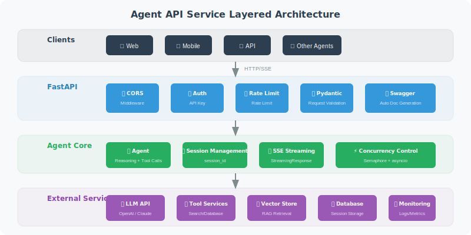

# API Service Wrapping: FastAPI / Flask

> **Section Goal**: Learn how to wrap an Agent as a usable API service using FastAPI.

---

## Why Choose FastAPI?

| Feature | FastAPI | Flask |
|---------|---------|-------|
| Async support | ✅ Native async | ⚠️ Requires extension |
| Type validation | ✅ Pydantic auto-validation | ❌ Manual required |
| API documentation | ✅ Auto-generated Swagger | ❌ Requires extension |
| Performance | ⚡ High performance | 🏃 Moderate |
| Streaming responses | ✅ Native SSE support | ⚠️ More complex |

For Agent services, FastAPI's async support and streaming responses are key advantages.



---

## Basic API Framework

```python
from fastapi import FastAPI, HTTPException, Header, Depends
from fastapi.middleware.cors import CORSMiddleware
from pydantic import BaseModel, Field
from typing import Optional
import os

app = FastAPI(
    title="Agent API",
    description="Intelligent Assistant API Service",
    version="1.0.0"
)

# CORS configuration
app.add_middleware(
    CORSMiddleware,
    allow_origins=["*"],  # In production, restrict to specific domains
    allow_methods=["*"],
    allow_headers=["*"],
)

# ===== Request/Response Models =====

class ChatRequest(BaseModel):
    """Chat request"""
    message: str = Field(..., min_length=1, max_length=5000,
                         description="User message")
    session_id: Optional[str] = Field(None, description="Session ID")
    
class ChatResponse(BaseModel):
    """Chat response"""
    reply: str = Field(..., description="Agent reply")
    session_id: str = Field(..., description="Session ID")
    tool_calls: list[dict] = Field(default_factory=list,
                                    description="Tool call records")

class HealthResponse(BaseModel):
    """Health check response"""
    status: str
    version: str

# ===== Authentication =====

async def verify_api_key(
    x_api_key: str = Header(..., description="API Key")
):
    """Verify API Key"""
    valid_keys = os.getenv("VALID_API_KEYS", "").split(",")
    if x_api_key not in valid_keys:
        raise HTTPException(status_code=401, detail="Invalid API Key")
    return x_api_key

# ===== API Endpoints =====

@app.get("/health", response_model=HealthResponse)
async def health_check():
    """Health check endpoint"""
    return HealthResponse(status="healthy", version="1.0.0")

@app.post("/chat", response_model=ChatResponse)
async def chat(
    request: ChatRequest,
    api_key: str = Depends(verify_api_key)
):
    """Chat endpoint"""
    import uuid
    
    session_id = request.session_id or str(uuid.uuid4())
    
    # Call your Agent here
    # result = await agent.run(request.message, session_id)
    
    # Example return
    return ChatResponse(
        reply="This is the Agent's reply",
        session_id=session_id,
        tool_calls=[]
    )
```

---

## Streaming Responses (SSE)

Let users see the Agent's response process in real time:

```python
from fastapi.responses import StreamingResponse
import json
import asyncio

@app.post("/chat/stream")
async def chat_stream(
    request: ChatRequest,
    api_key: str = Depends(verify_api_key)
):
    """Streaming chat endpoint (Server-Sent Events)"""
    
    async def event_generator():
        """Generate SSE event stream"""
        
        # Send start event
        yield f"data: {json.dumps({'type': 'start', 'session_id': 'xxx'})}\n\n"
        
        # Simulate streaming generation (replace with LLM streaming output in practice)
        full_response = "This is an example of a streaming reply, each character is sent to the client progressively."
        
        for char in full_response:
            yield f"data: {json.dumps({'type': 'token', 'content': char})}\n\n"
            await asyncio.sleep(0.05)  # Simulate generation delay
        
        # Send end event
        yield f"data: {json.dumps({'type': 'end'})}\n\n"
    
    return StreamingResponse(
        event_generator(),
        media_type="text/event-stream",
        headers={
            "Cache-Control": "no-cache",
            "Connection": "keep-alive",
        }
    )
```

### Frontend Receiving SSE

```javascript
// ⚠️ Note: Native EventSource API only supports GET requests
// For POST request SSE, use the fetch API to handle manually

// ✅ Correct approach: use fetch API to receive SSE streaming responses
async function streamChat(message) {
    const response = await fetch('/chat/stream', {
        method: 'POST',
        headers: {
            'Content-Type': 'application/json',
            'X-API-Key': 'your-key'
        },
        body: JSON.stringify({ message })
    });
    
    const reader = response.body.getReader();
    const decoder = new TextDecoder();
    
    while (true) {
        const { done, value } = await reader.read();
        if (done) break;
        
        const text = decoder.decode(value);
        // Parse SSE data
        const lines = text.split('\n');
        for (const line of lines) {
            if (line.startsWith('data: ')) {
                const data = JSON.parse(line.slice(6));
                if (data.type === 'token') {
                    // Append to page
                    document.getElementById('output').textContent += data.content;
                }
            }
        }
    }
}
```

---

## Error Handling and Middleware

```python
from fastapi import Request
from fastapi.responses import JSONResponse
import time
import logging

logger = logging.getLogger("agent_api")

# Global exception handler
@app.exception_handler(Exception)
async def global_exception_handler(request: Request, exc: Exception):
    """Global exception handler"""
    logger.error(f"Unhandled exception: {exc}", exc_info=True)
    return JSONResponse(
        status_code=500,
        content={
            "error": "Internal server error",
            "detail": "Service temporarily unavailable, please try again later"
            # Don't expose specific error details in production
        }
    )

# Request logging middleware
@app.middleware("http")
async def log_requests(request: Request, call_next):
    """Log each request"""
    start = time.time()
    
    response = await call_next(request)
    
    elapsed = time.time() - start
    logger.info(
        f"{request.method} {request.url.path} "
        f"→ {response.status_code} ({elapsed:.3f}s)"
    )
    
    return response
```

---

## Starting the Service

```python
if __name__ == "__main__":
    import uvicorn
    
    uvicorn.run(
        "app:app",
        host="0.0.0.0",
        port=8000,
        workers=4,        # Use multiple workers in production
        reload=False,      # Disable hot reload in production
        log_level="info"
    )
```

After starting, visit `http://localhost:8000/docs` to see the auto-generated API documentation.

---

## Summary

| Concept | Description |
|---------|-------------|
| FastAPI | High-performance async web framework, suitable for Agent services |
| Pydantic Models | Automatically validate request parameters |
| SSE Streaming | Real-time push of Agent generation process |
| Middleware | Global logging, error handling, authentication |

> **Next Section Preview**: With the API service ready, the next step is to package it with Docker for deployment in any environment.

---

[Next: 18.3 Containerization and Cloud Deployment →](./03_containerization.md)