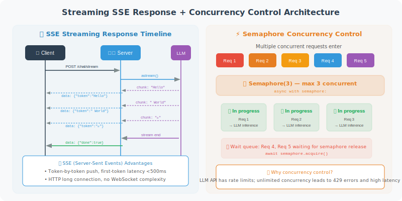

# Streaming Responses and Concurrency Handling

> **Section Goal**: Master streaming output and high-concurrency handling techniques for Agent services.

---

## Why Streaming Responses?

An LLM may take 5–15 seconds to generate a complete reply. Making users wait in silence is a poor experience. Streaming responses work like a typewriter — each character is sent as it's generated, so users can see "AI is thinking" in real time.



---

## LLM Streaming Output

```python
from langchain_openai import ChatOpenAI
import asyncio

async def stream_agent_response(question: str):
    """Stream Agent reply"""
    
    llm = ChatOpenAI(model="gpt-4o", streaming=True)
    
    # Method 1: Use astream (recommended)
    full_response = ""
    async for chunk in llm.astream(question):
        token = chunk.content
        if token:
            full_response += token
            print(token, end="", flush=True)  # Real-time output
    
    return full_response
```

### Implementing Streaming SSE in FastAPI

```python
from fastapi import FastAPI
from fastapi.responses import StreamingResponse
from langchain_openai import ChatOpenAI
import json

app = FastAPI()

@app.post("/chat/stream")
async def chat_stream(question: str):
    """Streaming Agent chat"""
    
    async def generate():
        llm = ChatOpenAI(model="gpt-4o", streaming=True)
        
        # Send thinking status
        yield f"data: {json.dumps({'type': 'thinking'})}\n\n"
        
        # Stream generate reply
        async for chunk in llm.astream(question):
            if chunk.content:
                yield f"data: {json.dumps({'type': 'token', 'content': chunk.content})}\n\n"
        
        # Send completion signal
        yield f"data: {json.dumps({'type': 'done'})}\n\n"
    
    return StreamingResponse(
        generate(),
        media_type="text/event-stream"
    )
```

---

## Concurrency Handling

### Async Agent Execution

```python
import asyncio
from langchain_openai import ChatOpenAI

class AsyncAgentService:
    """Async Agent service — supports high concurrency"""
    
    def __init__(self, max_concurrent: int = 50):
        self.semaphore = asyncio.Semaphore(max_concurrent)
        self.llm = ChatOpenAI(model="gpt-4o")
    
    async def handle_request(self, question: str) -> str:
        """Handle a single request (with concurrency control)"""
        
        async with self.semaphore:  # Limit number of concurrent requests
            try:
                response = await asyncio.wait_for(
                    self.llm.ainvoke(question),
                    timeout=30.0  # 30-second timeout
                )
                return response.content
            except asyncio.TimeoutError:
                return "Sorry, request timed out. Please try again later."
    
    async def batch_process(
        self,
        questions: list[str]
    ) -> list[str]:
        """Batch process multiple requests"""
        
        tasks = [
            self.handle_request(q) for q in questions
        ]
        
        results = await asyncio.gather(*tasks, return_exceptions=True)
        
        return [
            r if isinstance(r, str) else f"Error: {r}"
            for r in results
        ]
```

### Request Queue (Handling Traffic Spikes)

```python
import asyncio
from collections import deque
from dataclasses import dataclass, field
from typing import Any

@dataclass
class QueuedRequest:
    """Request in queue"""
    question: str
    future: asyncio.Future = field(default_factory=lambda: asyncio.get_event_loop().create_future())

class RequestQueue:
    """Request queue — traffic peak shaving"""
    
    def __init__(self, max_queue_size: int = 1000, workers: int = 10):
        self.queue = asyncio.Queue(maxsize=max_queue_size)
        self.workers = workers
    
    async def start(self, agent_service: AsyncAgentService):
        """Start worker coroutines"""
        worker_tasks = [
            asyncio.create_task(self._worker(agent_service))
            for _ in range(self.workers)
        ]
        return worker_tasks
    
    async def _worker(self, agent_service: AsyncAgentService):
        """Worker coroutine: fetch requests from queue and process"""
        while True:
            request: QueuedRequest = await self.queue.get()
            try:
                result = await agent_service.handle_request(
                    request.question
                )
                request.future.set_result(result)
            except Exception as e:
                request.future.set_exception(e)
            finally:
                self.queue.task_done()
    
    async def submit(self, question: str) -> str:
        """Submit request and wait for result"""
        request = QueuedRequest(question=question)
        
        try:
            self.queue.put_nowait(request)
        except asyncio.QueueFull:
            raise Exception("Service busy, please try again later")
        
        return await request.future
```

---

## Connection Pool Management

Avoid creating new HTTP connections for every request:

```python
import httpx

class LLMConnectionPool:
    """LLM API connection pool"""
    
    def __init__(self, max_connections: int = 100):
        self.client = httpx.AsyncClient(
            limits=httpx.Limits(
                max_connections=max_connections,
                max_keepalive_connections=50
            ),
            timeout=httpx.Timeout(30.0)
        )
    
    async def call_llm(self, messages: list[dict]) -> str:
        """Call LLM using connection pool"""
        response = await self.client.post(
            "https://api.openai.com/v1/chat/completions",
            json={
                "model": "gpt-4o",
                "messages": messages
            },
            headers={
                "Authorization": f"Bearer {os.getenv('OPENAI_API_KEY')}"
            }
        )
        response.raise_for_status()
        return response.json()["choices"][0]["message"]["content"]
    
    async def close(self):
        """Close connection pool"""
        await self.client.aclose()
```

---

## Summary

| Technology | Problem Solved | Key Point |
|-----------|---------------|-----------|
| Streaming response | Reduces user wait time | SSE + LLM streaming |
| Async processing | Improves concurrency | asyncio + ainvoke |
| Semaphore | Prevents resource exhaustion | Semaphore limits concurrency |
| Request queue | Handles traffic spikes | Peak shaving |
| Connection pool | Reduces connection overhead | httpx connection reuse |

> **Next Section Preview**: Finally, we'll integrate everything and deploy a complete production-grade Agent service.

---

[Next: 18.5 Practice: Deploying a Production-Grade Agent Service →](./05_practice_production_agent.md)