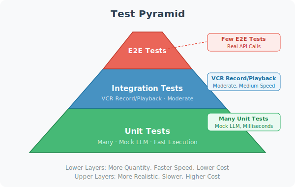

# Practice: Deploying a Production-Grade Agent Service

> **Section Goal**: Apply everything learned in this chapter to complete the full workflow from development to deployment of an Agent service.

---

## Project Structure

```
agent-service/
├── app/
│   ├── __init__.py
│   ├── main.py          # FastAPI entry point
│   ├── agent.py          # Agent core logic
│   ├── config.py         # Configuration management
│   └── middleware.py     # Middleware
├── Dockerfile
├── docker-compose.yml
├── requirements.txt
├── .env.example
└── tests/
    └── test_api.py
```

---

## Core Code

### config.py — Configuration Management

```python
from pydantic_settings import BaseSettings

class Settings(BaseSettings):
    openai_api_key: str
    model_name: str = "gpt-4o"
    redis_url: str = "redis://localhost:6379"
    api_keys: str = ""  # Comma-separated valid API Keys
    max_concurrent: int = 50
    request_timeout: int = 30
    
    class Config:
        env_file = ".env"
        env_prefix = "AGENT_"

settings = Settings()
```

### agent.py — Agent Core

```python
from langchain_openai import ChatOpenAI
from langchain_core.prompts import ChatPromptTemplate, MessagesPlaceholder
from langchain_core.messages import HumanMessage, AIMessage
from app.config import settings

class ProductionAgent:
    """Production-grade Agent"""
    
    def __init__(self):
        self.llm = ChatOpenAI(
            model=settings.model_name,
            api_key=settings.openai_api_key,
            streaming=True
        )
        
        self.prompt = ChatPromptTemplate.from_messages([
            ("system", "You are a professional AI assistant. Please answer questions accurately and concisely."),
            MessagesPlaceholder("history"),
            ("human", "{input}")
        ])
        
        self.chain = self.prompt | self.llm
    
    async def run(self, message: str, history: list[dict] = None):
        """Execute Agent (non-streaming)"""
        chat_history = self._build_history(history or [])
        response = await self.chain.ainvoke({
            "input": message,
            "history": chat_history
        })
        return response.content
    
    async def stream(self, message: str, history: list[dict] = None):
        """Execute Agent (streaming)"""
        chat_history = self._build_history(history or [])
        async for chunk in self.chain.astream({
            "input": message,
            "history": chat_history
        }):
            if chunk.content:
                yield chunk.content
    
    def _build_history(self, history: list[dict]):
        """Build conversation history"""
        messages = []
        for msg in history:
            if msg["role"] == "user":
                messages.append(HumanMessage(content=msg["content"]))
            elif msg["role"] == "assistant":
                messages.append(AIMessage(content=msg["content"]))
        return messages

# Global singleton
agent = ProductionAgent()
```

### main.py — API Entry Point

```python
import uuid
import json
import asyncio

from fastapi import FastAPI, HTTPException, Header, Depends
from fastapi.middleware.cors import CORSMiddleware
from fastapi.responses import StreamingResponse
from pydantic import BaseModel, Field
from typing import Optional

from app.config import settings
from app.agent import agent

app = FastAPI(title="Agent Service", version="1.0.0")

app.add_middleware(
    CORSMiddleware,
    allow_origins=["*"],
    allow_methods=["*"],
    allow_headers=["*"],
)

# Concurrency control
semaphore = asyncio.Semaphore(settings.max_concurrent)

# ===== Models =====

class ChatRequest(BaseModel):
    message: str = Field(..., min_length=1, max_length=5000)
    session_id: Optional[str] = None

class ChatResponse(BaseModel):
    reply: str
    session_id: str

# ===== Authentication =====

async def verify_key(x_api_key: str = Header(...)):
    valid = settings.api_keys.split(",")
    if x_api_key not in valid:
        raise HTTPException(401, "Invalid API Key")

# ===== Endpoints =====

@app.get("/health")
async def health():
    return {"status": "healthy"}

@app.post("/chat", response_model=ChatResponse)
async def chat(req: ChatRequest, _=Depends(verify_key)):
    session_id = req.session_id or str(uuid.uuid4())
    
    async with semaphore:
        try:
            reply = await asyncio.wait_for(
                agent.run(req.message),
                timeout=settings.request_timeout
            )
        except asyncio.TimeoutError:
            raise HTTPException(504, "Request timed out")
    
    return ChatResponse(reply=reply, session_id=session_id)

@app.post("/chat/stream")
async def chat_stream(req: ChatRequest, _=Depends(verify_key)):
    async def generate():
        async with semaphore:
            async for token in agent.stream(req.message):
                yield f"data: {json.dumps({'token': token})}\n\n"
            yield f"data: {json.dumps({'done': True})}\n\n"
    
    return StreamingResponse(generate(), media_type="text/event-stream")

if __name__ == "__main__":
    import uvicorn
    uvicorn.run("app.main:app", host="0.0.0.0", port=8000, workers=4)
```

---

## Deployment Steps

### 1. Prepare Environment Variables

```bash
# ⚠️ The following is the .env.example template
# Copy to .env and fill in real values: cp .env.example .env
# 🔒 Security reminder: .env file must be added to .gitignore, never commit to version control!

AGENT_OPENAI_API_KEY=sk-your-key-here
AGENT_API_KEYS=key1,key2,key3
AGENT_MODEL_NAME=gpt-4o
AGENT_REDIS_URL=redis://redis:6379
```

### 2. Build and Start

```bash
# Build image and start
docker compose up -d --build

# Check service status
docker compose ps

# Verify health check
curl http://localhost:8000/health
```

### 3. Test the API



```bash
# Regular chat
curl -X POST http://localhost:8000/chat \
  -H "Content-Type: application/json" \
  -H "X-API-Key: key1" \
  -d '{"message": "Hello, please introduce Python"}'

# Streaming chat
curl -X POST http://localhost:8000/chat/stream \
  -H "Content-Type: application/json" \
  -H "X-API-Key: key1" \
  -d '{"message": "Tell me a short story"}' \
  --no-buffer
```

---

## Deployment Checklist

| Check Item | Description | ✅ |
|-----------|-------------|---|
| Environment variables | API Keys and sensitive info not hardcoded | |
| Health check | /health endpoint returns normally | |
| Authentication | API Key validation is active | |
| Rate limiting | Nginx rate limiting configured correctly | |
| Logging | Request logs recorded normally | |
| Monitoring | Error rate and latency are observable | |
| Backup | Redis data persistence | |
| SSL | HTTPS certificate configured | |

---

## Summary

| Concept | Description |
|---------|-------------|
| Project structure | Clear layering: config, core, API, middleware |
| Configuration management | Pydantic Settings + environment variables |
| Concurrency control | Semaphore + timeout mechanism |
| Streaming response | SSE real-time push of generation process |
| Container deployment | Docker Compose one-command startup |

> 🎓 **Chapter Summary**: From API wrapping to containerized deployment, from streaming responses to concurrency handling, we've completed the full path from "a runnable script" to "a production-grade service." Next, let's enter the comprehensive project section and build real Agent applications!

---

[Next Chapter: Chapter 19 Project Practice: AI Coding Assistant →](../chapter_coding_agent/README.md)
