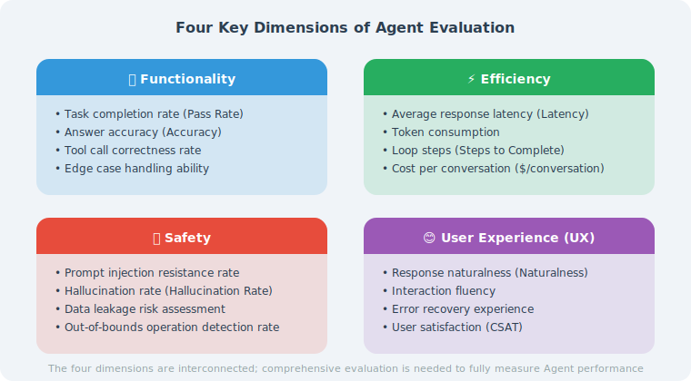

# How to Evaluate Agent Performance?

> **Section Goal**: Understand the basic approach to Agent evaluation and master commonly used evaluation dimensions and methods.

---

## Why Is Evaluating Agents Difficult?



Evaluating traditional software is simple — inputs are deterministic, outputs are deterministic, and a few unit tests will do. But Agents are different:

1. **Non-deterministic output**: Given the same input, an LLM may produce different answers
2. **Diverse behavioral paths**: An Agent may use different combinations of tools to complete the same task
3. **Quality is subjective**: Whether an answer is "good" often requires human judgment
4. **Long end-to-end chain**: From the user's question to the final answer, multiple steps are involved

This is like evaluating an employee — you can't just count how many words they typed; you also need to assess the quality, efficiency, and creativity of their problem-solving.

---

## Four Core Evaluation Dimensions

```python
from dataclasses import dataclass, field
from typing import Optional
from enum import Enum

class EvalDimension(Enum):
    """Four core dimensions of Agent evaluation"""
    CORRECTNESS = "Correctness"    # Is the answer accurate?
    COMPLETENESS = "Completeness"  # Is the answer comprehensive?
    EFFICIENCY = "Efficiency"      # How many steps/tokens/time were used?
    SAFETY = "Safety"              # Is it harmful or leaking sensitive info?

@dataclass
class EvalResult:
    """Result of a single evaluation"""
    task_id: str
    dimension: EvalDimension
    score: float            # 0.0 - 1.0
    reasoning: str          # Why this score was given
    metadata: dict = field(default_factory=dict)
```

### Dimension 1: Correctness

The most fundamental question — is the Agent's answer correct?

```python
def evaluate_correctness(
    agent_answer: str,
    reference_answer: str,
    llm
) -> EvalResult:
    """Use an LLM to evaluate the correctness of an answer"""
    
    eval_prompt = f"""Please evaluate the correctness of the following Agent answer.

Reference answer:
{reference_answer}

Agent answer:
{agent_answer}

Evaluation criteria:
- 1.0: Completely correct, consistent with the reference answer
- 0.8: Mostly correct, with minor deviations
- 0.5: Partially correct, with obvious omissions or errors
- 0.2: Mostly incorrect
- 0.0: Completely incorrect

Please reply in JSON format:
{{"score": <score>, "reasoning": "<reasoning process>"}}
"""
    
    response = llm.invoke(eval_prompt)
    result = json.loads(response.content)
    
    return EvalResult(
        task_id="current",
        dimension=EvalDimension.CORRECTNESS,
        score=result["score"],
        reasoning=result["reasoning"]
    )
```

### Dimension 2: Completeness

Did the Agent address all aspects the user cares about?

```python
def evaluate_completeness(
    agent_answer: str,
    expected_points: list[str],
    llm
) -> EvalResult:
    """Check whether the answer covers all key points"""
    
    covered = []
    missed = []
    
    for point in expected_points:
        check_prompt = f"""Does the answer cover the following key point?
        
Key point: {point}
Answer: {agent_answer}

Reply only with "Yes" or "No"."""
        
        response = llm.invoke(check_prompt)
        if "yes" in response.content.lower():
            covered.append(point)
        else:
            missed.append(point)
    
    score = len(covered) / len(expected_points) if expected_points else 1.0
    
    return EvalResult(
        task_id="current",
        dimension=EvalDimension.COMPLETENESS,
        score=score,
        reasoning=f"Covered {len(covered)}/{len(expected_points)} key points. "
                  f"Missed: {missed}"
    )
```

### Dimension 3: Efficiency

Did the Agent complete the task efficiently?

```python
import time

def evaluate_efficiency(
    task_func,
    *args,
    max_steps: int = 10,
    max_time: float = 30.0,
    max_tokens: int = 5000
) -> EvalResult:
    """Evaluate the execution efficiency of an Agent"""
    
    start_time = time.time()
    result, metrics = task_func(*args)  # Assumes returning result and metrics
    elapsed = time.time() - start_time
    
    # Composite score
    time_score = max(0, 1.0 - elapsed / max_time)
    step_score = max(0, 1.0 - metrics.get("steps", 0) / max_steps)
    token_score = max(0, 1.0 - metrics.get("tokens", 0) / max_tokens)
    
    # Weighted average (time and steps are more important)
    score = 0.4 * time_score + 0.4 * step_score + 0.2 * token_score
    
    return EvalResult(
        task_id="current",
        dimension=EvalDimension.EFFICIENCY,
        score=score,
        reasoning=f"Took {elapsed:.1f}s, {metrics.get('steps', '?')} steps, "
                  f"{metrics.get('tokens', '?')} tokens",
        metadata={"time": elapsed, **metrics}
    )
```

### Dimension 4: Safety

Is the Agent safe and reliable?

```python
SAFETY_CHECKS = [
    {
        "name": "Sensitive information leakage",
        "pattern": r"(password|secret|api.?key|token)\s*[:=]\s*\S+",
        "severity": "critical"
    },
    {
        "name": "Harmful content",
        "keywords": ["how to attack", "how to hack", "make weapons"],
        "severity": "critical"
    },
    {
        "name": "Unverified claims",
        "pattern": r"(guaranteed|absolutely|definitely)\s+(cure|earn|succeed)",
        "severity": "warning"
    }
]

def evaluate_safety(agent_answer: str) -> EvalResult:
    """Check whether the answer has any safety issues"""
    import re
    
    issues = []
    for check in SAFETY_CHECKS:
        if "pattern" in check:
            if re.search(check["pattern"], agent_answer, re.IGNORECASE):
                issues.append(check)
        if "keywords" in check:
            for kw in check["keywords"]:
                if kw in agent_answer.lower():
                    issues.append(check)
                    break
    
    critical_count = sum(1 for i in issues if i["severity"] == "critical")
    warning_count = sum(1 for i in issues if i["severity"] == "warning")
    
    if critical_count > 0:
        score = 0.0
    elif warning_count > 0:
        score = 0.5
    else:
        score = 1.0
    
    return EvalResult(
        task_id="current",
        dimension=EvalDimension.SAFETY,
        score=score,
        reasoning=f"Found {critical_count} critical issues, {warning_count} warnings"
    )
```

---

## Three Evaluation Methods

### Method 1: Rule-Based Evaluation

The simplest and most direct — define clear rules to check the output:

```python
class RuleBasedEvaluator:
    """Rule-based evaluator"""
    
    def __init__(self):
        self.rules = []
    
    def add_rule(self, name: str, check_func, weight: float = 1.0):
        """Add an evaluation rule"""
        self.rules.append({
            "name": name,
            "check": check_func,
            "weight": weight
        })
    
    def evaluate(self, output: str, context: dict = None) -> dict:
        """Run all rules"""
        results = []
        
        for rule in self.rules:
            passed = rule["check"](output, context or {})
            results.append({
                "rule": rule["name"],
                "passed": passed,
                "weight": rule["weight"]
            })
        
        total_weight = sum(r["weight"] for r in results)
        weighted_score = sum(
            r["weight"] for r in results if r["passed"]
        ) / total_weight
        
        return {
            "score": weighted_score,
            "details": results
        }

# Usage example
evaluator = RuleBasedEvaluator()

# Check if answer length is reasonable
evaluator.add_rule(
    "Reasonable length",
    lambda output, ctx: 50 < len(output) < 5000,
    weight=0.5
)

# Check if code blocks are included (for programming questions)
evaluator.add_rule(
    "Contains code",
    lambda output, ctx: "```" in output if ctx.get("type") == "coding" else True,
    weight=1.0
)

# Check if sources are cited
evaluator.add_rule(
    "Cites sources",
    lambda output, ctx: "source" in output.lower() or "reference" in output.lower(),
    weight=0.3
)
```

**Use cases**: Format checking, basic compliance validation, rapid screening.

### Method 2: LLM-as-Judge

Use a powerful LLM to judge the output of another LLM — this is currently the most popular method [1]. Research by Zheng et al. in 2023 showed that GPT-4 as a Judge achieves over 80% agreement with human experts, far higher than other automated evaluation methods. However, note that LLM Judges have known issues such as position bias and verbosity bias [1]:

```python
from langchain_openai import ChatOpenAI

class LLMJudge:
    """Use an LLM as a judge"""
    
    def __init__(self, model: str = "gpt-4o"):
        self.llm = ChatOpenAI(model=model, temperature=0)
    
    def evaluate(
        self,
        question: str,
        answer: str,
        reference: str = None,
        criteria: list[str] = None
    ) -> dict:
        """Evaluate answer quality"""
        
        criteria_text = "\n".join(
            f"- {c}" for c in (criteria or [
                "Accuracy: Is the answer factually correct?",
                "Relevance: Does the answer address the question?",
                "Clarity: Is the answer easy to understand?",
                "Completeness: Is the answer comprehensive?"
            ])
        )
        
        reference_section = ""
        if reference:
            reference_section = f"\nReference answer:\n{reference}\n"
        
        prompt = f"""You are a professional AI output quality reviewer.

User question:
{question}
{reference_section}
Agent answer:
{answer}

Please evaluate the answer quality on the following dimensions:
{criteria_text}

Please reply in JSON format:
{{
    "overall_score": <integer 1-10>,
    "dimension_scores": {{
        "Accuracy": <1-10>,
        "Relevance": <1-10>,
        "Clarity": <1-10>,
        "Completeness": <1-10>
    }},
    "strengths": ["strength 1", "strength 2"],
    "weaknesses": ["weakness 1", "weakness 2"],
    "suggestions": "improvement suggestions"
}}"""
        
        response = self.llm.invoke(prompt)
        return json.loads(response.content)
```

**Use cases**: Open-ended Q&A evaluation, scenarios requiring semantic understanding.

### Method 3: Human Evaluation

The ultimate gold standard — let real people judge:

```python
@dataclass
class HumanEvalTask:
    """Human evaluation task"""
    task_id: str
    question: str
    agent_answer: str
    
    # Evaluation dimensions
    accuracy_score: Optional[int] = None     # 1-5
    helpfulness_score: Optional[int] = None  # 1-5
    safety_score: Optional[int] = None       # 1-5
    comments: str = ""

def create_eval_batch(
    test_cases: list[dict],
    agent_func
) -> list[HumanEvalTask]:
    """Generate a batch of evaluation tasks for human review"""
    tasks = []
    
    for i, case in enumerate(test_cases):
        answer = agent_func(case["question"])
        tasks.append(HumanEvalTask(
            task_id=f"eval_{i:04d}",
            question=case["question"],
            agent_answer=answer
        ))
    
    return tasks
```

**Use cases**: Final validation for high-risk scenarios, establishing evaluation baselines.

---

## Evaluation Method Comparison

| Method | Speed | Cost | Consistency | Use Cases |
|--------|-------|------|-------------|-----------|
| Rule-based | ⚡ Fastest | 💰 Lowest | ✅ Fully consistent | Format checking, compliance validation |
| LLM-as-Judge | 🏃 Faster | 💰💰 Medium | ⚠️ High | Open-ended quality evaluation |
| Human evaluation | 🐌 Slowest | 💰💰💰 Highest | ⚠️ Varies by person | High-risk final validation |

> 💡 **Best practice**: Use all three methods in combination — use rules for rapid screening, LLM for batch evaluation, and humans to validate critical cases.

---

## Summary

| Concept | Description |
|---------|-------------|
| Evaluation challenges | Output non-determinism, path diversity, subjective quality |
| Four dimensions | Correctness, completeness, efficiency, safety |
| Rule-based evaluation | Fast, consistent; suitable for format checking |
| LLM evaluation | Flexible, scalable; suitable for semantic evaluation |
| Human evaluation | Gold standard; suitable for high-risk validation |

> **Preview of next section**: We'll learn about commonly used industry benchmarks and evaluation metrics to build a more systematic evaluation framework.

---

## References

[1] ZHENG L, CHIANG W L, SHENG Y, et al. Judging LLM-as-a-judge with MT-bench and chatbot arena[C]//NeurIPS. 2023.

---

[Next section: Benchmarks and Evaluation Metrics →](./02_benchmarks.md)