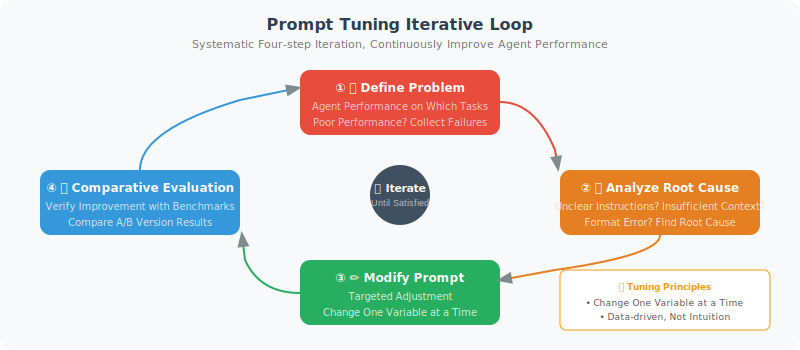

# Prompt Tuning Strategies

> **Section Goal**: Master systematic prompt tuning methods and learn how to improve Agent performance through iterative optimization.

---

## The Core Idea of Prompt Tuning

Prompt tuning is like tuning a radio — not randomly turning the dial, but methodically fine-tuning until the signal is clear. The core process is:

1. **Identify the problem**: On which tasks does the Agent perform poorly?
2. **Analyze the cause**: Is the instruction unclear? Is there insufficient context? Is the format wrong?
3. **Make targeted changes**: Adjust specific parts of the prompt
4. **Comparative evaluation**: Use benchmarks to verify whether there's improvement



---

## Strategy 1: System Prompt Optimization

The System Prompt is the Agent's "code of conduct" and has a huge impact on its performance:

```python
# ❌ Bad system prompt
bad_system_prompt = "You are an assistant. Please help the user."

# ✅ Optimized system prompt
good_system_prompt = """You are a professional Python technical consultant with 10 years of development experience.

## Your Responsibilities
- Answer Python-related technical questions
- Provide code examples and best practice recommendations
- Help debug code issues

## Answer Requirements
1. **Accuracy first**: Clearly state when you're uncertain; do not fabricate information
2. **Runnable code**: All code examples must be complete and directly runnable
3. **Clear explanations**: Explain key concepts and code logic
4. **Version specifics**: When mentioning libraries or tools, note the applicable version numbers

## Answer Format
- Start with 1–2 sentences directly answering the question
- Then provide a code example (if applicable)
- Finally, add notes or best practices

## Constraints
- Only answer Python-related questions; for other languages, suggest the user consult a specialist
- Do not provide code with potential security risks (e.g., eval on user input)
- Keep answers under 500 words, unless the question genuinely requires a longer explanation
"""
```

### Key Elements of a System Prompt

```python
SYSTEM_PROMPT_TEMPLATE = """
# Role Definition
You are {role_name}, {role_description}.

# Core Capabilities
{capabilities}

# Behavioral Guidelines
{behavioral_rules}

# Output Format
{output_format}

# Constraints and Boundaries
{constraints}

# Examples (optional)
{examples}
"""
```

The purpose of each element:

| Element | Purpose | Impact if Missing |
|---------|---------|------------------|
| Role definition | Sets the Agent's identity and professional background | Answers lack professionalism |
| Core capabilities | Clarifies what the Agent can do | May answer out of scope |
| Behavioral guidelines | Standardizes how to answer | Output quality is inconsistent |
| Output format | Unifies the structure of answers | Chaotic format, hard to parse |
| Constraints and boundaries | Restricts what the Agent shouldn't do | May produce unsafe output |

---

## Strategy 2: Few-Shot Example Optimization

Good examples can significantly improve Agent performance:

```python
def build_few_shot_prompt(
    task: str,
    examples: list[dict],
    user_input: str
) -> str:
    """Build a few-shot prompt"""
    
    prompt = f"Task: {task}\n\n"
    prompt += "Here are some examples:\n\n"
    
    for i, ex in enumerate(examples, 1):
        prompt += f"--- Example {i} ---\n"
        prompt += f"Input: {ex['input']}\n"
        prompt += f"Output: {ex['output']}\n"
        if "explanation" in ex:
            prompt += f"Explanation: {ex['explanation']}\n"
        prompt += "\n"
    
    prompt += "--- Your Task ---\n"
    prompt += f"Input: {user_input}\n"
    prompt += "Output:"
    
    return prompt

# Tips for example selection
few_shot_tips = {
    "Quantity": "Usually 3–5 examples work best; too many can add noise",
    "Diversity": "Examples should cover different situations (simple/complex/edge cases)",
    "Order": "Put the most relevant example last (closest to the user input)",
    "Consistent format": "All examples must have a consistent input/output format",
    "Dynamic selection": "Dynamically select the most relevant examples based on user input"
}
```

### Dynamic Example Selection

Automatically select the most relevant examples based on user input:

```python
from langchain_openai import OpenAIEmbeddings
import numpy as np

class DynamicExampleSelector:
    """Dynamically select examples based on semantic similarity"""
    
    def __init__(self, examples: list[dict], k: int = 3):
        self.examples = examples
        self.k = k
        self.embeddings = OpenAIEmbeddings()
        
        # Pre-compute embeddings for all examples
        self.example_vectors = self.embeddings.embed_documents(
            [ex["input"] for ex in examples]
        )
    
    def select(self, query: str) -> list[dict]:
        """Select the k examples most relevant to the query"""
        query_vector = self.embeddings.embed_query(query)
        
        # Calculate cosine similarity
        similarities = [
            np.dot(query_vector, ev) / (
                np.linalg.norm(query_vector) * np.linalg.norm(ev)
            )
            for ev in self.example_vectors
        ]
        
        # Select top-k
        top_indices = np.argsort(similarities)[-self.k:][::-1]
        return [self.examples[i] for i in top_indices]
```

---

## Strategy 3: A/B Testing Framework

Like internet products, run A/B tests on prompts:

```python
import random

class PromptABTest:
    """Prompt A/B testing framework"""
    
    def __init__(self, prompts: dict[str, str], test_cases: list[dict]):
        """
        Args:
            prompts: {"A": prompt_a, "B": prompt_b, ...}
            test_cases: [{"input": "...", "expected": "..."}, ...]
        """
        self.prompts = prompts
        self.test_cases = test_cases
        self.results = {name: [] for name in prompts}
    
    def run(self, llm, judge_llm=None) -> dict:
        """Run the A/B test"""
        
        for case in self.test_cases:
            for name, prompt in self.prompts.items():
                # Assemble the full prompt
                full_prompt = f"{prompt}\n\nUser question: {case['input']}"
                
                # Get the answer
                response = llm.invoke(full_prompt)
                
                # Evaluate (if a judge LLM is available)
                score = self._evaluate(
                    case, response.content, judge_llm
                )
                
                self.results[name].append({
                    "input": case["input"],
                    "output": response.content,
                    "score": score
                })
        
        # Summarize results
        summary = {}
        for name, results in self.results.items():
            scores = [r["score"] for r in results if r["score"] is not None]
            summary[name] = {
                "avg_score": sum(scores) / len(scores) if scores else 0,
                "total_cases": len(results),
                "scored_cases": len(scores)
            }
        
        return summary
    
    def _evaluate(self, case, response, judge_llm) -> float:
        """Evaluate a single answer"""
        if judge_llm is None:
            return None
        
        eval_prompt = f"""Compare the following answer with the expected answer and give a score from 1–10.

Question: {case['input']}
Expected: {case['expected']}
Actual answer: {response}

Reply with only a number (1–10)."""
        
        result = judge_llm.invoke(eval_prompt)
        try:
            return float(result.content.strip()) / 10
        except ValueError:
            return None
```

---

## Strategy 4: Common Prompt Problem Checklist

When an Agent is underperforming, go through this checklist one by one:

```python
PROMPT_DEBUGGING_CHECKLIST = [
    {
        "problem": "Agent answers are too generic and lack depth",
        "possible_cause": "Instructions are not specific enough",
        "fix": "Add specific role background and domain description",
        "example": "❌ 'Answer questions' → ✅ 'As a backend engineer with 10 years of experience, provide detailed answers with code examples'"
    },
    {
        "problem": "Agent doesn't use tools and fabricates answers directly",
        "possible_cause": "No explicit requirement to use tools",
        "fix": "Emphasize in the system prompt: 'If you need to query data, you must use the corresponding tool; do not guess'",
        "example": "Add rule: 'Any question requiring real-time data must first use the search tool'"
    },
    {
        "problem": "Agent output format is inconsistent",
        "possible_cause": "Missing explicit format requirements",
        "fix": "Provide a detailed output format template and examples",
        "example": "Specify a JSON Schema or Markdown template"
    },
    {
        "problem": "Agent repeatedly calls the same tool",
        "possible_cause": "Missing termination conditions or step limits",
        "fix": "Add a maximum step limit and termination condition description",
        "example": "'Execute at most 5 steps; if the problem is still unresolved, summarize current progress and ask the user for help'"
    },
    {
        "problem": "Agent answers contain obvious factual errors",
        "possible_cause": "Model hallucination, or use of outdated knowledge",
        "fix": "Require the Agent to cite sources, and add a rule: 'Clearly state when uncertain'",
        "example": "'Please cite your sources when answering. If you are unsure of a fact, say \"I am not certain; I recommend you verify this\"'"
    }
]
```

---

## Practical Case: Iteratively Optimizing a Customer Service Agent

```python
# Version 1 — Basic (problem: answers too brief, lacks empathy)
v1_prompt = "You are customer service. Please answer user questions."

# Version 2 — Add role details (improvement: more professional, but still not warm enough)
v2_prompt = """You are "Aria," a professional customer service representative.
You need to accurately answer user questions about products and orders."""

# Version 3 — Add behavioral guidelines (improvement: more empathetic, but format inconsistent)
v3_prompt = """You are "Aria," a customer service representative with 3 years of experience.

## Behavioral Guidelines
1. Always respond with a friendly, patient attitude
2. First express understanding of the customer's situation, then provide a solution
3. If the issue is beyond your scope, direct the customer to human support
4. Do not fabricate uncertain information; promise to confirm later"""

# Version 4 — Add format standards and examples (current best version)
v4_prompt = """You are "Aria," a customer service representative with 3 years of experience.

## Behavioral Guidelines
1. Always respond with a friendly, patient attitude
2. First express understanding (1 sentence), then provide a solution (clear points)
3. Out-of-scope issues → direct to human support
4. Uncertain → promise to confirm later

## Answer Format
[Understand the customer] → [Specific solution] → [Follow-up]

## Example
Customer: My order still hasn't shipped after three days
Aria: I completely understand your frustration — three days is quite a wait. Let me check your order status...
  1. Order #xxx is currently being picked in the warehouse
  2. Expected to ship tomorrow, with normal delivery in 2–3 days
  3. I'll keep tracking it and notify you as soon as there's an update
  Feel free to reach out if you have any other questions 😊
"""
```

Score changes across versions:

| Version | Accuracy | Satisfaction | Improvement |
|---------|----------|-------------|-------------|
| v1 | 0.65 | 2.1/5 | Baseline |
| v2 | 0.78 | 3.0/5 | + Role definition |
| v3 | 0.80 | 3.8/5 | + Behavioral guidelines |
| v4 | 0.85 | 4.3/5 | + Format + examples |

---

## Summary

| Strategy | Key Points | Effect |
|----------|-----------|--------|
| System prompt optimization | Role + capabilities + guidelines + format + constraints | Comprehensive improvement |
| Few-shot optimization | 3–5 diverse examples, dynamically selected | Significantly improves consistency |
| A/B testing | Data-driven, let scores speak | Scientific decision-making |
| Problem checklist | Targeted fixes, check one by one | Quickly locate issues |

> **Preview of next section**: Beyond prompt tuning, cost control is also a challenge that must be faced in production environments.

---

[Next section: 18.4 Cost Control and Performance Optimization →](./04_cost_optimization.md)