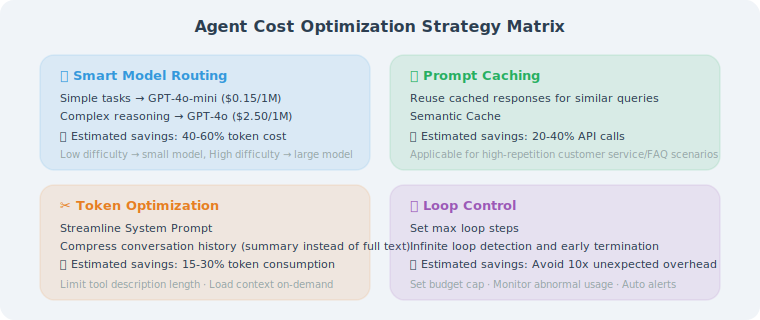

# Cost Control and Performance Optimization

> **Section Goal**: Learn how to effectively control API call costs and improve response speed while maintaining Agent quality.

---

## Agent Cost Breakdown



The cost of running an Agent comes primarily from three areas:

| Cost Type | Source | Share |
|-----------|--------|-------|
| LLM API calls | Tokens consumed per inference | 60–80% |
| Vector database | Embedding computation + retrieval queries | 10–20% |
| Infrastructure | Servers, storage, networking | 10–20% |

A simple calculation: if your Agent consumes an average of 5,000 tokens per conversation (input + output) using GPT-4o, the cost is approximately $0.02. Processing 10,000 conversations per day results in a monthly cost of about $6,000.

---

## Strategy 1: Intelligent Model Routing

Not every question needs the most powerful (and most expensive) model. Use cheap models for simple questions and high-end models only for complex ones:

```python
from langchain_openai import ChatOpenAI

class SmartRouter:
    """Intelligent model router — selects a model based on question complexity"""
    
    def __init__(self):
        # Fast, cheap model for simple tasks
        self.fast_model = ChatOpenAI(
            model="gpt-4o-mini", temperature=0
        )
        # Powerful model for complex tasks
        self.power_model = ChatOpenAI(
            model="gpt-4o", temperature=0
        )
    
    def classify_complexity(self, question: str) -> str:
        """Determine question complexity"""
        # Simple rule-based judgment (can also use LLM, but adds cost)
        simple_indicators = [
            len(question) < 50,           # Short questions are usually simple
            "?" in question and question.count("?") == 1,  # Single question
            any(w in question.lower() for w in ["hello", "thanks", "what is"]),
        ]
        
        complex_indicators = [
            len(question) > 200,          # Long questions are usually complex
            "analyze" in question.lower() or "compare" in question.lower(),
            "code" in question.lower() or "implement" in question.lower(),
            question.count("?") > 2,      # Multiple questions
        ]
        
        simple_score = sum(simple_indicators)
        complex_score = sum(complex_indicators)
        
        if complex_score >= 2:
            return "complex"
        elif simple_score >= 2:
            return "simple"
        else:
            return "medium"
    
    def route(self, question: str) -> ChatOpenAI:
        """Select the appropriate model"""
        complexity = self.classify_complexity(question)
        
        if complexity == "simple":
            return self.fast_model    # ~$0.15/1M tokens
        else:
            return self.power_model   # ~$2.50/1M tokens

# Usage example
router = SmartRouter()
model = router.route("How do list comprehensions work in Python?")
response = model.invoke("How do list comprehensions work in Python?")
```

---

## Strategy 2: Semantic Caching

If a user asks a similar question, return the previous result directly without calling the API again:

```python
import hashlib
import json
import time
import numpy as np
from pathlib import Path

class SemanticCache:
    """Cache based on semantic similarity"""
    
    def __init__(
        self,
        cache_dir: str = ".agent_cache",
        similarity_threshold: float = 0.92,
        ttl: int = 3600  # Cache expiration time (seconds)
    ):
        self.cache_dir = Path(cache_dir)
        self.cache_dir.mkdir(exist_ok=True)
        self.threshold = similarity_threshold
        self.ttl = ttl
        self.cache = self._load_cache()
    
    def _load_cache(self) -> list[dict]:
        cache_file = self.cache_dir / "cache.json"
        if cache_file.exists():
            with open(cache_file) as f:
                return json.load(f)
        return []
    
    def _save_cache(self):
        with open(self.cache_dir / "cache.json", "w") as f:
            json.dump(self.cache, f, indent=2)
    
    def get(self, query: str, query_embedding: list[float]) -> str | None:
        """Try to retrieve an answer from the cache"""
        now = time.time()
        
        for entry in self.cache:
            # Check if expired
            if now - entry["timestamp"] > self.ttl:
                continue
            
            # Calculate semantic similarity
            similarity = self._cosine_similarity(
                query_embedding, entry["embedding"]
            )
            
            if similarity >= self.threshold:
                entry["hit_count"] = entry.get("hit_count", 0) + 1
                self._save_cache()
                return entry["response"]
        
        return None
    
    def put(
        self,
        query: str,
        query_embedding: list[float],
        response: str
    ):
        """Store a result in the cache"""
        self.cache.append({
            "query": query,
            "embedding": query_embedding,
            "response": response,
            "timestamp": time.time(),
            "hit_count": 0
        })
        
        # Limit cache size
        if len(self.cache) > 1000:
            # Remove the oldest, least-hit entries
            self.cache.sort(
                key=lambda x: (x["hit_count"], x["timestamp"])
            )
            self.cache = self.cache[-500:]  # Keep the most valuable half
        
        self._save_cache()
    
    @staticmethod
    def _cosine_similarity(a: list[float], b: list[float]) -> float:
        a, b = np.array(a), np.array(b)
        return float(np.dot(a, b) / (np.linalg.norm(a) * np.linalg.norm(b)))
```

---

## Strategy 3: Prompt Compression

Reduce the number of tokens sent to the LLM without losing key information:

```python
class PromptCompressor:
    """Prompt compressor"""
    
    def compress_history(
        self,
        messages: list[dict],
        max_messages: int = 10,
        max_tokens: int = 2000
    ) -> list[dict]:
        """Compress conversation history"""
        if len(messages) <= max_messages:
            return messages
        
        # Strategy: keep the beginning and end, compress the middle
        # 1. Always keep system messages
        system_msgs = [m for m in messages if m["role"] == "system"]
        
        # 2. Keep the most recent messages
        recent = messages[-max_messages:]
        
        # 3. Compress the middle messages into a summary
        middle = messages[len(system_msgs):-max_messages]
        if middle:
            summary = self._summarize_messages(middle)
            summary_msg = {
                "role": "system",
                "content": f"[Summary of previous conversation: {summary}]"
            }
            return system_msgs + [summary_msg] + recent
        
        return system_msgs + recent
    
    def _summarize_messages(self, messages: list[dict]) -> str:
        """Compress multiple messages into a summary"""
        topics = set()
        for msg in messages:
            # Extract keywords as topics
            content = msg.get("content", "")
            if len(content) > 20:
                topics.add(content[:50] + "...")
        
        return f"The user discussed the following topics: {', '.join(list(topics)[:5])}"
    
    def remove_redundancy(self, prompt: str) -> str:
        """Remove redundant information from the prompt"""
        lines = prompt.split("\n")
        seen = set()
        result = []
        
        for line in lines:
            normalized = line.strip().lower()
            if normalized and normalized not in seen:
                seen.add(normalized)
                result.append(line)
            elif not normalized:
                result.append(line)  # Keep blank lines
        
        return "\n".join(result)
```

---

## Strategy 4: Cost Monitoring and Alerts

```python
from dataclasses import dataclass, field
from collections import defaultdict

@dataclass
class CostTracker:
    """API call cost tracker"""
    
    # Pricing per model (per million tokens, March 2026 data; check official pricing for updates)
    PRICING = {
        "gpt-4o":      {"input": 2.50, "output": 10.00},
        "gpt-4o-mini": {"input": 0.15, "output": 0.60},
        "gpt-5":       {"input": 10.00, "output": 30.00},
    }
    
    daily_budget: float = 50.0    # Daily budget (USD)
    monthly_budget: float = 1000.0
    
    # Records
    daily_cost: float = 0.0
    monthly_cost: float = 0.0
    call_log: list = field(default_factory=list)
    model_usage: dict = field(default_factory=lambda: defaultdict(
        lambda: {"calls": 0, "input_tokens": 0, "output_tokens": 0, "cost": 0.0}
    ))
    
    def record_call(
        self,
        model: str,
        input_tokens: int,
        output_tokens: int
    ) -> dict:
        """Record an API call"""
        pricing = self.PRICING.get(model, {"input": 5.0, "output": 15.0})
        
        cost = (
            input_tokens * pricing["input"] / 1_000_000 +
            output_tokens * pricing["output"] / 1_000_000
        )
        
        self.daily_cost += cost
        self.monthly_cost += cost
        
        # Update model-level statistics
        usage = self.model_usage[model]
        usage["calls"] += 1
        usage["input_tokens"] += input_tokens
        usage["output_tokens"] += output_tokens
        usage["cost"] += cost
        
        # Check budget
        warnings = []
        if self.daily_cost > self.daily_budget * 0.8:
            warnings.append(
                f"⚠️ Daily budget {self.daily_cost/self.daily_budget:.0%} used"
            )
        if self.monthly_cost > self.monthly_budget * 0.8:
            warnings.append(
                f"⚠️ Monthly budget {self.monthly_cost/self.monthly_budget:.0%} used"
            )
        
        return {
            "cost": cost,
            "daily_total": self.daily_cost,
            "warnings": warnings
        }
    
    def get_report(self) -> str:
        """Generate a cost report"""
        report = "📊 Cost Report\n"
        report += f"{'='*40}\n"
        report += f"Daily cost:   ${self.daily_cost:.4f} / ${self.daily_budget:.2f}\n"
        report += f"Monthly cost: ${self.monthly_cost:.4f} / ${self.monthly_budget:.2f}\n\n"
        
        report += "Model usage statistics:\n"
        for model, usage in self.model_usage.items():
            report += f"  {model}:\n"
            report += f"    Calls: {usage['calls']}\n"
            report += f"    Input tokens: {usage['input_tokens']:,}\n"
            report += f"    Output tokens: {usage['output_tokens']:,}\n"
            report += f"    Cost: ${usage['cost']:.4f}\n"
        
        return report
```

---

## Performance Optimization Checklist

| Technique | Savings | Implementation Difficulty | Notes |
|-----------|---------|--------------------------|-------|
| Model routing | 40–60% | ⭐⭐ | Use cheap models for simple questions |
| Semantic caching | 20–50% | ⭐⭐⭐ | Return directly for repeated questions |
| Prompt compression | 10–30% | ⭐⭐ | Reduce input tokens |
| Batch processing | 20–40% | ⭐ | Combine multiple requests |
| Streaming responses | No savings, but better UX | ⭐ | Reduces perceived wait time |
| Pre-generation | Saves real-time cost | ⭐⭐⭐ | Pre-generate answers for popular questions |

---

## Summary

| Concept | Description |
|---------|-------------|
| Model routing | Select the appropriate model based on question complexity |
| Semantic caching | Reuse previous answers for similar questions |
| Prompt compression | Retain key information while reducing token count |
| Cost monitoring | Track costs in real time; alert when budget is exceeded |

> **Preview of next section**: In production environments, performance alone isn't enough — you also need to be able to "see" what's happening inside the Agent.

---

[Next section: 18.5 Observability: Logging, Tracing, and Monitoring →](./05_observability.md)