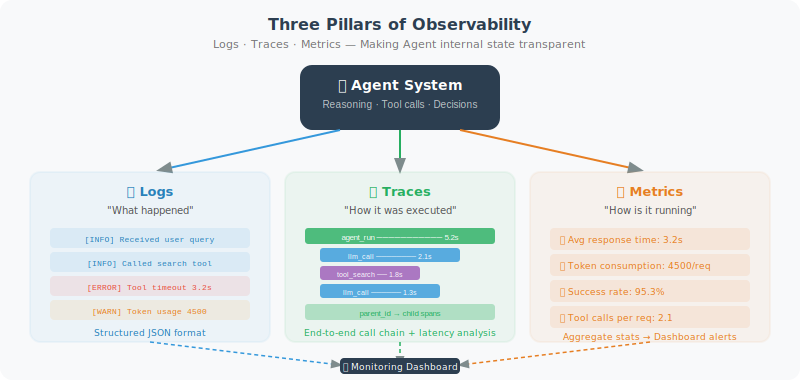

# Observability: Logging, Tracing, and Monitoring

> **Section Goal**: Learn how to build a comprehensive observability system for Agents, so that "problems can be detected when they occur, and located once detected."

---

## What Is Observability?

Observability refers to the ability to understand the internal state of a system through its external outputs, without modifying the system's code. For Agents, this means being able to answer the following questions:

- What decisions did the Agent make? Why?
- Which tools were called? How long did each tool take?
- What intermediate steps occurred between the user's question and the final answer?
- When an error occurred, at which step did it happen?

The three pillars of observability: **Logs**, **Traces**, and **Metrics**.



---

## Pillar 1: Structured Logging

```python
import logging
import json
from datetime import datetime

class AgentLogger:
    """Structured logger dedicated to Agents"""
    
    def __init__(self, agent_name: str, log_file: str = None):
        self.agent_name = agent_name
        self.logger = logging.getLogger(agent_name)
        self.logger.setLevel(logging.DEBUG)
        
        # Console output
        console_handler = logging.StreamHandler()
        console_handler.setFormatter(
            logging.Formatter("%(asctime)s [%(levelname)s] %(message)s")
        )
        self.logger.addHandler(console_handler)
        
        # File output (JSON format)
        if log_file:
            file_handler = logging.FileHandler(log_file)
            file_handler.setFormatter(logging.Formatter("%(message)s"))
            self.logger.addHandler(file_handler)
    
    def log_event(self, event_type: str, **kwargs):
        """Log a structured event"""
        event = {
            "timestamp": datetime.now().isoformat(),
            "agent": self.agent_name,
            "event": event_type,
            **kwargs
        }
        self.logger.info(json.dumps(event))
    
    def log_llm_call(
        self,
        model: str,
        prompt: str,
        response: str,
        tokens: dict,
        latency: float
    ):
        """Log an LLM call"""
        self.log_event(
            "llm_call",
            model=model,
            prompt_preview=prompt[:200] + "..." if len(prompt) > 200 else prompt,
            response_preview=response[:200] + "..." if len(response) > 200 else response,
            input_tokens=tokens.get("input", 0),
            output_tokens=tokens.get("output", 0),
            latency_ms=round(latency * 1000)
        )
    
    def log_tool_call(
        self,
        tool_name: str,
        args: dict,
        result: str,
        success: bool,
        latency: float
    ):
        """Log a tool call"""
        self.log_event(
            "tool_call",
            tool=tool_name,
            arguments=args,
            result_preview=str(result)[:200],
            success=success,
            latency_ms=round(latency * 1000)
        )
    
    def log_error(self, error: Exception, context: dict = None):
        """Log an error"""
        self.log_event(
            "error",
            error_type=type(error).__name__,
            error_message=str(error),
            context=context or {}
        )

# Usage example
logger = AgentLogger("customer_service", log_file="agent.log")

logger.log_llm_call(
    model="gpt-4o",
    prompt="User asked: Where is my order?",
    response="Let me check your order status...",
    tokens={"input": 150, "output": 80},
    latency=1.2
)
```

---

## Pillar 2: Distributed Tracing

Trace all steps a request goes through from start to finish:

```python
import uuid
import time
from dataclasses import dataclass, field

@dataclass
class Span:
    """A single node in a trace chain"""
    name: str
    trace_id: str
    span_id: str = field(default_factory=lambda: str(uuid.uuid4())[:8])
    parent_id: str = None
    start_time: float = 0.0
    end_time: float = 0.0
    attributes: dict = field(default_factory=dict)
    events: list = field(default_factory=list)
    status: str = "ok"
    
    @property
    def duration_ms(self) -> float:
        return (self.end_time - self.start_time) * 1000


class AgentTracer:
    """Agent distributed tracer"""
    
    def __init__(self):
        self.traces = {}  # trace_id -> list[Span]
    
    def start_trace(self, name: str) -> Span:
        """Start a new trace chain"""
        trace_id = str(uuid.uuid4())[:12]
        span = Span(name=name, trace_id=trace_id)
        span.start_time = time.time()
        self.traces[trace_id] = [span]
        return span
    
    def start_span(self, name: str, parent: Span) -> Span:
        """Create a child node in an existing trace chain"""
        span = Span(
            name=name,
            trace_id=parent.trace_id,
            parent_id=parent.span_id
        )
        span.start_time = time.time()
        self.traces[parent.trace_id].append(span)
        return span
    
    def end_span(self, span: Span, status: str = "ok", **attributes):
        """End a node"""
        span.end_time = time.time()
        span.status = status
        span.attributes.update(attributes)
    
    def print_trace(self, trace_id: str):
        """Visually print a complete trace chain"""
        spans = self.traces.get(trace_id, [])
        if not spans:
            print("Trace not found")
            return
        
        print(f"\n{'='*60}")
        print(f"🔍 Trace: {trace_id}")
        print(f"{'='*60}")
        
        # Build tree structure
        root_spans = [s for s in spans if s.parent_id is None]
        
        for root in root_spans:
            self._print_span_tree(root, spans, indent=0)
    
    def _print_span_tree(self, span: Span, all_spans: list, indent: int):
        """Recursively print the Span tree"""
        prefix = "  " * indent
        status_icon = "✅" if span.status == "ok" else "❌"
        
        print(f"{prefix}{status_icon} {span.name} "
              f"({span.duration_ms:.0f}ms)")
        
        for key, value in span.attributes.items():
            print(f"{prefix}   {key}: {value}")
        
        # Print child nodes
        children = [s for s in all_spans if s.parent_id == span.span_id]
        for child in children:
            self._print_span_tree(child, all_spans, indent + 1)


# Usage example
tracer = AgentTracer()

# Simulate a complete Agent request trace
root = tracer.start_trace("handle_user_query")

# Step 1: Understand user intent
intent_span = tracer.start_span("classify_intent", root)
# ... execute intent classification ...
tracer.end_span(intent_span, intent="order_query")

# Step 2: Call a tool
tool_span = tracer.start_span("call_tool:query_order", root)
# ... query the order ...
tracer.end_span(tool_span, order_id="12345", status="shipped")

# Step 3: Generate a reply
reply_span = tracer.start_span("generate_reply", root)
# ... generate the final reply ...
tracer.end_span(reply_span, tokens=150)

tracer.end_span(root)
tracer.print_trace(root.trace_id)
```

Example output:
```
============================================================
🔍 Trace: a1b2c3d4e5f6
============================================================
✅ handle_user_query (1523ms)
  ✅ classify_intent (245ms)
     intent: order_query
  ✅ call_tool:query_order (1050ms)
     order_id: 12345
     status: shipped
  ✅ generate_reply (228ms)
     tokens: 150
```

---

## Pillar 3: Monitoring Metrics

```python
import time
from collections import defaultdict, deque
from dataclasses import dataclass

class AgentMonitor:
    """Agent runtime monitor"""
    
    def __init__(self, window_size: int = 100):
        self.window_size = window_size
        self.latencies = deque(maxlen=window_size)
        self.error_count = 0
        self.total_count = 0
        self.tool_stats = defaultdict(
            lambda: {"calls": 0, "errors": 0, "total_ms": 0}
        )
    
    def record_request(self, latency: float, success: bool):
        """Record a request"""
        self.total_count += 1
        self.latencies.append(latency)
        if not success:
            self.error_count += 1
    
    def record_tool_usage(
        self,
        tool_name: str,
        latency: float,
        success: bool
    ):
        """Record tool usage"""
        stats = self.tool_stats[tool_name]
        stats["calls"] += 1
        stats["total_ms"] += latency * 1000
        if not success:
            stats["errors"] += 1
    
    def get_dashboard(self) -> str:
        """Get monitoring dashboard data"""
        avg_latency = (
            sum(self.latencies) / len(self.latencies)
            if self.latencies else 0
        )
        error_rate = (
            self.error_count / self.total_count
            if self.total_count else 0
        )
        p95_latency = (
            sorted(self.latencies)[int(len(self.latencies) * 0.95)]
            if len(self.latencies) > 20 else avg_latency
        )
        
        dashboard = f"""
┌──────────────────────────────────────┐
│        🖥️  Agent Monitor Dashboard    │
├──────────────────────────────────────┤
│ Total requests: {self.total_count:<20} │
│ Error rate:     {error_rate:<20.2%} │
│ Avg latency:    {avg_latency:<18.0f}ms │
│ P95 latency:    {p95_latency:<18.0f}ms │
├──────────────────────────────────────┤
│ 🔧 Tool Usage Statistics              │
"""
        for name, stats in self.tool_stats.items():
            avg_tool_ms = (
                stats["total_ms"] / stats["calls"]
                if stats["calls"] else 0
            )
            dashboard += (
                f"│ {name:<15} "
                f"calls:{stats['calls']:<5} "
                f"avg:{avg_tool_ms:.0f}ms │\n"
            )
        
        dashboard += "└──────────────────────────────────────┘"
        return dashboard
```

---

## Using LangSmith for Tracing (Recommended)

[LangSmith](https://smith.langchain.com/) is LangChain's official observability platform that can automatically trace every step of LangChain/LangGraph applications:

```python
import os

# Just set environment variables to enable LangSmith tracing
os.environ["LANGCHAIN_TRACING_V2"] = "true"
os.environ["LANGCHAIN_API_KEY"] = os.getenv("LANGSMITH_API_KEY")
os.environ["LANGCHAIN_PROJECT"] = "my-agent-project"

# All subsequent LangChain calls will be automatically traced
from langchain_openai import ChatOpenAI

llm = ChatOpenAI(model="gpt-4o")
response = llm.invoke("Hello")
# Detailed information about this call (input, output, latency, tokens)
# will automatically appear in the LangSmith web interface
```

Core features provided by LangSmith:

| Feature | Description |
|---------|-------------|
| Automatic tracing | Complete chain for every LLM/tool call |
| Visualization | View input/output of each step in the web interface |
| Dataset management | Create test datasets for batch evaluation |
| Run comparison | Compare performance differences between versions |
| Alerting | Set alert rules for error rate, latency, etc. |

---

## Summary

| Pillar | Problem Solved | Tools |
|--------|---------------|-------|
| Logs | "What happened?" | Structured logging, JSON format |
| Traces | "What steps were taken?" | Span chains, LangSmith |
| Metrics | "How is overall performance?" | Counters, histograms, monitoring dashboards |

> 🎓 **Chapter Summary**: Evaluation and optimization is a continuous iterative process. First establish an evaluation system, then continuously improve the Agent through prompt tuning, cost control, and observability.

---

[Next chapter: Chapter 19: Security and Reliability →](../chapter_security/README.md)