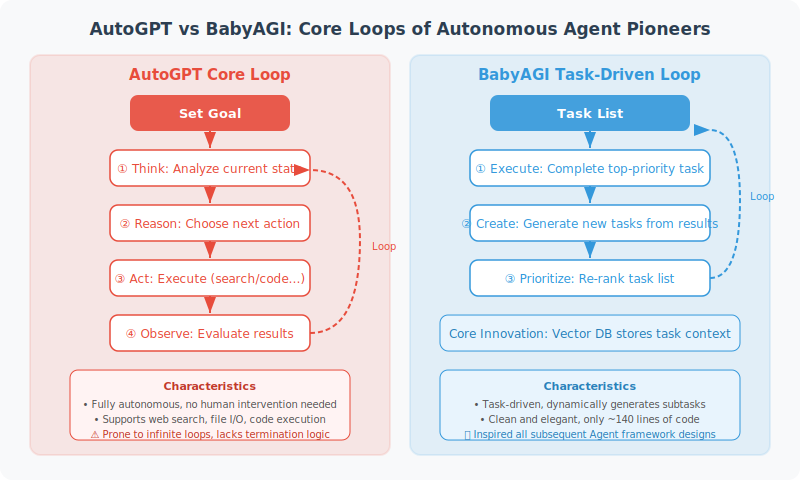

# Lessons from AutoGPT and BabyAGI

AutoGPT (March 2023) and BabyAGI (April 2023) were the earliest autonomous Agent projects to attract widespread attention. Although their practical utility in production environments is limited, their design philosophies have had a profound influence on the entire Agent field.



## AutoGPT: Pioneer of Autonomous Task Execution

AutoGPT's core idea is: given a goal, the Agent autonomously plans and executes all steps.

```python
# AutoGPT's core loop (simplified version, for understanding its design philosophy)

class AutoGPTLoop:
    """
    Simulates AutoGPT's core loop.
    Illustrates the design philosophy, not a real implementation.
    """
    
    def __init__(self, goal: str):
        self.goal = goal
        self.memory = []
        self.tools = ["search", "write_file", "read_file", "execute_code"]
    
    def think(self, context: str) -> dict:
        """Reasoning: analyze current state, decide next step"""
        from openai import OpenAI
        
        client = OpenAI()
        response = client.chat.completions.create(
            model="gpt-4o",
            messages=[
                {
                    "role": "system",
                    "content": f"""You are an autonomous AI Agent with the goal: {self.goal}
                    
You need to:
1. Thought: analyze current progress
2. Reasoning: why do this
3. Plan: the next 3 steps
4. Criticism: risks of the current approach
5. Action: choose one tool from the list to execute immediately

Available tools: {self.tools}

Return in JSON format."""
                },
                {
                    "role": "user",
                    "content": f"Current context:\n{context}\n\nDecide the next action:"
                }
            ],
            response_format={"type": "json_object"}
        )
        import json
        return json.loads(response.choices[0].message.content)
    
    def execute(self, action: dict) -> str:
        """Execute a tool action"""
        tool = action.get("tool", "unknown")
        args = action.get("args", {})
        
        # Simulate execution
        print(f"  Executing tool: {tool}({args})")
        return f"{tool} executed, result: ..."
    
    def run(self, max_steps: int = 10):
        """Run the main loop"""
        context = f"Goal: {self.goal}\nSteps completed: none"
        
        for step in range(max_steps):
            print(f"\n=== Step {step + 1} ===")
            
            # Think
            thought = self.think(context)
            print(f"Thought: {thought.get('thought', '')}")
            print(f"Plan: {thought.get('plan', [])[:1]}")
            
            # Execute
            action = thought.get("action", {})
            if action.get("tool") == "task_complete":
                print("✅ Task complete!")
                break
            
            result = self.execute(action)
            
            # Update memory and context
            self.memory.append({"step": step+1, "action": action, "result": result})
            context = f"Goal: {self.goal}\n" + "\n".join([
                f"Step {m['step']}: {m['action'].get('tool')} → {m['result'][:50]}"
                for m in self.memory[-5:]
            ])

# Demo (not actually run, to avoid infinite loops)
# agent = AutoGPTLoop("Write a blog post about Python and save it")
# agent.run()
```

## AutoGPT's Limitations and Lessons

AutoGPT exposed several important issues in practice:

```python
# Issue 1: Goal Drift
# The Agent may deviate from the original goal during execution
original_goal = "Write a blog post"
# Actual execution path might be:
# → Search for lots of information → Search for related tools → Research writing techniques → ... → Forget to write the post

# Issue 2: Infinite loops
# Without effective termination conditions, the Agent may run forever
# Solution: strict max_steps and budget limits

# Issue 3: Limited task decomposition capability
# The quality of automatic planning is far inferior to carefully designed prompts
# Solution: human-assisted planning + Agent execution

# Issue 4: Error propagation
# Small errors in early steps can be amplified in later steps
# Solution: per-step validation + rollback mechanism
```

## BabyAGI: The Core Idea of Task Management

BabyAGI introduced the concept of a **task queue**:

```python
from collections import deque
from openai import OpenAI

client = OpenAI()

class BabyAGI:
    """
    BabyAGI core mechanism: task queue + automatic subtask creation
    """
    
    def __init__(self, objective: str):
        self.objective = objective
        self.task_queue: deque = deque()
        self.completed_tasks = []
        self.task_id_counter = 0
    
    def add_task(self, task: str):
        self.task_id_counter += 1
        self.task_queue.append({
            "id": self.task_id_counter,
            "task": task
        })
    
    def execute_task(self, task: str) -> str:
        """Execute a single task"""
        response = client.chat.completions.create(
            model="gpt-4o-mini",
            messages=[
                {
                    "role": "system",
                    "content": f"You are an executor. Objective: {self.objective}"
                },
                {
                    "role": "user",
                    "content": f"Complete task: {task}\nCompleted: {self.completed_tasks[-3:]}"
                }
            ],
            max_tokens=300
        )
        return response.choices[0].message.content
    
    def create_new_tasks(self, task: str, result: str) -> list:
        """Create new subtasks based on task results"""
        response = client.chat.completions.create(
            model="gpt-4o-mini",
            messages=[
                {
                    "role": "user",
                    "content": f"""Based on the following result, list 1-2 subtasks that need to continue (return empty list if objective is complete):
Objective: {self.objective}
Just completed task: {task}
Task result: {result}
Pending queue: {list(self.task_queue)[:3]}

Return JSON: {{"new_tasks": ["subtask1", "subtask2"]}}"""
                }
            ],
            response_format={"type": "json_object"}
        )
        import json
        result_data = json.loads(response.choices[0].message.content)
        return result_data.get("new_tasks", [])
    
    def run(self, initial_task: str, max_tasks: int = 10):
        """Run the BabyAGI loop"""
        self.add_task(initial_task)
        
        while self.task_queue and len(self.completed_tasks) < max_tasks:
            task = self.task_queue.popleft()
            
            print(f"\n[Task {task['id']}] {task['task']}")
            
            # Execute
            result = self.execute_task(task["task"])
            self.completed_tasks.append({"task": task["task"], "result": result[:100]})
            print(f"  Result: {result[:100]}")
            
            # Create new tasks
            new_tasks = self.create_new_tasks(task["task"], result)
            for new_task in new_tasks:
                self.add_task(new_task)
                print(f"  → New task added: {new_task}")
        
        print(f"\nDone! Completed {len(self.completed_tasks)} tasks")

# Test (kept small to control scope)
agent = BabyAGI("Research the main use cases of Python decorators")
agent.run("List 3 common application scenarios for Python decorators", max_tasks=5)
```

## Lessons for Modern Agent Development

The most important lessons AutoGPT and BabyAGI left us:

```python
# 1. Goals need to be clear and bounded
# ❌ "Make our product better"
# ✅ "Analyze user feedback and list the top 5 most common complaints"

# 2. Tools must be restricted
# ❌ Give the Agent full filesystem access
# ✅ Grant only the minimum permissions necessary to complete the task

# 3. Termination conditions must be explicit
# ❌ "Keep running until done"
# ✅ "Execute at most 10 steps, verify progress at each step"

# 4. Human oversight is important
# Fully automated Agents carry high risk in production
# Human-in-the-Loop is the practically viable solution
```

---

## Summary

The historical value of AutoGPT/BabyAGI:
- Proved that LLMs can autonomously execute complex tasks (proof of concept)
- Revealed the limitations of fully automated Agents (infinite loops, error propagation)
- Established core design patterns like task queues and memory management
- Inspired the development of more mature frameworks (LangChain, LangGraph)

---

*Next section: [14.2 CrewAI: Role-Playing Multi-Agent Framework](./02_crewai.md)*
