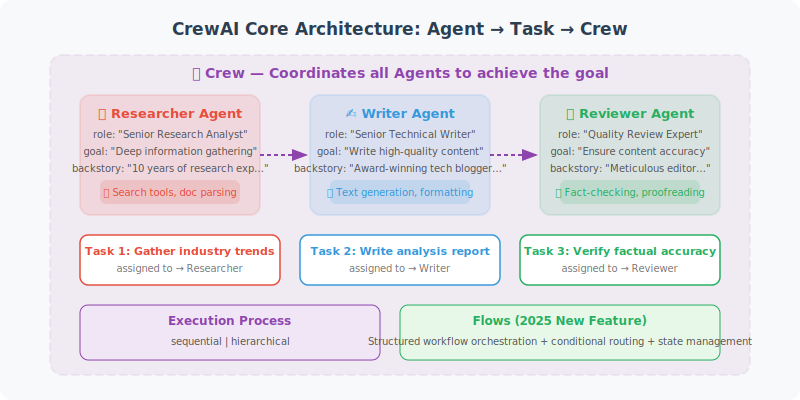

# CrewAI: Role-Playing Multi-Agent Framework

CrewAI is a framework designed specifically for multi-Agent collaboration. It uses "role-playing" to have different Agents take on different professional roles and work together to complete complex tasks. Since its launch in 2024, CrewAI has grown into one of the most popular multi-Agent frameworks, and in 2025 it introduced important new features such as **Flows**.



## CrewAI Core Concepts

CrewAI is built around three core abstractions: **Agent** (role), **Task**, and **Crew** (team). Each Agent has a clear role and goal, with its behavior pattern defined through natural language descriptions:

```python
# pip install crewai crewai-tools

from crewai import Agent, Task, Crew, Process

# ============================
# 1. Define Agents (Roles)
# ============================
# CrewAI has built-in LLM support, defaulting to GPT-4o
# Other models can be specified via the llm parameter

researcher = Agent(
    role="Senior Researcher",
    goal="Deeply research the specified topic and collect the latest, most accurate information",
    backstory="""You are a researcher with 10 years of experience, skilled at quickly gathering
    and organizing information. You prioritize data accuracy and cite reliable sources.""",
    verbose=True,
    allow_delegation=False  # Not allowed to delegate tasks to other Agents
)

writer = Agent(
    role="Content Editor",
    goal="Transform research content into readable, engaging articles",
    backstory="""You are a senior editor skilled at transforming complex technical content
    into articles that are easy for general readers to understand. Your articles are
    logically clear and written in vivid language.""",
    verbose=True,
    allow_delegation=True  # Can delegate subtasks to other Agents
)

reviewer = Agent(
    role="Quality Reviewer",
    goal="Ensure the accuracy, completeness, and readability of content",
    backstory="""You are a strict quality reviewer with sharp insight.
    You identify logical gaps, factual errors, and unclear expressions in content.""",
    verbose=True
)

# ============================
# 2. Define Tasks
# ============================

research_task = Task(
    description="""
    Research the following topic: {topic}
    
    Collect:
    1. Basic definition and importance of the topic
    2. Latest development trends (2025–2026)
    3. Main application scenarios (at least 3)
    4. Challenges faced
    5. Expert opinions (cite at least 2 sources)
    """,
    expected_output="A detailed research report containing all required information points",
    agent=researcher
)

writing_task = Task(
    description="""
    Based on the research report, write an article for technical developers.
    
    Requirements:
    - Word count: 800–1200 words
    - Structure: introduction, body (3–4 sections), conclusion
    - Language: professional but readable, avoid excessive jargon
    - Include specific code examples or real-world cases
    """,
    expected_output="A complete technical article in Markdown format",
    agent=writer,
    context=[research_task]  # Depends on the output of the research task
)

review_task = Task(
    description="""
    Review article quality, checking:
    1. Content accuracy
    2. Logical structure
    3. Language expression
    4. Correctness of code examples
    
    Provide a score (1–10) and specific revision suggestions.
    """,
    expected_output="Quality score report and specific revision suggestions",
    agent=reviewer,
    context=[writing_task]
)

# ============================
# 3. Create Crew and Execute
# ============================

crew = Crew(
    agents=[researcher, writer, reviewer],
    tasks=[research_task, writing_task, review_task],
    process=Process.sequential,  # Sequential execution (also supports hierarchical)
    verbose=True
)

# Execute tasks
result = crew.kickoff(inputs={"topic": "Applications of LangGraph in Production Environments"})
print(result)
```

## CrewAI Advanced Features

### Hierarchical Process and Tool Integration

CrewAI supports two execution processes: **sequential** and **hierarchical**. Hierarchical mode introduces a manager Agent to coordinate task assignment:

```python
# Hierarchical process: has a manager Agent
from crewai import Agent, Task, Crew, Process

manager = Agent(
    role="Project Manager",
    goal="Coordinate the team to ensure tasks are completed with high quality",
    backstory="You are an experienced project manager",
    allow_delegation=True
)

crew_hierarchical = Crew(
    agents=[researcher, writer],
    tasks=[research_task, writing_task],
    manager_agent=manager,          # Specify the manager
    process=Process.hierarchical,   # Hierarchical execution
    verbose=True
)

# Tool integration
from crewai_tools import SerperDevTool, FileWriterTool

search_tool = SerperDevTool()  # Search tool
file_tool = FileWriterTool()   # File writing tool

researcher_with_tools = Agent(
    role="Senior Researcher",
    goal="Research and collect information",
    backstory="You are a researcher",
    tools=[search_tool]  # Assign tools
)
```

### Flows: Structured Workflow Orchestration (New Feature)

CrewAI Flows is an important new feature introduced in 2025, providing **event-driven** workflow orchestration capabilities. Unlike Crew's declarative task assignment, Flows allows developers to precisely control the execution flow with Python code:

```python
from crewai.flow.flow import Flow, listen, start, router
from pydantic import BaseModel


class ArticleState(BaseModel):
    """Flow state management"""
    topic: str = ""
    research: str = ""
    article: str = ""
    quality_score: int = 0


class ArticleFlow(Flow[ArticleState]):
    """Article creation workflow"""

    @start()  # Mark the entry method
    def choose_topic(self):
        self.state.topic = "Best Practices for Agent Development"
        return self.state.topic

    @listen(choose_topic)  # Listen for the previous step to complete
    def research_topic(self, topic):
        """Call the research Crew to conduct research"""
        # Crews can be embedded within Flows
        crew = Crew(
            agents=[researcher],
            tasks=[research_task],
            verbose=True
        )
        result = crew.kickoff(inputs={"topic": topic})
        self.state.research = str(result)
        return self.state.research

    @listen(research_topic)
    def write_article(self, research):
        """Write the article based on research results"""
        crew = Crew(
            agents=[writer],
            tasks=[writing_task],
            verbose=True
        )
        result = crew.kickoff()
        self.state.article = str(result)
        return self.state.article

    @router(write_article)  # Router: branch based on conditions
    def check_quality(self, article):
        """Quality check routing"""
        if len(article) < 500:
            return "rewrite"  # Too short, rewrite
        return "publish"  # Quality acceptable, publish

    @listen("rewrite")
    def rewrite_article(self):
        """Rewrite the article"""
        print("Article too short, rewriting...")
        # Re-execute the writing logic
        return self.write_article(self.state.research)

    @listen("publish")
    def publish_article(self):
        """Publish the article"""
        print(f"Article published successfully! {len(self.state.article)} characters")
        return self.state.article


# Execute the Flow
flow = ArticleFlow()
result = flow.kickoff()
```

**Core Flows decorators**:

| Decorator | Purpose | Description |
|-----------|---------|-------------|
| `@start()` | Entry method | Starting point of the Flow; can have multiple |
| `@listen(method)` | Event listener | Triggered when the previous step completes |
| `@router(method)` | Conditional routing | Branches to different paths based on return value |

**Crew vs Flow selection**:
- **Crew**: suitable for scenarios with clear task division where Agents can collaborate autonomously
- **Flow**: suitable for complex workflows requiring precise flow control, conditional branching, and loops

## CrewAI vs LangGraph Comparison

```
CrewAI characteristics:
✅ Simple and intuitive role-playing model
✅ Declarative definition, less code
✅ Suitable for scenarios with clear task division
✅ Flows supports event-driven workflows (new)
❌ Complex state management not as powerful as LangGraph
❌ Debugging tools relatively limited

LangGraph characteristics:
✅ Powerful state management and loop control
✅ Fine-grained control over each step
✅ Supports Human-in-the-Loop
✅ Visual debugging (LangSmith integration)
❌ More code required
❌ Steeper learning curve

Recommendations:
- Tasks with clear role division → CrewAI (Crew mode)
- Needs complex control flow and state management → LangGraph
- Needs workflow orchestration + multi-Agent → CrewAI (Flow mode)
- Quick prototyping → CrewAI
- Production environment with high reliability requirements → LangGraph
```

---

## Summary

CrewAI makes multi-Agent collaboration very intuitive through the concise abstraction of Agent (role) + Task + Crew (team). The **Flows** feature introduced in 2025 further enhances workflow orchestration capabilities, enabling CrewAI to handle more complex scenarios — from simple sequential tasks to complete workflows with conditional branching and loops.

---

*Next section: [14.3 AutoGen: Multi-Agent Conversation Framework](./03_autogen.md)*
