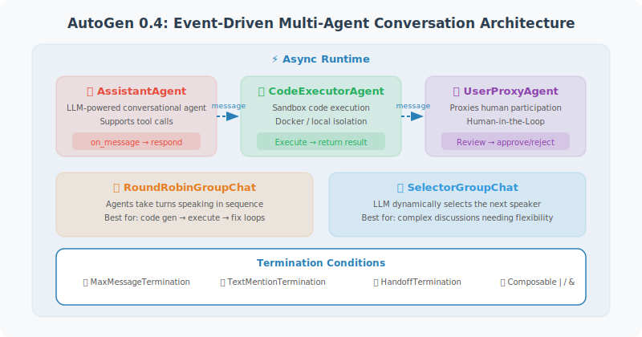

# AutoGen: Microsoft's Multi-Agent Conversation Framework

AutoGen is a multi-Agent conversation framework developed by Microsoft. Its core innovation is: completing tasks through **conversations between Agents**, rather than traditional call chains.

> ⚠️ **Important Update**: In late 2024, AutoGen underwent a major change. The original AutoGen team forked into two projects: Microsoft's official **AutoGen 0.4** (completely rewritten, based on an event-driven architecture) and the community-maintained **AG2** (continuing the 0.2 API). This section focuses primarily on the latest AutoGen 0.4.

Unlike LangChain/LangGraph's "node-edge" model, AutoGen treats each Agent as a "conversation participant." Agents communicate through natural language — like a virtual team having a meeting. This design makes building multi-Agent systems very intuitive.

AutoGen's most prominent feature is **automatic code execution**: after AI generates code, it can be executed directly in a sandbox, with results fed back to the AI, forming an automated "generate-execute-correct" loop.



## AutoGen 0.4: New Event-Driven Architecture

AutoGen 0.4 is a complete rewrite compared to the old version, introducing the following core concepts:
- **Asynchronous message passing**: Agents communicate via async messages
- **Event-driven**: execution model based on an event loop
- **Pluggable runtime**: supports single-process and distributed runtimes
- **Type safety**: Pydantic-based message type system

```python
# pip install autogen-agentchat autogen-ext
from autogen_agentchat.agents import AssistantAgent
from autogen_agentchat.teams import RoundRobinGroupChat
from autogen_agentchat.conditions import TextMentionTermination
from autogen_ext.models.openai import OpenAIChatCompletionClient
import asyncio

model_client = OpenAIChatCompletionClient(model="gpt-4o-mini")

# ============================
# Basics: Create a Single Agent
# ============================
assistant = AssistantAgent(
    name="Assistant",
    system_message="""You are a helpful AI assistant.
    You can write code to solve problems.
    When the task is complete, reply TERMINATE.""",
    model_client=model_client,
)
```

## Core Feature: Automatic Code Execution Sandbox

This is AutoGen's **killer feature** that sets it apart from other frameworks. AI generates code → sandbox executes it → execution results are fed back → AI corrects based on results, forming an automated programming loop.

AutoGen 0.4 provides two code executors:

### Docker Sandbox Executor (Recommended for Production)

```python
from autogen_ext.code_executors.docker import DockerCommandLineCodeExecutor
from autogen_agentchat.agents import CodeExecutorAgent, AssistantAgent
from autogen_agentchat.teams import RoundRobinGroupChat
from autogen_agentchat.conditions import TextMentionTermination
import asyncio

# Docker sandbox — code executes in an isolated container, safe and controlled
code_executor = DockerCommandLineCodeExecutor(
    image="python:3.12-slim",    # Docker image to use
    work_dir="coding_output",    # Working directory
    timeout=60,                  # Single execution timeout (seconds)
)

# Code execution Agent — responsible for running code and returning results
executor_agent = CodeExecutorAgent(
    name="CodeExecutor",
    code_executor=code_executor,
)

# Programming Agent — responsible for generating code
coder_agent = AssistantAgent(
    name="Programmer",
    system_message="""You are a Python expert. Follow these rules:
    1. Write complete, directly runnable Python code
    2. Put all code in ```python code blocks
    3. Analyze execution results; if there are errors, fix the code
    4. Reply TERMINATE when the task is complete""",
    model_client=model_client,
)

async def coding_task():
    # Start Docker container
    async with code_executor:
        termination = TextMentionTermination("TERMINATE")
        team = RoundRobinGroupChat(
            [coder_agent, executor_agent],
            termination_condition=termination,
            max_turns=10,
        )
        # Execution flow: programmer writes code → executor runs it → returns results → programmer corrects
        result = await team.run(
            task="Write code to: download and analyze the iris dataset, plot the distribution of each feature, and save as iris_analysis.png"
        )
        print(result)

asyncio.run(coding_task())
```

### Local Process Executor (For Development and Debugging)

```python
from autogen_ext.code_executors.local import LocalCommandLineCodeExecutor

# Local execution — runs code directly on the host machine (note security risks!)
local_executor = LocalCommandLineCodeExecutor(
    work_dir="local_output",
    timeout=30,
    virtual_env_context=None,   # Can specify a virtual environment
)

# ⚠️ Security warning: the local executor has no sandbox isolation!
# Malicious code can access the host's filesystem, network, and other resources.
# Use only in development/debugging environments; always use the Docker executor in production.
```

> 💡 **Core insight**: Code execution capability makes AutoGen not just "chat," but a framework that can **truly complete programming tasks**. AI wrote buggy code? No problem — the executor returns the error message, the AI sees the error and automatically corrects it — this loop is fully automated.

## Multi-Agent Group Conversations

AutoGen 0.4 provides multiple group conversation modes:

### RoundRobinGroupChat (Take Turns Speaking)

```python
from autogen_agentchat.teams import RoundRobinGroupChat
from autogen_agentchat.conditions import TextMentionTermination

coder = AssistantAgent(
    name="Programmer",
    system_message="You are a Python expert responsible for writing code.",
    model_client=model_client,
)

reviewer = AssistantAgent(
    name="CodeReviewer",
    system_message="""You are a code review expert responsible for:
    1. Checking code correctness
    2. Identifying potential bugs
    3. Suggesting performance optimizations
    Reply TERMINATE when the review passes.""",
    model_client=model_client,
)

# Take turns: Programmer → Reviewer → Programmer → Reviewer → ...
termination = TextMentionTermination("TERMINATE")
team = RoundRobinGroupChat(
    [coder, reviewer],
    termination_condition=termination,
    max_turns=10,
)

async def main():
    result = await team.run(
        task="Develop a secure user login validation function using bcrypt for password hashing"
    )
    print(result)

asyncio.run(main())
```

### SelectorGroupChat (Intelligently Select the Next Speaker)

This is an advanced mode introduced in AutoGen 0.4 — the LLM **dynamically decides** which Agent should speak next based on the conversation context:

```python
from autogen_agentchat.teams import SelectorGroupChat

# Multi-role team
planner = AssistantAgent(
    name="ProjectManager",
    system_message="You are a project manager responsible for task breakdown and progress tracking.",
    model_client=model_client,
)

coder = AssistantAgent(
    name="Developer",
    system_message="You are a full-stack developer responsible for implementing features.",
    model_client=model_client,
)

tester = AssistantAgent(
    name="QAEngineer",
    system_message="You are a QA engineer responsible for writing test cases and verifying functionality. Reply TERMINATE when the task is complete.",
    model_client=model_client,
)

# LLM automatically selects the next speaker based on context
# e.g.: requirements analysis phase → Project Manager; need to write code → Developer; code complete → QA Engineer
team = SelectorGroupChat(
    [planner, coder, tester],
    model_client=model_client,   # LLM used to select the next speaker
    termination_condition=TextMentionTermination("TERMINATE"),
    max_turns=15,
)

async def dev_task():
    result = await team.run(
        task="Develop a command-line TODO app supporting add, delete, mark complete, and list display"
    )
    print(result)

asyncio.run(dev_task())
```

## Agents Using Tools

AutoGen 0.4 supports registering custom tools for Agents:

```python
from autogen_agentchat.agents import AssistantAgent

# Define tool functions (regular Python functions)
def search_web(query: str) -> str:
    """Search the web for the latest information"""
    # In real projects, connect to a search API
    return f"Search results: latest information about '{query}'..."

def calculate(expression: str) -> str:
    """Evaluate a mathematical expression"""
    try:
        result = eval(expression)  # Note: use a safe expression parser in production
        return f"Result: {expression} = {result}"
    except Exception as e:
        return f"Calculation error: {e}"

# Create an Agent with tools
agent_with_tools = AssistantAgent(
    name="ResearchAssistant",
    system_message="You are a research assistant that can search the web and perform calculations.",
    model_client=model_client,
    tools=[search_web, calculate],   # Pass a list of regular Python functions directly
)
```

> 💡 **Comparison with LangChain**: In LangChain, registering tools requires the `@tool` decorator or `StructuredTool`, while AutoGen accepts regular Python functions directly — much more concise.

## AutoGen vs CrewAI Comparison

| Dimension | AutoGen | CrewAI |
|-----------|---------|--------|
| **Core philosophy** | Free conversation between Agents | Role-playing + task flow |
| **Code execution** | ✅ Built-in sandbox (killer feature) | ❌ Not supported |
| **Flexibility** | High, conversation can flow freely | Medium, tasks follow a predefined flow |
| **Cost control** | Higher (multi-turn conversations) | Lower (controllable flow) |
| **Ease of use** | Medium | Simple |
| **Best for** | Code generation/debugging, data analysis, automated testing | Content creation, research reports, pipeline tasks |

**Selection advice**:
- Need to **generate and execute code** → AutoGen (no alternative; this is its killer feature)
- Need **workflows with clear role division** → CrewAI
- Need **flexible multi-Agent discussion** → AutoGen
- Need **integration with the LangChain ecosystem** → both work, but CrewAI is more native

---

## Summary

AutoGen's core value lies in its **automatic code generation and execution** capability and its **conversation-based multi-Agent collaboration** pattern. AutoGen 0.4's new event-driven architecture makes it more reliable in production environments. For scenarios requiring code automation and multi-Agent discussion, AutoGen is a very powerful choice.

> 💡 **Version selection advice**: New projects should use AutoGen 0.4 (`autogen-agentchat`). For older projects using version 0.2, consider migrating to the community-maintained AG2 (`ag2`).

---

*Next section: [14.4 Low-Code Agent Platforms: Dify, Coze, and More](./04_low_code_platforms.md)*
