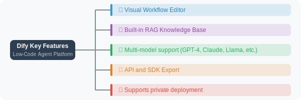
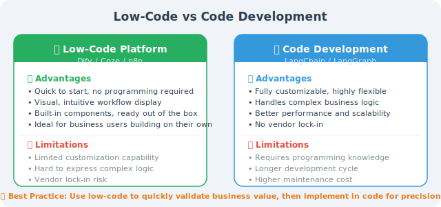

# Low-Code Agent Platforms: Dify, Coze, and More

Low-code platforms allow non-programmers to build Agent applications, lowering the barrier to AI application development. In 2024–2025, a large number of platforms emerged in this space, with competition intensifying.

## Major Low-Code Platforms

### Dify

Dify is currently the most popular open-source LLM application development platform, with 90K+ GitHub stars as of early 2026:



Dify integrates with existing applications via API:

```python
import requests

# Dify application API call example
def call_dify_app(app_token: str, user_message: str) -> str:
    """Call a Dify application"""
    url = "https://api.dify.ai/v1/chat-messages"
    
    response = requests.post(
        url,
        headers={
            "Authorization": f"Bearer {app_token}",
            "Content-Type": "application/json"
        },
        json={
            "inputs": {},
            "query": user_message,
            "response_mode": "blocking",
            "user": "user_001"
        }
    )
    
    result = response.json()
    return result.get("answer", "")

# Usage example
answer = call_dify_app("your-app-token", "How do I apply for reimbursement?")
print(answer)
```

### Coze

An Agent-building platform launched by ByteDance, one of the most feature-rich low-code Agent platforms:

**Key features**:
- Graphical Agent building with drag-and-drop workflow orchestration (supports conditional branching and loops)
- Rich built-in plugins (weather, search, code execution, database, etc.)
- Multi-platform publishing: WeChat, Feishu, Douyin, Discord, Telegram, and more
- Bot marketplace (share and reuse bots)
- Knowledge base management (supports RAG retrieval augmentation)

Coze also provides an API for calling bots built on Coze via code:

```python
import requests
import json

def call_coze_bot(
    bot_id: str,
    user_message: str,
    access_token: str,
    user_id: str = "user_001",
) -> str:
    """Call the Coze Bot API"""
    url = "https://api.coze.com/v3/chat"

    response = requests.post(
        url,
        headers={
            "Authorization": f"Bearer {access_token}",
            "Content-Type": "application/json",
        },
        json={
            "bot_id": bot_id,
            "user_id": user_id,
            "stream": False,
            "auto_save_history": True,
            "additional_messages": [
                {
                    "role": "user",
                    "content": user_message,
                    "content_type": "text",
                }
            ],
        },
    )

    result = response.json()
    # Coze API returns messages in data.messages
    if result.get("code") == 0:
        messages = result.get("data", {}).get("messages", [])
        # Find the assistant's reply
        for msg in messages:
            if msg.get("role") == "assistant" and msg.get("type") == "answer":
                return msg.get("content", "")
    return f"API call failed: {result.get('msg', 'Unknown error')}"


# Usage example
answer = call_coze_bot(
    bot_id="your-bot-id",
    user_message="Help me analyze recent sales data trends",
    access_token="your-access-token",
)
print(answer)
```

> 💡 **Coze vs Dify selection**: Coze is better suited for scenarios that need quick distribution to multiple instant messaging platforms (WeChat, Feishu, Douyin); Dify is better for enterprise scenarios requiring private deployment and custom workflows.

### Dify Workflow API

Beyond the basic conversation API, Dify also supports calling **Workflows** via API, which is very useful for embedding Dify-orchestrated complex logic into your own systems:

```python
import requests

def run_dify_workflow(
    api_key: str,
    inputs: dict,
    user: str = "user_001",
) -> dict:
    """Call the Dify Workflow API"""
    url = "https://api.dify.ai/v1/workflows/run"

    response = requests.post(
        url,
        headers={
            "Authorization": f"Bearer {api_key}",
            "Content-Type": "application/json",
        },
        json={
            "inputs": inputs,
            "response_mode": "blocking",
            "user": user,
        },
    )

    result = response.json()
    return result.get("data", {}).get("outputs", {})


# Example: call a "document summary + translation" workflow
outputs = run_dify_workflow(
    api_key="app-your-workflow-key",
    inputs={
        "document_url": "https://example.com/report.pdf",
        "target_language": "Chinese",
    },
)
print(outputs)
# Output: {"summary": "...", "translation": "..."}
```

### n8n: Workflow Automation Platform

n8n is an open-source workflow automation platform with built-in AI Agent nodes, enabling complex LLM workflows through drag-and-drop configuration. Its core advantage is **connecting everything** — supporting 400+ app integrations.

n8n integrates bidirectionally with external systems via Webhooks:

```python
import requests

# Call an n8n Webhook to trigger an AI workflow
# Configure in n8n: Webhook → AI Agent → Slack notification
def trigger_n8n_workflow(
    webhook_url: str,
    payload: dict,
) -> dict:
    """Trigger an n8n workflow"""
    response = requests.post(webhook_url, json=payload)
    return response.json()


# Example: trigger a "daily task intelligent prioritization" workflow
result = trigger_n8n_workflow(
    webhook_url="https://your-n8n.example.com/webhook/daily-tasks",
    payload={
        "tasks": [
            "Complete project proposal",
            "Fix production bug",
            "Write weekly report",
            "Team code review",
        ],
        "context": "There's an important client demo this afternoon",
    },
)
# n8n workflow: read tasks → call GPT-4o to analyze priorities → return sorted results
print(result)  # {"prioritized_tasks": [...], "reasoning": "..."}
```

### Other Noteworthy Platforms

| Platform | Key Features | Best For |
|----------|-------------|---------|
| **FastGPT** | Open-source, excellent knowledge base RAG | Enterprise knowledge base Q&A |
| **Langflow** | LangChain visual orchestration | Developer rapid prototyping |
| **Flowise** | Low-code LangChain orchestration | Simple Agent building |
| **Baidu AppBuilder** | Baidu ecosystem, ERNIE model | Domestic enterprise applications |
| **Alibaba Tongyi** | Alibaba Cloud ecosystem, Qwen model | Domestic enterprise applications |

## Low-Code vs Code Development



### How to Choose?

```python
decision_guide = {
    "Choose low-code platform": [
        "Quickly validate MVP (prototype within 1–3 days)",
        "Projects led by non-technical teams",
        "Standardized customer service/Q&A/document processing scenarios",
        "Internal tools with low customization requirements",
    ],
    "Choose code development": [
        "Need deep customization of Agent behavior logic",
        "Strict requirements on latency/cost/security",
        "Need deep integration with existing systems",
        "Complex architectures like multi-Agent collaboration",
    ],
    "Hybrid approach": [
        "Use Dify to quickly build a prototype and validate product direction",
        "After validation, rewrite core logic with LangChain/LangGraph",
        "Keep Dify as an orchestration tool for non-core modules",
    ],
}
```

---

## Summary

Low-code platforms lower the barrier to Agent development, but code development provides greater flexibility. The best practice is: use low-code to quickly validate ideas, then use code for fine-tuned implementation and production deployment. As platforms like Dify and Coze continue to iterate, the capability boundaries of low-code platforms are constantly expanding.

---

*Next section: [14.5 How to Choose the Right Framework?](./05_how_to_choose.md)*
