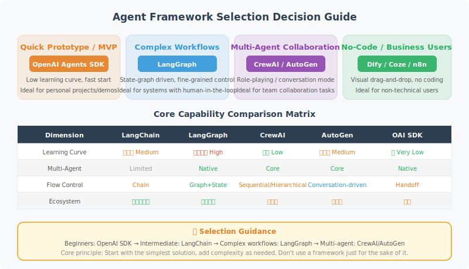

# 14.5 How to Choose the Right Framework

> **Translation in progress.** This chapter is currently being translated from Chinese.
> Please refer to the [Chinese version](../../zh/chapter_frameworks/05_how_to_choose.md) in the meantime.

# How to Choose the Right Framework?

Framework selection is one of the key decisions for Agent project success. With the release of OpenAI Agents SDK in 2025 and the rapid iteration of various frameworks, the choices have become even richer. This section provides a systematic decision framework.



## Framework Capability Comparison Matrix

```python
framework_comparison = {
    "Framework": [
        "LangChain", "LangGraph", "CrewAI",
        "AutoGen", "OpenAI Agents SDK", "Dify", "Coze/n8n"
    ],
    
    "Learning Curve": ["Medium", "High", "Low", "Medium", "Low", "Low", "Very Low"],
    
    "Multi-Agent Support": [
        "Limited", "Native", "Core Feature",
        "Core Feature", "Native", "Supported", "Limited"
    ],
    
    "Workflow Complexity": [
        "Linear", "Complex Loops", "Sequential/Flow",
        "Event-Driven", "Handoff", "Visual", "Visual"
    ],
    
    "MCP Support": [
        "Community Integration", "Community Integration", "Community Integration",
        "Community Integration", "Native", "Plugin", "Not Supported"
    ],
    
    "Production Ready": ["High", "High", "Medium", "Medium", "High", "Medium", "Low"],
    
    "Best For": [
        "RAG/General Chains",
        "Stateful Workflows",
        "Role-Based Collaboration",
        "Code Generation/Conversation",
        "Lightweight Production Agents",
        "Rapid Prototyping",
        "Non-Technical Users"
    ]
}

# Print comparison
for key, values in framework_comparison.items():
    print(f"\n{key}:")
    for framework, value in zip(framework_comparison["Framework"], values):
        if key != "Framework":
            print(f"  {framework}: {value}")
```

## Decision Tree

```python
def choose_framework(requirements: dict) -> str:
    """Choose a framework based on requirements (updated for 2026)"""
    
    # Non-technical team → low-code
    if not requirements.get("technical_team"):
        return "Dify or Coze (low-code platform)"
    
    # Needs automatic code execution → AutoGen
    if requirements.get("code_execution"):
        return "AutoGen 0.4"
    
    # Lightweight Agent, fast to market → OpenAI Agents SDK
    if (requirements.get("lightweight") and 
        not requirements.get("complex_control_flow")):
        return "OpenAI Agents SDK"
    
    # Clear role division in multi-Agent → CrewAI
    if (requirements.get("multi_agent") and 
        not requirements.get("complex_control_flow")):
        return "CrewAI"
    
    # Complex state management/loops/Human-in-Loop → LangGraph
    if (requirements.get("complex_control_flow") or
        requirements.get("human_in_the_loop") or
        requirements.get("stateful_workflow")):
        return "LangGraph"
    
    # Standard RAG/single Agent → LangChain
    return "LangChain"


# Test decisions
scenarios = [
    {
        "name": "Enterprise Knowledge Base Q&A",
        "technical_team": True,
        "multi_agent": False,
        "code_execution": False,
        "complex_control_flow": False,
        "lightweight": False
    },
    {
        "name": "Automated Software Development Assistant",
        "technical_team": True,
        "multi_agent": True,
        "code_execution": True,
        "complex_control_flow": True,
        "lightweight": False
    },
    {
        "name": "Content Creation Team",
        "technical_team": True,
        "multi_agent": True,
        "code_execution": False,
        "complex_control_flow": False,
        "lightweight": False
    },
    {
        "name": "Customer Service Automation (Business Configuration)",
        "technical_team": False,
        "multi_agent": False,
        "code_execution": False,
        "complex_control_flow": False,
        "lightweight": False
    },
    {
        "name": "Quickly Build a Tool-Calling Agent",
        "technical_team": True,
        "multi_agent": False,
        "code_execution": False,
        "complex_control_flow": False,
        "lightweight": True
    }
]

print("Framework Selection Recommendations:\n")
for scenario in scenarios:
    name = scenario["name"]  # Use [] to read, not pop(), to avoid modifying the original dict
    # Build a requirements dict without the "name" key to pass to the decision function
    requirements = {k: v for k, v in scenario.items() if k != "name"}
    framework = choose_framework(requirements)
    print(f"Scenario: {name}")
    print(f"Recommended: {framework}\n")
```

## Framework Strategy for Real Projects

```python
# Most production projects use a mix of multiple frameworks

class HybridAgentSystem:
    """
    Typical architecture for a real production system (2025–2026):
    - LangGraph manages complex workflow state
    - OpenAI Agents SDK handles lightweight Agent logic
    - LangChain handles RAG and chain calls
    - MCP unifies the tool interface
    - Custom code handles business logic
    """
    
    def __init__(self):
        # LangGraph for workflows
        from langgraph.graph import StateGraph
        self.workflow = None  # Built with LangGraph
        
        # LangChain for RAG
        from langchain_community.vectorstores import Chroma
        self.knowledge_base = None  # Built with LangChain
        
        # OpenAI Agents SDK for lightweight Agents
        # from agents import Agent, Runner
        self.agents = {}
        
        # Custom tools (can be standardized via MCP)
        self.tools = {}
    
    def build(self):
        """Combine frameworks to build a complete system"""
        # 1. Use LangChain to build the knowledge base
        # 2. Use LangGraph to build the workflow
        # 3. Use OpenAI Agents SDK to create lightweight Agents
        # 4. Use MCP to standardize the tool interface
        pass

# Advice: don't get locked into any single framework
# Understand each framework's strengths and combine as needed
```

## Final Recommendations

```
Core principles for choosing a framework:

1. Start simple
   Try OpenAI Agents SDK or LangChain + direct API calls first
   Don't introduce complex frameworks if simpler ones are sufficient

2. Upgrade based on bottlenecks
   Find you need state management → introduce LangGraph
   Need multi-role collaboration → consider CrewAI
   Need code execution → consider AutoGen

3. Embrace standard protocols
   Use MCP to unify the tool interface, reducing the cost of switching frameworks
   Follow A2A protocol development to prepare for Agent interoperability

4. Keep framework-agnostic code
   Don't tightly couple business logic to a specific framework
   Keep tool functions general-purpose

5. Prioritize debugging and observability
   In production, prefer solutions with good logging and observability
   LangSmith, Dify, etc. all provide good observability capabilities

6. Community and ecosystem
   Choose actively maintained frameworks (check GitHub activity)
   Most active in 2025: LangGraph, CrewAI, OpenAI Agents SDK
```

---

## Chapter Summary

Overview of major frameworks:

| Framework | Core Advantage | Recommended For |
|-----------|---------------|----------------|
| LangChain | Rich ecosystem, powerful RAG | General Agents, rapid development |
| LangGraph | State management, complex workflows | Production-grade stateful Agents |
| CrewAI | Simple multi-Agent + Flows | Tasks with clear role division |
| AutoGen 0.4 | Event-driven, code execution | Programming automation tasks |
| OpenAI Agents SDK | Lightweight, native MCP | Quickly build production Agents |
| Dify/Coze | Low-code visual | Non-technical teams for rapid validation |

---

*Next chapter: [Chapter 16 Multi-Agent Collaboration](../chapter_multi_agent/README.md)*
