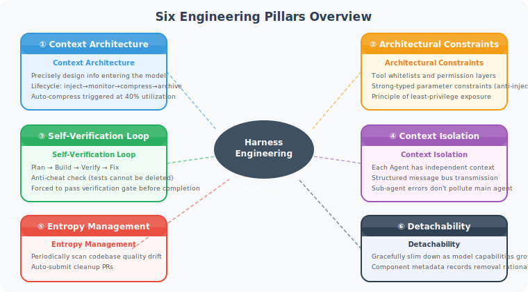
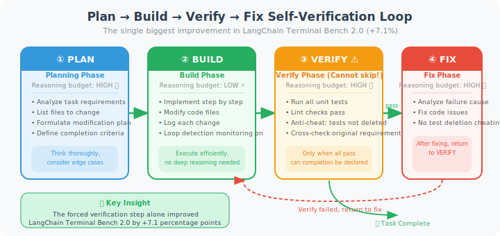

# 9.2 Six Engineering Pillars

> 🏛️ *"Constraints liberate — clear boundaries make Agents more efficient and reliable."*

---

The complete practice system of Harness Engineering consists of **six engineering pillars**. Each pillar solves a specific category of reliability problems, and together they form an Agent system that can run stably and continuously.



As shown in the diagram, the six pillars center on Harness Engineering, each pointing to a different reliability dimension:

| Pillar | Core Problem Solved | Priority |
|--------|--------------------|---------:|
| ① Context Architecture | Agent "anxiety" and step-skipping due to context overload in long tasks | ⭐⭐⭐⭐⭐ |
| ② Architectural Constraints | Prompt soft constraints are unreliable; depending on model "self-discipline" is unstable | ⭐⭐⭐⭐⭐ |
| ③ Self-Verification Loop | Agent claims completion without verification, or cheats by deleting tests | ⭐⭐⭐⭐⭐ |
| ④ Context Isolation | Erroneous information propagates across Agents in multi-Agent systems | ⭐⭐⭐⭐ |
| ⑤ Entropy Management | Rapid AI code generation causes codebase quality to spiral downward | ⭐⭐⭐ |
| ⑥ Detachability | Harness accumulates over time, masking the model's true capabilities | ⭐⭐⭐ |

> 💡 **Implementation advice**: don't try to implement all six pillars at once. The first three (context architecture + architectural constraints + self-verification loop) can already solve 80% of production reliability problems — implement these first.

---

## Pillar 1: Context Architecture

**Core philosophy**: precisely design the information entering the model's context, actively managing the "attention budget."

This is consistent with the context engineering discussed in Chapter 8, but Harness Engineering further emphasizes **active monitoring and dynamic adjustment**.

### Context Lifecycle Management

```python
class ContextLifecycleManager:
    """
    Context lifecycle manager.
    
    Four lifecycle phases:
    Inject → Monitor → Compress → Archive
    """
    
    COMPRESSION_THRESHOLD = 0.40  # trigger compression when utilization exceeds 40%
    ARCHIVE_THRESHOLD = 0.70      # trigger archiving when utilization exceeds 70%
    
    def __init__(self, model, max_tokens: int):
        self.model = model
        self.max_tokens = max_tokens
        self.messages = []
        self.archived_summary = None
    
    # === Phase 1: Inject ===
    def inject(self, message: dict) -> None:
        """Smart injection: priority queuing, not mindless appending"""
        priority = self._assess_priority(message)
        if priority == "CRITICAL":
            self.messages.insert(1, message)   # insert immediately after system message
        elif priority == "HIGH":
            self.messages.append(message)       # normal append
        elif priority == "LOW":
            # Low-priority messages only appended when there's space
            if self.utilization() < 0.3:
                self.messages.append(message)
    
    # === Phase 2: Monitor ===
    def utilization(self) -> float:
        """Real-time monitoring of context utilization"""
        current_tokens = sum(count_tokens(m) for m in self.messages)
        return current_tokens / self.max_tokens
    
    def health_check(self) -> dict:
        """Context health report"""
        util = self.utilization()
        return {
            "utilization": f"{util:.1%}",
            "status": "🟢 Healthy" if util < 0.4 else 
                      "🟡 Warning" if util < 0.7 else "🔴 Danger",
            "token_count": int(util * self.max_tokens),
            "recommendation": self._get_recommendation(util),
        }
    
    def _get_recommendation(self, util: float) -> str:
        if util < 0.4:
            return "Normal, no action needed"
        elif util < 0.7:
            return "Recommend cleaning up old tool outputs"
        else:
            return "⚠️ Execute full compression immediately"
    
    # === Phase 3: Compress ===
    def compress(self) -> None:
        """Progressive compression: from lightweight to full"""
        util = self.utilization()
        
        if util >= self.COMPRESSION_THRESHOLD:
            # Step 1: lightweight compression — clear old tool results (safest)
            self._clear_old_tool_results()
        
        if self.utilization() >= self.COMPRESSION_THRESHOLD:
            # Step 2: full compression — generate structured summary
            self._full_compress()
    
    def _clear_old_tool_results(self) -> None:
        """Clear older tool execution results (Anthropic's recommended lightweight compression)"""
        cutoff_index = len(self.messages) - 8  # keep the most recent 4 rounds of interaction
        for i, msg in enumerate(self.messages[:cutoff_index]):
            if msg.get("role") == "tool":
                self.messages[i] = {
                    "role": "tool",
                    "tool_call_id": msg.get("tool_call_id"),
                    "content": f"[Executed: {msg.get('name', 'tool')} → result archived to save space]"
                }
    
    def _full_compress(self) -> None:
        """Full compression: replace intermediate history with structured summary"""
        system_msgs = [m for m in self.messages if m["role"] == "system"]
        recent_msgs = self.messages[-6:]   # keep the most recent 3 rounds
        middle_msgs = self.messages[len(system_msgs):-6]
        
        if not middle_msgs:
            return
        
        summary_prompt = """
Please compress the following conversation history into a structured summary.

Must preserve:
1. The user's core goals and current state
2. Key operations completed (including specific file paths, function names, values)
3. Problems discovered and corresponding resolution decisions
4. Current to-do items

Can discard:
- Repeated attempt records
- Verbose raw tool outputs
- Exploratory discussions without conclusions

Format: use hierarchical lists, ensure key details are not lost.
"""
        compressed = self.model.summarize(
            prompt=summary_prompt,
            content=format_as_text(middle_msgs)
        )
        
        self.messages = system_msgs + [
            {"role": "system", "content": f"[Conversation History Summary]\n{compressed}"}
        ] + recent_msgs
    
    # === Phase 4: Archive ===
    def archive_session(self) -> None:
        """Archive key decisions after task completion for future reference"""
        self.archived_summary = self.model.summarize(
            prompt="Please extract the key decisions, lessons learned, and reusable patterns from this task.",
            content=format_as_text(self.messages)
        )
```

### Progressive Disclosure

This is a key pattern from OpenAI's million-line code experiment: **don't dump all information to the Agent at once — disclose progressively on demand**.

```python
class ProgressiveDisclosure:
    """
    Progressive disclosure strategy.
    
    Wrong approach: put the entire 2000-line AGENTS.md into context
    Right approach: only provide the table of contents, Agent fetches specific sections on demand
    """
    
    def __init__(self, docs_dir: str):
        # Build document index (lightweight)
        self.doc_index = self._build_index(docs_dir)
    
    def _build_index(self, docs_dir: str) -> dict:
        """Build document index — only record document names and one-sentence summaries"""
        index = {}
        for doc_path in Path(docs_dir).rglob("*.md"):
            with open(doc_path) as f:
                content = f.read()
                # Extract document title and first paragraph summary
                lines = content.strip().split('\n')
                title = lines[0].lstrip('#').strip()
                summary = next((l for l in lines[2:] if l.strip()), "")[:100]
                index[str(doc_path)] = {
                    "title": title,
                    "summary": summary,
                    "size_tokens": count_tokens(content),
                }
        return index
    
    def get_initial_context(self) -> str:
        """Return document table of contents (not full document text)"""
        lines = ["Available documents:\n"]
        for path, meta in self.doc_index.items():
            lines.append(f"- [{meta['title']}]({path}): {meta['summary']}")
        lines.append("\nPlease use the read_doc tool to fetch specific document content.")
        return '\n'.join(lines)
    
    def read_doc(self, doc_path: str) -> str:
        """Agent calls on demand to fetch specific documents"""
        with open(doc_path) as f:
            return f.read()
```

---

## Pillar 2: Architectural Constraints

**Core philosophy**: use tools and code to enforce rules, rather than relying on Prompt "soft constraints."

**Key principle**: *To achieve higher AI autonomy, the runtime must be subject to stricter constraints.* (Like highway guardrails that let you drive faster.)

### Tool Whitelists and Permission Tiers

```python
from enum import Enum
from typing import Callable

class PermissionLevel(Enum):
    READ_ONLY = 1          # can only read, not write
    WRITE_SAFE = 2         # can write, but with undo mechanism
    WRITE_DESTRUCTIVE = 3  # deletes/modifies important data, requires confirmation
    SYSTEM = 4             # system-level operations, strictly limited

class ToolRegistry:
    """
    Tool registry: implements permission tiers.
    
    Design principle: minimum privilege exposure
    - Not all tools are visible to all Agents
    - Dangerous operations require additional confirmation steps
    """
    
    def __init__(self, agent_role: str):
        self.agent_role = agent_role
        self.tools = {}
        self._load_permitted_tools()
    
    def _load_permitted_tools(self):
        """Load the allowed tool set based on Agent role"""
        role_permissions = {
            "code_reviewer": [PermissionLevel.READ_ONLY],
            "code_writer": [PermissionLevel.READ_ONLY, PermissionLevel.WRITE_SAFE],
            "devops": [PermissionLevel.READ_ONLY, PermissionLevel.WRITE_SAFE, 
                       PermissionLevel.WRITE_DESTRUCTIVE],
        }
        allowed_levels = role_permissions.get(self.agent_role, [PermissionLevel.READ_ONLY])
        
        # Only register tools allowed for this role
        for name, tool in ALL_TOOLS.items():
            if tool.permission_level in allowed_levels:
                self.tools[name] = tool
    
    def register_tool(
        self, 
        name: str, 
        func: Callable,
        permission: PermissionLevel,
        description: str,
        idempotent: bool = False  # whether idempotent (safe to execute repeatedly)
    ):
        """Register a tool, must declare its permission level and idempotency"""
        if permission == PermissionLevel.WRITE_DESTRUCTIVE:
            # Dangerous operation: wrap with confirmation logic
            func = self._wrap_with_confirmation(func, name)
        
        if not idempotent and permission >= PermissionLevel.WRITE_SAFE:
            # Non-idempotent write operations: add operation log, support undo
            func = self._wrap_with_audit_log(func, name)
        
        self.tools[name] = {
            "function": func,
            "permission": permission,
            "description": description,
            "idempotent": idempotent,
        }
    
    def _wrap_with_confirmation(self, func: Callable, tool_name: str) -> Callable:
        """Add confirmation step for dangerous operations"""
        def confirmed_func(*args, **kwargs):
            print(f"⚠️  About to execute dangerous operation: {tool_name}")
            print(f"   Parameters: {args}, {kwargs}")
            confirm = input("Confirm execution? (yes/no): ")
            if confirm.lower() != "yes":
                return {"status": "cancelled", "reason": "User cancelled"}
            return func(*args, **kwargs)
        return confirmed_func

# Practical example: set up a reasonable tool set for a coding Agent
def create_coding_agent_tools() -> ToolRegistry:
    registry = ToolRegistry(agent_role="code_writer")
    
    # ✅ Safe: read file (idempotent, read-only)
    registry.register_tool(
        name="read_file",
        func=lambda path: open(path).read(),
        permission=PermissionLevel.READ_ONLY,
        description="Read file content. Parameters: file_path (string)",
        idempotent=True,
    )
    
    # ✅ Safe: write file (non-idempotent, but with audit log)
    registry.register_tool(
        name="write_file",
        func=lambda path, content: write_with_backup(path, content),
        permission=PermissionLevel.WRITE_SAFE,
        description="Write file content. Parameters: file_path, content",
        idempotent=False,
    )
    
    # ❌ Not exposed to Agent: delete file (too dangerous)
    # registry.register_tool("delete_file", ...)
    
    # ✅ Restricted: run tests (read-only form of side-effect operation)
    registry.register_tool(
        name="run_tests",
        func=lambda test_pattern="": run_pytest(test_pattern),
        permission=PermissionLevel.WRITE_SAFE,
        description="Run test suite. Parameters: test_pattern (optional, runs all by default)",
        idempotent=True,
    )
    
    return registry
```

### Strong-Typed Parameter Constraints

```python
from pydantic import BaseModel, validator, Field

class FileWriteParams(BaseModel):
    """
    Strong-typed definition of tool parameters.
    
    Don't accept dict, accept validated Pydantic models.
    This way, parameter errors can be caught before tool execution,
    rather than silently occurring during execution.
    """
    file_path: str = Field(
        description="File path to write to",
        example="src/utils/helper.py"
    )
    content: str = Field(
        description="File content to write",
    )
    mode: str = Field(
        default="overwrite",
        description="Write mode: overwrite or append",
    )
    
    @validator('file_path')
    def validate_path(cls, v):
        # Prevent path traversal attacks
        if '..' in v:
            raise ValueError("Path traversal with .. is forbidden")
        # Prevent writing to system directories
        forbidden_prefixes = ['/etc/', '/usr/', '/bin/', '/sys/']
        for prefix in forbidden_prefixes:
            if v.startswith(prefix):
                raise ValueError(f"Writing to system directory is forbidden: {prefix}")
        return v
    
    @validator('mode')
    def validate_mode(cls, v):
        allowed_modes = {'overwrite', 'append'}
        if v not in allowed_modes:
            raise ValueError(f"mode must be one of {allowed_modes}")
        return v
```

---

## Pillar 3: Self-Verification Loop

**Core philosophy**: build validation checkpoints into the Agent's execution flow, **requiring the Agent to prove the task is truly complete before claiming completion**.

This is the **single improvement with the greatest impact on success rate** among the six pillars. According to LangChain's experimental data, simply enforcing validation steps improved benchmark scores by +7.1 percentage points — more than all other improvements combined.

### Plan-Build-Verify-Fix Four-Phase Workflow



As shown in the diagram, the four phases have different reasoning budget strategies:
- **Plan**: use high reasoning budget, think deeply about all edge cases
- **Build**: use low reasoning budget, execute efficiently according to plan, no need for deep deliberation
- **Verify**: use high reasoning budget, carefully check each requirement
- **Fix**: use high reasoning budget, deeply analyze root causes of failures

Note the **loop structure**: after verification failure, return to the fix phase, then verify again, until all checks pass. This closed loop is the key mechanism for ensuring task quality.

Inspired by GANs (Generative Adversarial Networks), separate the Generator Agent from the Critic Agent:

```python
class PlanBuildVerifyFix:
    """
    Four-phase workflow: Plan → Build → Verify → Fix
    
    This is the most effective Harness pattern proven in LangChain Terminal Bench 2.0
    This pattern alone improved scores from 52.8% to 66.5% (+13.7%)
    """
    
    def __init__(self, agent, tools):
        self.agent = agent
        self.tools = tools
        self.loop_detector = LoopDetector(max_same_attempts=3)
    
    def execute(self, task: str) -> dict:
        """Execute the complete four-phase workflow"""
        
        # ===== Phase 1: Plan (high reasoning budget) =====
        print("📋 Phase 1: Planning...")
        plan = self.agent.plan(
            task=task,
            reasoning_budget="high",  # think thoroughly in planning phase
            prompt_addition="""
Please formulate a detailed execution plan including:
1. Which files need to be modified
2. What changes need to be made to each file
3. Verification steps (test commands)
4. Completion criteria (how to determine the task is truly complete)
"""
        )
        
        # ===== Phase 2: Build (medium reasoning budget) =====
        print("🔨 Phase 2: Building...")
        build_result = self.agent.build(
            plan=plan,
            reasoning_budget="medium",  # execute according to plan, no need for deep thinking
            tools=self.tools,
            loop_detector=self.loop_detector,  # inject loop detection
        )
        
        # ===== Phase 3: Verify (high reasoning budget) =====
        print("✅ Phase 3: Verifying...")
        verification = self.verify(task, plan, build_result)
        
        if verification.passed:
            return {
                "status": "success",
                "result": build_result,
                "verification": verification,
            }
        
        # ===== Phase 4: Fix (high reasoning budget) =====
        print("🔧 Phase 4: Fixing...")
        fix_result = self.agent.fix(
            original_task=task,
            plan=plan,
            build_result=build_result,
            verification_failures=verification.failures,
            reasoning_budget="high",
            prompt_addition=f"""
Verification failed. Please fix the following issues:
{verification.failure_report}

Note:
- Do not delete or modify test cases to make tests pass
- Fix the actual code problems
- Re-run all tests after fixing
"""
        )
        
        # Verify again (prevent infinite fix loops)
        final_verification = self.verify(task, plan, fix_result)
        return {
            "status": "success" if final_verification.passed else "partial",
            "result": fix_result,
            "verification": final_verification,
        }
    
    def verify(self, task: str, plan: dict, build_result: dict) -> 'VerificationResult':
        """
        Verification phase: not just running tests, also checking for "cheating" behavior
        """
        failures = []
        
        # Check 1: unit tests
        test_result = self.tools.run_tests()
        if not test_result.passed:
            failures.append(f"Unit tests failed: {test_result.failure_summary}")
        
        # Check 2: anti-cheating check — ensure no tests were deleted
        test_deletions = self._check_test_deletions(build_result.file_changes)
        if test_deletions:
            failures.append(f"⚠️ Detected test file modifications/deletions: {test_deletions}")
        
        # Check 3: Linter
        lint_result = self.tools.run_linter()
        if lint_result.error_count > 0:
            failures.append(f"Lint errors: {lint_result.error_count} issues")
        
        # Check 4: verify all files declared in the plan were modified
        planned_files = set(plan.get("files_to_modify", []))
        modified_files = set(build_result.file_changes.keys())
        missing = planned_files - modified_files
        if missing:
            failures.append(f"Files in plan not modified: {missing}")
        
        return VerificationResult(
            passed=len(failures) == 0,
            failures=failures,
            failure_report='\n'.join(failures),
        )
    
    def _check_test_deletions(self, file_changes: dict) -> list:
        """Detect if tests were deleted (common AI cheating pattern)"""
        suspicious = []
        for file_path, change in file_changes.items():
            if 'test' in file_path.lower():
                if change.lines_deleted > change.lines_added * 2:
                    suspicious.append(f"{file_path}: deleted {change.lines_deleted} lines, only added {change.lines_added} lines")
        return suspicious
```

### Pre-Condition Validation

```python
class PreConditionValidator:
    """
    Pre-condition validation: confirm the environment is ready before the Agent starts executing.
    
    Analogy: pre-surgical checklist (WHO Surgical Safety Checklist)
    Research shows such checklists can reduce error rates by 50%+
    """
    
    def validate_before_task(self, task: dict) -> list:
        """Return all pre-conditions that failed"""
        violations = []
        
        # Check that dependency files exist
        for required_file in task.get("requires_files", []):
            if not Path(required_file).exists():
                violations.append(f"Required file does not exist: {required_file}")
        
        # Check baseline test state (tests should pass before task starts)
        if task.get("type") == "code_modification":
            baseline = run_tests()
            if not baseline.all_passed:
                violations.append(
                    f"Tests already failing before task starts: {baseline.failure_count} failures. "
                    "Recommend fixing existing failures before continuing this task."
                )
        
        # Check working directory is clean
        git_status = run_git_status()
        if git_status.has_unstaged_changes:
            violations.append(
                "Working directory has uncommitted changes. Recommend committing or stashing first."
            )
        
        return violations
```

---

## Pillar 4: Context Isolation

**Core philosophy**: in multi-Agent systems, each Agent's context should be **mutually isolated**, passing information through structured interfaces rather than sharing complete conversation history.

```python
class IsolatedAgentContext:
    """
    Isolated Agent context management.
    
    Each Agent has:
    - Independent conversation history
    - Independent tool set (principle of least privilege)
    - Only interacts with other Agents through "interfaces"
    
    Avoid:
    - Directly passing complete context history to sub-Agents
    - Sub-Agent errors propagating to the main Agent
    """
    
    def spawn_sub_agent(
        self,
        role: str,
        task: str,
        context_summary: str,      # only pass necessary summary, not full history
        allowed_tools: list[str],  # only expose tools needed to complete this task
    ) -> 'SubAgentResult':
        """
        Spawn a sub-Agent: strictly control its context and tool permissions.
        
        Correct approach:
        Main Agent holds the full architectural picture, sub-Agent only receives
        the fragment needed to complete its subtask.
        """
        sub_agent = Agent(
            role=role,
            system_prompt=self._build_sub_agent_prompt(role, task),
            tools=self._filter_tools(allowed_tools),
            initial_context=context_summary,  # only summary, not full history
        )
        
        try:
            result = sub_agent.execute(task)
            # Validate sub-Agent output format
            return self._validate_and_package(result, role)
        except Exception as e:
            # Sub-Agent errors are isolated, don't contaminate main Agent
            return SubAgentResult(
                success=False,
                error=str(e),
                fallback_needed=True,
            )
    
    def _build_sub_agent_prompt(self, role: str, task: str) -> str:
        """Build a focused, concise system prompt for the sub-Agent"""
        return f"""
You are a {role} focused on a single task.

Your task: {task}

Important constraints:
- Only complete the above task, don't do anything extra
- If you encounter issues outside the task scope, return an error rather than handling them yourself
- Return results in structured JSON format upon completion
"""


class MessageBus:
    """
    Inter-Agent message bus.
    
    All inter-Agent communication goes through this bus, implementing:
    1. Message format validation (prevent format errors from propagating)
    2. Message filtering (prevent sensitive information leakage)
    3. Audit logging (traceable)
    """
    
    def publish(self, sender: str, recipient: str, message: dict) -> bool:
        """Publish message: format validation + audit"""
        # 1. Validate message format
        if not self._validate_message_schema(message):
            self._log_error(f"Message format error: {sender} -> {recipient}")
            return False
        
        # 2. Filter sensitive information
        sanitized = self._sanitize(message)
        
        # 3. Route to target Agent
        self._route(recipient, sanitized)
        
        # 4. Audit log
        self._audit_log(sender, recipient, sanitized)
        return True
    
    def _sanitize(self, message: dict) -> dict:
        """Clean sensitive content from messages"""
        # Remove fields that might contain credentials
        sensitive_keys = ['api_key', 'password', 'token', 'secret']
        return {
            k: v for k, v in message.items() 
            if k.lower() not in sensitive_keys
        }
```

---

## Pillar 5: Entropy Management

**Core philosophy**: AI generates code extremely fast, and without active maintenance mechanisms, the codebase will rapidly accumulate "technical debt," which in turn affects the quality of subsequent AI work.

```python
class EntropyGardener:
    """
    Entropy management Agent: runs periodically to maintain system health.
    
    Analogy: the "immune system" of the codebase.
    Proactively discovers and eliminates accumulating problems before they spread.
    """
    
    def __init__(self, repo_path: str):
        self.repo = Repository(repo_path)
    
    def weekly_health_check(self) -> HealthReport:
        """Comprehensive health check run weekly"""
        issues = []
        
        # Check 1: documentation synchronization
        issues += self._check_doc_sync()
        
        # Check 2: convention violations
        issues += self._check_convention_violations()
        
        # Check 3: dead code
        issues += self._check_dead_code()
        
        # Check 4: dependency health
        issues += self._check_dependency_health()
        
        # Check 5: test coverage regression
        issues += self._check_coverage_regression()
        
        # Automatically create PRs to fix auto-fixable issues
        auto_fixed = []
        for issue in issues:
            if issue.auto_fixable:
                pr = self.repo.create_pr(
                    title=f"[Entropy Garden] {issue.title}",
                    changes=issue.fix(),
                    description=issue.description,
                )
                auto_fixed.append(pr)
        
        return HealthReport(
            issues_found=len(issues),
            auto_fixed=len(auto_fixed),
            manual_review_needed=[i for i in issues if not i.auto_fixable],
        )
    
    def _check_doc_sync(self) -> list:
        """Check if documentation is in sync with code"""
        violations = []
        
        for func_path, func_info in self.repo.get_all_functions().items():
            doc_path = func_info.get('doc_reference')
            if not doc_path:
                continue
            
            # Check if the interface described in docs matches actual code
            documented_params = parse_doc_params(doc_path)
            actual_params = func_info['parameters']
            
            if documented_params != actual_params:
                violations.append(Issue(
                    title=f"Doc-code out of sync: {func_path}",
                    description=f"Documented params: {documented_params}\nActual params: {actual_params}",
                    auto_fixable=True,
                    fix=lambda: update_doc(doc_path, actual_params),
                ))
        
        return violations
    
    def _check_convention_violations(self) -> list:
        """Check naming convention and code style drift"""
        # Run linter and analyze trends (not just current state)
        current_violations = run_linter(self.repo.path)
        historical = self.repo.get_linter_history(days=7)
        
        violations = []
        for rule, count in current_violations.items():
            if count > historical.get(rule, 0) * 1.5:  # violations increased by more than 50%
                violations.append(Issue(
                    title=f"Convention drift: {rule} violations increased by {count - historical.get(rule, 0)}",
                    auto_fixable=rule in AUTO_FIXABLE_RULES,
                ))
        
        return violations
    
    def context_distillation(self, full_context: str) -> str:
        """
        Context distillation: preserve conclusions, discard reasoning processes.
        
        This is the key technique for preventing context "corruption."
        As iterations proceed, more and more "why" becomes irrelevant —
        only "conclusions" and "rules" need to be preserved.
        """
        distillation_prompt = """
Distill the following context:

Rules:
- Preserve: final decision conclusions, established conventions, verified facts
- Discard: discussion processes, rejected proposals, exploratory attempt records
- Preserve format: concise lists or tables, no narrative text

Output format:
## Established Conventions
...

## Key Decisions
...

## Known Constraints
...
"""
        return model.summarize(distillation_prompt, content=full_context)
```

---

## Pillar 6: Detachability

**Core philosophy**: as model capabilities continuously improve, Harness components needed today may no longer be needed tomorrow. **Good Harness design should be able to gracefully adjust as models iterate.**

This pillar addresses a common pitfall: **over-engineering** — retaining large amounts of constraint mechanisms for problems that no longer exist, which actually masks the model's true capabilities and increases maintenance burden.

```python
class DetachableHarness:
    """
    Detachable Harness design.
    
    Three-layer architecture:
    - Application layer (business logic, stable)
    - Harness core layer (model-agnostic general constraints)
    - Model adaptation layer (constraints specific to particular models)
    
    When the model updates, only the adaptation layer needs updating,
    and constraints that are no longer needed can even be removed.
    """
    
    def __init__(self):
        self.components = {}
        self.component_metadata = {}
    
    def register_component(
        self,
        name: str,
        component,
        rationale: str,              # what problem does this component solve
        added_for_model: str,        # which model deficiency was it added for
        review_trigger: str = "model_update",  # when should it be re-evaluated
    ):
        """Register a Harness component, must state the reason"""
        self.components[name] = component
        self.component_metadata[name] = {
            "rationale": rationale,
            "added_for_model": added_for_model,
            "added_date": datetime.now().isoformat(),
            "review_trigger": review_trigger,
        }
    
    def review_components(self, current_model: str) -> list:
        """
        When the model updates, review which Harness components may no longer be needed.
        
        Returns: list of components that may be removable
        """
        candidates_for_removal = []
        
        for name, meta in self.component_metadata.items():
            if meta["added_for_model"] != current_model:
                # This component was added for an old model's deficiency
                candidates_for_removal.append({
                    "component": name,
                    "original_rationale": meta["rationale"],
                    "recommendation": f"Please test whether this component is still needed on {current_model}",
                })
        
        return candidates_for_removal
    
    def get_health_report(self) -> dict:
        """Harness system health report"""
        return {
            "total_components": len(self.components),
            "components": [
                {
                    "name": name,
                    "rationale": meta["rationale"],
                    "age_days": (datetime.now() - datetime.fromisoformat(meta["added_date"])).days,
                    "review_status": "Needs review" if meta.get("needs_review") else "Normal",
                }
                for name, meta in self.component_metadata.items()
            ]
        }


# Practical: establish a Harness component registry
harness = DetachableHarness()

harness.register_component(
    name="loop_detector",
    component=LoopDetector(max_same_attempts=3),
    rationale="GPT-4o tends to get stuck in doom loops with the same approach when fixing complex bugs",
    added_for_model="gpt-4o",
    review_trigger="model_update",
)

harness.register_component(
    name="test_deletion_checker",
    component=TestDeletionChecker(),
    rationale="Early models had a cheating behavior of deleting test cases to make tests pass",
    added_for_model="claude-3.5-sonnet",
    review_trigger="model_update",
)

harness.register_component(
    name="context_compressor",
    component=ContextLifecycleManager(model, max_tokens=200000),
    rationale="Long-task context management, prevent context overflow",
    added_for_model="all",           # all models need this
    review_trigger="never",         # this is always needed
)
```

### Progressive Implementation Roadmap

It's recommended to implement the six pillars in the following order — each step brings observable improvements:

```
Level 1 (Beginner):
  └── Context management (Pillar 1 basics)
      + AGENTS.md file (Pillar 2 basics)
      + Basic test validation (Pillar 3 basics)

Level 2 (Intermediate):
  └── All of Level 1
      + Loop detection middleware (Pillar 3 advanced)
      + Tool permission tiers (Pillar 2 advanced)
      + Context isolation (Pillar 4)

Level 3 (Production):
  └── All of Level 2
      + Entropy management Agent (Pillar 5)
      + Observability dashboard (Pillars 1+3 combined)
      + Component health review (Pillar 6)
```

---

## Six Pillars Overview

| Pillar | Problem Solved | Core Mechanism | Implementation Priority |
|--------|---------------|---------------|------------------------|
| **Context Architecture** | Context anxiety, information overload | Lifecycle management, progressive disclosure | ⭐⭐⭐⭐⭐ |
| **Architectural Constraints** | Prompt soft constraints unreliable | Tool whitelists, strong-typed params, permission tiers | ⭐⭐⭐⭐⭐ |
| **Self-Verification Loop** | Completion bias, silent failures | Plan-Build-Verify-Fix, anti-cheating checks | ⭐⭐⭐⭐⭐ |
| **Context Isolation** | Multi-Agent contamination effect | Independent contexts, message bus, interface-based | ⭐⭐⭐⭐ |
| **Entropy Management** | Codebase quality degradation | Periodic scanning, auto-fix PRs, context distillation | ⭐⭐⭐ |
| **Detachability** | Harness over-engineering | Component metadata, periodic review, modular design | ⭐⭐⭐ |

> 💡 **Implementation advice**: don't try to implement all six pillars at once. Start with the highest priority (context architecture + architectural constraints + self-verification loop) — these three can already solve 80% of production reliability problems.

---

*Next: [9.3 AGENTS.md / CLAUDE.md: Agent Constitution Writing Guide](./03_agents_md.md)*
