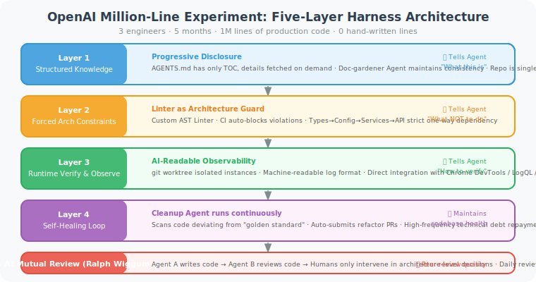
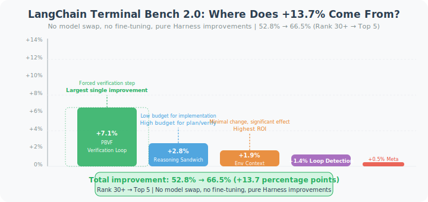

# 9.4 Production Case Studies: OpenAI, LangChain, Stripe

> 📊 *"Theory can't explain practice. Let's look at how engineering teams that actually delivered millions of lines of code and hundreds of thousands of PRs did it."*

---

This section provides an in-depth analysis of three Harness Engineering cases validated in production environments. These three cases cover different application scenarios:

- **OpenAI**: built a complete Harness architecture from scratch, delivering 1 million lines of code in 5 months
- **LangChain**: pure Harness optimization, no model switching, benchmark improved by +13.7%
- **Stripe**: large-scale automated technical debt cleanup, merging 1,000+ PRs per week

---

## Case 1: OpenAI's Million-Line Code Experiment

### Background and Results

**Team size**: 3 engineers (+ AI Agent)  
**Time period**: 5 months  
**Code produced**: approximately 1 million lines of production code  
**Handwritten code**: 0 lines (human engineers wrote zero lines of code)  
**Implementation speed**: approximately 1/10 the cost of traditional development  

This was not a POC (proof of concept) — it was real code deployed to production.

### Core Architecture: Five-Layer Harness System

The OpenAI team built a sophisticated five-layer Harness architecture, with each layer clearly answering one engineering question:



The five-layer architecture forms a **top-down constraint system**:
- **Layer 1** (knowledge system) solves the problem of "Agent doesn't know the project"
- **Layer 2** (architectural constraints) solves the problem of "Agent breaks existing architecture"
- **Layer 3** (runtime validation) solves the problem of "Agent can't self-diagnose"
- **Layer 4** (self-repair loop) solves the problem of "technical debt accumulates rapidly"
- **Layer 5** (AI peer review) solves the problem of "manual review costs too high"

> 💡 **Key insight**: the order of these five layers matters — the clearer the upper-layer constraints, the higher the Agent's autonomy in the lower layers. As the OpenAI team summarized: "To achieve higher AI autonomy, the runtime must be subject to stricter constraints."

#### Layer 1: Progressive Knowledge System

The key innovation is **"document table of contents rather than full document text"**:

```markdown
# AGENTS.md (OpenAI internal practice style)

## Project Architecture
→ See docs/architecture-overview.md (~200 lines, full architectural picture)
→ See docs/domain-model.md (core domain concepts)
→ See docs/api-contracts.md (inter-service interface specifications)

## Module Guides
→ See src/payments/AGENTS.md (payment module)
→ See src/users/AGENTS.md (user module)
→ See src/notifications/AGENTS.md (notification module)

## Development Workflow
Run `make dev-guide` to view the complete development process guide
```

They also introduced a **"Doc Gardener Agent"**:

```python
class DocGardenerAgent:
    """
    Automatically maintains consistency between documentation and code.
    
    Runs after each PR merge, checking:
    1. Whether newly added/modified functions have corresponding documentation
    2. Whether interface descriptions in docs match the code
    3. Whether file references in AGENTS.md are still valid
    """
    
    def post_merge_check(self, pr_diff: dict) -> list:
        issues = []
        
        for file_change in pr_diff['changed_files']:
            # Check if newly added public functions have documentation
            new_public_funcs = extract_new_public_functions(file_change)
            for func in new_public_funcs:
                if not has_docstring(func) or not has_doc_reference(func):
                    issues.append(DocIssue(
                        type="missing_doc",
                        location=func.location,
                        suggestion=f"Function {func.name} is missing a docstring"
                    ))
        
        # Automatically create fix PRs
        if issues:
            self.create_doc_fix_pr(issues)
        
        return issues
```

#### Layer 2: Architectural Constraint System

The OpenAI team encoded architectural rules as **Linter rules**, so that code written by either humans or AI must comply:

```python
# Custom Linter rule example (based on AST analysis)
import ast
from typing import Generator

class LayerDependencyChecker(ast.NodeVisitor):
    """
    Check if module dependencies comply with layered architecture rules.
    
    Rule: api/ cannot directly import models/; must go through services/
    """
    
    LAYER_ORDER = {
        "models": 0,
        "repositories": 1,
        "services": 2,
        "api": 3,
    }
    
    def __init__(self, current_file_layer: str):
        self.current_layer = self.LAYER_ORDER.get(current_file_layer, -1)
        self.violations = []
    
    def visit_Import(self, node: ast.Import) -> None:
        for alias in node.names:
            self._check_import(alias.name, node.lineno)
    
    def visit_ImportFrom(self, node: ast.ImportFrom) -> None:
        if node.module:
            self._check_import(node.module, node.lineno)
    
    def _check_import(self, module_name: str, lineno: int) -> None:
        """Check if import crosses layers"""
        for layer_name, layer_order in self.LAYER_ORDER.items():
            if f".{layer_name}." in module_name or module_name.startswith(f"{layer_name}."):
                if layer_order < self.current_layer - 1:
                    self.violations.append(
                        f"Line {lineno}: {self.current_layer_name} cannot directly import {layer_name}/"
                    )


def run_architecture_check(project_dir: str) -> list:
    """Run architecture check in CI"""
    violations = []
    
    for py_file in Path(project_dir).rglob("*.py"):
        # Determine which layer the current file belongs to
        layer = identify_layer(py_file)
        if not layer:
            continue
        
        with open(py_file) as f:
            tree = ast.parse(f.read())
        
        checker = LayerDependencyChecker(layer)
        checker.visit(tree)
        violations.extend(checker.violations)
    
    return violations
```

#### Layer 3: Runtime Observability

The OpenAI team's key insight: **observability is not just "for humans to see" — it's also "for AI to see."**

```python
class AgentObservabilityLayer:
    """
    Provides machine-readable runtime information for Agents.
    
    Traditional logs: for human debugging, verbose format
    Agent logs: formatted, structured, Agent can directly parse and reason about them
    """
    
    def get_runtime_context(self) -> str:
        """
        Returns runtime state that the Agent can directly understand.
        
        This is injected into the Agent's initial context.
        """
        return f"""
## Current Runtime Environment

**Working directory**: {self.get_cwd()}
**Git status**: {self.get_git_status()}
**Available tools**: {', '.join(self.get_available_tools())}
**Environment variables**: {self.get_safe_env_vars()}
**Timeout**: {self.timeout_seconds} seconds

## Quick Diagnostic Commands
- Run tests: `pytest tests/ -v --tb=short`
- View logs: `tail -100 logs/app.log | grep ERROR`
- Check service status: `curl http://localhost:8000/health`
"""
    
    def get_git_status(self) -> str:
        """Return concise git status"""
        result = subprocess.run(['git', 'status', '--short'], capture_output=True, text=True)
        lines = result.stdout.strip().split('\n')
        if not lines or lines == ['']:
            return "Clean (no uncommitted changes)"
        return f"{len(lines)} files modified"
```

#### Layer 4: Self-Repair Loop

```python
class CleanupAgent:
    """
    Cleanup Agent: runs continuously in the background, combating technical debt accumulation.
    
    OpenAI practice: this Agent automatically submits multiple "cleanup PRs" daily,
    maintaining the codebase in a "golden standard" state.
    """
    
    def daily_cleanup(self) -> list:
        """Daily cleanup tasks"""
        cleanup_tasks = []
        
        # Scan for code deviating from the "golden standard"
        deviations = self.scan_deviations()
        
        for deviation in deviations:
            if deviation.auto_fixable and deviation.risk_level == "low":
                # Auto-fix and submit PR
                fix = self.generate_fix(deviation)
                pr = self.create_pr(
                    title=f"[Cleanup] {deviation.description}",
                    changes=fix,
                    description=f"""
## Automated Cleanup PR

**Issue**: {deviation.description}
**Location**: {deviation.location}
**Fix approach**: {deviation.fix_description}
**Risk rating**: Low risk (automated cleanup)

This PR was automatically generated by CleanupAgent. Questions? @cleanup-agent-team.
""",
                )
                cleanup_tasks.append(pr)
        
        return cleanup_tasks
    
    def scan_deviations(self) -> list:
        """Scan for deviations from the golden standard"""
        deviations = []
        
        # Check functions with non-standard naming
        for func in self.repo.get_all_functions():
            if not is_snake_case(func.name):
                deviations.append(Deviation(
                    type="naming",
                    description=f"Function name doesn't follow snake_case: {func.name}",
                    location=func.location,
                    auto_fixable=True,
                    risk_level="low",
                ))
        
        # Check public functions missing type annotations
        for func in self.repo.get_public_functions():
            if not func.has_type_hints:
                deviations.append(Deviation(
                    type="type_hints",
                    description=f"Public function missing type annotations: {func.name}",
                    location=func.location,
                    auto_fixable=False,  # requires human judgment on types
                    risk_level="medium",
                ))
        
        return deviations
```

#### Layer 5: "Ralph Wiggum Loop" — AI Peer Review

```python
class RalphWiggumLoop:
    """
    AI peer review loop (internally called the "Ralph Wiggum Loop" at OpenAI)
    
    Agent A (writes code) → Agent B (reviews code) → Human (architectural decisions)
    
    Effect: routine code review is fully automated; humans only intervene in high-level design decisions
    """
    
    def __init__(self, writer_agent, reviewer_agent):
        self.writer = writer_agent
        self.reviewer = reviewer_agent
    
    def execute_with_review(self, task: str) -> dict:
        # Step 1: write code
        code_output = self.writer.execute(task)
        
        # Step 2: AI auto-review
        review = self.reviewer.review(
            code=code_output.changes,
            task_description=task,
            review_checklist=[
                "Does it comply with architectural layering rules?",
                "Is there appropriate error handling?",
                "Is there sufficient test coverage?",
                "Are there any security-related changes?",
            ]
        )
        
        if review.has_blocking_issues:
            # Have the code-writing Agent fix the issues found in review
            fixed_output = self.writer.fix(
                original=code_output,
                review_comments=review.blocking_issues,
            )
            return self.execute_with_review.__wrapped__(task, fixed_output)
        
        return {
            "code": code_output,
            "review": review,
            "ready_for_merge": not review.has_blocking_issues,
        }
```

### Key Lessons Summary

```
Core lessons from OpenAI's million-line code experiment (from official retrospective):

1. "When you encounter a problem, fix the system, not the code"
   → Every time an Agent makes a mistake, first ask: which part of the Harness failed?

2. "The codebase is the Agent Constitution"  
   → All rules must exist as code (linters, tests), not text

3. "Observability must be AI-facing"
   → The format of logs and error messages must be directly understandable and reasoned about by Agents

4. "The stricter the constraints, the higher the autonomy"
   → The clearer the guardrails, the more boldly the Agent can act within the boundaries
```

---

## Case 2: LangChain Terminal Bench 2.0 Optimization

### Background and Results

**Goal**: improve benchmark scores purely through Harness improvements, without switching models or fine-tuning.  
**Benchmark**: Terminal Bench 2.0 (evaluates Agent's ability to autonomously complete software engineering tasks)  
**Starting score**: 52.8% (ranked outside top 30)  
**Final score**: 66.5% (ranked top 5)  
**Improvement**: +13.7 percentage points  

**All improvements came from Harness changes — zero model switching, zero fine-tuning.**

### Five Key Harness Improvements

#### Improvement 1: Forced Plan-Build-Verify-Fix Loop (Contribution: +7.1%)

```python
class TerminalBenchHarness:
    """
    Harness implementation optimized for LangChain Terminal Bench 2.0
    """
    
    SYSTEM_PROMPT_ADDITION = """
[MANDATORY WORKFLOW] You must complete each task following these steps:

Step 1 [PLAN]:
  Analyze task requirements, list files to modify and specific changes needed
  
Step 2 [IMPLEMENT]:
  Implement each item according to the plan

Step 3 [VERIFY] (This step is MANDATORY and cannot be skipped!):
  - Run relevant tests: `pytest [relevant test path] -v`
  - Check each item against the original task description
  - Check for any missed edge cases

Step 4 [FIX] (If Step 3 found issues):
  - Fix the discovered issues
  - Re-execute Step 3

Only after Step 3 passes completely can you declare the task complete.
"""
```

> 📊 **Data insight**: simply enforcing the verification step contributed +7.1 percentage points of improvement. This proves that the root cause of a large number of Agent failures is: **claiming completion without actually completing verification**.

#### Improvement 2: Reasoning Sandwich Strategy (Contribution: +2.8%)

```python
class ReasoningBudgetStrategy:
    """
    Reasoning budget sandwich:
    
    ┌─────────────────┐
    │  High budget    │  ← Planning phase (needs deep analysis)
    ├─────────────────┤
    │  Medium budget  │  ← Implementation phase (execute according to plan)
    ├─────────────────┤
    │  High budget    │  ← Verification/fix phase (needs deep analysis)
    └─────────────────┘
    
    Key finding: using high reasoning budget throughout actually REDUCES performance!
    Reason: planning phase consumes too many reasoning tokens,
            causing implementation phase to time out or degrade in quality.
    """
    
    def get_budget_for_phase(self, phase: str) -> str:
        budgets = {
            "planning": "high",       # think as deeply as possible
            "implementation": "low",  # execute according to plan, no need for deep thinking
            "verification": "high",   # need careful checking
            "bug_fixing": "high",     # need deep analysis
        }
        return budgets.get(phase, "medium")
    
    def build_phase_prompt(self, phase: str, context: str) -> dict:
        """Build messages with reasoning budget hints for different phases"""
        budget = self.get_budget_for_phase(phase)
        
        budget_instructions = {
            "high": "Please think deeply, considering all possible edge cases and potential issues.",
            "medium": "Please think normally and execute.",
            "low": "Please execute efficiently; no need for excessive deliberation — just complete the plan.",
        }
        
        return {
            "role": "user",
            "content": f"{budget_instructions[budget]}\n\n{context}"
        }
```

#### Improvement 3: Environment Context Injection (Contribution: +1.9%)

```python
class EnvironmentContextInjector:
    """
    Inject environment context at startup.
    
    Problem: at the start of each task, the Agent needs to "figure out where it is,"
             which wastes precious context space and reasoning time.
    
    Solution: inject complete environment information once; Agent uses it directly.
    """
    
    def build_startup_context(self, workspace: str) -> str:
        """Build the complete environment context the Agent needs at startup"""
        
        # Project structure overview (only to three directory levels)
        structure = get_directory_tree(workspace, max_depth=3)
        
        # Available tools list
        tools = get_available_tools()
        
        # Task timeout
        timeout = get_task_timeout()
        
        return f"""
## Working Environment Information (Use directly, no need to re-explore)

**Working directory**: `{workspace}`

**Project structure**:
```
{structure}
```

**Available tools**:
{chr(10).join(f"- `{t.name}`: {t.description}" for t in tools)}

**Task time limit**: {timeout} seconds (please manage time wisely)

**Quick reference**:
- Run tests: `pytest tests/ -v`
- Code formatting: `ruff format .`
- Type checking: `mypy src/`
"""
```

#### Improvement 4: Doom Loop Detection Middleware (Contribution: +1.4%)

```python
class LoopDetectionMiddleware:
    """
    Doom loop detection: an interception layer inserted between the Agent and tool calls.
    
    Monitors: number of repeated edits to the same file
    Triggers: automatically injects "try a different approach" prompt when threshold is exceeded
    """
    
    def __init__(self, threshold: int = 3):
        self.edit_counts = defaultdict(int)
        self.threshold = threshold
    
    def intercept_tool_call(self, tool_name: str, params: dict) -> dict:
        """Intercept tool calls, detect potential doom loops"""
        
        if tool_name in ("write_file", "edit_file", "apply_patch"):
            file_path = params.get("path", "unknown")
            self.edit_counts[file_path] += 1
            
            if self.edit_counts[file_path] > self.threshold:
                # Inject "rethink" prompt rather than directly refusing execution
                params["_harness_injection"] = f"""
⚠️ Note: you have made {self.edit_counts[file_path]} modifications to `{file_path}`.
Repeatedly modifying the same file may indicate you're stuck in a loop.

Please consider:
1. Is the root cause of the problem elsewhere (not in this file)?
2. Do you need to first read the related test files to understand the expected behavior?
3. Is there a simpler solution?

If 3 attempts all fail, please report the issue and request human assistance rather than continuing to try.
"""
        
        return params
```

#### Improvement 5: Meta-Layer Automation (Contribution: +0.5%, but significant compounding effect)

```python
class TraceAnalyzer:
    """
    Trace analyzer: analyzes failure cases and automatically proposes Harness improvement suggestions.
    
    This is the "self-evolution" mechanism of the Harness system —
    every Agent failure is an opportunity to improve the Harness.
    """
    
    def analyze_failure_batch(self, failed_traces: list) -> list:
        """Analyze a batch of failure cases, extract improvement suggestions"""
        
        # Pattern analysis of failure cases
        patterns = self._cluster_failures(failed_traces)
        
        suggestions = []
        for pattern in patterns:
            if pattern.count >= 3:  # only address failures of the same type 3+ times
                suggestion = self._generate_harness_fix(pattern)
                suggestions.append(suggestion)
        
        return suggestions
    
    def _generate_harness_fix(self, failure_pattern) -> dict:
        """Generate Harness fix suggestions for a category of failure patterns"""
        
        prompt = f"""
The following are {failure_pattern.count} similar Agent failure cases:

Failure pattern summary: {failure_pattern.summary}
Typical failure steps: {failure_pattern.common_failure_steps}

Please analyze:
1. What is the root cause of this type of failure?
2. At which layer of the Harness (context architecture/constraints/verification loop) should the fix be applied?
3. What is the specific fix plan (at the code or configuration level)?
"""
        
        analysis = model.analyze(prompt)
        return {
            "pattern": failure_pattern.summary,
            "root_cause": analysis.root_cause,
            "harness_layer": analysis.harness_layer,
            "fix_proposal": analysis.fix_proposal,
        }
```

### Core Insights from the LangChain Case



From the diagram, the contribution magnitude of the five Harness improvements is clearly visible:

- **Largest single contribution**: the forced verification loop (Plan-Build-Verify-Fix) contributed +7.1%, more than the other four combined. This shows that **"making Agents truly verify their own work"** is the most valuable single improvement.
- **Highest ROI**: environment context injection (+1.9%) required the smallest change (dozens of lines of code) yet produced significant results — the "low-hanging fruit."
- **Highest long-term compounding value**: meta-layer automation (+0.5%) appears to contribute the least, but it is the **engine** of continuous improvement — every failure automatically distills improvement suggestions, causing the Harness system to continuously evolve over time.

```
Distribution of +13.7% improvement:

Forced verification loop (+7.1%)  ▓▓▓▓▓▓▓▓▓▓▓▓▓▓▓▓▓▓▓▓▓▓▓▓▓
Reasoning budget strategy (+2.8%) ▓▓▓▓▓▓▓▓▓▓
Environment context (+1.9%)       ▓▓▓▓▓▓▓
Doom loop detection (+1.4%)       ▓▓▓▓▓
Meta automation (+0.5%)           ▓▓
```

---

## Case 3: Stripe Minions — 1,000+ PRs Per Week

### Background and Results

Stripe built a multi-Agent system called **"Minions"** specifically for large-scale technical debt cleanup:

- **PRs automatically merged per week**: 1,000+
- **Main work**: technical debt cleanup, dependency version updates, code convention alignment
- **Human review intervention rate**: <5% (95% of PRs auto-merged)

### System Architecture

```python
class StripeMinionsSystem:
    """
    Stripe Minions system architecture (reconstructed from public information)
    
    Core design: highly structured task assignment + strict review process
    """
    
    def __init__(self):
        self.task_queue = PriorityQueue()
        self.worker_pool = MinionPool(size=20)  # concurrently running small Agents
        self.reviewer = CodeReviewAgent()
        self.merger = AutoMergeBot()
    
    def process_tech_debt_backlog(self, repo: Repository) -> None:
        """Process technical debt backlog"""
        
        # Step 1: identify and classify technical debt
        tasks = self._identify_tasks(repo)
        
        for task in tasks:
            # Step 2: assign to the Minion with the matching specialty
            minion = self.worker_pool.get_specialized_minion(task.type)
            
            # Step 3: each Minion's task scope is strictly limited
            result = minion.execute(
                task=task,
                constraints={
                    "max_files_changed": 5,      # max 5 files per PR
                    "max_lines_changed": 100,    # max 100 lines changed
                    "forbidden_changes": [        # forbidden change types
                        "breaking_api_changes",
                        "database_schema_changes",
                        "security_related_code",
                    ],
                }
            )
            
            # Step 4: strict review checklist
            review = self.reviewer.check(result, checklist=[
                "Does it only contain the declared type of change?",
                "Is there complete test coverage?",
                "Did it pass all CI checks?",
                "Does the change scope exceed the task description?",
                "Are there any security-related changes?",
            ])
            
            if review.all_passed:
                self.merger.auto_merge(result.pr)
            else:
                # Send to human review
                self.escalate_to_human(result.pr, review.failed_checks)
    
    def _identify_tasks(self, repo: Repository) -> list:
        """Scan the repository, generate structured task list"""
        tasks = []
        
        # Task type 1: dependency version updates
        outdated_deps = repo.get_outdated_dependencies()
        for dep in outdated_deps:
            tasks.append(MinionTask(
                type="dependency_update",
                description=f"Update {dep.name} from {dep.current} to {dep.latest}",
                priority="low",
                estimated_complexity="simple",
            ))
        
        # Task type 2: lint convention alignment
        lint_violations = repo.get_lint_violations()
        # Aggregate by file, one PR per file
        for file_path, violations in group_by_file(lint_violations).items():
            tasks.append(MinionTask(
                type="lint_fix",
                description=f"Fix {len(violations)} lint issues in {file_path}",
                priority="medium",
                estimated_complexity="simple",
                target_file=file_path,
            ))
        
        return sorted(tasks, key=lambda t: t.priority)
```

### Core Insights from the Stripe Case

```python
stripe_minions_learnings = {
    "Task atomization": """
        Each Minion does one very specific thing (e.g., "update the dependency version in this one file"),
        rather than "clean up all dependencies in the entire project."
        
        Benefits of atomization:
        - Failure scope is strictly limited
        - Review is easier (small changes, clear context)
        - Higher concurrency (no interference between tasks)
    """,
    
    "Review checklists over human judgment": """
        Human reviewers get fatigued and miss things.
        Machines executing checklists don't miss things, but the checklists need to be well-written.
        
        Stripe's review checklists are very specific; each item can be machine-verified.
    """,
    
    "High-frequency small PRs over low-frequency large PRs": """
        1,000 PRs per week changing 1-5 files each
        is better than 100 PRs per month changing 50+ files each.
        
        Reasons:
        - Small PRs are easier to review and understand
        - Problems are quickly discovered and isolated
        - Fewer merge conflicts
    """,
    
    "Auto-merge requires an extremely high confidence threshold": """
        Stripe doesn't "try to auto-merge" — it "auto-merges unless there's any doubt."
        This requires the upstream validation system to be very comprehensive.
    """,
}
```

---

## Cross-Case Comparison

| Dimension | OpenAI | LangChain | Stripe |
|-----------|--------|-----------|--------|
| **Core goal** | Deliver large amounts of code from scratch | Improve benchmark scores | Large-scale technical debt cleanup |
| **Harness focus** | Complete five-layer architecture | Verification loop + reasoning budget | Task atomization + review checklists |
| **Scale** | 1M lines of code / 5 months | 52.8% → 66.5% improvement | 1,000+ PRs / week |
| **Key innovation** | AI peer review, Doc Gardener | Reasoning sandwich, doom loop detection | Atomic task assignment |
| **Biggest challenge** | Maintaining knowledge system sync | Completion bias | Review checklist coverage |
| **Applicable scenarios** | Large product development | Task-based Agent optimization | Maintenance automation |

---

## Section Summary

These three cases collectively reveal several **universal principles** of Harness Engineering:

1. **Verification is more important than generation**: Agents spend far more time "claiming completion" than "truly verifying completion." Forced verification is the Harness improvement with the smallest investment and greatest return.

2. **Systems thinking > individual case fixes**: every time you find an Agent making a mistake, first ask "which part of the system failed" rather than "how to change this specific Prompt."

3. **Constraints are the prerequisite for freedom**: clear boundaries (architectural constraints, tool whitelists, task scope limits) make Agents more confident and efficient within those boundaries.

4. **Continuous iteration, never stop**: the best Harness is not designed once — it comes from continuously analyzing failure cases and making ongoing improvements.

---

## References

[1] OPENAI ENGINEERING TEAM. Harness engineering: leveraging Codex in an engineering organization[EB/OL]. OpenAI Blog, 2026-02.

[2] LANGCHAIN TEAM. From 52.8% to 66.5% on Terminal Bench 2.0: a harness engineering case study[EB/OL]. LangChain Blog, 2026-01.

[3] STRIPE ENGINEERING. Minions: autonomous agents for technical debt reduction[EB/OL]. Stripe Engineering Blog, 2025-12.

---

*Next: [9.5 Practice: Building Your First Harness System](./05_practice_harness_builder.md)*