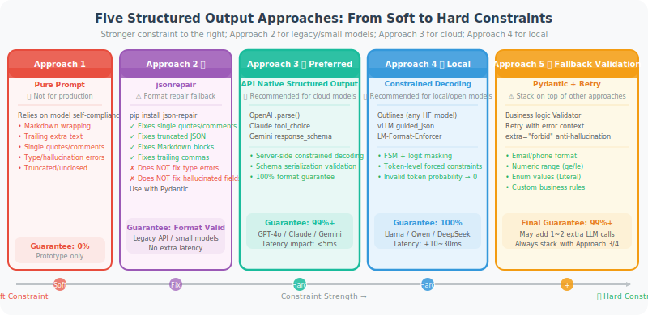

# 9.6 Structured Output: Engineering Practices for JSON Reliability

> 🔩 *"An Agent outputs an unparseable JSON, and the entire downstream pipeline crashes. This isn't a model problem — it means your Harness isn't doing its job."*

---

## Why Is JSON Reliability a Harness Problem?

In Agent systems, JSON is the universal language for inter-module communication: tool call parameters, structured analysis results, multi-Agent message passing... it's everywhere.

But models don't "naturally" guarantee valid JSON output. Even if you write `please output JSON` in your Prompt, you'll still encounter these in production:

```
# Various "surprises" in actual model output

✗ Wrapped in Markdown:  ```json { "key": "value" } ```
✗ Trailing extra text:  {"key": "value"} The above is the analysis result
✗ Single quotes instead of double: {'key': 'value'}
✗ Comments (not supported in JSON): {"key": "value" // this is a comment}
✗ Numeric field output as string: {"count": "3"} instead of {"count": 3}
✗ Hallucinated fields: model added fields not in the Schema
✗ Truncated output: context insufficient, output cut off, JSON unclosed
```

Every one of these will cause `json.loads()` to throw an exception, triggering downstream cascading failures.

**From a Harness perspective**, this is a core application scenario for **Pillar 2 (Architectural Constraints)**: you can't rely on "the model will self-discipline to output correct JSON" — you need engineering mechanisms to **enforce** output format.

---

## The Evolution Path of Five Approaches

```
Soft constraints (not recommended)    Post-processing fix    Hard constraints (recommended)
──────────────────────────────────────────────────────────────────────────────────────────
Prompt says "please output JSON"  →  jsonrepair  →  API structured output  →  Constrained decoding
                                     (fallback)      (server-side enforced)    (token-level enforced)
```

The diagram below shows the technical paths and applicable scenarios for the five approaches:



---

## Approach 1: Pure Prompt Constraints (Soft Constraints — Not Recommended)

```python
# ❌ Anti-pattern: relying only on Prompt constraints
system_prompt = """
You are a data extraction assistant. Please parse user input into the following JSON format:
{
  "name": "name",
  "age": age (number),
  "email": "email"
}
Please ensure the output is valid JSON with no other content.
"""

# Problems:
# 1. Model may add explanatory text outside the JSON
# 2. High field type error rate with complex Schemas
# 3. Cannot handle hallucinated fields in nested structures
# 4. Inconsistent behavior across model versions/temperatures

# If you must use this, at least add post-processing:
import json, re

def extract_json_from_text(text: str) -> dict:
    """
    Best-effort JSON extraction from model output (last resort — don't rely on this)
    Tries multiple parsing strategies in priority order
    """
    # Strategy 1: direct parse
    try:
        return json.loads(text.strip())
    except json.JSONDecodeError:
        pass
    
    # Strategy 2: extract ```json ... ``` code block
    md_match = re.search(r'```(?:json)?\s*(\{.*?\})\s*```', text, re.DOTALL)
    if md_match:
        try:
            return json.loads(md_match.group(1))
        except json.JSONDecodeError:
            pass
    
    # Strategy 3: extract first { ... } block
    brace_match = re.search(r'\{[^{}]*(?:\{[^{}]*\}[^{}]*)?\}', text, re.DOTALL)
    if brace_match:
        try:
            return json.loads(brace_match.group())
        except json.JSONDecodeError:
            pass
    
    raise ValueError(f"Cannot extract valid JSON from output: {text[:200]}")
```

> ⚠️ **When soft constraints are acceptable**: simple single-field output, prototype validation phase.  
> **Unacceptable scenarios**: production environments, complex Schemas, downstream processing requiring type precision.

---

## Approach 1.5: jsonrepair — A JSON Repair Library Designed for LLM Output

When hard constraints are unavailable (older API, local small models, high migration cost for existing code), `json-repair` is a **far more robust** fallback than hand-written regex.

### What Can It Fix?

`json-repair` is specifically designed for typical LLM output issues and handles all the scenarios that hand-written regex struggles with:

| Issue Type | Raw Output Example | After Repair |
|-----------|-------------------|--------------|
| Markdown code block | `` ```json {"k": 1}``` `` | `{"k": 1}` |
| Trailing extra text | `{"k": 1} This is the result` | `{"k": 1}` |
| Single-quote keys/values | `{'key': 'value'}` | `{"key": "value"}` |
| Inline comments | `{"k": 1 // comment}` | `{"k": 1}` |
| Truncated JSON | `{"name": "Alice", "age":` | `{"name": "Alice", "age": null}` |
| Missing quotes | `{name: "Alice"}` | `{"name": "Alice"}` |
| Trailing comma | `{"k": 1,}` | `{"k": 1}` |
| Truncated array | `["a", "b",` | `["a", "b"]` |
| Mixed Python literals | `{"flag": True, "val": None}` | `{"flag": true, "val": null}` |

### Installation and Basic Usage

```python
# pip install json-repair
from json_repair import repair_json
import json

# ── Basic usage: direct replacement for json.loads ──
broken_json = """```json
{
  "name": "Alice",
  'age': 28,   // age
  "email": "alice@example.com",
"""

# repair_json returns the repaired JSON string
fixed_str = repair_json(broken_json)
data = json.loads(fixed_str)
# {"name": "Alice", "age": 28, "email": "alice@example.com"}

# ── Or directly return a Python object ──
data = repair_json(broken_json, return_objects=True)
print(type(data))  # <class 'dict'>
print(data["name"])  # "Alice"
```

### Combining with Pydantic Validation

The best use of `jsonrepair` is as a "repair layer" between `json.loads()` and Pydantic validation:

```python
from json_repair import repair_json
from pydantic import BaseModel, ValidationError
import json

class OrderInfo(BaseModel):
    order_id: str
    amount: float
    status: str
    items: list[str]

def safe_parse(raw_text: str, model_class: type[BaseModel]) -> BaseModel:
    """
    Robust parsing process with jsonrepair:
    
    Raw text
      ↓ repair_json (fix format errors)
      ↓ json.loads (parse to Python dict)
      ↓ Pydantic.model_validate (type validation + business rules)
      ↓ Structured object
    """
    # Step 1: jsonrepair fixes format
    try:
        fixed = repair_json(raw_text)
    except Exception as e:
        raise ValueError(f"jsonrepair cannot handle this input: {e}")
    
    # Step 2: parse to Python object
    try:
        data = json.loads(fixed)
    except json.JSONDecodeError as e:
        raise ValueError(f"Still cannot parse after repair: {fixed[:100]}\nError: {e}")
    
    # Step 3: Pydantic type validation (including business rules)
    try:
        return model_class.model_validate(data)
    except ValidationError as e:
        raise ValueError(
            f"Structure validation failed (JSON format correct but fields don't match Schema):\n{e}"
        )

# Usage: handle various malformed JSON from model output
raw_outputs = [
    "```json\n{'order_id': 'ORD-001', 'amount': 99.9, 'status': 'paid', 'items': ['Item A']}\n```",
    '{"order_id": "ORD-002", "amount": 150, "status": "pending", "items": ["Item B", "Item C"],}',
    '{"order_id": "ORD-003", "amount": 200.0, "status": "shipped", "items": ["Item D"]  // tracking number generated',
]

for raw in raw_outputs:
    order = safe_parse(raw, OrderInfo)
    print(f"✅ Parsed successfully: {order.order_id}, ${order.amount}")
```

### Handling Truncated Output (Context Overflow Scenario)

This is one of `jsonrepair`'s biggest advantages — when model output is truncated due to context limits, it **intelligently completes the missing structure**:

```python
from json_repair import repair_json

# Simulate: model output truncated (context tokens exhausted)
truncated_outputs = [
    # Object truncated
    '{"name": "Alice", "age": 28, "address": {"city": "New York", "district": "Manhattan',
    # Array truncated
    '["apple", "banana", "orange", "grape',
    # Nested truncated
    '{"users": [{"id": 1, "name": "Alice"}, {"id": 2, "name": "Bob"}, {"id": 3',
]

for truncated in truncated_outputs:
    repaired = repair_json(truncated, return_objects=True)
    print(f"Original (truncated): {truncated[:50]}...")
    print(f"Repaired:             {repaired}")
    print()

# Output:
# Original (truncated): {"name": "Alice", "age": 28, "address": {"city": "New York", "district": "Manhattan...
# Repaired:             {'name': 'Alice', 'age': 28, 'address': {'city': 'New York', 'district': 'Manhattan'}}
#
# Original (truncated): ["apple", "banana", "orange", "grape...
# Repaired:             ['apple', 'banana', 'orange', 'grape']
#
# Original (truncated): {"users": [{"id": 1, "name": "Alice"}, {"id": 2, "name": "Bob"}, {"id": 3...
# Repaired:             {'users': [{'id': 1, 'name': 'Alice'}, {'id': 2, 'name': 'Bob'}, {'id': 3}]}
```

### Limitations of jsonrepair

`jsonrepair` **is not a silver bullet** — understanding its boundaries is important:

```python
from json_repair import repair_json

# ❌ Problems jsonrepair cannot solve: type errors
wrong_types = '{"age": "twenty-eight", "score": "excellent"}'  # strings instead of numbers
result = repair_json(wrong_types, return_objects=True)
# → {'age': 'twenty-eight', 'score': 'excellent'}  ← types still wrong, needs Pydantic validation

# ❌ Problems jsonrepair cannot solve: hallucinated fields
hallucinated = '{"name": "Alice", "age": 28, "non_schema_field": "hallucinated value"}'
result = repair_json(hallucinated, return_objects=True)
# → hallucinated field still present, needs extra="forbid" to intercept

# ❌ Problems jsonrepair cannot solve: semantic errors
semantic_error = '{"status": "completed-not-completed"}'  # semantic contradiction
# → jsonrepair will preserve it, needs business logic validator to handle

# ✅ Correct approach: jsonrepair + Pydantic double defense
from pydantic import BaseModel, ConfigDict

class StrictUser(BaseModel):
    model_config = ConfigDict(extra="forbid")  # block hallucinated fields
    name: str
    age: int       # Pydantic will fail on "twenty-eight", triggering an error

# jsonrepair fixes format → Pydantic validates types + business rules = complete defense
```

> 💡 **jsonrepair's role**: it is a **format repair layer**, not a **semantic validation layer**. The correct division of labor is:
> - `jsonrepair`: fix JSON syntax errors (brackets, quotes, commas, truncation)
> - `Pydantic`: validate field types, value ranges, business rules
> - Both are indispensable.

### Position in the Collaboration with Other Approaches

```
┌─────────────────────────────────────────────────────────────┐
│     Complete JSON parsing defense (recommended stacking)     │
│                                                             │
│  Raw model output text                                      │
│       ↓                                                     │
│  ① jsonrepair.repair_json()   ← fix format errors, truncation│
│       ↓                                                     │
│  ② json.loads()               ← convert to Python object    │
│       ↓                                                     │
│  ③ Pydantic.model_validate()  ← type validation + business  │
│       ↓ (on failure)                                        │
│  ④ Retry with error context   ← max 2~3 times               │
│       ↓                                                     │
│  Structured object (type-safe)                              │
└─────────────────────────────────────────────────────────────┘
```

---

## Approach 2: API Native Structured Output (Recommended — First Choice)

From 2024–2026, mainstream model APIs all natively support structured output — this is the **simplest and most reliable approach**.

### Principle: Why Can the API Guarantee JSON Format?

The underlying mechanism of API native structured output is **server-side constrained decoding**: when the model generates each token, the API server builds a **finite state machine (FSM)** based on the JSON Schema you provide, then in real time masks tokens that don't conform to the current state.

An intuitive example: when the model has already generated `{"age":`, and the JSON Schema requires `age` to be an integer, the candidate range for the next token is only `0-9`, `-` (minus sign), and spaces — the probabilities of all letter, quote, and boolean tokens are forced to 0. This means **the model physically cannot output a type-incorrect value**.

The essential difference from pure Prompt approach:
- **Prompt constraints** tell the model at the input side "what you should do" — the model can choose to comply or not
- **Constrained decoding** controls at the output side "what you can only do" — the model doesn't even have the option to violate the rules

The three major vendors implement this slightly differently:

| Vendor | Mechanism | Call Method | Schema Source | Release Date |
|--------|-----------|-------------|---------------|--------------|
| **OpenAI** | Native constrained decoding | `response_format=PydanticModel` | Auto-converted from Pydantic | 2024.08 |
| **Anthropic** | Tool call semantic equivalent | `tool_choice` forced tool | Pydantic → JSON Schema → Tool | 2024.04 |
| **Google** | Native constrained decoding | `response_schema=PydanticModel` | Auto-converted from Pydantic | 2024.10 |

**Selection recommendation**:
- If using OpenAI or Gemini, passing a Pydantic class directly is the simplest
- If using Claude, implement structured output indirectly by "defining a tool + forcing that tool to be called"
- All three provide the same guarantee strength (all can 100% guarantee valid JSON format), but Claude's approach consumes an extra tool call's worth of tokens

Below are code examples for all three platforms.

### OpenAI Structured Outputs (2024.08+)

OpenAI's implementation is the most direct — just pass the Pydantic class to the `response_format` parameter, and the return value is directly a Pydantic object:

```python
from openai import OpenAI
from pydantic import BaseModel, Field
from typing import Optional, Literal

client = OpenAI()

# ── Define Schema with Pydantic ──
class PersonInfo(BaseModel):
    name: str = Field(description="Full name")
    age: int = Field(description="Age, must be a positive integer", ge=0, le=150)
    email: Optional[str] = Field(default=None, description="Email address")
    gender: Literal["male", "female", "unknown"] = Field(
        default="unknown", description="Gender"
    )

class ExtractionResult(BaseModel):
    persons: list[PersonInfo] = Field(description="All extracted person information")
    confidence: float = Field(description="Extraction confidence 0~1", ge=0, le=1)
    notes: Optional[str] = Field(default=None, description="Notes")

# ── Call API, use parse() method to get Pydantic object directly ──
response = client.beta.chat.completions.parse(
    model="gpt-4o-2024-08-06",   # Version supporting Structured Outputs
    messages=[
        {"role": "system", "content": "You are an information extraction assistant that extracts person information from text."},
        {"role": "user", "content": "Alice, female, 28 years old, email alice@example.com. Bob, 35 years old."},
    ],
    response_format=ExtractionResult,  # Pass Pydantic class directly!
)

# Returns a Pydantic object directly — type-safe, no manual parsing needed
result: ExtractionResult = response.choices[0].message.parsed
print(result.persons[0].name)    # "Alice"
print(result.confidence)         # 0.95 (example)
print(type(result.persons[0].age))  # <class 'int'>, type guaranteed
```

> 💡 **Underlying guarantee of OpenAI Structured Outputs**:  
> Uses constrained decoding (see Approach 3), forcibly masking all tokens that don't conform to the Schema at the model logit layer.  
> This means even if the model "wants" to output an illegal format, it will be intercepted — **not post-hoc repair, but never generating illegal output in the first place**.

### Anthropic Claude Structured Output

Claude's implementation differs from OpenAI — it doesn't have a dedicated `response_format` parameter, but instead reuses the **Tool Use** mechanism. The core idea is: define a "fake tool" whose input Schema is the JSON format you want, then force the model to call that tool via `tool_choice`.

The advantage of this approach is seamless integration with Claude's Agent tool call system; the disadvantage is that it requires extra tool definitions, and the returned result is nested in a `tool_use` block requiring one extraction step:

```python
import anthropic
import json
from pydantic import BaseModel

client = anthropic.Anthropic()

class ProductReview(BaseModel):
    sentiment: str        # "positive" | "negative" | "neutral"
    score: int            # 1-5
    key_points: list[str]
    summary: str

def extract_with_claude(text: str) -> ProductReview:
    """Use Claude's tool calls to implement structured output"""
    
    # Convert Pydantic Schema to Claude tool definition
    tool_schema = ProductReview.model_json_schema()
    
    response = client.messages.create(
        model="claude-sonnet-4-6",
        max_tokens=1024,
        tools=[{
            "name": "extract_review",
            "description": "Extract structured information from a product review",
            "input_schema": tool_schema,
        }],
        tool_choice={"type": "tool", "name": "extract_review"},  # Force tool use
        messages=[
            {"role": "user", "content": f"Analyze the following review: {text}"}
        ],
    )
    
    # Extract tool call result
    for block in response.content:
        if block.type == "tool_use":
            return ProductReview(**block.input)
    
    raise ValueError("Claude did not return a tool call result")

# Usage
review = extract_with_claude("The battery life on this phone is terrible — it died after two days. Very disappointed.")
print(review.sentiment)    # "negative"
print(review.score)        # 1
print(review.key_points)   # ["poor battery life", "short usage time"]
```

### Google Gemini Structured Output

Gemini's approach is most similar to OpenAI — pass the Pydantic class directly via the `response_schema` parameter. But there's one key difference: you also need to set `response_mime_type="application/json"` to tell the model to return in JSON format:

```python
import google.generativeai as genai
from pydantic import BaseModel

genai.configure(api_key="YOUR_API_KEY")

class RecipeInfo(BaseModel):
    name: str
    ingredients: list[str]
    cook_time_minutes: int
    difficulty: str  # "easy" | "medium" | "hard"

model = genai.GenerativeModel("gemini-2.5-pro")

response = model.generate_content(
    "Give me a simple scrambled eggs with tomatoes recipe",
    generation_config=genai.GenerationConfig(
        response_mime_type="application/json",
        response_schema=RecipeInfo,  # Pass Pydantic class directly
    ),
)

recipe = RecipeInfo.model_validate_json(response.text)
print(recipe.name)              # "Scrambled Eggs with Tomatoes"
print(recipe.cook_time_minutes) # 15
```

### Limitations of API Native Structured Output

Although the API native approach is the most recommended, you need to understand its boundaries:

1. **Schema complexity has an upper limit**: OpenAI has limits on nesting depth and field count (typically no more than 5 levels of nesting, no more than 100 fields). Oversized Schemas should be split into multiple calls.

2. **Cannot constrain semantic correctness**: The API guarantees *format* legality (JSON parses without error, types match Schema), but doesn't guarantee *value* business reasonableness. For example, `"age": -5` is a legally valid integer in format, but unreasonable in business — this requires Pydantic's `validator` to handle.

3. **First call has cache latency**: OpenAI pre-compiles the Schema (builds FSM), which may add ~100ms latency on the first call; subsequent calls have almost no additional overhead.

4. **Not suitable for streaming output**: Most Structured Outputs implementations don't support streaming returns (because the complete JSON needs to be generated before its integrity can be verified). If you need to display intermediate results in a stream, use normal mode + post-processing.

---

## Approach 3: Constrained Decoding

For **locally deployed open-source models** (Llama, Qwen, DeepSeek, etc.), you can't use cloud API native structured output. This is where **constrained decoding** technology is needed.

### Principle: Enforcing Constraints at the Token Generation Layer

To understand constrained decoding, first review the LLM generation process (see Chapter 3): at each step, the model outputs a **probability distribution over the vocabulary** (logits), then selects the next token through a sampling strategy (top-p, temperature, etc.).

The core idea of constrained decoding is: **before sampling, based on the currently generated text and JSON Schema rules, force all illegal tokens' probabilities to −∞ (i.e., probability 0 after softmax).** The model still does normal forward inference, but only legal tokens can be sampled.

This process can be understood in three steps:

**Step 1: Compile JSON Schema into a Finite State Machine (FSM)**

JSON Schema defines all possible shapes of valid JSON. For example, `{"age": int, "name": str}` can be expanded into a series of states:

```
State 0: expecting "{"
State 1: expecting key ("age" or "name")
State 2: expecting ":"
State 3 (age value): expecting integer token (0-9, minus sign)
State 4 (name value): expecting string token (starts with quote)
State 5: expecting "," or "}"
...
```

Each state corresponds to a **legal token subset** in the vocabulary. This FSM is compiled before inference begins — the overhead is one-time only.

**Step 2: Query FSM at each generation step, build logit mask**

```
Normal generation:
  Model logits [vocab_size] → softmax → sampling → any token

Constrained generation:
  Model logits [vocab_size]
       ↓
  logit_mask[i] = −∞  (if token i is not in the legal set for FSM's current state)
       ↓
  softmax → sampling → guaranteed legal token
```

**Step 3: FSM state transition**

After selecting a token, the FSM transitions to the next state based on that token, and the above process repeats.

**Key property**: constrained decoding **does not change the model's weights or inference logic** — it only adds a filter layer before sampling. The model still selects the highest-probability token within the legal token range, so output quality doesn't decrease; it's just constrained to the legal space.

Here's a concrete example of how the state machine works:

```
Target Schema: {"age": {"type": "integer"}}
Currently generated: {"age": 

FSM current state: expecting integer value
Allowed next tokens: 0-9 (start of number)
Masked tokens: letters, quotes, true/false/null, etc.

→ Model can only generate numbers, physically preventing type errors
```

> 💡 **Essential difference between constrained decoding and jsonrepair**:  
> jsonrepair is **post-hoc repair** — the model has already generated incorrect JSON, then tries to patch it.  
> Constrained decoding is **preventive** — incorrect JSON can never be generated.  
> In terms of reliability: constrained decoding > jsonrepair, but constrained decoding requires control of the inference engine and can only be used for locally deployed models.

### Using the Outlines Library

[Outlines](https://github.com/dottxt-ai/outlines) is the most mainstream constrained decoding library:

```python
import outlines
from pydantic import BaseModel
from typing import Optional

# ── 1. Load local model ──
model = outlines.models.transformers(
    "Qwen/Qwen2.5-7B-Instruct",
    device="cuda",
)

# ── 2. Define Schema ──
class CodeReview(BaseModel):
    has_bugs: bool
    bug_description: Optional[str] = None
    severity: str          # "low" | "medium" | "high" | "critical"
    suggested_fix: str
    estimated_fix_time_hours: float

# ── 3. Create structured generator ──
generator = outlines.generate.json(model, CodeReview)

# ── 4. Generate — guaranteed 100% Schema compliance ──
code_sample = """
def divide(a, b):
    return a / b   # division by zero not handled
"""

result: CodeReview = generator(
    f"Review this code:\n{code_sample}"
)

# result is directly a Pydantic object, type-safe
print(result.has_bugs)                    # True
print(result.severity)                    # "high"
print(result.estimated_fix_time_hours)    # 0.5 (example)
```

### Using vLLM's Native Structured Output (Recommended for Production)

If you need **high-concurrency service** (multiple users requesting simultaneously), using Outlines' `transformers` backend alone isn't efficient enough — it processes requests synchronously one by one. vLLM is a better choice: it has built-in constrained decoding support in a high-performance inference engine, capable of serving multiple structured output requests simultaneously in continuous batching, with each request potentially having a different Schema.

vLLM supports two constrained decoding backends — `outlines` (default) and `lm-format-enforcer` — switchable via parameters:

```python
from vllm import LLM, SamplingParams
from pydantic import BaseModel
import json

llm = LLM(model="Qwen/Qwen2.5-72B-Instruct", tensor_parallel_size=4)

class AnalysisResult(BaseModel):
    category: str
    subcategories: list[str]
    confidence: float
    reasoning: str

# Specify constrained decoding via guided_decoding_backend
params = SamplingParams(
    max_tokens=512,
    guided_decoding_backend="outlines",   # or "lm-format-enforcer"
    guided_json=AnalysisResult.model_json_schema(),
)

outputs = llm.generate(
    ["Classify the following text: 'Stock market surged today, tech sector led gains'"],
    sampling_params=params,
)

result = AnalysisResult.model_validate_json(outputs[0].outputs[0].text)
print(result.category)      # "Finance"
print(result.confidence)    # 0.92
```

---

## Approach 4: Pydantic + Retry Validation (Defensive Fallback Layer)

### Why Aren't Hard Constraints Enough?

Even with API native structured output or constrained decoding, **JSON format being legal** doesn't mean **values are business-reasonable**. For example:

- Format legal but value unreasonable: `{"age": -5, "email": "not-an-email"}`
- Format legal but semantically contradictory: `{"status": "shipped", "shipped_date": null}`
- Format legal but value out of range: `{"score": 999}` (should be 0~100)
- Format legal but fields conflict: `{"is_active": true, "deactivated_at": "2025-01-01"}`

These issues are all outside the "jurisdiction" of JSON Schema and require **business logic layer** validation. Pydantic's `validator` mechanism specifically addresses these issues: it allows you to define arbitrarily complex inter-field constraints and business rules using Python code.

### Design Thinking for Retry Strategy

When validation fails, simply "trying again" isn't enough — the model will likely make the same mistake. An effective retry strategy needs:

1. **Carry error context**: feed back the previous output and specific validation error information to the model, so it knows what went wrong
2. **Exponential backoff**: increasing intervals between retries (0.5s → 1s → 2s), avoiding rate limiting from frequent calls
3. **Limited attempts**: usually no more than 3 times — if 3 attempts all fail, the Schema design is likely ambiguous or the task itself is too vague; continuing to retry only wastes cost
4. **Explicit failure**: after exceeding the retry limit, throw an error with complete context for easy debugging

Here's a complete retry validation implementation:

```python
from pydantic import BaseModel, ValidationError, validator
from openai import OpenAI
from typing import Optional
import json
import time

client = OpenAI()

class UserProfile(BaseModel):
    username: str
    email: str
    age: int
    role: str  # "admin" | "user" | "guest"
    
    @validator("email")
    def email_must_be_valid(cls, v):
        if "@" not in v or "." not in v.split("@")[-1]:
            raise ValueError(f"Invalid email format: {v}")
        return v.lower()
    
    @validator("age")
    def age_must_be_positive(cls, v):
        if not (0 < v < 150):
            raise ValueError(f"Age out of reasonable range: {v}")
        return v
    
    @validator("role")
    def role_must_be_valid(cls, v):
        allowed = {"admin", "user", "guest"}
        if v not in allowed:
            raise ValueError(f"Role '{v}' not in allowed list {allowed}")
        return v


def extract_with_retry(
    text: str,
    schema_class: type[BaseModel],
    max_retries: int = 3,
    model: str = "gpt-4o-mini",
) -> BaseModel:
    """
    Structured extraction with retry
    
    First round: normal extraction
    Subsequent rounds: feed back the previous round's error information to guide correction
    """
    last_error = None
    last_output = None
    
    for attempt in range(max_retries):
        # Build Prompt
        if attempt == 0:
            user_content = f"Extract user information from the following text:\n\n{text}"
        else:
            user_content = f"""
The previous extraction result had errors, please correct:

Previous output:
{last_output}

Validation errors:
{last_error}

Original text:
{text}

Please re-extract, ensuring all field types and formats are correct.
"""
        
        try:
            # Use OpenAI Structured Outputs
            response = client.beta.chat.completions.parse(
                model=model,
                messages=[
                    {"role": "system", "content": "You are a user information extraction assistant. Output strictly in the required format."},
                    {"role": "user", "content": user_content},
                ],
                response_format=schema_class,
            )
            
            parsed = response.choices[0].message.parsed
            
            # Even if the API returned a result, do a full Pydantic validation
            # (including business logic checks like email format, age range, etc.)
            validated = schema_class.model_validate(parsed.model_dump())
            
            if attempt > 0:
                print(f"✅ Retry {attempt + 1} succeeded")
            
            return validated
        
        except ValidationError as e:
            last_error = str(e)
            last_output = str(parsed) if 'parsed' in locals() else "Parse failed"
            print(f"⚠️ Validation failed on attempt {attempt + 1}: {last_error[:100]}")
            
            if attempt < max_retries - 1:
                time.sleep(0.5 * (attempt + 1))  # Exponential backoff
        
        except Exception as e:
            print(f"❌ API call failed: {e}")
            raise
    
    raise ValueError(f"Unable to extract valid result after {max_retries} retries. Last error: {last_error}")


# Usage example
profile = extract_with_retry(
    text="User: Alice, email alice@company.com, age 30, regular user",
    schema_class=UserProfile,
)
print(profile.model_dump())
# {'username': 'Alice', 'email': 'alice@company.com', 'age': 30, 'role': 'user'}
```

---

## Production-Grade JSON Harness: Comprehensive Implementation

The four approaches above each have their focus — Approach 2 guarantees format, Approach 3 controls tokens, Approach 4 validates semantics. In real production systems, they're not "pick one to use" — they're **layered on top of each other** to form a defense in depth:

```
┌────────────────────────────────────────────────────┐
│  Layer 1: Hard Constraints (API Structured Outputs / Constrained Decoding) │
│  → Guarantees JSON format 100% legal, types match Schema                   │
├────────────────────────────────────────────────────┤
│  Layer 2: Business Validation (Pydantic Validator)                          │
│  → Guarantees value ranges reasonable, inter-field logic consistent, no hallucinated fields │
├────────────────────────────────────────────────────┤
│  Layer 3: Smart Retry (with error context)                                  │
│  → When business validation fails, let model correct output based on specific error info │
└────────────────────────────────────────────────────┘
```

The `StructuredOutputHarness` class below encapsulates these three layers as a generic component supporting multiple backend (OpenAI / Claude / vLLM) switching. Its design follows three core principles of Harness Engineering Pillar 2 (Architectural Constraints):

- **Don't trust model output**: every output goes through complete Pydantic validation, even when using native structured output
- **Errors don't fail silently**: all exceptions have clear logs and error messages for easy debugging
- **Auto-recovery**: automatically retries with error context when validation fails, no manual intervention needed

```python
from __future__ import annotations
import json
import time
import logging
from enum import Enum
from typing import TypeVar, Generic, Type, Optional, Any
from pydantic import BaseModel, ValidationError

T = TypeVar("T", bound=BaseModel)
logger = logging.getLogger(__name__)


class OutputBackend(Enum):
    """Supported backends"""
    OPENAI = "openai"        # OpenAI API (native Structured Outputs)
    ANTHROPIC = "anthropic"  # Claude API (tool calls)
    VLLM = "vllm"           # Local vLLM (constrained decoding)
    FALLBACK = "fallback"    # Soft constraints + regex extraction (fallback)


class StructuredOutputHarness(Generic[T]):
    """
    Structured output Harness
    
    Design principles (from "Architectural Constraints" in Harness Engineering's six pillars):
    - Use engineering mechanisms to guarantee, not rely on model self-discipline
    - From hard constraints (API) to soft constraints (retry), layer by layer defense
    - All errors have explicit handling, no silent failures
    
    Usage example:
        harness = StructuredOutputHarness(MySchema, backend=OutputBackend.OPENAI)
        result = harness.extract("Extract information from this text: ...")
    """
    
    def __init__(
        self,
        schema_class: Type[T],
        backend: OutputBackend = OutputBackend.OPENAI,
        model: str = "gpt-4o",
        max_retries: int = 3,
        retry_delay: float = 0.5,
    ):
        self.schema_class = schema_class
        self.backend = backend
        self.model = model
        self.max_retries = max_retries
        self.retry_delay = retry_delay
        self._client = self._init_client()
    
    def _init_client(self):
        if self.backend == OutputBackend.OPENAI:
            from openai import OpenAI
            return OpenAI()
        elif self.backend == OutputBackend.ANTHROPIC:
            import anthropic
            return anthropic.Anthropic()
        return None  # vLLM and fallback don't need a client
    
    def extract(self, prompt: str, system: str = "") -> T:
        """
        Core extraction method: layer-by-layer defense
        
        Execution order:
        1. Try hard-constraint extraction (API native / constrained decoding)
        2. If failed, retry with error context (up to max_retries times)
        3. Every result goes through complete Pydantic validation (including business logic)
        4. After all retries fail, throw a clear error
        """
        last_error: Optional[str] = None
        last_raw: Optional[str] = None
        
        for attempt in range(self.max_retries):
            try:
                # ── Build Prompt (carry error context on retry) ──
                full_prompt = self._build_prompt(prompt, last_error, last_raw, attempt)
                
                # ── Execute extraction ──
                raw_result = self._call_backend(full_prompt, system)
                last_raw = str(raw_result)
                
                # ── Complete Pydantic validation ──
                if isinstance(raw_result, self.schema_class):
                    validated = raw_result  # Native structured output, already a Pydantic object
                else:
                    validated = self.schema_class.model_validate(raw_result)
                
                logger.info(
                    "Structured output succeeded",
                    extra={"attempt": attempt + 1, "schema": self.schema_class.__name__}
                )
                return validated
            
            except ValidationError as e:
                last_error = self._format_validation_error(e)
                logger.warning(f"Validation failed on attempt {attempt + 1}: {last_error[:100]}")
            
            except json.JSONDecodeError as e:
                last_error = f"JSON parse failed: {e}"
                logger.warning(f"JSON parse failed on attempt {attempt + 1}: {e}")
            
            if attempt < self.max_retries - 1:
                time.sleep(self.retry_delay * (2 ** attempt))  # Exponential backoff
        
        raise RuntimeError(
            f"Structured output failed after {self.max_retries} retries.\n"
            f"Schema: {self.schema_class.__name__}\n"
            f"Last error: {last_error}"
        )
    
    def _build_prompt(
        self, original: str, last_error: Optional[str],
        last_raw: Optional[str], attempt: int
    ) -> str:
        if attempt == 0 or not last_error:
            return original
        return f"""
[Retry {attempt}/{self.max_retries - 1}] The previous output had the following issues, please correct:

Issue: {last_error}
Previous output: {last_raw}

Original request:
{original}

Please regenerate, ensuring full compliance with the required format and type constraints.
"""
    
    def _call_backend(self, prompt: str, system: str) -> Any:
        """Call the corresponding API based on backend"""
        if self.backend == OutputBackend.OPENAI:
            return self._call_openai(prompt, system)
        elif self.backend == OutputBackend.ANTHROPIC:
            return self._call_anthropic(prompt, system)
        elif self.backend == OutputBackend.FALLBACK:
            return self._call_fallback(prompt, system)
        raise NotImplementedError(f"Backend {self.backend} not implemented")
    
    def _call_openai(self, prompt: str, system: str) -> T:
        system_msg = system or "You are an assistant that strictly outputs structured data in the specified format."
        response = self._client.beta.chat.completions.parse(
            model=self.model,
            messages=[
                {"role": "system", "content": system_msg},
                {"role": "user", "content": prompt},
            ],
            response_format=self.schema_class,
        )
        return response.choices[0].message.parsed
    
    def _call_anthropic(self, prompt: str, system: str) -> T:
        response = self._client.messages.create(
            model=self.model,
            max_tokens=2048,
            system=system or "You are an assistant that strictly outputs structured data in the specified format.",
            tools=[{
                "name": "structured_output",
                "description": "Output structured data",
                "input_schema": self.schema_class.model_json_schema(),
            }],
            tool_choice={"type": "tool", "name": "structured_output"},
            messages=[{"role": "user", "content": prompt}],
        )
        for block in response.content:
            if block.type == "tool_use":
                return self.schema_class(**block.input)
        raise ValueError("Anthropic did not return a tool call")
    
    def _call_fallback(self, prompt: str, system: str) -> dict:
        """Fallback: soft constraints + regex extraction"""
        import re
        # Simplified example here; in practice should call a local model
        raise NotImplementedError("Fallback mode requires configuring a local model")
    
    def _format_validation_error(self, e: ValidationError) -> str:
        """Format Pydantic validation error into readable information"""
        errors = e.errors()
        lines = []
        for err in errors:
            field = " → ".join(str(loc) for loc in err["loc"])
            lines.append(f"Field [{field}]: {err['msg']} (input value: {err.get('input', '?')})")
        return "\n".join(lines)


# ── Usage example ──

class SentimentAnalysis(BaseModel):
    """Sentiment analysis result"""
    text_summary: str
    sentiment: str           # "positive" | "negative" | "neutral" | "mixed"
    confidence: float        # 0.0 ~ 1.0
    key_phrases: list[str]
    emotion_tags: list[str]  # e.g. ["joy", "anticipation"]

# One-line initialization
harness = StructuredOutputHarness(
    SentimentAnalysis,
    backend=OutputBackend.OPENAI,
    model="gpt-4o-mini",
    max_retries=3,
)

result = harness.extract(
    prompt="Analyze the sentiment of the following review: 'The food at this restaurant is absolutely amazing, the service is excellent too, definitely coming back!'"
)

print(result.sentiment)     # "positive"
print(result.confidence)    # 0.98
print(result.key_phrases)   # ["amazing food", "excellent service", "coming back"]
```

---

## Key Technical Comparison

| Approach | Guarantee Strength | Applicable Scenarios | Latency Impact | Implementation Complexity |
|----------|-------------------|---------------------|----------------|--------------------------|
| **Pure Prompt** | ❌ No guarantee | Prototype phase only | None | Very low |
| **jsonrepair** | ⚠️ Format repair (not type guarantee) | Old API/local small model fallback | Minimal (pure CPU) | Very low |
| **OpenAI Structured Outputs** | ✅ Schema enforced | GPT-4o/mini production | Minimal (<5ms) | Low |
| **Claude Tool Call** | ✅ Schema enforced | Claude production | Minimal | Low |
| **Constrained Decoding (Outlines)** | ✅ Token-level enforced | Local open-source models | Small (+10~30ms) | Medium |
| **vLLM guided_json** | ✅ Token-level enforced | High-concurrency local service | Small | Medium |
| **Pydantic + Retry** | ⚠️ Final guarantee (multi-round) | Fallback validation layer for all scenarios | May add 1~2 calls | Low |

> 💡 **Production best practices**:
> 1. **First choice**: API native structured output (OpenAI/Claude/Gemini)
> 2. **Local models**: vLLM guided_json or Outlines
> 3. **Old API / unable to upgrade**: `jsonrepair` + Pydantic combination fallback
> 4. **Always layer**: Pydantic business logic validation + limited retry (as last line of defense)
> 5. **Never**: bare `json.loads()` without any error handling

---

## Common Pitfalls and Solutions

The following three pitfalls are the most commonly encountered in structured output. Their common characteristic is: **JSON format is legal, `json.loads()` doesn't error, but downstream logic goes wrong.** This is precisely why format guarantees (Approaches 2/3) must be combined with semantic validation (Approach 4).

### Pitfall 1: Hallucinated Fields in Nested Schemas

**Root cause**: when LLMs generate JSON, they may "spontaneously" add fields not defined in the Schema to nested objects — this is called "hallucination" in machine learning. Pydantic's default configuration **allows extra fields** (`extra="allow"`), meaning hallucinated fields silently pass validation and lurk in downstream code causing unpredictable behavior.

Example: model outputs `{"name": "Alice", "address": {"street": "...", "city": "...", "country": "US"}}`, but your `Address` Schema doesn't have a `country` field. Neither `json.loads()` nor default Pydantic validation will error, but if downstream code tries to serialize or compare this object, the extra field may cause unexpected behavior.

```python
class Address(BaseModel):
    street: str
    city: str
    # Note: no country field defined

class User(BaseModel):
    name: str
    address: Address

# Model may output: {"name": "Alice", "address": {"street": "...", "city": "...", "country": "US"}}
# json.loads() won't error, but Pydantic by default allows extra fields!

# Solution: use model_config to forbid extra fields
from pydantic import ConfigDict

class Address(BaseModel):
    model_config = ConfigDict(extra="forbid")  # Block hallucinated fields!
    street: str
    city: str
```

### Pitfall 2: Null Value Confusion for Optional Fields

**Root cause**: Python's `None` and empty string `""` are completely different values, but LLMs often confuse them. When you define `Optional[str] = None`, you expect `null` when "this information is absent," but the model may return `""` (empty string). This can cause serious differences in downstream logic — for example, `if description:` evaluates differently for `None` and `""`, but semantically they should be equivalent.

More subtle variants include: returning `"N/A"`, `"none"`, `"unknown"` — text that is semantically equivalent to null.

```python
from typing import Optional

class Item(BaseModel):
    name: str
    description: Optional[str] = None
    # Model may output "description": "" (empty string) instead of null
    # Downstream logic may handle "" and None differently

# Solution: use validator to handle uniformly
from pydantic import validator

class Item(BaseModel):
    name: str
    description: Optional[str] = None
    
    @validator("description", pre=True)
    def empty_str_to_none(cls, v):
        if isinstance(v, str) and v.strip() == "":
            return None
        return v
```

### Pitfall 3: Large Schemas Causing Token Consumption to Skyrocket

**Root cause**: OpenAI Structured Outputs works by serializing the JSON Schema and appending it to the model's system prompt. A complex Schema with 50+ fields and multiple levels of nesting may occupy 500~2000 tokens when serialized — these tokens are **consumed repeatedly in every API call**, increasing both latency and cost.

A deeper impact is that the Schema itself consumes a large amount of context attention budget (see Chapter 8), potentially reducing the model's attention to user input content and actually degrading extraction quality.

**Solution principle**: split large Schemas into multiple smaller extractions, each focusing on one subset — similar to "query primary key first, then JOIN details" in database queries:

```python
# ❌ Define an overly complex Schema all at once (Schema itself is hundreds of tokens)
class MegaSchema(BaseModel):
    field_1: str
    field_2: int
    field_3: list[SubSchema1]  # SubSchema1 has another 10 fields
    field_4: dict[str, SubSchema2]
    # ... 50 fields

# ✅ Step-by-step extraction, simplify complexity
class BasicInfo(BaseModel):
    name: str
    category: str
    priority: int

class DetailInfo(BaseModel):  
    description: str
    tags: list[str]
    metadata: dict[str, str]

# Step 1: extract basic info
basic = harness_basic.extract(text)
# Step 2: extract details based on basic info
detail = harness_detail.extract(f"{text}\n\nConfirmed category: {basic.category}")
```

---

## Section Summary

| Technology | Key Points |
|-----------|-----------|
| **Pure Prompt constraints** | Only for prototypes; unreliable in production |
| **jsonrepair** | `pip install json-repair`; fixes syntax/format errors and truncation; doesn't solve type/semantic issues |
| **OpenAI Structured Outputs** | `client.beta.chat.completions.parse()` + Pydantic, first choice |
| **Claude tool calls** | `tool_choice` forced, equivalent effect to native structured output |
| **Constrained decoding (Outlines/vLLM)** | Strong guarantee for local models, token-level hard constraint |
| **Pydantic business validation** | `extra="forbid"` prevents hallucinations, `@validator` handles business rules |
| **Retry mechanism** | Retry with error context, exponential backoff, no more than 3 times |

**Recommended complete defense (from loose to strict)**:

```
Old/small models:  jsonrepair  →  Pydantic validation  →  retry
Cloud API:         Structured Outputs  →  Pydantic validation  →  retry
Local models:      Constrained decoding (Outlines/vLLM)  →  Pydantic validation
```

> 💡 **Harness perspective summary**:  
> The essence of ensuring JSON reliability is upgrading "the model should output correct JSON" from a **soft constraint** to "the model cannot output incorrect JSON" as a **hard constraint**. This is precisely the core concept of Harness Engineering Pillar 2 (Architectural Constraints) — using engineering mechanisms to replace trust in the model's "self-discipline."

---

*Previous section: [9.5 Practice: Building Your First Harness System](./05_practice_harness_builder.md)*  
*Next chapter: [Chapter 10 Skill System](../chapter_skill/README.md)*
