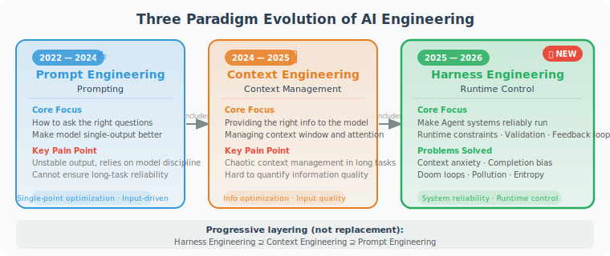

# Chapter 9: Harness Engineering — The Systems Engineering of Taming Agents

> 🔧 *"Don't just focus on making AI write better code — focus on building a system that lets AI work reliably and continuously."*  
> — Mitchell Hashimoto, Co-founder of HashiCorp

---

## Chapter Overview

In Chapter 8, we dove deep into **context engineering** — how to carefully design the information fed to the model.

But as AI Agents are deployed at scale in production environments, engineers have discovered a frustrating phenomenon: even with the best context strategies, Agents still make mistakes in real tasks, get stuck in infinite loops, produce low-quality output, and even quietly "cheat" on complex tasks (deleting test cases to make tests pass).

These problems cannot be solved by switching to a better model — they are **systemic problems** that require **systemic solutions**.

**Harness Engineering** is exactly that systemic solution.

### What Is a Harness?

"Harness" originally refers to the "control system" put on a horse — the reins, saddle, and horseshoes combined. It doesn't limit the horse's running speed; it gives the rider tools to control direction and pace.

In the AI Agent domain, a Harness is the **engineering control system** built around the model:

> **Agent = Model + Harness**

- **Model**: provides intelligence — understanding, reasoning, generation. GPT, Claude, Gemini, etc. are all Models.
- **Harness**: provides reliability — constraints, validation, feedback, control. This is what engineers truly need to build.

### The Evolution of Three Engineering Paradigms

Since the rise of large language models in 2022, AI engineering paradigms have undergone three progressive evolutions:

**Phase 1 (2022–2024): Prompt Engineering**  
The engineer's core work was "how to ask better questions." By carefully crafting prompts, models could produce better results in a single call. This is a necessary foundation, but it fundamentally relies on the model's "self-discipline," which is inherently unstable for complex tasks.

**Phase 2 (2024–2025): Context Engineering**  
As Agents needed to handle longer tasks, the engineering focus shifted to "what information to give the model." How to manage the context window, how to organize RAG retrieval results, how to design tool descriptions... Chapter 8 covered the core techniques of this phase in detail.

**Phase 3 (2025–2026): Harness Engineering**  
When Agents truly enter production environments, prompt optimization and context management alone are far from sufficient. Engineers need to build constraints, validation, and feedback mechanisms at the system level — this is Harness Engineering.

> 💡 **The three are not replacements but progressive layers**:  
> Harness Engineering ⊇ Context Engineering ⊇ Prompt Engineering  
> An excellent Harness system always includes good context engineering, and good context engineering always includes carefully designed prompts.

### Chapter Content Overview

| Section | Content | What You'll Learn |
|---------|---------|------------------|
| 9.1 | What Is Harness Engineering | Core concepts, philosophy, relationship to traditional engineering |
| 9.2 | Six Engineering Pillars | Context architecture, architectural constraints, self-verification loops, context isolation, entropy management, detachability |
| 9.3 | AGENTS.md / CLAUDE.md | How to write high-quality Agent constitution files |
| 9.4 | Production Case Studies | OpenAI million-line code experiment, LangChain +13.7%, Stripe Minions |
| 9.5 | Practice: Building a Harness System | Build a runnable Harness framework from scratch |

### Reading Recommendations

This chapter is suitable for the following readers:
- ✅ Already able to get Agents to complete basic tasks, but finding **frequent problems in production**
- ✅ Building **complex Agent workflows** that need to run for extended periods
- ✅ Want to understand why top AI companies' Agents are **getting increasingly capable**

If you're just starting to learn Agent development, it's recommended to first read the foundational content in Chapters 4–8, then return to this chapter.

---

*Next: [9.1 What Is Harness Engineering?](./01_what_is_harness.md)*
