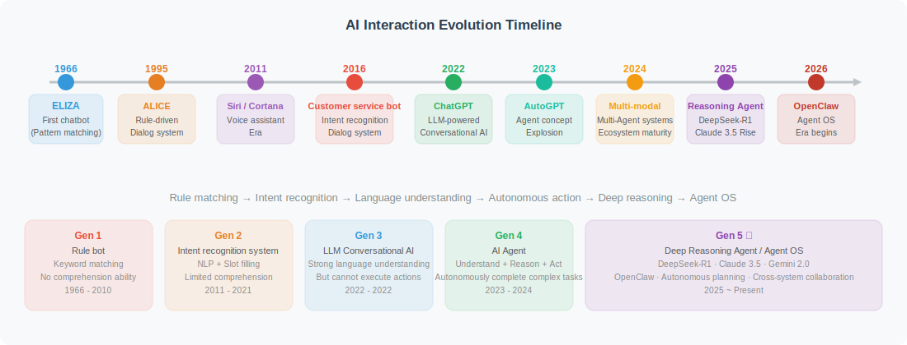
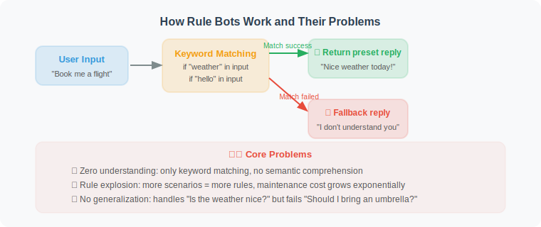
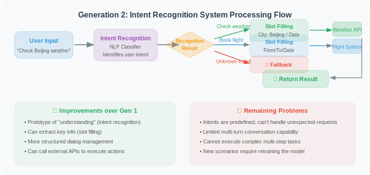
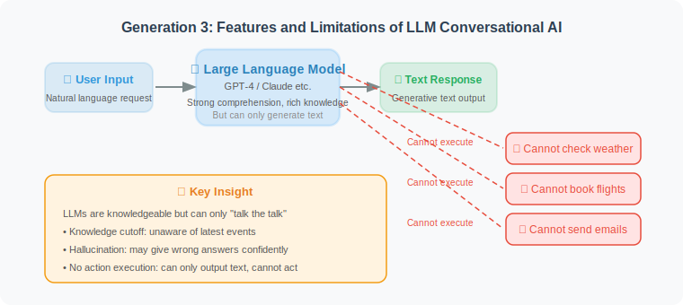
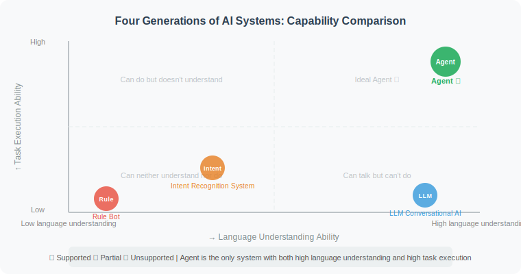
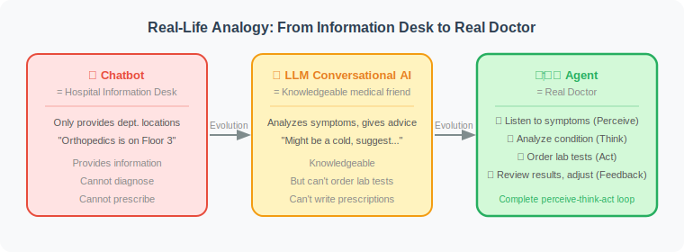

# From Chatbots to Intelligent Agents: The Evolution

> 📖 *"To understand what an Agent is, the best approach is to trace where it came from."*

## A Brief History

The way AI interacts with humans has undergone a long and fascinating evolutionary journey. Let's hop in a time machine and quickly review this history:



## Generation 1: Rule-Based Chatbots

The earliest chatbots relied entirely on **predefined rules**. In 1966, Joseph Weizenbaum at MIT created ELIZA [1] — the first computer program in history capable of "conversing" with humans. It used simple pattern matching to "impersonate" a psychotherapist:

```python
# Generation 1: Rule-based chatbot (simulating ELIZA's approach)
# Core principle: Pattern matching + template responses

def rule_based_chatbot(user_input: str) -> str:
    """
    The most primitive chatbot: keyword-matching rules
    - No understanding capability
    - Can only handle predefined scenarios
    - Fails completely on unknown input
    """
    user_input = user_input.lower()
    
    # Rule 1: Greetings
    if any(word in user_input for word in ["hello", "hi", "hey"]):
        return "Hello! How can I help you?"
    
    # Rule 2: About weather
    if "weather" in user_input:
        return "The weather looks nice today — great for going out!"
    
    # Rule 3: About time
    if "time" in user_input or "clock" in user_input:
        return "It's currently business hours. How can I assist you?"
    
    # Fallback response (for unrecognized input)
    return "Sorry, I don't quite understand. Could you rephrase that?"

# Test
print(rule_based_chatbot("hello"))              # ✅ Handled
print(rule_based_chatbot("how's the weather"))  # ✅ Handled
print(rule_based_chatbot("book me a flight"))   # ❌ Cannot handle → fallback
```

**The problems with this approach are obvious:**



| Problem | Description |
|---------|-------------|
| 🔴 Zero understanding | Only matches keywords, no semantic understanding |
| 🔴 Rule explosion | More scenarios = more rules = exponentially growing maintenance cost |
| 🔴 Cannot generalize | Can answer "what's the weather?" but not "should I bring an umbrella?" |
| 🔴 Stateless | No memory of previous exchanges; every turn is independent |

## Generation 2: Intent-Recognition Dialogue Systems

Around 2016, advances in NLP gave rise to a smarter generation of dialogue systems. Virtual assistants like Apple Siri (2011) and Microsoft Cortana (2014) emerged, built on a core idea: **first recognize the user's intent, then respond accordingly** [2].

```python
# Generation 2: Intent-recognition dialogue system (simplified demo)
# Core principle: Intent classification + slot filling + dialogue management

from dataclasses import dataclass
from typing import Optional

@dataclass
class Intent:
    """User intent"""
    name: str           # Intent name, e.g. "check_weather", "book_flight"
    confidence: float   # Confidence score 0~1
    slots: dict         # Slot values, e.g. {"city": "Beijing", "date": "tomorrow"}

def classify_intent(user_input: str) -> Intent:
    """
    Intent recognition (using rules here to simulate; real systems use NLP models)
    Improvement: Can identify what the user "wants to do"
    Limitation: Intents are predefined; cannot handle open-domain questions
    """
    if "weather" in user_input:
        city = "Beijing"  # In practice, an NER model would extract this
        return Intent(name="check_weather", confidence=0.95, slots={"city": city})
    elif "flight" in user_input or "ticket" in user_input:
        return Intent(name="book_flight", confidence=0.88, slots={})
    else:
        return Intent(name="small_talk", confidence=0.5, slots={})

def handle_intent(intent: Intent) -> str:
    """
    Execute the corresponding logic based on the recognized intent
    """
    handlers = {
        "check_weather": lambda: f"Checking weather for {intent.slots.get('city', 'your city')}...",
        "book_flight": lambda: "Please tell me the departure city, destination, and date.",
        "small_talk": lambda: "Ha, that's interesting!",
    }
    handler = handlers.get(intent.name, lambda: "Sorry, I can't handle that request right now.")
    return handler()

# Usage flow
user_input = "What's the weather like in Beijing tomorrow?"
intent = classify_intent(user_input)
print(f"Recognized intent: {intent.name} (confidence: {intent.confidence})")
print(f"Response: {handle_intent(intent)}")
```

**Processing flow of a Generation 2 system:**



**Improvements over Generation 1:**
- ✅ A rudimentary form of "understanding" (intent recognition)
- ✅ Can extract key information (slot filling)
- ✅ More structured dialogue management

**Remaining problems:**
- 🔴 Intents are predefined; cannot handle unexpected requests
- 🔴 Limited multi-turn conversation capability
- 🔴 Cannot execute complex, multi-step tasks

## Generation 3: LLM-Powered Conversational AI

In late 2022, ChatGPT burst onto the scene, bringing an era-defining transformation [3]. Large Language Models (LLMs) no longer need predefined intents — they can understand **any** natural language input:

```python
# Generation 3: LLM-powered conversational AI (using OpenAI API)
# Core principle: Generative responses from a large language model

from openai import OpenAI

client = OpenAI()  # Requires OPENAI_API_KEY to be configured

def llm_chatbot(user_input: str) -> str:
    """
    LLM-based chatbot
    Huge leap forward:
    - Understands any natural language input
    - Capable of reasoning and analysis
    - Broad knowledge base
    
    But still only "talks":
    - Can only generate text responses
    - Cannot perform real actions (can't actually check weather or book flights)
    - Knowledge has a cutoff date
    """
    response = client.chat.completions.create(
        model="gpt-4o",
        messages=[
            {"role": "system", "content": "You are a helpful assistant."},
            {"role": "user", "content": user_input}
        ]
    )
    return response.choices[0].message.content

# LLM can understand various ways of expressing the same thing
print(llm_chatbot("Do I need an umbrella in Beijing tomorrow?"))
# → "Regarding whether you need an umbrella in Beijing tomorrow, I recommend checking the latest weather forecast..."
# Note: It understands the question, but cannot actually check the weather!
```

**Characteristics of LLM conversational AI:**



> 💡 LLMs are knowledgeable, but they can only "talk the talk" — they cannot actually take action.

## Generation 4: Agents — Talk AND Act

Finally, we arrive at the **Agent** era. Agents build on the powerful understanding and reasoning capabilities of LLMs by adding **the ability to act** [4]. They don't just understand your needs — they can actually execute them:

```python
# Generation 4: Agent — not just understanding, but acting!
# Core principle: LLM (brain) + Tools (hands and feet) + Planning (strategy)

import json
from openai import OpenAI

client = OpenAI()

# ========== Define tools the Agent can use ==========

def search_weather(city: str) -> str:
    """A tool that actually queries the weather"""
    # In practice, this would call a weather API
    return json.dumps({
        "city": city,
        "temperature": "18°C",
        "condition": "Partly cloudy to sunny",
        "suggestion": "No umbrella needed"
    })

def book_flight(from_city: str, to_city: str, date: str) -> str:
    """A tool that actually books a flight"""
    # In practice, this would call an airline API
    return json.dumps({
        "status": "Flight found",
        "flight": "CA1234",
        "price": "$180",
        "departure": f"{date} 08:00"
    })

# ========== Tool descriptions (tell the LLM what tools are available) ==========

tools = [
    {
        "type": "function",
        "function": {
            "name": "search_weather",
            "description": "Query weather information for a specified city",
            "parameters": {
                "type": "object",
                "properties": {
                    "city": {"type": "string", "description": "City name"}
                },
                "required": ["city"]
            }
        }
    },
    {
        "type": "function",
        "function": {
            "name": "book_flight",
            "description": "Book a flight ticket",
            "parameters": {
                "type": "object",
                "properties": {
                    "from_city": {"type": "string", "description": "Departure city"},
                    "to_city": {"type": "string", "description": "Destination city"},
                    "date": {"type": "string", "description": "Departure date"}
                },
                "required": ["from_city", "to_city", "date"]
            }
        }
    }
]

# ========== Core Agent logic ==========

def agent(user_input: str) -> str:
    """
    A simple Agent:
    1. Understand user needs (LLM)
    2. Decide which tool to use (reasoning)
    3. Call the tool to execute the action (action)
    4. Generate a response based on the tool's result (summarization)
    """
    print(f"🧑 User: {user_input}")
    
    # Step 1: Let the LLM understand the user's need and decide whether to call a tool
    response = client.chat.completions.create(
        model="gpt-4o",
        messages=[
            {"role": "system", "content": "You are a capable AI assistant that can check weather and book flights."},
            {"role": "user", "content": user_input}
        ],
        tools=tools
    )
    
    message = response.choices[0].message
    
    # Step 2: If the LLM decides to call a tool
    if message.tool_calls:
        tool_call = message.tool_calls[0]
        func_name = tool_call.function.name
        func_args = json.loads(tool_call.function.arguments)
        
        print(f"🤖 Thinking: I need to call the {func_name} tool")
        print(f"🔧 Tool arguments: {func_args}")
        
        # Step 3: Execute the tool
        available_tools = {
            "search_weather": search_weather,
            "book_flight": book_flight
        }
        tool_result = available_tools[func_name](**func_args)
        
        print(f"📊 Tool result: {tool_result}")
        
        # Step 4: Pass the tool result back to the LLM to generate the final response
        final_response = client.chat.completions.create(
            model="gpt-4o",
            messages=[
                {"role": "system", "content": "You are a capable AI assistant."},
                {"role": "user", "content": user_input},
                message,
                {"role": "tool", "content": tool_result, "tool_call_id": tool_call.id}
            ]
        )
        result = final_response.choices[0].message.content
    else:
        # LLM determined no tool is needed; answer directly
        result = message.content
    
    print(f"🤖 Response: {result}")
    return result

# Use the Agent
agent("Do I need an umbrella in Beijing tomorrow?")
# 🧑 User: Do I need an umbrella in Beijing tomorrow?
# 🤖 Thinking: I need to call the search_weather tool
# 🔧 Tool arguments: {"city": "Beijing"}
# 📊 Tool result: {"city": "Beijing", "temperature": "18°C", "condition": "Partly cloudy to sunny", ...}
# 🤖 Response: Based on the query results, Beijing tomorrow will be partly cloudy to sunny with a
#              temperature of 18°C. No umbrella needed — enjoy your outing!
```

## Summary: Comparing All Four Generations

The diagram below clearly illustrates the core differences between the four generations of AI interaction:



| Capability | Rule-Based Bot | Intent Recognition | LLM Chat AI | Agent |
|------------|:--------------:|:-----------------:|:-----------:|:-----:|
| Language understanding | ❌ | 🟡 | ✅ | ✅ |
| Open-domain conversation | ❌ | ❌ | ✅ | ✅ |
| Tool use | ❌ | 🟡 | ❌ | ✅ |
| Autonomous decision-making | ❌ | ❌ | ❌ | ✅ |
| Task execution | ❌ | 🟡 | ❌ | ✅ |
| Multi-step planning | ❌ | ❌ | ❌ | ✅ |
| Self-correction | ❌ | ❌ | 🟡 | ✅ |

> Legend: ✅ Supported  🟡 Partially supported  ❌ Not supported

## Key Insight

> 💡 **The essential leap of Agents is: from "only talking" to "actually doing things."**
>
> - **Chatbot** = Mouth (conversation only)
> - **Agent** = Brain + Mouth + Hands & Feet (can think, speak, and act)

A real-world analogy to help understand:



## Section Summary

- AI interaction has evolved through four stages: **Rules → Intent Recognition → LLM → Agent**
- Each generation builds on the previous one, adding new capabilities
- The core breakthrough of Agents is: **adding the ability to act on top of LLM's understanding and reasoning**
- Agents can use tools, execute tasks, and make decisions — not just generate text

## 🤔 Thinking Exercises

1. Which generation do the AI products you use daily (e.g., Siri, ChatGPT, Copilot) belong to?
2. If you gave ChatGPT "hands and feet" (tools), what tasks could it help you accomplish that it currently cannot?
3. What do you think the next generation of Agents might look like?

---

*In the next section, we will formally define what an Agent is and explore its core characteristics in depth.*

---

## References

[1] WEIZENBAUM J. ELIZA — A computer program for the study of natural language communication between man and machine[J]. Communications of the ACM, 1966, 9(1): 36-45.

[2] CHEN H, LIU X, YIN D, et al. A survey on dialogue systems: Recent advances and new frontiers[J]. ACM SIGKDD Explorations Newsletter, 2017, 19(2): 25-35.

[3] OPENAI. GPT-4 technical report[R]. arXiv preprint arXiv:2303.08774, 2023.

[4] XI Z, CHEN W, GUO X, et al. The rise and potential of large language model based agents: A survey[R]. arXiv preprint arXiv:2309.07864, 2023.
