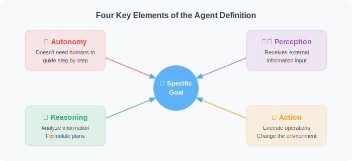

# Core Concepts and Definition of Agents

> 📖 *"If you cannot clearly define a concept, you cannot truly understand it."*

## 1. From Reinforcement Learning to Large Models: The Evolution of the Agent Definition

Before exploring the formal definition, we need to clarify the historical context of the Agent (Intelligent Agent) concept. Agents are not a brand-new invention of the Large Language Model (LLM) era. Long before LLMs, during the era dominated by Reinforcement Learning (RL), the term "Agent" was used to describe algorithmic entities that maximize cumulative reward through trial and error within a specific environment — for example, AlphaGo, which defeated human Go champions.

However, traditional RL-era Agents had obvious limitations: they were often confined to specific closed environments (such as well-defined board games), suffered from severe **cold-start problems** when facing novel open-ended tasks, and found it extremely difficult to generalize or transfer learned strategies to other domains.

The explosion of Large Language Models (LLMs) gave Agents a "universal cognitive brain" equipped with vast world knowledge, fundamentally transforming what an Agent can be. Synthesizing the current consensus in academia and industry, the formal definition of a modern Agent is:

> **An Agent is an intelligent system that uses a Large Language Model (LLM) as its core computation and reasoning engine, capable of autonomously perceiving complex environmental states, performing multi-step logical reasoning and goal decomposition, calling external tools to take action, and ultimately achieving specific goals in a closed-loop manner.**

Under this definition, an Agent is no longer a text generator that merely predicts the next token — it is a "digital entity" with autonomous planning capabilities. Let's deeply dissect the core elements of this definition from an engineering and algorithmic perspective.



---

## 2. Five Core Characteristics of Agents

To thoroughly distinguish Agents from traditional "rule-based software" or simple "chatbots (Q&A bots)", a true Agent must possess the following five core characteristics.

### Characteristic 1: Autonomy — From "Instruction-Driven" to "Goal-Driven"

Traditional software engineering is **instruction-driven**: system state transitions depend on static DAGs (Directed Acyclic Graphs) or complex `if-else` control flows pre-written by developers. Once unexpected data distributions are encountered, the pipeline breaks down. Agents, by contrast, are **goal-driven**.

An Agent can autonomously explore and plan execution paths in an unknown state space using the LLM's in-context learning capability — without any human-hardcoded rules or even specific execution steps.

```python
# ❌ Traditional architecture: the entire pipeline crashes immediately on a missing field
def rule_based_pipeline(user_data):
    if "age" not in user_data:
        raise Exception("Missing field 'age', pipeline aborting.")
    return process_data(user_data)

# ✅ Agent architecture: dynamic routing and autonomous fault tolerance based on high-level goals
class AutonomousAgent:
    def execute(self, goal: str, max_iterations: int = 15):
        """Humans only provide an abstract goal; the Agent autonomously handles state transitions and exceptions"""
        state = {"goal": goal, "memory": [], "status": "RUNNING"}
        
        for step in range(max_iterations):
            # 1. The brain evaluates the current state and dynamically generates the next Action
            #    (no more hardcoded if-else)
            plan = self.llm_engine.plan_next_step(state)
            
            # 2. Autonomously determine whether the task has reached its termination condition
            if plan.is_completed:
                return plan.final_result
                
            # 3. Fault-tolerant execution: on exception, does not crash directly —
            #    instead logs the error and tries an alternative approach
            try:
                observation = self.tool_executor.run(plan.action)
                state["memory"].append(f"Action: {plan.action} -> Success: {observation}")
            except Exception as e:
                # The Agent "sees" this error and works around or fixes it in the next iteration
                state["memory"].append(f"Action: {plan.action} -> Failed: {str(e)}")
                
        return "Max iterations reached. Task could not be completed within the expected range. Human intervention requested."
```

### Characteristic 2: Perception — Converting Heterogeneous Signals into State Representations

An Agent must be able to obtain information from the outside world and understand the current "environment" state. It is important to clarify that the form of perception depends entirely on the Agent's "workspace":
* **Pure text/code environments:** Error logs thrown by compilers, terminal stdout, database-returned schemas.
* **Multimodal environments:** Pixel screenshots of GUI interfaces, voice commands from users, or even sensor data from physical robots.

The core algorithmic essence of perception is **converting high-dimensional, sparse, heterogeneous feedback signals from the physical or digital world into a unified latent representation that the LLM can understand, via embedding models.**

```python
class AgentPerceptionEngine:
    """Example of an Agent's multimodal perception and feature alignment engine"""
    
    def perceive(self, text_query: str, visual_context, user_behavior_seq: list):
        """In complex recommendation or search Agents, perception often involves fusing multiple feature streams"""
        
        # 1. Text semantic perception (Text Embedding)
        text_emb = self.text_encoder(text_query)
        
        # 2. Visual semantic perception (Visual Embedding)
        # e.g., perceiving the layout of the current UI or the cover image of a product
        visual_emb = self.vision_encoder(visual_context)
        
        # 3. Sequential behavior perception (Sequential Behavior)
        # e.g., capturing the user's last 10 click/scroll actions to capture immediate intent
        seq_emb = self.sequence_model(user_behavior_seq)
        
        # 4. Cross-modal alignment and feature fusion
        # Project multiple signals into the same semantic space to form the Agent's state vector S_t
        import torch
        fused_state = self.fusion_layer(torch.cat([text_emb, visual_emb, seq_emb], dim=-1))
        
        return fused_state
```

### Characteristic 3: Reasoning — Deep Unfolding of Logical Topology

If the perception engine provides the environmental state $S_t$, then the LLM is the core reasoning hub that computes the policy distribution $\pi(a|S_t)$. Agent reasoning is no longer a single-pass QA mapping — it is the unfolding of complex logical topology.

Current mainstream Agent reasoning paradigms include:
* **Chain of Thought (CoT):** Linearly decomposes complex problems into sequential logical nodes: "Step A → Step B → Step C."
* **Tree of Thoughts (ToT):** Generates multiple possible branches at each decision point, combined with heuristic evaluation for lookahead search and backtracking — giving the Agent global optimization capabilities similar to Monte Carlo Tree Search (MCTS).

The most widely used paradigm in industry is **ReAct (Reason + Act)**: it forces the Agent to output its internal thought process (Thought) in a sandbox before calling any external tool to intervene in reality. This mechanism greatly reduces the probability of the model taking destructive actions due to "hallucination."

### Characteristic 4: Action — Crossing the Boundary Between Virtual and Reality

Agents cross the digital boundary through **Tool Calling / Function Calling**. Tools are the Agent's "limbs." When the Agent decides during reasoning that it needs real-time data or physical execution, it outputs structured instructions in a specific format (usually JSON), triggering native code in external systems.

```python
# Example tool calling schema definition (letting the Agent understand how to control the external world)
agent_tools = [
    {
        "name": "query_realtime_metrics",
        "description": "Query real-time click-through rate (pCTR) and conversion rate (pCVR) monitoring data",
        "parameters": {
            "type": "object",
            "properties": {
                "model_version": {"type": "string", "description": "Algorithm model version, e.g. v2.1.0"},
                "time_window": {"type": "string", "description": "Time lookback window, e.g. 1h, 24h, 7d"}
            },
            "required": ["model_version", "time_window"]
        }
    }
]
# When the Agent encounters a task requiring dashboard data, it can precisely construct
# this JSON parameter and trigger the internal API
```

### Characteristic 5: Learning & Adaptation — Memory Mechanisms and Anti-Fatigue Control

This is the ultimate dividing line between a "toy-level Agent" and an "industrial-grade Agent." A powerful Agent system must have **Memory and Self-Reflection mechanisms** when facing continuous interactions or data distribution shifts (Data Drift).

In real business workflows (e.g., advertising recommendation or content distribution Agents), if the system is merely a greedy algorithm that continuously recommends content with the highest predicted click-through rate (pCTR), it will quickly lead to **content homogenization**. After receiving similar multimodal stimuli repeatedly, users develop a severe **fatigue effect**, causing downstream conversion rates (pCVR) to drop sharply.

An adaptive Agent uses long- and short-term memory mechanisms for dynamic intervention, actively breaking information silos:

```python
def agent_adaptive_strategy(current_user_state, candidate_actions, memory_db):
    """Agent uses memory mechanisms to dynamically adjust strategy against systemic fatigue effects"""
    
    # 1. Retrieve memory: get the user's recent exposure history and negative feedback records
    recent_exposures = memory_db.get_recent_history(user_id=current_user_state.uid)
    
    # 2. Dynamic reflection and evaluation (Reflection & Penalty)
    for action in candidate_actions:
        # Compute similarity between the current candidate action's features and recent memory features
        similarity = compute_similarity(action.multimodal_emb, recent_exposures.embs)
        
        if similarity > 0.85:
            # 💡 Trigger Anti-fatigue Control
            # The Agent proactively down-weights this action to prevent user experience degradation
            # caused by highly overlapping features
            penalty = calculate_fatigue_penalty(similarity, consecutive_times=recent_exposures.count)
            action.final_score = action.pctr_score * (1.0 - penalty)
            
            log_reflection(f"Homogenization risk detected! Reduced priority of action {action.id}, increasing exploration.")
            
    # 3. Apply diversity re-ranking and output the final plan
    return rank_with_diversity(candidate_actions)
```

---

## 3. The Core Architecture Formula of an Agent System

In summary, academia and industry broadly distill the underlying architecture of a complete AI Agent system into the following combination formula:

> 🎯 **Agent = LLM (Core Brain) + Memory (Memory System) + Planning (Planning & Scheduling) + Tools (Tool Execution)**

| Core Component | Engineering Analogy | Architectural Role & Technology |
| :--- | :--- | :--- |
| **LLM Engine** | CPU / Arithmetic Logic Unit | Responsible for complex semantic understanding, commonsense reasoning, and natural language generation. Relies on large-parameter foundation models (e.g., GPT-4, Gemini Pro, Llama 3). |
| **Planning** | OS Scheduler | Responsible for decomposing high-level goals (Sub-goal Decomposition) and managing the sequencing and concurrent execution of task flows. Involves the ReAct framework or complex state machine orchestration. |
| **Memory** | RAM & Hard Drive | Maintains the Agent's contextual coherence and long-term evolution. **Short-term memory** relies on the LLM's Context Window; **long-term memory** relies on Vector DBs (e.g., Milvus) for RAG retrieval. |
| **Tools/Action** | Peripheral Interfaces (I/O) | Gives the virtual brain the ability to intervene in physical/digital reality. Involves automatic OpenAPI schema parsing and sandboxed code execution environments (Python Sandbox). |

---

## Section Summary

If a Large Language Model is a "brain" enshrined in a data center — possessing vast knowledge but unable to move directly — then the Agent framework connects it with "multimodal sensors" for perceiving complex environments, a "hippocampus" (memory system) for storing past experiences, and "limbs" (tool APIs) capable of changing the real world.

The emergence of Agents officially marks the transition of artificial intelligence from the **"Chat Paradigm"** to the **"Action Paradigm."**

---

## 🤔 Thinking Exercises

1. **Environment and modality differences:** A code Agent specialized in fixing Python backend bugs vs. a shopping guide Agent helping users choose clothes on an e-commerce platform — what fundamental differences would there be in their "perception layer" and "tool layer" architectural designs?
2. **Cold start and memory pools:** When an Agent is first deployed to a brand-new business scenario, its performance is often poor because the "long-term memory store" is empty. Can you design an initialization mechanism that accelerates cross-domain "cold start" for Agents, leveraging multimodal feature pre-training models?
3. **Architectural introspection:** Why can't simply increasing the LLM's parameter count solve the user "fatigue effect" in complex recommendation systems? Why must an explicit memory module and scoring penalty mechanism — independent of the large model — be introduced into the Agent architecture?

---

## 📚 Recommended Reading & Key References

To deepen your understanding of Agent underlying architecture and cutting-edge developments, the following landmark papers in the AI industry are strongly recommended:

1. **Weng, L. (2023). *"LLM Powered Autonomous Agents"*. OpenAI Safety & Alignment Blog.**
   * **Core contribution:** Currently the most widely cited Agent survey in industry. The author clearly dissects the four-in-one architecture `Agent = LLM + Memory + Planning + Tool Use` — essential reading for all Agent developers.

2. **Yao, S., et al. (2022). *"ReAct: Synergizing Reasoning and Acting in Language Models"*. (ICLR 2023).**
   * **Core contribution:** First systematically proposed the ReAct paradigm of alternating internal "Reasoning" with external "Acting," fundamentally changing the chaotic blind tool-calling of LLMs and laying the control-flow foundation for most modern Agents.

3. **Park, J. S., et al. (2023). *"Generative Agents: Interactive Simulacra of Human Behavior"*. (UIST 2023).**
   * **Core contribution:** The famous Stanford "AI Town" paper. This research deeply explores Agent memory mechanisms (Observation → Memory → Retrieval → Reflection), demonstrating how multi-agent systems can generate complex emergent social behaviors through long- and short-term memory.

4. **Shinn, N., et al. (2023). *"Reflexion: Language Agents with Iterative Design Learning"*. (NeurIPS 2023).**
   * **Core contribution:** Deeply explores the Agent self-reflection mechanism. The paper demonstrates how an agent can achieve self-evolution and iterative adaptation purely by converting failure lessons into linguistic memory — without any additional network weight updates.