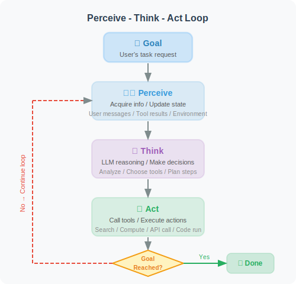
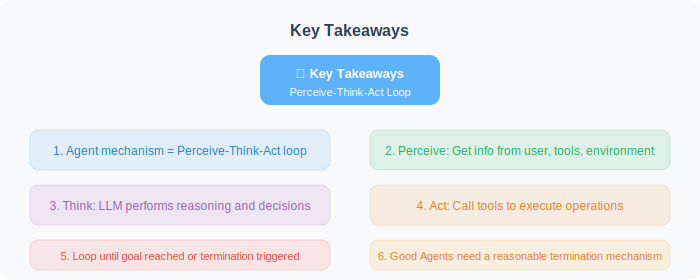

# The Typical Agent Architecture: The Perceive-Think-Act Loop

> 📖 *"Intelligence is not a static weight matrix — it is the dynamic adaptive process a system exhibits through high-frequency cyclic interaction in a complex environment."*

## 1. Mathematical Formalization of the Core Loop and MDP Abstraction

Before dissecting the concrete code architecture, we need to re-examine the Agent's operating mechanism from the perspective of systems control theory and algorithmic principles. An Agent's operation is not a one-way DAG (Directed Acyclic Graph) pipeline — it is a continuously repeating **Feedback Control Loop**.

In classical reinforcement learning, this is defined as the interaction between an agent and its environment. In the context of Large Language Models (LLMs), we refine it into the **Perceive-Think-Act (PTA) loop**. We can formalize it as a variant of a Partially Observable Markov Decision Process (POMDP).

Assuming the current time step is $t$, the mathematical and logical expression of the entire closed loop is as follows:

1. **Perceive ($O_t$):**

   $$O_t = \text{Observe}(E_t, A_{t-1})$$

   The Agent observes the current high-dimensional environment $E_t$ and receives the exact feedback from the previous action $A_{t-1}$ (e.g., API status codes, database-returned schemas, or model-estimated click-rate distributions), generating the current observation feature vector or text representation $O_t$.

2. **Think ($T_t, P_t$):**

   $$T_t, P_t = \text{LLM\_Policy}(O_t \mid S_{t-1})$$

   The core large model (brain) combines the latest observation $O_t$ with historical memory context $S_{t-1}$ for autoregressive decoding. It generates the internal logical reasoning topology $T_t$ (Thought — the latent variable optimization process) and the locally optimal action plan $P_t$ for the next step.

3. **Act ($A_t$):**

   $$A_t = \text{Execute}(P_t)$$

   The Tool Executor parses the action plan and applies the exact action $A_t$ to external systems (e.g., adjusting recommendation ranking weights, initiating SQL queries). The environment undergoes a state transition due to $A_t$.

4. **State & Memory Update:**

   $$S_t = \text{Memory\_Update}(S_{t-1}, O_t, T_t, A_t)$$

   The "what was seen, thought, and done" in this round is serialized or summarized and appended to the global state space $S_t$, serving as the prior prompt for the next round of decoding.



> 🎬 **Interactive Animation**: Want to see the PTA loop in action? Click the link below to open the interactive demo and observe the complete flow through the Perceive, Think, and Act phases.
>
> <a href="../animations/pta_cycle.html" target="_blank" style="display:inline-block;padding:8px 16px;background:#4CAF50;color:white;border-radius:6px;text-decoration:none;font-weight:bold;">▶ Open PTA Loop Interactive Animation</a>

---

## 2. Deep Dive: Engineering Challenges in the PTA Loop

Building an industrial-grade Agent requires far more than stitching together APIs — developers must go deep into the underlying architecture of all three phases.

### 👁️ Phase 1: Perceive — Denoising and Multimodal Alignment of Heterogeneous Signals

Large models cannot directly "see" code error stack traces, nor can they directly understand floating-point matrices in recommendation systems. The core engineering task of the perception module is **information parsing, denoising, and feature alignment**.

In complex industrial scenarios (e.g., an Agent responsible for monitoring and optimizing a content distribution dashboard), environmental feedback is often multimodal and extremely sparse:
* **Structured data perception:** When the Agent executes SQL queries for pCTR (predicted click-through rate) and pCVR (predicted conversion rate) dashboard data, the returned JSON may be several megabytes long. The perception engine must use truncation or dynamic sampling algorithms to extract only the core statistical distribution to feed the LLM, preventing Context Overflow.
* **Multimodal feature alignment:** If the Agent needs to analyze why a specific product's conversion rate dropped, it needs to perceive not just text labels, but also align the product's visual cover image and the user's historical behavior sequence through an external Embedding extractor into a unified latent space, then convert them into natural language descriptions for the large model to understand.

### 🧠 Phase 2: Think — Deep Evolution of Cognitive Paradigms

The end-to-end approach of "directly mapping perception to action" is highly prone to severe hallucinations. In industry, the Think phase is primarily dominated by several advanced paradigms, each with different trade-offs between computational cost and reasoning depth:

1. **ReAct (Reason + Act):**
   * **Mechanism:** Forces the Agent to generate a human-readable reasoning text (Thought) before outputting structured tool instructions.
   * **Principle:** Leverages the LLM's autoregressive nature — the Thought tokens generated first form a forcing context for subsequent Action generation, greatly reducing action randomness.

2. **Plan-and-Solve (Plan First, Then Execute):**
   * **Mechanism:** Addresses the latency bottleneck of ReAct (waiting for LLM response at every step). The Agent outputs a complete global task execution graph (DAG) in the first loop; subsequent loops are scheduled by lightweight scripts, calling the large model again only when exceptions occur.

3. **Tree of Thoughts (ToT):**
   * **Mechanism:** At critical decision branch points, the Agent internally generates multiple candidate Thought branches and calls an `Evaluator` to score them (Heuristic Evaluation), selecting the path with the highest expected reward to continue expanding. Similar to equipping the Agent with Monte Carlo Tree Search (MCTS) lookahead capability.

4. **Reflexion (Dynamic Reflection Mechanism):**
   * **Mechanism:** Introduces short-term episodic memory. When the Agent perceives that the previous action failed, it triggers a separate `<Reflection>` generation process, forcing the Agent to summarize the root cause of the failure and inject this lesson into the current loop: "To avoid repeating the same mistake, I should adjust my strategy this time."

### 🦾 Phase 3: Act — Crossing Boundaries and the Game with Execution Environments

Action is the Agent's physical handle for crossing the digital boundary and intervening in reality. Mainstream engineering practice relies heavily on the LLM's `Function Calling` mechanism. However, when executing code or high-risk instructions generated by the large model, the system design must make trade-offs between **"safety"** and **"convenience"**.

Depending on the application scenario, the execution environment in the Act phase typically follows two distinctly different evolutionary paths:

**Path 1: Cloud/Production-Grade Agent (Sandboxed Physical Isolation)**
When an Agent is deployed in a multi-tenant cloud environment (e.g., enterprise-grade data analysis Agents, automated operations Agents), to prevent the large model from generating hallucinated malicious instructions (e.g., `DROP TABLE`, `rm -rf /`, or infinite CPU-consuming mining scripts), all code-level Act operations **must be forcibly isolated** and run inside ephemeral Docker containers or lightweight WASM sandboxes. The environment is immediately destroyed after execution, ensuring absolute host security.

**Path 2: Local/Developer-Assist Agent (Trust Authorization and Vibe Coding)**
With the rise of **Vibe Coding**, tools like Cursor, Aider, and various CLI local agents have become developers' "pair programming" partners. To pursue the ultimate development experience, these Agents typically **run directly on the user's host machine (local OS)**.

By abandoning strict physical isolation, this architecture derives **different trust-level authorization modes** at the execution layer:

* **Human-in-the-Loop (HITL) Default Mode:** Before executing state-changing commands (e.g., installing dependencies, modifying system configurations), the framework requests a `y/n` confirmation from the human developer in the terminal. Human experience is the last guardrail.
* **Full Auto-Run (YOLO Mode):** Tools like Cursor's Composer or Aider's full-auto mode allow users to grant the Agent **complete terminal control**. The Agent can autonomously run tests, read terminal error logs, automatically install missing npm packages, and recursively fix bugs. The "isolation guardrail" is completely removed, replaced by maximum efficiency — with system safety relying on OS user permissions (running as non-root) and high-frequency automatic Git commits (rollback at any time).

---

## 3. Industrial-Grade Core Source Code: FSM-Based State Machine Scheduling Architecture

Compared to a simple `while True` loop, modern advanced Agent frameworks (such as LangGraph and AutoGen) use a **Finite State Machine (FSM)** transition architecture at their core.

Below, we abandon the toy-level "weather query" example and directly build an **"Ad Algorithm Tuning Agent"** skeleton that closely mirrors real algorithmic business workflows. It demonstrates how a highly cohesive ReAct loop engine maintains state, tracks trajectories, and performs multi-tool routing.

```python
import json
import traceback
from typing import Callable, Dict, Any, Tuple
from dataclasses import dataclass, field
from enum import Enum

# --- 1. Define rigorous types and state space ---

class AgentStatus(Enum):
    RUNNING = "RUNNING"             # Normal loop in progress
    COMPLETED = "COMPLETED"         # High-level goal successfully achieved
    FAILED = "FAILED"               # Irreversible fatal error occurred
    MAX_LOOPS_REACHED = "TIMEOUT"   # Dead-loop protection circuit breaker triggered

@dataclass
class AgentContext:
    """Maintains global memory and state context for the Agent's full lifecycle"""
    task_goal: str
    scratchpad: list[str] = field(default_factory=list)  # Records complete T-A-O trajectory
    current_step: int = 0
    max_steps: int = 12             # Strictly control maximum reasoning depth
    status: AgentStatus = AgentStatus.RUNNING

# --- 2. Simulate LLM engine and tool library abstraction ---

class LLMEngine:
    def generate(self, prompt: str) -> str:
        # In production, connect to a long-context model (e.g., Gemini 1.5 Pro / GPT-4o)
        pass

# --- 3. Industrial-grade ReAct loop scheduler ---

class AutonomousAlgorithmAgent:
    def __init__(self, llm: LLMEngine, tools: Dict[str, Callable]):
        self.llm = llm
        self.tools = tools
        self.tools["Finish"] = self._tool_finish  # Inject system-level task termination node
        
        # Extremely strict System Prompt guardrail settings
        self.system_prompt = f"""
You are a senior recommendation algorithm diagnostic agent. Your goal is to autonomously analyze and resolve data anomalies.
Available tools: {list(self.tools.keys())}.

⚠️ Core constraint: Every response MUST strictly follow the format below. No extra explanations allowed!
Thought: Think about what you need to do now and what data is still missing.
Action: The tool name you decide to call (must be one from the list above).
Action Input: Parameters to pass to the tool, must be a valid JSON object.
"""

    def _tool_finish(self, final_report: str) -> str:
        """Built-in tool: used by the Agent to proactively declare completion after collecting all clues"""
        return "SYSTEM_SUCCESS_FLAG"

    def execute_task(self, user_goal: str) -> str:
        """Launch the Perceive-Think-Act state machine main loop"""
        context = AgentContext(task_goal=user_goal)
        print(f"\n🚀 [Agent Booting] Received optimization goal: {context.task_goal}\n" + "="*55)
        
        while context.status == AgentStatus.RUNNING:
            context.current_step += 1
            print(f"\n🔄 --- [PTA Loop {context.current_step}/{context.max_steps}] ---")
            
            # [Phase 1 & 2: 👁️ Context Perception + 🧠 Core Thinking]
            # Serialize the historical scratchpad for the model to perceive and plan the next step
            full_prompt = self._build_prompt(context)
            llm_response = self.llm.generate(full_prompt)
            
            try:
                # Parse the model's output: Thought, Action, Action Input
                thought, action_name, action_args = self._parse_llm_output(llm_response)
                
                # Update local memory
                context.scratchpad.append(f"Thought: {thought}")
                context.scratchpad.append(f"Action: {action_name}")
                context.scratchpad.append(f"Action Input: {json.dumps(action_args)}")
                
                print(f"🧠 [Thought] {thought}")
                print(f"🦾 [Action Decision] -> {action_name}({action_args})")
                
                # Terminal state interception
                if action_name == "Finish":
                    context.status = AgentStatus.COMPLETED
                    return action_args.get("final_report", "Analysis complete.")
                    
            except Exception as parse_err:
                # Fault tolerance: if the LLM hallucinates and doesn't follow the format,
                # feed it back as environment feedback to force self-correction
                obs = f"System Error: Output parsing failed. Please ensure valid JSON parameters. Error: {str(parse_err)}"
                context.scratchpad.append(f"Observation: {obs}")
                print(f"⚠️ [Format Hallucination] Logged to short-term memory. Forcing retry in next loop.")
                continue
                
            # [Phase 3: 🦾 Action Execution and Environment State Transition]
            observation = self._execute_tool(action_name, action_args)
            
            # Record real environment feedback
            context.scratchpad.append(f"Observation: {observation}")
            print(f"📊 [Observation] {observation}")
            
            # System-level guardrail: dead-loop circuit breaker
            if context.current_step >= context.max_steps:
                context.status = AgentStatus.MAX_LOOPS_REACHED
                break

        return f"Task terminated abnormally. Final scheduler status: {context.status.name}"

    def _execute_tool(self, name: str, args: dict) -> str:
        """Sandboxed tool routing executor"""
        if name not in self.tools:
            return f"Error: Tool '{name}' not found. Please check the Action spelling."
        try:
            result = self.tools[name](**args)
            # Key defense mechanism: limit the maximum token length of a single Observation
            return str(result)[:3000]
        except Exception:
            return f"Tool Exception: {traceback.format_exc()[:500]}"
            
    # (_build_prompt and _parse_llm_output are basic string parsing logic, omitted here)
```

### Example Production Trajectory:

If the algorithm engineer's `user_goal` is: *"Today the pCVR of the multimodal recommendation experiment group dropped significantly. Please help me diagnose the cause and provide intervention recommendations."*

The Agent's loop log will exhibit highly professional diagnostic logic:

```text
🔄 --- [PTA Loop 1/12] ---
🧠 [Thought] I need to first confirm the magnitude of the dashboard drop and the main affected traffic features. I will query today's pCVR data for each strategy group.
🦾 [Action Decision] -> query_pctr_cvr_metrics({"experiment_group": "multimodal_exp_v2", "metric": "pCVR"})
📊 [Observation] Result: Compared to the control group, the experiment group's pCVR dropped 14.2%, mainly concentrated in the long-tail cold-start video category.

🔄 --- [PTA Loop 2/12] ---
🧠 [Thought] Since the problem is in long-tail videos, this may be due to insufficient representation of sparse features in the multimodal embedding fusion stage, or content recommendations being too homogeneous causing user aesthetic fatigue. I need to query the feature distribution similarity in the cold-start phase.
🦾 [Action Decision] -> analyze_multimodal_embeddings({"target_category": "long_tail_video"})
📊 [Observation] Result: The mean cosine similarity of content embeddings in the experiment group's recall list reached 0.89, indicating high content homogenization.

🔄 --- [PTA Loop 3/12] ---
🧠 [Thought] Root cause identified. The multimodal semantic capture capability is too strong, leading to over-recommendation of content with similar features, causing severe fatigue due to missing anti-fatigue mechanisms. I can now output the diagnostic report.
🦾 [Action Decision] -> Finish({"final_report": "Diagnosis complete. The drop is caused by multimodal recommendation overfitting, triggering user fatigue. Recommend adding a diversity penalty term (Anti-fatigue penalty) in the SE_Logit or re-ranking layer."})
```

---

## 4. Industrial Pitfalls: Loop Failures and System-Level Guardrails

In real online business environments, the environment is full of noise and Agents can easily fall into **"loop crashes"**. A mature architecture must deploy multiple layers of "guardrails" outside the PTA loop:

1. **Infinite Looping:**
   * *Symptom:* The Agent falls into a logical deadlock. Example: *"Try to read Table A → Table A doesn't exist → Try to read Table A again."*
   * *Defense design:* Deploy a trajectory monitoring algorithm outside the main loop. If the same `Action` and `Action Input` appear 3 consecutive times in the context, immediately interrupt with a strong environment feedback: `"Observation: [System Warning] You have repeated the same invalid action 3 times consecutively. You must immediately switch to another tool or change your analysis approach!"`

2. **Context Window Overflow:**
   * *Symptom:* If a tool API returns hundreds of thousands of rows of full user event data, the LLM immediately hits the token limit, causing the model to crash or truncate.
   * *Defense design:* Implement **Dynamic Sliding Window Summarization**. When the `scratchpad` length approaches the watermark, proactively strip the first 80% of historical loop nodes and compress them into a high-density state summary using a lightweight model (or text extraction algorithm).

3. **Cascading Hallucinations:**
   * *Symptom:* If an analysis tool errors in one step, the Agent may ignore the failure and pretend in subsequent Think steps that it successfully obtained the metrics, fabricating false conclusions.
   * *Defense design:* Introduce an **Independent Critic Evaluator mechanism**. Before triggering the `Finish` action, use another LLM to verify the global logical chain (Trajectory Check): *"Is the final conclusion it gives truly supported by the data from the preceding Observations?"* If support is insufficient, intercept and send back for rework.

---

## Section Summary



| PTA Phase | System Responsibility | Engineering Challenges & Technical Defenses |
| :--- | :--- | :--- |
| **Perceive** | Extract effective state representations from high-dimensional, noisy environments | Data anti-truncation, multi-stream feature aggregation, JSON structure cleaning |
| **Think** | State transition evaluation, multi-step goal optimization and planning | Prompt engineering, ReAct templates, ToT pruning, reflection memory injection |
| **Act** | Cross-boundary triggering of external physical/digital world state changes | Schema strict validation, sandboxed isolated execution, fault tolerance and retry routing |

Perceive, Think, Act — these form the underlying flywheel of continuous Agent evolution. The more powerful the foundation model (LLM), the deeper the global lookahead capability of Think; the more solid the tool infrastructure (Tools), the broader the ability of Act to intervene in reality.

## 🤔 Thinking Exercises

1. **Parallel planning trap:** If your algorithm Agent needs to simultaneously query dashboard latency data from three data centers in Beijing, Shanghai, and Guangzhou — in a pure single-threaded ReAct paradigm, it would need 3 complete loop iterations. Can you modify the output constraints at the Think layer to achieve concurrent `Action` calls, significantly reducing LLM network latency?
2. **Architecture rollback mechanism:** Looking at the state machine code above, if in loop iteration 8 the Agent realizes it misunderstood a field in iteration 2 and went in the wrong direction — does the current architecture support "undoing" and rolling back to the state at iteration 2? If not, what data structure should be introduced to transform the Scratchpad?
3. **Reinforcement learning perspective:** Try to map the `Thought → Action → Observation` trajectory in the ReAct loop to the reward feedback formula in RL algorithms like PPO or Q-Learning using pseudocode. What element in RL does the Agent's prompt correspond to?

---

## 📚 Recommended Reading & Key References

Deeply understanding the evolution of underlying control loops and reasoning paradigms is the cornerstone for senior algorithm practitioners building complex systems:

1. **Yao, S., et al. (2022). *"ReAct: Synergizing Reasoning and Acting in Language Models"*. (ICLR 2023)**
   * **Reading value:** The "genesis paper" of modern Agent architecture. It uses solid data to prove that in complex decision-making, reasoning alone (CoT) or blind acting alone both perform poorly — only by interweaving the two in a closed loop can emergent human-like trial-and-error and self-correction capabilities be activated.

2. **Wang, L., et al. (2023). *"Plan-and-Solve Prompting: Improving Zero-Shot Chain-of-Thought Reasoning by Large Language Models"*. (ACL 2023)**
   * **Reading value:** Directly addresses the efficiency bottleneck of ReAct reasoning. This paper proposes pre-generating a complete execution DAG and separating the "global Planner" from the "local Executor."

3. **Harrison Chase. (2024). *"LangGraph: Multi-Agent Workflows"*. LangChain Engineering Blog.**
   * **Reading value:** The most cutting-edge orchestration practice in industry. Deeply explains why the simple `While` loop must be completely refactored into a directed cyclic state graph composed of Nodes and Edges, to build production-grade Agent systems with extremely high fault tolerance.
