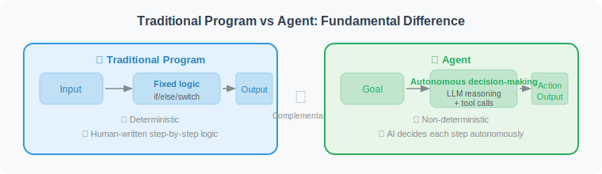
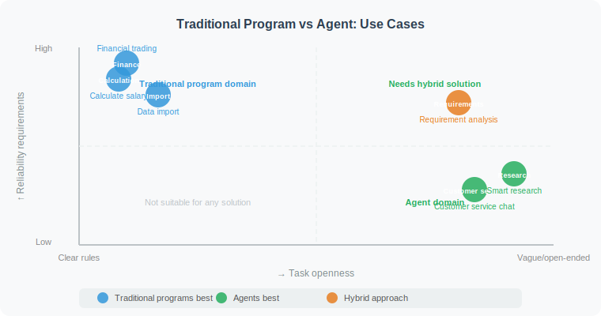

# Agents vs. Traditional Programs

> 📖 *"The evolution of AI is essentially a paradigm shift in software engineering. The best way to understand Agents is to clarify the fundamental contest of 'control' between them and traditional code."*

## 1. The Core Paradigm Shift: From "Software 1.0" to "Software 2.0"

Andrej Karpathy, former AI Director at Tesla, famously proposed the concept of "Software 2.0." Following this line of thinking, the fundamental difference between traditional programs and AI Agents lies in **how the system's State Machine is driven**.

* **Traditional Programs (Software 1.0): Deterministic Static DAG**
    Every state transition, every `if-else` branch, and every exception handler must be **exhaustively enumerated and hard-coded** by human programmers before compilation. Its essence is **instruction-driven**.
* **AI Agent (Software 2.0+): Dynamic Probabilistic Routing**
    Humans no longer define execution paths — instead, they define **high-level goals** and **boundary guardrails**. The Agent relies on the large model's contextual understanding and autoregressive reasoning to dynamically generate and correct execution paths at runtime. Its essence is **intent-driven**.



---

## 2. Source-Code-Level Comparison: Handling "Environment Drift"

In algorithm engineering, we frequently encounter **Data Drift** or **Schema Evolution**. Let's compare the fragility and anti-fragility of both approaches through a real data analysis scenario.

**Task:** *"Read the latest ad campaign report (CSV) and find the strategy group with the highest conversion rate (pCVR) and spend greater than 1000."*

### ❌ Traditional Program: The Fragile "Glass Pipeline"

```python
"""
Traditional architecture: tightly coupled Pipeline
Characteristic: Highly deterministic, but completely defenseless against any environmental change
(e.g., upstream table schema changes)
"""
import pandas as pd

def analyze_ads_report_traditional(file_path: str) -> dict:
    try:
        # 1. Hard dependency on a fixed file format and path
        df = pd.read_csv(file_path)
        
        # 2. Hard dependency on hardcoded column names (tight Schema coupling)
        # If upstream renames "cost" to "spend", the program crashes immediately (KeyError)
        valid_df = df[(df["cost"] > 1000) & (df["status"] == "active")]
        
        # 3. Hard dependency on fixed computation logic
        top_strategy = valid_df.loc[valid_df["pCVR"].idxmax()]
        
        return {"strategy": top_strategy["strategy_id"], "cvr": top_strategy["pCVR"]}
        
    except KeyError as e:
        # On unexpected error, the system can only "die gracefully" — it cannot self-rescue
        return {"error": f"Missing expected column: {e}"}
```

### ✅ Agent: Dynamic Execution with Self-Healing Capability

```python
"""
Agent architecture: dynamic generation and self-correction
Characteristic: Understands semantics, dynamically writes code, can autonomously fix Schema changes
"""

def analyze_ads_report_agent(file_path: str, context):
    """
    The Agent does not pre-assume column names — it solves the problem through the PTA
    (Perceive-Think-Act) loop
    """
    # 🔄 [Loop 1]: Perceive data structure
    # 🧠 Thought: I need to first understand the Schema of this CSV.
    # 🦾 Action: execute_python("import pandas as pd; print(pd.read_csv('report.csv', nrows=0).columns)")
    # 📊 Observation: Index(['strategy_id', 'spend_usd', 'conversion_rate', 'is_active'], dtype='object')
    
    # 🔄 [Loop 2]: Semantic alignment and code generation
    # 🧠 Thought: The upstream schema changed. "cost" became "spend_usd", "pCVR" became
    #             "conversion_rate". I need to write analysis code based on the new Schema
    #             to find the strategy with the highest conversion rate and spend > 1000.
    # 🦾 Action: execute_python("""
    #     df = pd.read_csv('report.csv')
    #     valid = df[(df['spend_usd'] > 1000) & (df['is_active'] == True)]
    #     print(valid.loc[valid['conversion_rate'].idxmax()]['strategy_id'])
    # """)
    # 📊 Observation: Error: 'is_active' is of type string ('Y'/'N'), cannot compare to True.
    
    # 🔄 [Loop 3]: Exception capture and self-correction (Reflexion)
    # 🧠 Thought: The code errored. 'is_active' is a string type; I should use == 'Y' to filter.
    #             I will rewrite the code.
    # 🦾 Action: execute_python("... df['is_active'] == 'Y' ...")
    # 📊 Observation: "STRATEGY_9527"
    
    # ✅ Task complete — successfully worked around Schema change and data type exception
    return "Analysis complete. The strategy group with the highest conversion rate is STRATEGY_9527."
```

---

## 3. Industrial Six-Dimension Comparison



| Architecture Dimension | Traditional Program (Software 1.0) | Agent (Software 2.0+) |
| :--- | :--- | :--- |
| **Control Flow** | Statically compiled control graph (DAG / DFA) | LLM-based dynamic probabilistic pathfinding and planning |
| **Input Interface** | Strong Schema constraints (RESTful, Protobuf) | Fuzzy natural language, multimodal intent (Images, Audio) |
| **Fault Tolerance** | Explicit `try-catch` exhaustive design | Dynamic stack analysis, self-reflection (Reflexion) and retry |
| **Generalization** | Zero generalization: $N$ scenarios require $N$ codebases | Strong generalization: universal tools handle infinite unknown scenarios |
| **Computational Complexity** | Time complexity precisely measurable (e.g., $O(N \log N)$) | Complexity depends on LLM reasoning depth; non-deterministic latency |
| **Determinism** | Absolute determinism: $f(x) \equiv y$ | Stochastic process: same input may trigger different exploration trajectories |

---

## 4. Deep Dive: The Superiority of Fault Tolerance

Fault tolerance in traditional engineering is extremely rigid. For example, when calling an external API and encountering `HTTP 429 Too Many Requests`, the best a traditional program can do is execute **Exponential Backoff retry**. If retries fail 3 times, the program throws an exception and circuit-breaks.

But Agent fault tolerance is **dynamic degradation based on semantic understanding**:

```text
🚨 Exception: Agent call to Google Search API failed (Quota Exceeded).

🧠 Traditional program's "brain":
"Trigger exception → Retry → Retry failed → Throw RuntimeError → Task dies"

🤖 Agent's "brain" (dynamic reasoning):
"Thought: Google Search API quota is exhausted. But my current goal is to get 2026 financial report data.
What else can I do besides Google?
Option A: Switch to the backup Bing Search tool.
Option B: Use the Web Browser tool to directly scrape the official website.
Option C: Check if the local knowledge base already has a cached copy.
I'll go with Option A."
→ Task survives, dynamically bypasses the failed node.
```

---

## 5. Architectural Trade-offs: The Double-Edged Sword of Non-Determinism

It must be clarified that Agents are not a universal "silver bullet." The greatest advantage of traditional programs is their **absolute determinism** and **low latency**.

In Agent architecture, the LLM's output is essentially stochastic sampling of the next token. This means:
1. **Non-reproducible trajectories:** Given the same input, the Agent might succeed on the first try yesterday, but today might fall into an infinite loop by choosing the wrong branch in the "thought tree."
2. **High latency tax:** An `if-else` decision that a traditional program completes in milliseconds (ms) may require the Agent to wait 2–5 seconds for LLM inference.

> 💡 **Architect's Rule of Thumb:**
> **"Agent = Probabilistic brain + Deterministic tools"**
> Never let the LLM perform precise mathematical calculations or directly modify underlying database tables. The correct approach is to let the LLM (Agent) handle **intent understanding and planning**, while encapsulating specific business logic as **deterministic API tools** for it to call.

---

## 6. Business Selection Guide: When to Use an Agent?

In real business deployments, don't force-fit Agents just to chase AI trends. Architecture selection should be based on **Cognitive Complexity** and **Execution Frequency**.


1. **Strong rules, high concurrency, low latency (stick with traditional programs):**
   * *Scenarios:* High-concurrency recall layer in recommendation systems, ad billing engines, flash-sale inventory deduction.
   * *Reason:* Cannot tolerate millisecond-level latency fluctuations or any non-deterministic results.

2. **Heavy process, requires human review (use traditional workflow orchestration + AI Copilot):**
   * *Scenarios:* Financial approval workflows, core database migrations.
   * *Reason:* Processes must be fully controlled; AI only provides advisory assistance (human-in-the-loop).

3. **Highly dynamic, long-tail demands, cognitively intensive (embrace Agents):**
   * *Scenarios:* Automated data exploration and attribution analysis, automatic code bug fixing (SWE-agent), deep analysis of massive unstructured documents.
   * *Reason:* Rules are numerous and constantly changing; human programmers cannot enumerate all `if-else` branches. Agent generalization capability will greatly reduce marginal R&D costs.

---

## Section Summary

If **traditional programs are pre-laid "railway tracks"** — trains can only travel along fixed routes, safe but inflexible — then **Agents are GPS-equipped "off-road vehicles"**: you only need to set the destination coordinates, and they autonomously perceive the terrain, navigate around obstacles, and even find a spare tire when one blows out, ultimately reaching the goal.

## 🤔 Thinking Exercises

1. **Boundary thinking:** In an autonomous driving system, which module is better suited for traditional programs — the Braking Control module or the Route Planning module? Why?
2. **Refactoring challenge:** Suppose you maintain a customer service ticket routing system with thousands of `if-elif-else` branches. If you refactor it with Agent architecture, how would your system architecture diagram change? Where would all those `if-else` logic blocks be moved?
3. **Fault tolerance trap:** An Agent's "self-healing" capability can sometimes backfire (e.g., repeatedly modifying code and drifting from the original intent). How would you design a hybrid architecture that preserves Agent autonomy while preventing it from going further and further in the wrong direction?

---

## 📚 Recommended Reading & Key References

* **Andrej Karpathy (2017). *"Software 2.0"*.**
  *(A classic blog post that profoundly predicted how stochastic systems represented by neural networks would replace parts of traditional hard-coded logic, laying the intellectual foundation for the Agent explosion.)*
* **Schick, T., et al. (2023). *"Toolformer: Language Models Can Teach Themselves to Use Tools"*.**
  *(Demonstrates how models can learn to interact with "deterministic" traditional program systems via API interfaces, transcending "non-deterministic" text generation — essential reading for understanding the essence of Agent tool calling.)*
* **Rich Sutton (2019). *"The Bitter Lesson"*.**
  *(Insights from a reinforcement learning pioneer. He argues that in the long-term evolution of AI, attempts to impose human prior knowledge (i.e., hard-coded rules of traditional programs) on systems ultimately fail — only leveraging compute and search (the core of Agent autonomous planning) is the right path.)*
