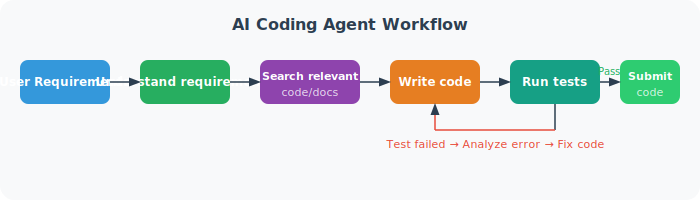
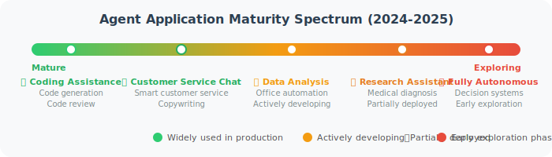

# Agent Application Landscape

> 📖 *"Agents are not a technology exclusive to any one industry — they are a universal intelligent paradigm."*

## Application Overview

Agent technology is rapidly being deployed across various fields. Let's take a bird's-eye view of what Agents can do:


## Scenario 1: 💻 Programming & Development — AI Coding Assistant

This is arguably the most mature and impactful Agent application scenario today.

```python
"""
What can an AI Coding Assistant Agent do?
"""

# Scenario A: Code generation
# 🧑 "Write a FastAPI endpoint for user registration, including parameter validation and password encryption"
# 🤖 Agent thinks → generates complete code with routes, models, and validation logic

# Scenario B: Bug fixing
# 🧑 "This code throws an error: TypeError: 'NoneType' object is not subscriptable"
# 🤖 Agent analyzes code → locates the problem → generates a fix

# Scenario C: Code review
# 🧑 "Help me review this PR"
# 🤖 Agent reads code changes → checks for potential issues → provides improvement suggestions

# Scenario D: Project scaffolding
# 🧑 "Create a Python project with logging, config management, and database connection"
# 🤖 Agent plans project structure → creates files → writes initial code → configures dependencies

# Representative products: GitHub Copilot, Cursor, Windsurf, Devin
```

**AI Coding Agent workflow:**



## Scenario 2: 📊 Data Analysis — Intelligent Analyst

```python
"""
Data Analysis Agent: Give everyone their own data analyst

Traditional approach: Users need SQL + Python + Statistics + Visualization skills
Agent approach: Users just need to speak naturally
"""

# 🧑 "Help me analyze last quarter's user churn and find the main causes"

# Agent's working process:
analysis_workflow = """
Step 1: 🧠 Understand the requirement → User churn analysis: need churn rate, churned user characteristics, possible causes
Step 2: 🦾 Connect to database → Query user behavior data, order data, customer service records
Step 3: 🦾 Data cleaning → Handle missing values and outliers
Step 4: 🧠 Analysis strategy →
        - Calculate monthly churn rate trends
        - Analyze feature differences between churned vs. retained users
        - Identify behavioral patterns before churn
Step 5: 🦾 Execute analysis → Run Python code for statistical analysis
Step 6: 🦾 Generate visualizations → Create trend charts, comparison charts, funnel charts
Step 7: 🧠 Summarize insights →
        "Last quarter's churn rate was 8.3%, up 2.1% from the previous quarter.
         Main causes:
         1. Low 7-day retention for new users (only 32%) — onboarding may be insufficient
         2. Price-sensitive users churned heavily after a price increase
         3. Competitor X launched a similar feature..."
"""
print(analysis_workflow)
```

## Scenario 3: 🎓 Education & Training — AI Personal Tutor

```python
"""
Education Agent: Adaptive teaching based on student level
"""

class TutorAgent:
    """Core concept of an AI Personal Tutor Agent"""
    
    def teach(self, student_question: str):
        """
        Difference from traditional online courses:
        - 📚 Traditional: All students watch the same videos and do the same exercises
        - 🤖 Agent: Customizes teaching for each student's level
        """
        pass
    
    def assess_level(self, student_response: str):
        """Assess the student's current level"""
        # Agent judges the student's understanding through conversation
        # "Can you explain what a variable is?" → determines if they understand the basics
        pass
    
    def adapt_difficulty(self, current_level: str):
        """Adaptively adjust difficulty"""
        # Student answers correctly → increase difficulty
        # Student answers incorrectly → reduce difficulty, explain differently
        # Student is confused → re-explain with analogies and examples
        pass
    
    def generate_exercise(self, topic: str, level: str):
        """Generate personalized exercises"""
        # Generate targeted exercises based on the student's weak points
        pass

# 🧑 Student: "I don't quite understand recursion"
# 🤖 Agent: "Sure! Let me explain with a real-life example.
#            Imagine you're looking up a word in a dictionary —
#            You look up 'happy', and it says 'see: joyful'
#            You look up 'joyful', and it says 'see: cheerful'
#            You look up 'cheerful', and it says 'feeling good'
#            You finally found it! That's recursion — calling itself until it finds the answer.
#
#            In code, it looks like this..."
```

## Scenario 4: 💼 Office Automation — Intelligent Assistant


## Scenario 5: 🛒 E-Commerce & Retail — Smart Customer Service & Recommendations

```python
"""
E-Commerce Agent: From passive response to proactive service
"""

ecommerce_scenarios = {
    "Smart Customer Service": {
        "Traditional": "Please select: 1. Returns & Exchanges  2. Shipping Inquiry  3. Complaints  4. Human Agent",
        "Agent": "I see you left a negative review on the phone case you recently bought. Did you encounter a quality issue? "
                 "I can help you apply for an exchange — the new one should arrive the day after tomorrow. Shall I proceed?"
    },
    
    "Personalized Recommendations": {
        "Traditional": "Users who bought a phone also bought → phone case, charger, earphones",
        "Agent": "You bought a camping tent last week, and I see you also saved a sleeping bag. "
                 "The temperature is dropping this weekend — I found a few sleeping bags rated for -5°C, "
                 "and there's a tent+sleeping bag bundle deal. Want to take a look?"
    },
    
    "Post-Sale Follow-up": {
        "Traditional": "Order complete → Send review invitation (fixed template)",
        "Agent": "Your new coffee machine arrived 3 days ago — how are you liking it? "
                 "If you'd like, I can send you some latte and cappuccino recipes."
    }
}
```

## Scenario 6: 🔬 Research Assistant — Literature Review & Experiment Design

```python
"""
Research Agent: Accelerate the research process
"""

research_agent_capabilities = """
📚 Literature Search & Review
   "Find papers from the last 3 years on Transformer applications in medical imaging,
    sorted by citation count, and summarize their main methods and results"

🧪 Experiment Design
   "I want to test the effect of a new drug on blood glucose in mice. Help me design
    an experimental plan, including control group setup, sample size calculation, and statistical methods"

📊 Data Analysis
   "Help me perform differential expression analysis on this gene expression dataset,
    identify up-regulated and down-regulated genes, and create a volcano plot and heatmap"

✍️ Paper Writing
   "Help me write the Results section of a paper based on these experimental findings,
    including descriptions of the statistical results"
"""
```

## More Application Scenarios at a Glance

| Domain | Agent Application Examples |
|--------|---------------------------|
| 💰 Finance | Intelligent investment research, risk assessment, compliance review, report generation |
| 🏥 Healthcare | Assisted diagnosis, medical record analysis, drug research, patient follow-up |
| ⚖️ Legal | Contract review, case retrieval, legal consultation, document generation |
| 🏭 Industry | Equipment monitoring, fault prediction, quality inspection, production scheduling |
| 🎮 Gaming | Intelligent NPCs, game testing, level design, player analytics |
| 📱 Social Media | Content moderation, user operations, public opinion monitoring, community management |
| 🚗 Transportation | Route planning, travel assistant, vehicle diagnostics, dispatch optimization |
| 🏠 Real Estate | Property recommendations, contract processing, market analysis, customer service |

## Agent Application Maturity Spectrum

Different application scenarios are at different stages of maturity:



## Your First Agent Application Idea

After learning about these application scenarios, try to come up with your own Agent application idea:

```python
"""
Creative exercise template: Design your first Agent

Fill in the following:
"""

my_agent_idea = {
    "name": "___Your Agent Name___",
    "target_users": "___Who will use it___",
    "core_features": "___What it can do___",
    "tools_needed": [
        "___Tool 1___",
        "___Tool 2___",
        "___Tool 3___",
    ],
    "difference_from_existing": "___Why is Agent better here___",
}

# Example:
my_first_agent = {
    "name": "Interview Coach Agent",
    "target_users": "Job seekers",
    "core_features": "Mock interviews + Resume optimization + Interview Q&A compilation",
    "tools_needed": [
        "web_search - Search for target company and job information",
        "knowledge_base - Retrieve interview question database",
        "text_analysis - Analyze resume and answer quality",
    ],
    "difference_from_existing": "Traditional mock interviews use fixed questions. "
                                "The Agent customizes questions for the target role, "
                                "asks follow-up questions based on answers in real time, "
                                "and provides personalized improvement suggestions.",
}
```

## Section Summary

| Key Point | Description |
|-----------|-------------|
| **Breadth of application** | Agents can be applied to virtually any scenario requiring intelligence |
| **Most mature domains** | Programming assistance, smart customer service, content creation |
| **High-potential domains** | Data analysis, office automation, education & training |
| **Core value** | Democratizing expert-level capabilities — giving everyone an "AI assistant" |
| **Key principle** | Agents augment human capabilities, not replace humans |

## 🤔 Thinking Exercises

1. In your daily work or study, which tasks are most suitable to delegate to an Agent?
2. What other Agent application opportunities exist in your industry?
3. Design your own first Agent idea — fill in the template above!

---

> In the next section, we will review the history of Agent technology and understand how it evolved from symbolic AI to today's LLM-driven era.
