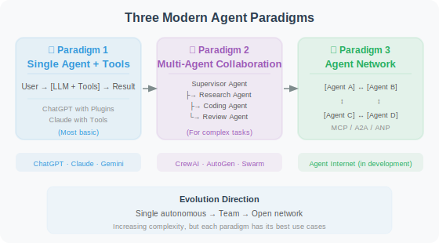
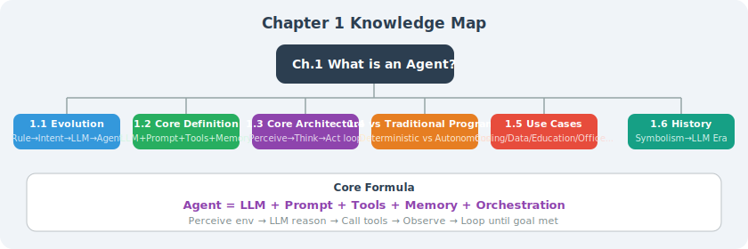

# The History of Intelligent Agents: From Symbolic AI to LLM-Driven Systems

> 📖 *"Without understanding history, you cannot truly understand the present. Every leap in Agent development stands on the shoulders of those who came before."*

## Why Study the History?

The concept of "Agent" was not invented in the LLM era. Since the birth of AI as a discipline in the 1950s, **how to build intelligent systems capable of autonomous action** has been a central research question. Understanding this history allows us to:

1. Understand the **academic origins** behind current Agent architecture design
2. Avoid "reinventing the wheel" — many classical methods are still in use
3. Anticipate the **future direction** of Agent technology


## Phase 1: Symbolic AI Agents (1950s–1980s)

### Turing's Prophecy

In 1950, Alan Turing published the landmark paper *"Computing Machinery and Intelligence"* [1], posing the fundamental question "Can machines think?" and designing the famous "Turing Test." This paper laid the philosophical foundation for the entire AI field.

### Early Expert Systems

Symbolism holds that the essence of intelligence is **symbol manipulation**: simulating human thinking through logical rule-based reasoning. Representative systems from this era include:

- **SHRDLU (1970)** [2]: A natural language understanding system developed by Terry Winograd at MIT, capable of understanding and executing instructions in a virtual world made of blocks (e.g., "Put the red block on top of the blue block"). It was the earliest system that could "understand language and execute actions" — in a sense, the most primitive Agent.

- **MYCIN (1976)** [3]: A medical diagnosis expert system developed at Stanford University, using approximately 600 rules to diagnose bacterial infections and recommend antibiotics. In clinical tests, MYCIN achieved a diagnostic accuracy of 69%, surpassing most non-specialist physicians at the time.

- **STRIPS (1971)** [4]: An automated planning system developed at SRI International, providing action planning capabilities for the robot Shakey. The "precondition-action-effect" planning paradigm proposed by STRIPS remains a foundational framework in AI planning to this day.

```
# STRIPS planning representation example (pseudocode)
# This "condition-action-effect" approach is still visible in today's Agent tool calling

Action: move_block(block, from, to)
  Preconditions:
    - on(block, from)        # Block is at the source location
    - clear(block)           # No other block on top of this block
    - clear(to)              # Target location is empty
  Effects:
    - on(block, to)          # Block moves to target location
    - clear(from)            # Source location becomes empty
    - NOT on(block, from)    # Block is no longer at source location
```

### Limitations of Symbolic AI

Symbolic AI Agents performed well in **closed domains**, but faced fundamental bottlenecks:

| Problem | Description |
|---------|-------------|
| Knowledge acquisition bottleneck | Rules must be manually written; the number grows exponentially |
| Brittleness | Completely fails when encountering situations not covered by rules |
| Lack of common sense | Cannot handle "self-evident" commonsense knowledge |
| Poor scalability | The larger the rule base, the harder it is to manage conflicts between rules |

> 💡 **Connection to modern Agents**: The symbolic "rules + reasoning" approach has not disappeared. In today's LLM Agents, the **System Prompt** is essentially a form of soft "rules," while **tool parameter constraints** are hard rules. The difference is that LLMs replace manually coded logical reasoning with statistical learning.

## Phase 2: Society of Mind and Distributed Intelligence (1980s–1990s)

### Minsky's "Society of Mind"

In 1986, Marvin Minsky, one of the founders of MIT's AI Lab, published *"The Society of Mind"* [5]. He proposed a revolutionary idea:

> **Intelligence is not the manifestation of a single capability, but the result of collaboration among a large number of "not-so-smart" small Agents (which Minsky called "agencies").**

The core ideas of this theory are:

- Each small Agent is responsible for only one simple thing (e.g., "recognize color," "calculate distance")
- Complex intelligent behavior **emerges** from the hierarchical collaboration of these small Agents
- Different small Agents compete and cooperate with each other

```python
# The idea of the Society of Mind is perfectly embodied in today's multi-agent systems
# The following is a simplified conceptual demonstration

class SimpleAgent:
    """A simple Agent that excels at only a single task"""
    def __init__(self, name: str, specialty: str):
        self.name = name
        self.specialty = specialty
    
    def can_handle(self, task: str) -> bool:
        return self.specialty.lower() in task.lower()
    
    def handle(self, task: str) -> str:
        return f"[{self.name}] Processing task related to {self.specialty}..."

class SocietyOfMind:
    """Society of Mind: collaboration among multiple simple Agents"""
    def __init__(self):
        self.agents = [
            SimpleAgent("Searcher", "search"),
            SimpleAgent("Analyst", "analyze"),
            SimpleAgent("Writer", "write"),
            SimpleAgent("Reviewer", "review"),
        ]
    
    def solve(self, task: str) -> list[str]:
        """Distribute the task to Agents that can handle it"""
        results = []
        for agent in self.agents:
            if agent.can_handle(task):
                results.append(agent.handle(task))
        return results

# When you define multiple roles in CrewAI or AutoGen,
# you are essentially practicing Minsky's "Society of Mind" theory
```

### BDI Architecture

In the 1990s, Rao and Georgeff proposed the **BDI (Belief-Desire-Intention) architecture** [6], which became the standard theoretical framework for rational Agents:

- **Belief**: The Agent's understanding of the world ("I believe traffic is currently congested")
- **Desire**: The goals the Agent wants to achieve ("I want to reach the office within 30 minutes")
- **Intention**: The action plan the Agent decides to take ("I choose to take the subway instead of driving")

```python
from dataclasses import dataclass, field

@dataclass
class BDIAgent:
    """BDI architecture Agent (conceptual demonstration)"""
    
    # Belief: Agent's understanding of the world
    beliefs: dict = field(default_factory=lambda: {
        "traffic": "congested",
        "weather": "rainy",
        "time": "08:30",
        "has_umbrella": True,
    })
    
    # Desire: Goals the Agent wants to achieve
    desires: list = field(default_factory=lambda: [
        "reach the office",
        "not be late",
        "not get wet",
    ])
    
    # Intention: The action plan the Agent has chosen
    intentions: list = field(default_factory=list)
    
    def deliberate(self):
        """Form intentions based on beliefs and desires (decision process)"""
        if self.beliefs["traffic"] == "congested":
            self.intentions.append("take the subway")
        if self.beliefs["weather"] == "rainy" and self.beliefs["has_umbrella"]:
            self.intentions.append("bring an umbrella")
        return self.intentions

# BDI ideas are reflected in today's Agents as:
# - Belief → Agent's context/memory (tool return values, conversation history)
# - Desire → User's task goal (task description in System Prompt)
# - Intention → Agent's planning result (the Thought part in ReAct)
```

> 💡 **Connection between BDI and ReAct**: Comparing the BDI architecture with the ReAct framework [7] reveals striking similarities — Thought in ReAct corresponds to BDI's Belief + reasoning process, Action corresponds to the execution of Intention, and Observation corresponds to the update of Belief. ReAct is essentially an implementation of the "deliberative reasoning" process in BDI architecture using LLMs.

## Phase 3: Connectionism and Deep Learning (1990s–2020s)

### From Statistical Learning to Neural Networks

In the late 1990s, with increasing computational power and data volume, **Connectionism** gradually became dominant. Its core idea: intelligence can emerge through the **connection and learning** of large numbers of simple computational units (neurons).

Key milestones:

- **1997 Deep Blue**: IBM's chess program defeated world champion Kasparov, but was still essentially search + heuristic algorithms
- **2012 AlexNet** [8]: Deep convolutional neural networks achieved breakthrough results in the ImageNet competition, launching the deep learning revolution
- **2016 AlphaGo** [9]: DeepMind's Go program defeated Lee Sedol, bringing deep reinforcement learning to mainstream attention. AlphaGo can be viewed as a complex "game Agent" — it can perceive the board state, reason about optimal moves, and execute stone placements

### Reinforcement Learning Agents

Deep Reinforcement Learning (Deep RL) brought a systematic mathematical framework to the Agent field. Agents are modeled as entities that take actions in an environment to maximize cumulative reward [10]:

```python
# The Agent-environment interaction loop in reinforcement learning
# This loop remains the core pattern in LLM Agents

class RLAgentLoop:
    """
    RL Agent loop:
    State → Action → Reward → New State → ...
    
    Compare with LLM Agent loop:
    Observation → Thought → Tool Call → Result → ...
    """
    
    def __init__(self, environment, policy):
        self.env = environment    # Environment
        self.policy = policy      # Policy (neural network in RL; LLM in LLM Agents)
    
    def run_episode(self, max_steps: int = 100):
        state = self.env.reset()               # Initial state
        total_reward = 0
        
        for step in range(max_steps):
            action = self.policy(state)        # Select action based on policy
            next_state, reward, done = self.env.step(action)  # Execute and observe
            total_reward += reward
            
            if done:
                break
            state = next_state
        
        return total_reward
```

> 💡 **From RL to LLM Agents**: The RL Agent loop (State→Action→Reward→NewState) maps directly to today's LLM Agent working loop (Observation→Thought→Action→Result). The only difference: RL Agent policies are driven by numerical neural networks, while LLM Agent policies are driven by natural language reasoning.

### Attention Is All You Need

In 2017, a Google research team published the landmark Transformer paper [11], proposing a sequence-to-sequence model based entirely on the attention mechanism. This paper directly gave rise to:

- **GPT series** (OpenAI): Generative pre-training + instruction fine-tuning
- **BERT** (Google): Bidirectional encoder, achieving breakthroughs on understanding tasks
- **T5, PaLM, LLaMA** and subsequent models

The Transformer architecture enabled model scale to efficiently expand to hundreds of billions of parameters, laying the technical foundation for the LLM era.

## Phase 4: LLM-Driven Agents (2023–Present)

### From Language Models to General-Purpose Agents

In 2022–2023, Large Language Models represented by ChatGPT/GPT-4 proved a key hypothesis: **sufficiently large language models can exhibit emergent higher-order cognitive capabilities such as reasoning, planning, and tool use** [12]. This fundamentally transformed how "Agents" are implemented:

| Dimension | Traditional Agent | LLM-Driven Agent |
|-----------|------------------|-----------------|
| Decision engine | Rules / Search / RL policy network | Large Language Model |
| Knowledge source | Manually coded knowledge base | World knowledge acquired during pre-training |
| Interaction mode | Structured input/output | Natural language |
| Generalization | Limited to training domain | Cross-domain generalization |
| Development cost | Requires extensive domain engineering | Build with Prompt + Tools |

### Landmark Milestones

**2023: Proof-of-Concept Phase**

- **ReAct** [7]: Unified reasoning and action into a single LLM interaction loop, becoming the foundational paradigm for Agents
- **AutoGPT** (March 2023): The first autonomous Agent project to attract global attention, proving LLMs can autonomously plan and execute complex tasks
- **Generative Agents** [13] (April 2023): Stanford's "AI Town" experiment — 25 Agents living, socializing, and forming memories autonomously in a virtual town, demonstrating emergent social behavior
- **Voyager** [14] (May 2023): NVIDIA's Minecraft Agent, capable of autonomous exploration, skill learning, and code writing, demonstrating lifelong learning capability

**2024: Engineering Phase**

- **Devin** (March 2024): Cognition AI's first "AI software engineer," achieving breakthroughs on SWE-bench
- **SWE-Agent** [15] (June 2024): Princeton's open-source code Agent, systematically designing the Agent-Computer Interface (ACI)
- **MCP Protocol** (November 2024): Anthropic releases Model Context Protocol, standardizing tool integration
- **A2A Protocol** (April 2024): Google releases Agent-to-Agent Protocol, standardizing inter-agent communication

**2025: Scaled Deployment Phase**

- **Claude Code / Codex CLI**: Agents enter developers' daily workflows
- **OpenAI Agents SDK**: Official Agent development framework
- **DeepSWE**: Open-source code Agent trained purely with RL, achieving 59% SOTA on SWE-bench Verified
- **Anthropic** publishes *Building Effective Agents* guide [16], emphasizing "simple composition over complex frameworks"
- **OpenAI** publishes *A Practical Guide to Building Agents* [17], providing complete engineering best practices

### Three Major Paradigms of Contemporary Agents

After years of rapid development, LLM-driven Agents have formed three main paradigms:



## Summary of the Development Arc

The entire history of intelligent agents can be connected by one clear thread:

> **From "writing rules" to "learning rules," to "replacing rules with language" — the source of Agent capabilities has been continuously abstracted and generalized.**

| Era | Paradigm | Source of Agent Capability | Representatives |
|-----|----------|--------------------------|----------------|
| 1950s–1980s | Symbolic AI | Manually written logical rules | MYCIN, SHRDLU, STRIPS |
| 1980s–1990s | Distributed Intelligence | Emergent multi-agent collaboration | BDI architecture, Society of Mind |
| 1990s–2020s | Connectionism | Data-driven statistical learning | AlphaGo, DQN |
| 2023–Present | LLM-Driven | Pre-trained knowledge + natural language reasoning | GPT-4 Agent, Claude Agent |

## Section Summary

- The concept of Agent spans over 70 years of AI history — far predating the LLM era
- Symbolic AI laid the foundation of "rules + reasoning"; BDI architecture defined the theoretical framework for rational Agents
- Deep learning and reinforcement learning provided data-driven learning capabilities
- The emergence of LLMs achieved a **qualitative transformation**: Agents gained **cross-domain general reasoning and planning capabilities** for the first time
- Understanding history helps us better design and build contemporary Agent systems

## 🤔 Thinking Exercises

1. What is the fundamental difference between MYCIN's 600 rules and today's Agent System Prompt?
2. How does Minsky's "Society of Mind" theory inspire the design of today's multi-agent frameworks?
3. How has the "planning" capability of Agents evolved from STRIPS to ReAct?
4. What do you think the next phase of Agents will look like?

---

## References

[1] TURING A M. Computing machinery and intelligence[J]. Mind, 1950, 59(236): 433-460.

[2] WINOGRAD T. Understanding Natural Language[M]. New York: Academic Press, 1972.

[3] SHORTLIFFE E H, BUCHANAN B G. A model of inexact reasoning in medicine[J]. Mathematical Biosciences, 1975, 23(3-4): 351-379.

[4] FIKES R E, NILSSON N J. STRIPS: A new approach to the application of theorem proving to problem solving[J]. Artificial Intelligence, 1971, 2(3-4): 189-208.

[5] MINSKY M. The Society of Mind[M]. New York: Simon & Schuster, 1986.

[6] RAO A S, GEORGEFF M P. BDI agents: From theory to practice[C]//Proceedings of the First International Conference on Multi-Agent Systems (ICMAS). 1995: 312-319.

[7] YAO S, ZHAO J, YU D, et al. ReAct: Synergizing reasoning and acting in language models[C]//ICLR. 2023.

[8] KRIZHEVSKY A, SUTSKEVER I, HINTON G E. ImageNet classification with deep convolutional neural networks[C]//NeurIPS. 2012: 1097-1105.

[9] SILVER D, HUANG A, MADDISON C J, et al. Mastering the game of Go with deep neural networks and tree search[J]. Nature, 2016, 529(7587): 484-489.

[10] SUTTON R S, BARTO A G. Reinforcement Learning: An Introduction[M]. 2nd ed. Cambridge: MIT Press, 2018.

[11] VASWANI A, SHAZEER N, PARMAR N, et al. Attention is all you need[C]//NeurIPS. 2017: 5998-6008.

[12] WEI J, TAY Y, BOMMASANI R, et al. Emergent abilities of large language models[J]. Transactions on Machine Learning Research, 2022.

[13] PARK J S, O'BRIEN J C, CAI C J, et al. Generative agents: Interactive simulacra of human behavior[C]//UIST. 2023.

[14] WANG G, XIE Y, JIANG Y, et al. Voyager: An open-ended embodied agent with large language models[R]. arXiv preprint arXiv:2305.16291, 2023.

[15] YANG J, JIMENEZ C E, WETTIG A, et al. SWE-agent: Agent-computer interfaces enable automated software engineering[R]. arXiv preprint arXiv:2405.15793, 2024.

[16] ANTHROPIC. Building effective agents[EB/OL]. 2024. https://www.anthropic.com/engineering/building-effective-agents.

[17] OPENAI. A practical guide to building agents[R]. 2025. https://cdn.openai.com/business-guides-and-resources/a-practical-guide-to-building-agents.pdf.

---

## 📚 Chapter 1 Summary

Congratulations on completing Chapter 1! 🎉 Let's review the core concepts learned:



In the next chapter, we will dive deep into the Agent's "brain" — the Large Language Model (LLM) — understanding how it works and how to communicate with it effectively.

*Let's keep moving forward! 🚀*
