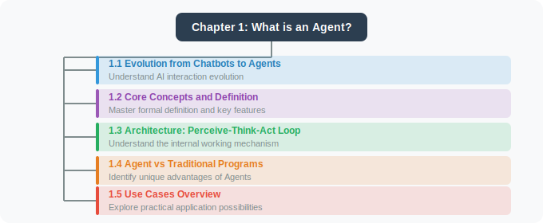

# Chapter 1: What is an Agent?

> 🎯 *"An Agent is not just a chatbot — it is an intelligent entity capable of autonomously perceiving its environment, making decisions, and taking action."*

## Chapter Overview

Welcome to the world of Agent development! In this chapter, we start from the most fundamental concepts to help you build a comprehensive understanding of AI Agents.

If you've used conversational AI like ChatGPT or Claude, you might wonder: "Aren't these Agents?" In fact, there is a fundamental difference. A true Agent doesn't just "talk" — it can "do things." It can use tools, access databases, call APIs, execute code, and even formulate plans and self-correct.

This chapter will help you understand these core differences and lay a solid conceptual foundation for the hands-on development ahead.

## 🎓 Learning Objectives

After completing this chapter, you will be able to:

- ✅ Clearly define what an AI Agent is
- ✅ Understand the evolution of Agents from simple chatbots to complex intelligent entities
- ✅ Master the core architecture of Agents: the Perception-Thinking-Action loop
- ✅ Distinguish the essential differences between Agents, traditional programs, and chatbots
- ✅ Understand typical application scenarios of Agents across various industries

## 📑 Chapter Structure

## ⏱️ Estimated Study Time

Approximately **45–60 minutes** (including thinking exercises)

## 💡 Prerequisites

- No background knowledge in AI or Agents required
- Basic understanding of programming concepts is helpful (but not required)

---

## 🔗 Learning Path

> **Recommended next steps**:
> - 👉 [Chapter 2: Development Environment Setup](../chapter_setup/README.md) — Set up your tools and get started
> - 👉 [Chapter 3: LLM Fundamentals](../chapter_llm/README.md) — Understand the Agent's "brain"

---

*Ready? Let's start with the history and origins of Agents…*