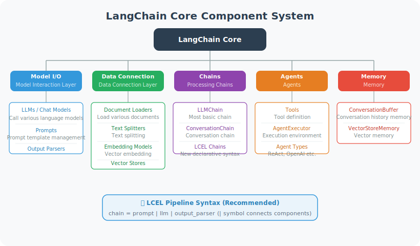

# LangChain Architecture Overview

LangChain is a modular LLM application development framework. Its core design philosophy is to **combine various components through standardized interfaces**, allowing developers to focus on business logic.

## Core Component System



## Architecture Evolution: From Monolith to Multi-Package

Since its release in late 2022, LangChain has undergone three major architectural transformations. Understanding these changes helps you read tutorials from different eras and avoid the pitfall of "deprecated APIs."

| Phase | Version | Core Change | Key Characteristics |
|-------|---------|-------------|---------------------|
| **v0.0.x (2022.11–2023.12)** | Monolithic package | All features in one `langchain` package | `from langchain.llms import OpenAI` |
| **v0.1.x (2024.01–2024.06)** | Multi-package architecture | Split into `langchain-core`, `langchain-community` | Dual import paths coexist; old API marked deprecated |
| **v0.2.x (2024.07–2024.12)** | LCEL-first | LCEL becomes the standard paradigm; legacy chains like `LLMChain` removed | Pydantic V2 support; Python 3.8 dropped |
| **v0.3.x (2025.01–present)** | Stable phase | Deprecated APIs fully removed; integration packages released independently | `langchain-openai`, `langchain-anthropic`, etc. with independent versioning |

### Multi-Package Design Philosophy

LangChain 0.3's package structure follows the "layered dependency" principle [1]:

```
langchain-core          ← Stable core (Runnable protocol, message types, Prompt templates)
    ↑                       Common foundation for all packages; almost no breaking changes
    |
langchain               ← Orchestration layer (Chain composition, Agent logic, callback system)
    ↑                       Provides high-level abstractions; depends on core
    |
langchain-openai         ← Integration packages (concrete implementations for each LLM/tool provider)
langchain-anthropic          Each integration released independently with its own version number
langchain-community          Community-contributed integrations collected in community
```

**Design rationale**:

- **`langchain-core`**: Only defines interfaces and protocols (e.g., `Runnable`, `BaseChatModel`, `BaseTool`), ensuring interface stability. When writing custom components, you only need to depend on core.
- **`langchain`**: Provides orchestration capabilities — how to combine multiple Runnables into a Chain, how to build Agents. This layer handles "glue logic."
- **Integration packages**: One package per LLM provider (`langchain-openai`, `langchain-anthropic`, `langchain-google-genai`), each released independently so that one provider's API changes don't affect other users.

> 💡 **Best practice**: For new projects, always use split-package imports like `from langchain_openai import ChatOpenAI`. Do not use `from langchain.chat_models import ChatOpenAI` (this is a compatibility alias for the old path, already marked deprecated).

### The Runnable Protocol

Runnable is the **most fundamental abstraction** introduced in LangChain 0.2+ — all components (LLM, Prompt, Parser, Tool, Retriever) implement a unified Runnable interface [2]. This means they share a completely consistent set of calling methods:

```python
from langchain_core.runnables import Runnable

# All Runnables support the following methods:
# runnable.invoke(input)         ← Synchronous call, returns a single result
# runnable.ainvoke(input)        ← Asynchronous call
# runnable.stream(input)         ← Streaming output, returns a generator
# runnable.astream(input)        ← Async streaming
# runnable.batch([input1, ...])  ← Batch call
# runnable.abatch([input1, ...]) ← Async batch

# Runnable composition: connect with | pipe operator (i.e., LCEL)
chain = prompt | llm | parser
# Equivalent to: chain = RunnableSequence(prompt, llm, parser)

# Parallel execution: RunnableParallel
from langchain_core.runnables import RunnableParallel

parallel = RunnableParallel(
    summary=summary_chain,
    translation=translate_chain,
)
# Executes both chains on the same input simultaneously,
# returns {"summary": ..., "translation": ...}
```

**Why is the Runnable protocol so important?**

1. **Composability**: Any Runnable can be chained with `|` or parallelized with `RunnableParallel`, building arbitrarily complex processing pipelines
2. **Streaming by default**: The `.stream()` method gives all components streaming output support — critical for Agent applications that need real-time responses
3. **Observability**: Built-in callback system (`callbacks`) can track the input/output of each Runnable; combined with LangSmith for full-chain monitoring
4. **Type safety**: Each Runnable has explicit `input_schema` and `output_schema` (based on Pydantic), supporting compile-time type checking

### LangChain vs. Comparable Frameworks

When choosing a development framework, understanding the positioning of different frameworks helps make a reasonable choice:

| Framework | Core Positioning | Best For | Community Activity |
|-----------|-----------------|----------|--------------------|
| **LangChain** | General LLM orchestration | Enterprise apps requiring many integrations | ⭐⭐⭐⭐⭐ |
| **LlamaIndex** | Data connection + RAG | Document Q&A, knowledge bases | ⭐⭐⭐⭐ |
| **Haystack** | Search + RAG Pipeline | Search-augmented applications | ⭐⭐⭐ |
| **Semantic Kernel** | Microsoft ecosystem integration | Azure + C# projects | ⭐⭐⭐ |
| **Native API** | No framework dependency | Simple prototypes, maximum performance | — |

> 📌 **Selection advice**: If you need to quickly integrate multiple LLMs and tools, LangChain's integration ecosystem is its biggest advantage. If your use case is primarily RAG, LlamaIndex's document processing capabilities are more specialized. If you want maximum control, use the native API directly. In this book's hands-on projects, we choose the LangChain + LangGraph combination because it performs most balanced in orchestration flexibility and community support.

---

## Quick Start

```python
# pip install langchain langchain-openai langchain-community

from langchain_openai import ChatOpenAI
from langchain_core.messages import HumanMessage, SystemMessage
from langchain_core.prompts import ChatPromptTemplate
from langchain_core.output_parsers import StrOutputParser

# ============================
# 1. Basic Model Call
# ============================

llm = ChatOpenAI(model="gpt-4o-mini", temperature=0.7)

# Direct call
response = llm.invoke([HumanMessage(content="Hello!")])
print(response.content)

# ============================
# 2. Prompt Templates
# ============================

# ChatPromptTemplate: recommended approach
prompt = ChatPromptTemplate.from_messages([
    ("system", "You are a {role}, specializing in {domain}."),
    ("user", "{question}")
])

# Format
formatted = prompt.format_messages(
    role="Python expert",
    domain="machine learning",
    question="How do I train a classifier with sklearn?"
)

response = llm.invoke(formatted)
print(response.content)

# ============================
# 3. Output Parsers
# ============================

from langchain_core.output_parsers import JsonOutputParser
from pydantic import BaseModel, Field

class ProductInfo(BaseModel):
    name: str = Field(description="Product name")
    price: float = Field(description="Price")
    category: str = Field(description="Category")

parser = JsonOutputParser(pydantic_object=ProductInfo)

product_prompt = ChatPromptTemplate.from_messages([
    ("system", "Extract product information from the user description and return it in JSON format.\n{format_instructions}"),
    ("user", "{description}")
])

# Inject format instructions
formatted = product_prompt.format_messages(
    format_instructions=parser.get_format_instructions(),
    description="A Bluetooth headset priced at $29.99"
)

response = llm.invoke(formatted)
product = parser.parse(response.content)
print(f"Product: {product.name}, Price: {product.price}")

# ============================
# 4. Conversation Management
# ============================

from langchain_core.chat_history import InMemoryChatMessageHistory
from langchain_core.runnables.history import RunnableWithMessageHistory

# Store chat history
store = {}

def get_session_history(session_id: str):
    if session_id not in store:
        store[session_id] = InMemoryChatMessageHistory()
    return store[session_id]

chat_prompt = ChatPromptTemplate.from_messages([
    ("system", "You are a helpful assistant."),
    ("placeholder", "{chat_history}"),
    ("human", "{input}")
])

chain = chat_prompt | llm | StrOutputParser()

# Chain with history
with_history = RunnableWithMessageHistory(
    chain,
    get_session_history,
    input_messages_key="input",
    history_messages_key="chat_history"
)

# Multi-turn conversation
session = {"configurable": {"session_id": "user_001"}}

reply1 = with_history.invoke({"input": "My name is Alice"}, config=session)
reply2 = with_history.invoke({"input": "What's my name?"}, config=session)

print(reply1)
print(reply2)  # Should remember "Alice"
```

## Version Notes

LangChain evolves rapidly and is currently in the **0.3.x** stable version. Key version differences:

```python
# Old-style imports (before langchain 0.1, deprecated)
# from langchain.llms import OpenAI
# from langchain.chains import LLMChain

# New-style imports (recommended, langchain >= 0.3)
from langchain_openai import ChatOpenAI       # Import from sub-package
from langchain_core.prompts import ChatPromptTemplate  # core is the stable foundation

# LCEL (LangChain Expression Language) is the standard way to build chains
chain = prompt | llm | StrOutputParser()  # Pipe syntax

# LangChain 0.3 key changes:
# - Deprecated APIs from langchain 0.1 fully removed
# - Integrations in langchain-community gradually migrated to independent packages
# - Recommended to use LangGraph for complex Agent workflows
# - Built-in Pydantic V2 support

# Check version
import langchain
print(langchain.__version__)  # Should be 0.3.x
```

---

## Summary

LangChain's five core elements: models, prompts, output parsers, chains, and Agents.
Recommended: use LCEL pipe syntax (`|` operator), which is the future direction of LangChain.

---

*Next section: [12.2 Chain: Building Processing Pipelines](./02_chains.md)*

---

## References

[1] LangChain Team. LangChain Architecture Overview. https://python.langchain.com/docs/concepts/architecture, 2025.

[2] LangChain Team. Runnable Interface. https://python.langchain.com/docs/concepts/runnables, 2025.