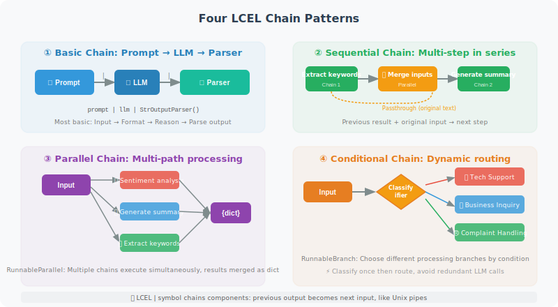

# Chain: Building Processing Pipelines

A Chain is a core concept in LangChain — it connects multiple processing steps into a reusable pipeline. You can think of a Chain as an assembly line: raw materials (user input) enter from one end, pass through multiple processing stations (prompt templates, LLM, parsers, etc.), and exit from the other end as finished products (structured results).

In LangChain, Chains are built using **LCEL (LangChain Expression Language)** syntax. The core symbol of LCEL is `|` (the pipe operator), which works similarly to pipes in Unix command lines — the output of the previous component automatically becomes the input of the next.

This section walks you through four common Chain patterns to master the core usage of LCEL.



## LCEL: Modern Chain Syntax

### Basic Setup

First, import the necessary modules. The core building blocks of LCEL include: `ChatPromptTemplate` (prompt template), `ChatOpenAI` (LLM), `StrOutputParser` (string parser), and various `Runnable` components.

```python
from langchain_openai import ChatOpenAI
from langchain_core.prompts import ChatPromptTemplate
from langchain_core.output_parsers import StrOutputParser, JsonOutputParser
from langchain_core.runnables import RunnableParallel, RunnableLambda, RunnablePassthrough
from operator import itemgetter

llm = ChatOpenAI(model="gpt-4o-mini")

# ============================
# Basic Chain: Prompt → LLM → Parse
# ============================

# Translation chain
translate_prompt = ChatPromptTemplate.from_messages([
    ("system", "You are a professional translator. Translate the text into {target_lang}."),
    ("human", "{text}")
])

translate_chain = translate_prompt | llm | StrOutputParser()

result = translate_chain.invoke({
    "target_lang": "French",
    "text": "Artificial intelligence is changing the world"
})
print(result)

# ============================
# Sequential Chain: Step-by-step processing
# ============================

# A sequential chain connects multiple steps — the output of one step becomes the input of the next.
# This example is a two-step process: "first extract keywords, then generate a summary combining the original text."
# Key challenge: subsequent steps need to access both the previous step's result and the original input.
# Solution: use RunnableParallel to simultaneously execute extraction and pass the original input.
keyword_prompt = ChatPromptTemplate.from_messages([
    ("system", "Extract 3 keywords from the text, separated by commas. Output only the keywords."),
    ("human", "{text}")
])

summary_prompt = ChatPromptTemplate.from_messages([
    ("system", "Based on the following keywords and original text, generate a concise summary."),
    ("human", "Keywords: {keywords}\nOriginal text: {original_text}")
])

# Approach: use RunnablePassthrough to pass the original input
analysis_chain = (
    RunnableParallel(
        keywords=keyword_prompt | llm | StrOutputParser(),
        original_text=RunnablePassthrough()
    )
    | RunnableLambda(lambda x: {
        "keywords": x["keywords"],
        "original_text": x["original_text"]["text"]
    })
    | summary_prompt | llm | StrOutputParser()
)

result = analysis_chain.invoke({"text": "Python is a powerful programming language widely used in AI development"})
print(result)

# ============================
# Parallel Chain: Execute multiple tasks simultaneously
# ============================

# RunnableParallel allows multiple chains to run simultaneously, ideal for scenarios
# where you need to perform multiple independent analyses on the same input.
# Each branch executes independently without interfering with others,
# and the final results are merged into a dictionary. This is much faster than sequential calls.

def analyze_text_parallel(text: str) -> dict:
    """Perform sentiment analysis and summary generation simultaneously"""
    
    sentiment_prompt = ChatPromptTemplate.from_messages([
        ("system", "Perform sentiment analysis on the text. Return only: positive/negative/neutral"),
        ("human", "{text}")
    ])
    
    summary_prompt = ChatPromptTemplate.from_messages([
        ("system", "Summarize the main content of the text in one sentence."),
        ("human", "{text}")
    ])
    
    keywords_prompt = ChatPromptTemplate.from_messages([
        ("system", "Extract 5 keywords from the text, separated by commas."),
        ("human", "{text}")
    ])
    
    # Execute in parallel
    parallel_chain = RunnableParallel(
        sentiment=sentiment_prompt | llm | StrOutputParser(),
        summary=summary_prompt | llm | StrOutputParser(),
        keywords=keywords_prompt | llm | StrOutputParser()
    )
    
    return parallel_chain.invoke({"text": text})

result = analyze_text_parallel("The new version released today fixed many bugs and significantly improved performance!")
print(f"Sentiment: {result['sentiment']}")
print(f"Summary: {result['summary']}")
print(f"Keywords: {result['keywords']}")

# ============================
# Conditional Chain: Route based on conditions
# ============================

# A conditional chain (RunnableBranch) selects different processing branches based on input characteristics.
# Typical scenario: a customer service system routes to different specialized chains
# based on user intent (technical issue, business inquiry, complaint, etc.).
#
# ⚠️ Performance note: RunnableBranch checks each condition function sequentially.
# If a condition function calls an LLM, you should classify once and cache the result
# to avoid repeated LLM calls for each condition branch (see the optimized implementation below).

from langchain_core.runnables import RunnableBranch

def classify_intent(input_dict: dict) -> str:
    """Classify user intent"""
    text = input_dict.get("text", "")
    
    classify_prompt = ChatPromptTemplate.from_messages([
        ("system", "Determine the intent type of the following text. Return only: technical issue/business inquiry/complaint/other"),
        ("human", "{text}")
    ])
    
    intent = (classify_prompt | llm | StrOutputParser()).invoke({"text": text})
    return intent.strip()

# Different intents map to different processing chains
tech_chain = ChatPromptTemplate.from_messages([
    ("system", "You are a technical support engineer. Provide detailed technical answers."),
    ("human", "{text}")
]) | llm | StrOutputParser()

business_chain = ChatPromptTemplate.from_messages([
    ("system", "You are a business consultant. Provide professional business advice."),
    ("human", "{text}")
]) | llm | StrOutputParser()

complaint_chain = ChatPromptTemplate.from_messages([
    ("system", "You are a customer relations manager. Handle complaints with patience and empathy."),
    ("human", "{text}")
]) | llm | StrOutputParser()

default_chain = ChatPromptTemplate.from_messages([
    ("system", "You are a general customer service assistant."),
    ("human", "{text}")
]) | llm | StrOutputParser()

# Routing chain
# Note: classify once with RunnableLambda and cache the result in the dict to avoid multiple LLM calls
branch_chain = (
    RunnableLambda(lambda x: {**x, "_intent": classify_intent(x)})
    | RunnableBranch(
        (lambda x: "technical issue" in x["_intent"], tech_chain),
        (lambda x: "business inquiry" in x["_intent"], business_chain),
        (lambda x: "complaint" in x["_intent"], complaint_chain),
        default_chain  # Default branch
    )
)

# Test
response = branch_chain.invoke({"text": "The API is returning a 500 error, what should I do?"})
print(response)
```

## Streaming Output Chains

In real applications, users don't want to wait for the LLM to generate a complete response before seeing any content. Streaming output lets responses appear character by character (similar to ChatGPT's typing effect), greatly improving user experience. All chains built with LCEL natively support streaming output without any additional code changes.

```python
# LCEL natively supports streaming output
async def stream_response(question: str):
    """Streaming output"""
    chain = ChatPromptTemplate.from_messages([
        ("system", "You are a helpful assistant."),
        ("human", "{question}")
    ]) | llm | StrOutputParser()
    
    print("Answer: ", end="", flush=True)
    async for chunk in chain.astream({"question": question}):
        print(chunk, end="", flush=True)
    print()  # New line

import asyncio
asyncio.run(stream_response("What is quantum entanglement?"))
```

---

## Summary

LCEL (`|` pipe syntax) is LangChain's core construction method:
- **Sequential chain**: pass results between steps
- **Parallel chain**: `RunnableParallel` executes simultaneously
- **Conditional chain**: `RunnableBranch` routes by condition
- **Streaming output**: all LCEL chains support `.stream()` and `.astream()`

---

*Next section: [12.3 Building Agents with LangChain](./03_langchain_agents.md)*