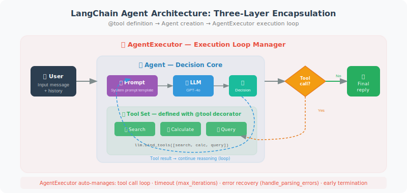

# Building Agents with LangChain

In previous chapters, we built Agents "by hand" — writing tool Schemas ourselves, managing the message loop ourselves, handling tool calls ourselves. While this helps understand the underlying principles, it's too cumbersome for real projects. LangChain provides standardized tool interfaces and AgentExecutor, greatly simplifying Agent development.

What LangChain does, in essence, is encapsulate the "boilerplate code" we previously wrote by hand into reusable components:

- **Tool definition**: no need to write JSON Schema by hand; use the `@tool` decorator or inherit from `BaseTool`
- **Agent creation**: no need to write the execution loop yourself; `create_openai_tools_agent` handles it in one line
- **Execution management**: `AgentExecutor` automatically handles the tool call loop, timeout control, and error recovery



## LangChain Tool Definition

LangChain provides two ways to define tools:

**Method 1: `@tool` decorator** — the simplest and most direct. You just write a regular Python function, add the `@tool` decorator, and LangChain automatically extracts parameter information from the function signature and docstring to generate the Schema. The docstring becomes the tool's description — so make sure to write it clearly.

**Method 2: Inherit from `BaseTool`** — use this when you need more complex logic, such as when the tool needs to maintain internal state, requires async execution, or needs custom parameter validation.

```python
from langchain_core.tools import tool, BaseTool
from langchain_openai import ChatOpenAI
from langchain.agents import AgentExecutor, create_openai_tools_agent
# ⚠️ Note: AgentExecutor is LangChain's legacy Agent solution.
# LangChain officially recommends using LangGraph to build Agents for new projects (see Chapter 13).
# AgentExecutor is used here for quick conceptual understanding.
from langchain_core.prompts import ChatPromptTemplate, MessagesPlaceholder
import math

# ============================
# Method 1: @tool decorator (simplest)
# ============================

@tool
def calculate(expression: str) -> str:
    """
    Evaluate a mathematical expression.
    Supports basic operations and math module functions (sqrt, sin, cos, log, etc.).
    Example: calculate("sqrt(144) + 2 * 3")
    """
    try:
        safe_env = {k: getattr(math, k) for k in dir(math) if not k.startswith('_')}
        result = eval(expression, {"__builtins__": {}}, safe_env)
        return f"{expression} = {result}"
    except Exception as e:
        return f"Calculation error: {e}"

@tool
def search_knowledge(query: str) -> str:
    """
    Search for relevant information in the knowledge base.
    Suitable for querying product information, policy documents, FAQs, and other internal materials.
    """
    # Simulate knowledge base query
    knowledge_base = {
        "refund": "Refund policy: refunds accepted within 7 days of purchase; original packaging required.",
        "shipping": "Shipping time: 1–3 business days; delayed during holidays.",
        "warranty": "Warranty policy: hardware products come with a 1-year warranty.",
    }
    
    for keyword, info in knowledge_base.items():
        if keyword in query.lower():
            return info
    
    return "No relevant information found in the knowledge base."

@tool  
def get_order_status(order_id: str) -> str:
    """
    Query order status.
    Input: order number (format: ORD-XXXXXXXX)
    Returns: current status and shipping information for the order
    """
    # Simulate order query
    mock_orders = {
        "ORD-12345678": "Shipped. Expected delivery tomorrow. Tracking number: SF1234567890",
        "ORD-87654321": "Processing. Expected to ship tomorrow.",
    }
    
    return mock_orders.get(order_id, f"Order {order_id} not found. Please check the order number.")

# ============================
# Method 2: Inherit BaseTool (more flexible)
# ============================

from typing import Type
from pydantic import BaseModel, Field

class WeatherInput(BaseModel):
    city: str = Field(description="City name")
    unit: str = Field(default="celsius", description="Temperature unit: celsius or fahrenheit")

class WeatherTool(BaseTool):
    name: str = "get_weather"
    description: str = "Get current weather information for a specified city"
    args_schema: Type[BaseModel] = WeatherInput
    
    def _run(self, city: str, unit: str = "celsius") -> str:
        """Synchronous execution"""
        # Simulate weather data
        weather = {"New York": 15, "Los Angeles": 22, "Chicago": 10}
        temp = weather.get(city, 18)
        
        if unit == "fahrenheit":
            temp = temp * 9/5 + 32
            unit_str = "°F"
        else:
            unit_str = "°C"
        
        return f"{city}: {temp}{unit_str}, Sunny"
    
    async def _arun(self, city: str, unit: str = "celsius") -> str:
        """Async execution (can call async APIs)"""
        return self._run(city, unit)  # Simply calls the sync version here

# ============================
# Create Agent
# ============================

tools = [calculate, search_knowledge, get_order_status, WeatherTool()]

# System prompt
prompt = ChatPromptTemplate.from_messages([
    ("system", """You are an intelligent customer service assistant.
    
You can use the following tools to help users:
- calculate: mathematical calculations
- search_knowledge: query product policies and FAQs
- get_order_status: query order status
- get_weather: get weather information

When a question requires a tool, use the tool first, then provide your answer."""),
    MessagesPlaceholder(variable_name="chat_history"),
    ("human", "{input}"),
    MessagesPlaceholder(variable_name="agent_scratchpad"),  # Agent reasoning space
])

llm = ChatOpenAI(model="gpt-4o", temperature=0)

# Create OpenAI Tools Agent
agent = create_openai_tools_agent(llm, tools, prompt)

# AgentExecutor: responsible for the run loop
agent_executor = AgentExecutor(
    agent=agent,
    tools=tools,
    verbose=True,  # Print reasoning process
    max_iterations=5,
    return_intermediate_steps=True  # Return intermediate steps
)

# ============================
# Use the Agent
# ============================

# Single conversation
result = agent_executor.invoke({
    "input": "Please check the status of order ORD-12345678, and what's the weather like in New York today?",
    "chat_history": []
})
print(result["output"])

# Multi-turn conversation with history
from langchain_core.messages import HumanMessage, AIMessage

chat_history = []

def chat_with_agent(user_message: str) -> str:
    result = agent_executor.invoke({
        "input": user_message,
        "chat_history": chat_history
    })
    
    # Update history
    chat_history.extend([
        HumanMessage(content=user_message),
        AIMessage(content=result["output"])
    ])
    
    return result["output"]

# Multi-turn conversation test
print(chat_with_agent("I'd like to know about the refund policy"))
print(chat_with_agent("If I bought it yesterday, can I still get a refund?"))  # Should remember context
```

A few key concepts in the code above are worth understanding:

- **`MessagesPlaceholder("agent_scratchpad")`**: This is the Agent's "reasoning space" — LangChain fills in the intermediate steps of tool calls (which tools were called, what results were returned) here, so the model can see its previous reasoning process.
- **`AgentExecutor`**: It is the "driver" of the entire Agent loop. Setting `verbose=True` lets you see the complete reasoning process in the terminal, which is useful for debugging.
- **`return_intermediate_steps=True`**: Allows us to see in the final result which intermediate steps the Agent went through — which tools were called, what parameters were passed, and what results were returned.

## Custom Agent Execution Strategy

In production environments, you need finer control over the Agent's execution behavior. The following parameters are the most commonly used:

- `max_iterations`: prevents the Agent from getting stuck in an infinite loop (e.g., the model repeatedly calling the same tool)
- `max_execution_time`: sets the total timeout to protect user experience
- `handle_parsing_errors`: automatically recovers when model output format is abnormal, instead of throwing an error directly
- `early_stopping_method`: stopping strategy when limits are exceeded — `"generate"` lets the model generate the best possible answer based on current information

```python
# Control Agent execution behavior
agent_executor = AgentExecutor(
    agent=agent,
    tools=tools,
    max_iterations=10,          # Maximum loop count
    max_execution_time=30,      # Maximum execution time (seconds)
    handle_parsing_errors=True, # Automatically handle parsing errors
    early_stopping_method="generate",  # How to stop when limits are exceeded
    verbose=True
)
```

---

## Summary

Key components of a LangChain Agent:
- `@tool` decorator: the fastest way to define tools
- `BaseTool`: use when complex logic is needed
- `create_openai_tools_agent`: creates an Agent using OpenAI Function Calling
- `AgentExecutor`: runs the Agent loop and handles tool calls

---

*Next section: [12.4 LCEL: LangChain Expression Language](./04_lcel.md)*