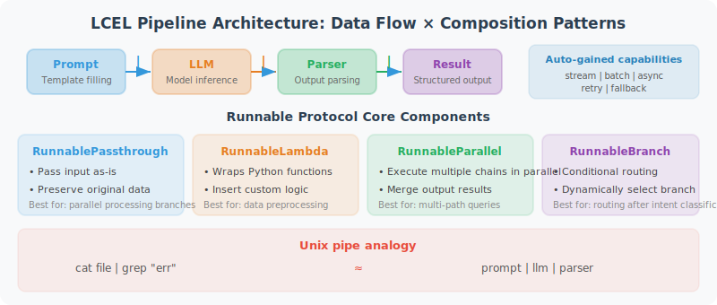

# LCEL: LangChain Expression Language

LCEL (LangChain Expression Language) is LangChain's core construction language. It uses the `|` symbol to connect components into processing pipelines, resulting in concise yet powerful code.



If you've used Unix pipes (`cat file.txt | grep "error" | wc -l`), LCEL follows exactly the same idea: data flows from left to right through a series of processing components, with each component receiving the previous one's output as its own input. In LLM applications, a typical pipeline is: `prompt template | LLM | output parser` — the template fills in variables to generate a complete prompt, the LLM generates a response, and the parser extracts structured results.

The core abstraction of LCEL is the **Runnable protocol** — all components (LLM, Prompt, Parser, Tool, Retriever) implement a unified interface (`invoke`, `stream`, `batch`, etc.), so any component can be freely combined with others. The benefit of this design is: once you write a chain, you automatically get streaming output, async calls, and batch processing capabilities without any additional coding.

## LCEL Core Concepts

The code below demonstrates LCEL's core components and usage patterns. Pay attention to the following key points:

- **`|` operator**: This is the soul of LCEL. Behind the scenes it calls Python's `__or__` method, chaining two Runnables into a new Runnable.
- **`RunnablePassthrough`**: Passes the input through unchanged. Commonly used when you need to preserve the original data while processing it.
- **`RunnableLambda`**: Wraps a regular Python function as a Runnable, allowing you to insert custom logic into a pipeline.
- **`RunnableParallel`**: Executes multiple Runnables in parallel and merges the results into a dictionary — very common in RAG (simultaneously retrieving context and passing the question).

```python
from langchain_core.runnables import (
    RunnablePassthrough,
    RunnableParallel,
    RunnableLambda,
    RunnableBranch
)
from langchain_openai import ChatOpenAI
from langchain_core.prompts import ChatPromptTemplate
from langchain_core.output_parsers import StrOutputParser

llm = ChatOpenAI(model="gpt-4o-mini")

# ============================
# The Runnable Protocol in LCEL
# ============================

# All LCEL components implement the Runnable interface, supporting:
# .invoke(input)         → Synchronous call
# .ainvoke(input)        → Async call
# .stream(input)         → Streaming output
# .astream(input)        → Async streaming
# .batch(inputs)         → Batch processing
# .abatch(inputs)        → Async batch processing

# Basic chain
chain = (
    ChatPromptTemplate.from_messages([("human", "{question}")])
    | llm
    | StrOutputParser()
)

# Four calling methods
result = chain.invoke({"question": "What is Python?"})        # Synchronous
results = chain.batch([{"question": "Q1"}, {"question": "Q2"}])  # Batch

# ============================
# RunnablePassthrough: Pass input through
# ============================

# Scenario: need to preserve the original input while processing
from langchain_core.runnables import RunnablePassthrough

# Note: RunnablePassthrough() passes the entire input dict, not a single field.
# If the input is {"question": "xxx"}, RunnablePassthrough() returns {"question": "xxx"}.
# Use itemgetter("question") to extract a specific field.

from operator import itemgetter

rag_chain = (
    RunnableParallel({
        "context": lambda x: "Document content..." + x["question"],  # Simulate retrieval
        "question": itemgetter("question")  # Correct: extract the value of the question field
    })
    | ChatPromptTemplate.from_messages([
        ("system", "Answer based on the following context: {context}"),
        ("human", "{question}")
    ])
    | llm
    | StrOutputParser()
)

# ============================
# RunnableLambda: Wrap regular functions
# ============================

import json

def extract_json(text: str) -> dict:
    """Extract JSON from text"""
    start = text.find("{")
    end = text.rfind("}") + 1
    if start != -1 and end > 0:
        return json.loads(text[start:end])
    return {}

json_chain = (
    ChatPromptTemplate.from_messages([
        ("system", "Convert the user description into a JSON-formatted task with title and priority fields."),
        ("human", "{description}")
    ])
    | llm
    | StrOutputParser()
    | RunnableLambda(extract_json)  # Wrap regular function as Runnable
)

result = json_chain.invoke({"description": "Team meeting tomorrow afternoon, very important"})
print(result)  # {'title': 'Team meeting', 'priority': 'high'}

# ============================
# Using itemgetter to extract fields
# ============================

from operator import itemgetter

# Field routing for multi-input chains
multi_input_chain = (
    {
        "language": itemgetter("language"),
        "code": itemgetter("code"),
        "task": itemgetter("task")
    }
    | ChatPromptTemplate.from_messages([
        ("system", "You are a {language} code expert. Help the user {task}."),
        ("human", "Code:\n{code}")
    ])
    | llm
    | StrOutputParser()
)

result = multi_input_chain.invoke({
    "language": "Python",
    "code": "def add(a, b): return a + b",
    "task": "add type annotations and comments"
})
print(result)

# ============================
# Chain Composition and Reuse
# ============================

# Define reusable sub-chains
summarize_chain = (
    ChatPromptTemplate.from_messages([
        ("system", "Compress the text into a summary of 50 words or fewer."),
        ("human", "{text}")
    ])
    | llm
    | StrOutputParser()
)

translate_chain = (
    ChatPromptTemplate.from_messages([
        ("system", "Translate the text into French."),
        ("human", "{text}")
    ])
    | llm
    | StrOutputParser()
)

# Compose: summarize first, then translate
summarize_then_translate = (
    summarize_chain
    | RunnableLambda(lambda x: {"text": x})
    | translate_chain
)

result = summarize_then_translate.invoke({
    "text": "LangChain is a powerful framework that provides all the tools needed to build LLM applications..."
})
print(result)
```

## Error Handling and Retry

In production environments, LLM API calls may occasionally fail due to network jitter, rate limiting, and other reasons. LCEL has two built-in recovery mechanisms:

- **`with_retry`**: Automatically retries failed calls with support for exponential backoff (increasing intervals between retries), avoiding cascading failures during API rate limiting.
- **`with_fallbacks`**: When the primary chain fails, automatically switches to a backup chain — for example, the primary model uses GPT-4o and the backup uses GPT-3.5-turbo, ensuring service availability.

```python
from langchain_core.runnables import RunnableRetry
from langchain_core.exceptions import OutputParserException

# Add retry logic
resilient_chain = (
    ChatPromptTemplate.from_messages([("human", "{input}")])
    | llm.with_retry(
        stop_after_attempt=3,
        wait_exponential_jitter=True
    )
    | StrOutputParser()
)

# Add fallback chain
fallback_chain = (
    ChatPromptTemplate.from_messages([("human", "{input}")])
    | ChatOpenAI(model="gpt-4o-mini")  # Backup model
    | StrOutputParser()
)

chain_with_fallback = resilient_chain.with_fallbacks([fallback_chain])
```

---

## Summary

Key advantages of LCEL:
- **Unified interface**: all components are Runnables, supporting the same calling methods
- **Declarative**: code is documentation, clearly expressing data flow
- **Built-in support**: automatically supports streaming, async, and batch processing
- **Composability**: sub-chains can be freely combined and reused

---

*Next section: [12.5 Practice: Multi-Function Customer Service Agent](./05_practice_customer_service.md)*