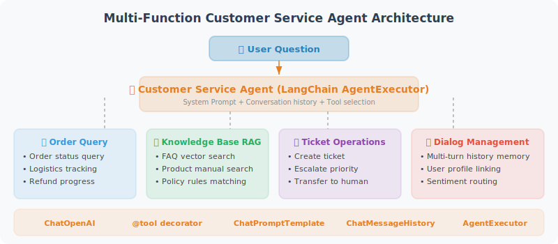

# Practice: Multi-Function Customer Service Agent

Combining all LangChain features, we build a complete multi-function customer service Agent system.



## Complete Implementation

```python
# customer_service_agent.py
from langchain_openai import ChatOpenAI
from langchain_core.tools import tool
from langchain_core.prompts import ChatPromptTemplate, MessagesPlaceholder
from langchain.agents import AgentExecutor, create_openai_tools_agent  # legacy; new projects should use LangGraph
from langchain_core.messages import HumanMessage, AIMessage
from langchain_community.chat_message_histories import ChatMessageHistory
from langchain_core.runnables.history import RunnableWithMessageHistory
from rich.console import Console
from dotenv import load_dotenv
import json

load_dotenv()
console = Console()

# ============================
# Tool Definitions
# ============================

@tool
def search_faq(query: str) -> str:
    """Search the FAQ knowledge base. Suitable for answering questions about product usage, policies, and processes."""
    faq_data = {
        "refund": "Refund policy: no-questions-asked refunds within 7 days; original packaging required. Contact customer service to apply.",
        "shipping": "Standard shipping: 1–3 business days; delayed during holidays. Express shipping available.",
        "warranty": "Products purchased through official channels come with a 1-year official warranty. Screen damage is not covered.",
        "discount": "New users get 20% off their first order. Members can use points to offset payment.",
        "payment": "Accepts credit cards, PayPal, and bank transfers. Cash on delivery not supported.",
    }
    
    for keyword, answer in faq_data.items():
        if keyword in query.lower():
            return answer
    
    return "No relevant FAQ found. We recommend contacting live customer support for more help."

@tool
def check_order(order_id: str) -> str:
    """
    Query order status and shipping information.
    Input an order number (e.g., ORD-12345678) to get order details.
    """
    orders = {
        "ORD-12345678": {
            "status": "Shipped",
            "items": "Python Programming Book × 1",
            "amount": 29.99,
            "shipping": "FedEx: FX1234567890, expected delivery tomorrow"
        },
        "ORD-87654321": {
            "status": "Pending Shipment",
            "items": "AI Development Course × 1",
            "amount": 99.00,
            "shipping": "Expected to ship tomorrow"
        }
    }
    
    order = orders.get(order_id)
    if order:
        return json.dumps(order, ensure_ascii=False)
    return f"Order {order_id} not found. Please verify the order number."

@tool
def submit_complaint(
    order_id: str,
    complaint_type: str,
    description: str
) -> str:
    """
    Submit an after-sales complaint or request.
    complaint_type: refund request / quality issue / shipping issue / other
    """
    import datetime
    ticket_id = f"TKT-{datetime.datetime.now().strftime('%Y%m%d%H%M%S')}"
    
    return (f"Complaint received! Ticket number: {ticket_id}\n"
            f"Type: {complaint_type}\n"
            f"Related order: {order_id}\n"
            f"A customer service representative will follow up within 24 hours.")

@tool
def recommend_products(user_need: str) -> str:
    """Recommend suitable products based on user needs."""
    catalog = [
        {"name": "Python: From Beginner to Expert", "price": 29.99, "tag": "programming python beginner"},
        {"name": "AI Agent Hands-On Course", "price": 99.00, "tag": "ai machine-learning agent"},
        {"name": "LangChain Practical Tutorial", "price": 69.00, "tag": "langchain python ai"},
        {"name": "Data Analysis Complete Guide", "price": 49.99, "tag": "data-analysis pandas excel"},
    ]
    
    # Simple keyword matching
    results = []
    for item in catalog:
        if any(keyword in user_need.lower() for keyword in item["tag"].split()):
            results.append(f"• {item['name']} - ${item['price']}")
    
    if results:
        return "Based on your needs, here are our recommendations:\n" + "\n".join(results)
    return "No exact matches found. Please describe your needs in more detail."


# ============================
# Agent Construction
# ============================

tools = [search_faq, check_order, submit_complaint, recommend_products]

system_message = """You are "Aria," a warm and professional customer service assistant.

## Your Responsibilities
- Answer questions about products and services
- Query order status and shipping information
- Handle after-sales requests and complaints
- Recommend suitable products based on user needs

## Service Guidelines
1. Always maintain an enthusiastic, patient, and professional attitude
2. Understand the user's needs first, then provide assistance
3. Think about which tool is most appropriate before using it
4. If you cannot resolve the issue, politely escalate to a human agent (inform the user to call 1-800-123-4567)
5. Use a friendly tone; avoid a robotic feel

## Permission Restrictions
- Cannot modify order amounts
- Cannot process refunds directly; can only submit requests
"""

prompt = ChatPromptTemplate.from_messages([
    ("system", system_message),
    MessagesPlaceholder(variable_name="chat_history"),
    ("human", "{input}"),
    MessagesPlaceholder(variable_name="agent_scratchpad"),
])

llm = ChatOpenAI(model="gpt-4o", temperature=0.3)
agent = create_openai_tools_agent(llm, tools, prompt)

agent_executor = AgentExecutor(
    agent=agent,
    tools=tools,
    verbose=False,
    max_iterations=5,
    handle_parsing_errors=True
)

# Session history management
store = {}

def get_session_history(session_id: str) -> ChatMessageHistory:
    if session_id not in store:
        store[session_id] = ChatMessageHistory()
    return store[session_id]

agent_with_history = RunnableWithMessageHistory(
    agent_executor,
    get_session_history,
    input_messages_key="input",
    history_messages_key="chat_history"
)

# ============================
# Main Program
# ============================

def main():
    session_id = "customer_001"
    
    console.print("\n[bold cyan]Aria:[/bold cyan] Hello! I'm Aria, happy to help you! "
                  "What can I do for you today? 😊")
    
    while True:
        user_input = input("\n[You]: ").strip()
        
        if not user_input:
            continue
        if user_input.lower() in ["quit", "exit", "bye"]:
            console.print("[bold cyan]Aria:[/bold cyan] Thank you for visiting. Goodbye! 👋")
            break
        
        result = agent_with_history.invoke(
            {"input": user_input},
            config={"configurable": {"session_id": session_id}}
        )
        
        console.print(f"\n[bold cyan]Aria:[/bold cyan] {result['output']}")


if __name__ == "__main__":
    main()
```

## Chapter Summary

In this chapter, we built a multi-function customer service Agent that combines all of LangChain's core capabilities. The system's design philosophy is: **decompose the customer service scenario into independent tool functions** (order queries, returns/exchanges, FAQ answers), then let the LLM Agent autonomously select the appropriate tool to respond based on user intent. This "tool-driven" architectural pattern is very common in real projects and is the most typical use case for LangChain Agents.

Through this chapter, we mastered LangChain's core skills:

| Skill | Key Points |
|-------|-----------|
| Model calls | `ChatOpenAI` + prompt templates |
| Tool definition | `@tool` decorator for quick definition |
| LCEL chains | `\|` pipe syntax, highly readable |
| Agent | `create_openai_tools_agent` + `AgentExecutor` |
| Session history | `RunnableWithMessageHistory` |

---

*Next chapter: [Chapter 13 LangGraph: Building Stateful Agents](../chapter_langgraph/README.md)*