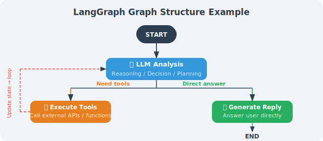

# Why Graph Structures?

> **Section Goal**: Understand the limitations of linear chains and master the core advantages of graph structures for solving complex Agent scenarios.

LangChain's LCEL chains are excellent for linear processing flows, but real-world Agents need to handle more complex scenarios: looping execution, conditional branching, and backtracking retries. Graph structures were designed precisely for this.

---

## Theoretical Background: Finite State Machines and Graph Computing

LangGraph's design is directly inspired by two classic concepts in computer science.

### Finite State Machines (FSM)

Agent behavior is fundamentally a **finite state machine** — transitioning between a finite number of states based on inputs and conditions [1]:

```
                ┌──────────────────────────┐
                ▼                          │
         ┌──────────┐    has tool call  ┌──────────┐
START ──▶│ Thinking  │ ────────────────▶ │ Execute  │
         └──────────┘                   │  Tool    │
              │                         └──────────┘
              │ no tool call (direct answer)
              ▼
         ┌──────────┐
         │   End    │
         └──────────┘
```

In the FSM model:
- **State**: the current phase the Agent is in (e.g., "thinking," "executing tool," "waiting for human approval")
- **Transition**: a conditional jump from one state to another
- **Action**: the operation performed during a state transition (e.g., calling LLM, executing a tool)

LangGraph maps the FSM concept directly to its API: **State corresponds to TypedDict**, **states correspond to Nodes**, and **transitions correspond to Edges**. This makes complex Agent behavior modelable, testable, and debuggable.

### Academic Roots of Graph Computing in AI Agents

Graph structures have deep academic foundations in the AI Agent field:

| Academic Field | Graph Application | Connection to LangGraph |
|---------------|-------------------|------------------------|
| **Behavior Trees** (Robotics) [2] | Game AI and robots use behavior trees for decision control | LangGraph's conditional edges = behavior tree selector nodes |
| **Dataflow Programming** | TensorFlow and similar frameworks use computation graphs to express data flow | LangGraph's State transitions = dataflow graph tensor passing |
| **Workflow Engines** (BPM) | Airflow/Temporal use DAGs to orchestrate tasks | LangGraph supports cycles, more flexible than DAGs |
| **Cognitive Architectures** | SOAR, ACT-R use production rules to control reasoning | LangGraph's conditional routing = production rule condition matching |

> 💡 LangGraph's innovation is: **it is not a simple DAG (Directed Acyclic Graph), but a directed graph that supports cycles**. This distinction is crucial — because the core behavioral pattern of Agents (the ReAct loop: think → act → observe → think again) is inherently a cycle. Traditional workflow engines (like Airflow) don't support cycles, so they cannot natively express an Agent's iterative reasoning.

---

## Real-World Business Scenario Analysis

Before diving into code, let's look at a few real business scenarios to understand why "graph structures" are not an optional advanced feature, but a **hard requirement** for building production-grade Agents.

### Scenario 1: Multi-Turn Dialogue for Intelligent Customer Service

```
User: "I want to return an item"
  → Identify intent: return
  → Query order status
    → If shipped → follow return process
    → If not shipped → cancel directly
    → If past return window → escalate to human agent
  → Execute operation
  → Confirm result
  → If user is unsatisfied → back to "understand intent" for reprocessing
```

This scenario requires: conditional branching (3 paths), loops (retry when unsatisfied), and human interaction (escalate to human). LCEL chains cannot elegantly express this logic.

### Scenario 2: Code Review Agent

```
Submit code → Static analysis → LLM review
  → If security issue found → Deep security analysis → Generate fix suggestions
  → If performance issue found → Performance analysis → Optimization suggestions
  → If no issues → Pass review
  → All analysis results → Summary report
  → Human review → Approve/Reject
```

This scenario requires: parallel branching (security and performance analyzed simultaneously), dynamic routing (different paths by issue type), and merging (combining analysis results).

### Scenario 3: Data Analysis Agent (Chapter 22 of this book)

```
Natural language question → Understand intent → Generate SQL
  → SQL safety check
    → If unsafe → Regenerate SQL (loop)
    → If safe → Execute query
  → Analyze data → Generate charts → Generate insights → Output report
  → If user asks follow-up → Back to "understand intent"
```

The common characteristic of these scenarios is: **the execution path is not predetermined, but dynamically decided based on intermediate results**. Graph structures are naturally suited to express this kind of "runtime decision-making."

---

## Limitations of Linear Chains

```python
# LCEL chain: linear, A → B → C
chain = step_a | step_b | step_c

# Cannot handle:
# 1. Loops: "Step B's result is unsatisfactory, re-execute Step B"
# 2. Conditional branching: "Based on Step A's result, take path B or path C"
# 3. Parallel then merge: "Execute B and C simultaneously, then merge at Step D"
# 4. Persistent state: "Step B needs to access data saved long ago by Step A"
```

**A concrete example**: suppose you're building a code review Agent:

```python
# LCEL approach: linear execution, cannot handle complex situations
review_chain = analyze_code | find_issues | suggest_fix

# Problem scenarios:
# 1. If analyze_code finds the code file is too large → need to split first, then analyze in segments
#    LCEL cannot go back to a previous step
# 2. If find_issues discovers a security vulnerability → need an extra security analysis step
#    LCEL cannot dynamically insert steps
# 3. If suggest_fix's fix suggestions introduce new problems → need to re-review
#    LCEL cannot implement loops
```

---

## Advantages of Graph Structures



Graph structures fundamentally change the Agent's execution model:

| Feature | Linear Chain (LCEL) | Graph Structure (LangGraph) |
|---------|:---:|:---:|
| Execution flow | A → B → C (fixed) | Arbitrary topology (dynamic) |
| Loop support | ❌ Not supported | ✅ Nodes can point back |
| Conditional branching | ⚠️ Limited support | ✅ Conditional edges |
| State management | ❌ No persistent state | ✅ Global State |
| Human interaction | ❌ Not supported | ✅ Human-in-the-Loop |
| Checkpoint recovery | ❌ Not supported | ✅ Checkpoint persistence |
| Parallel execution | ⚠️ Simple parallel | ✅ Complex parallel + merge |

---

## LangGraph's Core Design

LangGraph's design revolves around three core concepts: **State**, **Node**, and **Edge**.

```python
# pip install langgraph

from langgraph.graph import StateGraph, END, START
from typing import TypedDict, Annotated
import operator

# 1. Define State: data shared by all nodes in the graph
class AgentState(TypedDict):
    messages: list        # Message history
    current_task: str     # Current task
    iterations: int       # Loop count (prevent infinite loops)
    final_answer: str     # Final answer

# 2. Define Nodes: each node is a function that receives state and returns updates
def process_input(state: AgentState) -> AgentState:
    """Node function: process input"""
    print(f"Processing: {state['current_task']}")
    return {"iterations": state.get("iterations", 0) + 1}

# 3. Define Edges: connections between nodes (can be conditional edges)
def should_continue(state: AgentState) -> str:
    """Conditional edge: returns the name of the next node"""
    if state.get("final_answer"):
        return "end"
    elif state.get("iterations", 0) >= 5:
        return "end"  # Prevent infinite loops
    else:
        return "continue"

# 4. Build the graph
graph = StateGraph(AgentState)
graph.add_node("process", process_input)
graph.add_edge(START, "process")
graph.add_conditional_edges(
    "process",
    should_continue,
    {"end": END, "continue": "process"}  # Can loop back to itself!
)

app = graph.compile()
```

### When Should You Choose LangGraph?

```python
# ✅ Signals to choose LangGraph:
should_use_langgraph = [
    "Agent needs multi-step loops (e.g., ReAct loop)",
    "Needs conditional routing (e.g., different branches based on user intent)",
    "Needs Human-in-the-Loop (approval/confirmation nodes)",
    "Needs long-running tasks (with checkpoint recovery)",
    "Multiple Agents collaborating (Supervisor pattern)",
]

# ❌ Scenarios where LangGraph is not needed:
use_lcel_instead = [
    "Simple Prompt → LLM → output",
    "Fixed-step processing pipelines",
    "Workflows that don't need loops or conditional branching",
]
```

---

## Summary

The core value of graph structures:
- **Loop support**: nodes can point to themselves or previous nodes
- **Persistent state**: State is shared across all nodes throughout execution
- **Conditional routing**: dynamically decide the next step based on state
- **Visualization**: graph structures can intuitively display Agent execution logic
- **Checkpoint recovery**: through the Checkpoint mechanism, supports resuming tasks after interruption
- **Human-AI collaboration**: built-in Human-in-the-Loop support, suitable for scenarios requiring human approval

---

*Next section: [13.2 LangGraph Core Concepts: Nodes, Edges, State](./02_core_concepts.md)*

---

## References

[1] HOPCROFT J E, MOTWANI R, ULLMAN J D. Introduction to automata theory, languages, and computation[M]. 3rd ed. Pearson, 2006.

[2] COLLEDANCHISE M, ÖGREN P. Behavior trees in robotics and AI: an introduction[M]. CRC Press, 2018.
