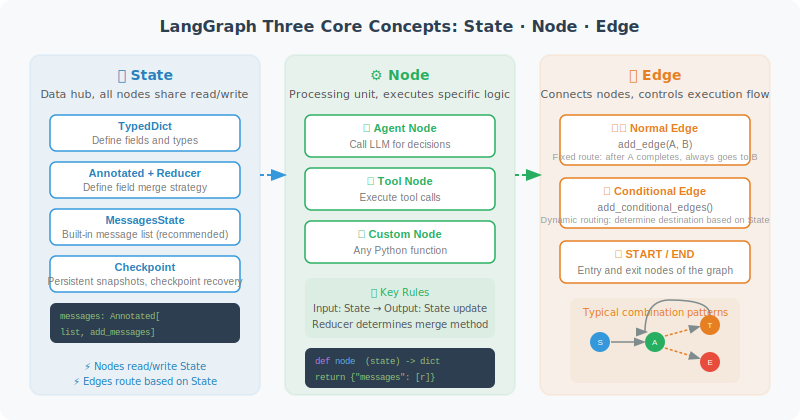

# LangGraph Core Concepts: Nodes, Edges, and State



## State

State is LangGraph's data center — all nodes read from and write to State.

```python
from typing import TypedDict, Annotated, Optional
from langgraph.graph import MessagesState
import operator

# Method 1: Use the built-in MessagesState (recommended)
# Already includes: messages: Annotated[list, add_messages]
class MyState(MessagesState):
    # Add extra fields on top of the base
    user_name: Optional[str]
    task_complete: bool

# Method 2: Fully custom
from langchain_core.messages import BaseMessage

class CustomState(TypedDict):
    # Use Annotated + operator.add to express "append" semantics
    messages: Annotated[list[BaseMessage], operator.add]
    
    # Regular fields (each update overwrites)
    current_step: str
    error_count: int
    result: Optional[str]
```

### Advanced Usage of State Reducers

Reducers are a mechanism in LangGraph that is easy to overlook but extremely powerful. When multiple nodes simultaneously update the same field in State, the Reducer determines **how to merge those updates**.

```python
from typing import Annotated
import operator

# Reducer Example 1: Append (most common)
# The messages field uses operator.add as its Reducer
# Effect: new messages are appended to the end of the list, not replacing the entire list
class ChatState(TypedDict):
    messages: Annotated[list, operator.add]  # Append semantics

# Reducer Example 2: Custom Reducer function
def merge_results(existing: dict, new: dict) -> dict:
    """Custom merge strategy: deep merge two dictionaries"""
    merged = {**existing}
    for key, value in new.items():
        if key in merged and isinstance(merged[key], list):
            merged[key] = merged[key] + value  # Append lists
        else:
            merged[key] = value  # Overwrite other types
    return merged

class AnalysisState(TypedDict):
    # Using a custom Reducer: results from multiple analysis nodes are merged, not overwritten
    analysis_results: Annotated[dict, merge_results]
    step_count: int

# Reducer Example 3: Using add_messages (LangChain built-in)
from langgraph.graph import add_messages

class AgentState(TypedDict):
    # add_messages is smarter than operator.add:
    # - Automatically handles message deduplication (based on message ID)
    # - Supports message updates (new messages with the same ID replace old ones)
    messages: Annotated[list, add_messages]
```

> ⚠️ **Common pitfall**: If you forget to add a Reducer to a list-type field, every time a node returns `{"messages": [new_msg]}` it will **replace** rather than **append** to the message list. This is the most common bug for beginners.

### Checkpoint Persistence

Checkpoints are the core mechanism in LangGraph for implementing "checkpoint recovery" and "session persistence." At each state transition, LangGraph can automatically save a Checkpoint (snapshot), and execution can later be resumed from any Checkpoint.

```python
# In-memory Checkpoint (for development/testing)
from langgraph.checkpoint.memory import MemorySaver

memory_checkpointer = MemorySaver()
app = graph.compile(checkpointer=memory_checkpointer)

# Use thread_id to identify an independent execution session
config = {"configurable": {"thread_id": "user-session-001"}}

# First round of conversation
result1 = app.invoke(
    {"messages": [HumanMessage(content="My name is Alice")]},
    config=config
)

# Second round of conversation — automatically restores previous state
result2 = app.invoke(
    {"messages": [HumanMessage(content="What's my name?")]},
    config=config
)
# Agent can remember "Alice" because state was persisted via Checkpoint

# SQLite Checkpoint (recommended for production)
from langgraph.checkpoint.sqlite import SqliteSaver

# Data persisted to disk, not lost after restart
db_checkpointer = SqliteSaver.from_conn_string("checkpoints.db")
app = graph.compile(checkpointer=db_checkpointer)

# PostgreSQL Checkpoint (distributed production environments)
# pip install langgraph-checkpoint-postgres
# from langgraph.checkpoint.postgres import PostgresSaver
# pg_checkpointer = PostgresSaver.from_conn_string("postgresql://...")
```

**Typical use cases for Checkpoints**:

| Scenario | Description |
|----------|-------------|
| Multi-turn conversation persistence | User closes browser and returns; conversation state is not lost |
| Human-in-the-Loop | Pause execution to wait for human approval; resume from pause point after approval |
| Long-running tasks | Data analysis may run for several minutes; supports mid-task checkpoint/resume |
| Error recovery | A node fails; after fixing, retry from the failure point rather than from the beginning |
| Time-travel debugging | Roll back to a previous Checkpoint to inspect the State at that time |

---

## Node

```python
from langchain_openai import ChatOpenAI
from langchain_core.messages import HumanMessage, AIMessage, SystemMessage
from langgraph.graph import StateGraph, END, START, MessagesState

llm = ChatOpenAI(model="gpt-4o")

# A node is just a regular Python function
def agent_node(state: MessagesState) -> dict:
    """
    Agent node: calls LLM to process messages
    
    Receives: current State
    Returns: the updated portion of State (a dictionary)
    """
    messages = state["messages"]
    
    # Call LLM
    response = llm.invoke(messages)
    
    # Return updates (only return the changed parts)
    return {"messages": [response]}

def tool_node(state: MessagesState) -> dict:
    """Tool node: execute tool calls"""
    import json
    
    last_message = state["messages"][-1]
    tool_results = []
    
    for tool_call in last_message.tool_calls:
        # Execute tool (simulated here)
        result = f"Result of tool {tool_call['name']}"
        
        from langchain_core.messages import ToolMessage
        tool_results.append(ToolMessage(
            content=result,
            tool_call_id=tool_call["id"]
        ))
    
    return {"messages": tool_results}
```

## Edge

```python
# Regular edge: fixed direction
graph.add_edge("node_a", "node_b")  # A always points to B

# Conditional edge: dynamically determined
def route_after_agent(state: MessagesState) -> str:
    """Decide the next step based on Agent output"""
    last_message = state["messages"][-1]
    
    # If there are tool calls → execute tools
    if hasattr(last_message, "tool_calls") and last_message.tool_calls:
        return "tool_node"
    
    # Otherwise → end
    return END

graph.add_conditional_edges(
    "agent_node",
    route_after_agent,
    {
        "tool_node": "tool_node",
        END: END
    }
)
```

## Complete ReAct Graph

```python
from langchain_core.tools import tool
import math

@tool
def calculate(expression: str) -> str:
    """Evaluate a mathematical expression"""
    try:
        result = eval(expression, {"__builtins__": {}}, 
                     {k: getattr(math, k) for k in dir(math)})
        return str(result)
    except Exception as e:
        return f"Error: {e}"

tools = [calculate]
llm_with_tools = llm.bind_tools(tools)

def agent_node(state: MessagesState) -> dict:
    response = llm_with_tools.invoke(state["messages"])
    return {"messages": [response]}

def tool_executor(state: MessagesState) -> dict:
    from langchain_core.messages import ToolMessage
    import json
    
    last_msg = state["messages"][-1]
    results = []
    
    for tool_call in last_msg.tool_calls:
        if tool_call["name"] == "calculate":
            result = calculate.invoke(tool_call["args"])
        else:
            result = "Unknown tool"
        
        results.append(ToolMessage(
            content=str(result),
            tool_call_id=tool_call["id"]
        ))
    
    return {"messages": results}

def should_use_tools(state: MessagesState) -> str:
    last_msg = state["messages"][-1]
    if hasattr(last_msg, "tool_calls") and last_msg.tool_calls:
        return "tools"
    return END

# Build the graph
graph = StateGraph(MessagesState)
graph.add_node("agent", agent_node)
graph.add_node("tools", tool_executor)
graph.add_edge(START, "agent")
graph.add_conditional_edges("agent", should_use_tools)
graph.add_edge("tools", "agent")  # After tool execution, return to agent

app = graph.compile()

# Run
result = app.invoke({"messages": [HumanMessage(content="Calculate sqrt(2) * pi")]})
print(result["messages"][-1].content)
```

---

## Error Handling and Retry Strategies

In production environments, Agent nodes (especially those calling external APIs) can fail at any time. LangGraph provides multiple error handling patterns:

```python
import time
from langchain_core.runnables import RunnableConfig

# Pattern 1: try-except inside the node (most flexible)
def resilient_tool_node(state: MessagesState) -> dict:
    """Tool node with error handling"""
    last_msg = state["messages"][-1]
    results = []
    
    for tool_call in last_msg.tool_calls:
        try:
            result = execute_tool(tool_call)
            results.append(ToolMessage(
                content=str(result),
                tool_call_id=tool_call["id"]
            ))
        except Exception as e:
            # When a tool fails, return error info rather than raising an exception
            # This gives the Agent a chance to self-correct
            results.append(ToolMessage(
                content=f"Tool execution failed: {str(e)}. Please try a different approach.",
                tool_call_id=tool_call["id"]
            ))
    
    return {"messages": results}

# Pattern 2: Conditional routing with retry count
class RetryState(MessagesState):
    retry_count: int
    max_retries: int

def should_retry(state: RetryState) -> str:
    """Retry decision: retry if failure count hasn't exceeded the limit"""
    last_msg = state["messages"][-1]
    
    if "failed" in last_msg.content.lower() and state["retry_count"] < state["max_retries"]:
        return "retry"
    elif "failed" in last_msg.content.lower():
        return "fallback"  # Exceeded retry count, take degraded path
    else:
        return "success"

# Pattern 3: Timeout control
# LangGraph supports setting timeouts via RunnableConfig
config = RunnableConfig(
    recursion_limit=25,  # Maximum recursion steps (prevent infinite loops)
    # Other configurations...
)
result = app.invoke(input_data, config=config)
```

> 💡 **Best practice**: In an Agent's tool nodes, never let exceptions propagate directly and crash the entire graph. Catch exceptions and return the error information as a ToolMessage to the Agent, letting the LLM decide the next step based on the error (retry, try a different approach, or inform the user). This "graceful degradation" pattern is the hallmark of production-grade Agents.

---

## Summary

LangGraph's three elements:
- **State**: shared data container, structure defined by TypedDict
- **Node**: processing function, receives State, returns partial updates
- **Edge**: connection relationship, regular edge or conditional edge

---

*Next section: [13.3 Build Your First Graph Agent](./03_first_graph_agent.md)*
