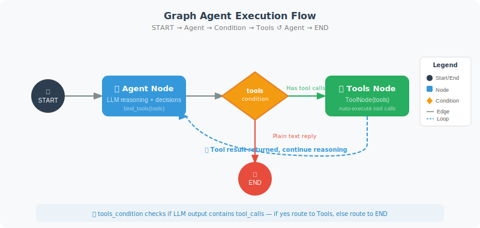

# Build Your First Graph Agent

This section walks you through building a complete LangGraph Agent step by step, including tool calls and iterative reasoning.

Unlike the previous approach of using the OpenAI native API or LangChain's AgentExecutor, LangGraph uses a **graph** to describe Agent behavior. The advantage of this approach is that the execution flow is **visualizable, controllable, and persistable** — you can clearly see which steps the Agent took, pause and resume at any node, and precisely control the flow direction by adding edges.

Building a Graph Agent involves four steps:
1. **Define tools**: same as before, use the `@tool` decorator to define tool functions
2. **Create nodes**: each node is a processing function that receives State and returns updates
3. **Build the graph**: use `add_node` to add nodes, and `add_edge` / `add_conditional_edges` to connect them
4. **Compile and run**: call `compile()` to get an executable Agent



In the code below, we use LangGraph's built-in `MessagesState` (message list state), `ToolNode` (automatically executes tools), and `tools_condition` (determines whether tool calls are needed) — these are shortcut components LangGraph provides for common Agent patterns.

```python
# first_graph_agent.py
from langgraph.graph import StateGraph, END, START, MessagesState
from langgraph.prebuilt import ToolNode, tools_condition
from langchain_openai import ChatOpenAI
from langchain_core.tools import tool
from langchain_core.messages import HumanMessage, SystemMessage
import math

# ============================
# 1. Define Tools
# ============================

@tool
def calculate(expression: str) -> str:
    """Evaluate a mathematical expression. Supports sqrt, sin, cos, log, pi, e, etc."""
    try:
        safe_env = {k: getattr(math, k) for k in dir(math) if not k.startswith('_')}
        # ⚠️ Security warning: eval() can still be bypassed even with restricted __builtins__
        # In production, use safe expression parsers like simpleeval or numexpr
        result = eval(expression, {"__builtins__": {}}, safe_env)
        if isinstance(result, float):
            return f"{result:.6g}"
        return str(result)
    except Exception as e:
        return f"Calculation error: {e}"

@tool
def get_fact(topic: str) -> str:
    """Get basic knowledge about a topic."""
    facts = {
        "python": "Python was created by Guido van Rossum, released in 1991. It is an interpreted, high-level language.",
        "langchain": "LangChain is a framework for building LLM applications, supporting Agents, RAG, Chains, and more.",
        "speed of light": "The speed of light in a vacuum is approximately 299,792,458 meters per second.",
        "earth": "Earth has a diameter of approximately 12,742 km and is about 150 million km from the Sun.",
    }
    
    for key, fact in facts.items():
        if key.lower() in topic.lower():
            return fact
    
    return f"No pre-loaded knowledge available for '{topic}'"

tools = [calculate, get_fact]

# ============================
# 2. Create the Agent Node
# ============================

llm = ChatOpenAI(model="gpt-4o", temperature=0)
llm_with_tools = llm.bind_tools(tools)

def agent_node(state: MessagesState) -> dict:
    """Agent core node: calls LLM to decide the next step"""
    messages = state["messages"]
    
    if not any(isinstance(m, SystemMessage) for m in messages):
        messages = [
            SystemMessage(content="You are an intelligent assistant with access to a calculator and knowledge base tools.")
        ] + messages
    
    response = llm_with_tools.invoke(messages)
    return {"messages": [response]}

# ============================
# 3. Build the Graph
# ============================

# Building the graph involves three steps: add nodes, add edges, compile.
# - "agent" node: LLM decision-making
# - "tools" node: uses the built-in ToolNode to automatically execute tools
# - tools_condition: built-in condition function that checks if the LLM response contains tool calls
#   If tool calls exist → route to "tools"
#   If not (plain text response) → route to END (finish)
# - "tools" → "agent": after tool execution, return to Agent for continued reasoning (forms a loop)

graph = StateGraph(MessagesState)

# Add nodes
graph.add_node("agent", agent_node)
graph.add_node("tools", ToolNode(tools))  # Built-in tool node

# Add edges
graph.add_edge(START, "agent")
graph.add_conditional_edges(
    "agent",
    tools_condition,  # Built-in condition: has tool calls → "tools", otherwise → END
)
graph.add_edge("tools", "agent")  # After tool execution, return to Agent

# Compile
app = graph.compile()

# ============================
# 4. Visualize (if relevant libraries are installed)
# ============================

try:
    from IPython.display import Image, display
    display(Image(app.get_graph().draw_mermaid_png()))
except:
    print("Graph structure (Mermaid format):")
    print(app.get_graph().draw_mermaid())

# ============================
# 5. Run Tests
# ============================

def chat(question: str):
    """Chat with the Agent"""
    result = app.invoke({
        "messages": [HumanMessage(content=question)]
    })
    
    # The last message is the AI's response
    final_msg = result["messages"][-1]
    return final_msg.content

# Tests
print(chat("When was Python released?"))
print(chat("What is the speed of light? How many milliseconds does it take to circle the Earth?"))
print(chat("Calculate sqrt(2) to 4 decimal places."))
```

Understanding the core of the code above: the graph structure forms a "loop" — `agent → tools → agent → tools → ... → END`. In each iteration, the `agent` node calls the LLM for reasoning, and `tools_condition` checks whether the LLM's response contains a tool call request. If it does, the flow goes to the `tools` node to execute the tool; if not (meaning the LLM believes it can answer directly), the flow goes to `END`. This is how the Agent's "reasoning-action loop" is expressed in graph structure.

## Tracing the Execution Process

When debugging an Agent, understanding each step of its reasoning process is crucial. The `app.stream()` method streams execution state node by node, letting you clearly see: which node the Agent made a decision at, which tool was called, and what result was returned.

```python
# Use stream to trace each step
for event in app.stream({"messages": [HumanMessage(content="What is Earth's diameter in km? Convert it to miles.")]}):
    for node_name, state in event.items():
        if node_name != "__end__":
            print(f"\n[Node: {node_name}]")
            last_msg = state.get("messages", [])[-1] if state.get("messages") else None
            if last_msg:
                if hasattr(last_msg, 'content') and last_msg.content:
                    print(f"  Message: {last_msg.content[:200]}")
                if hasattr(last_msg, 'tool_calls') and last_msg.tool_calls:
                    for tc in last_msg.tool_calls:
                        print(f"  Tool call: {tc['name']}({tc['args']})")
```

## Comparison with LangChain AgentExecutor

If you've used LangChain's `AgentExecutor` (Chapter 12), you might ask: why go through the trouble of building an Agent with a graph? Let's understand the fundamental difference between the two through a comparison:

```python
# LangChain AgentExecutor approach (black box)
from langchain.agents import create_openai_tools_agent, AgentExecutor

agent = create_openai_tools_agent(llm, tools, prompt)
executor = AgentExecutor(agent=agent, tools=tools)
result = executor.invoke({"input": "Calculate sqrt(2)"})
# The internal loop is opaque to you

# LangGraph approach (white box)
graph = StateGraph(MessagesState)
graph.add_node("agent", agent_node)
graph.add_node("tools", ToolNode(tools))
# You have full control over the graph structure, edge conditions, and when to terminate
app = graph.compile()
```

| Dimension | AgentExecutor | LangGraph |
|-----------|--------------|-----------|
| Transparency | Black-box loop | Every node and edge is visible |
| Control | Limited configuration | Fully customizable |
| Persistence | Not supported | Checkpoint natively supported |
| Human-AI collaboration | Requires extra implementation | Built-in interrupt/resume |
| Use case | Simple tool calls | Complex multi-step workflows |

> 💡 **Migration advice**: If your Agent only needs a simple "LLM + tool call" loop, `AgentExecutor` is sufficient. When you need conditional branching, multi-stage flows, human approval nodes, or intermediate state persistence, migrate to LangGraph.

## Common Pitfalls and Best Practices

When building your first Graph Agent, a few common mistakes are worth noting:

**Pitfall 1: Forgetting to handle empty message lists**

```python
# ❌ Wrong: directly accessing the last message, may cause IndexError
def agent_node(state: MessagesState):
    response = llm.invoke(state["messages"])
    return {"messages": [response]}

# ✅ Correct: ensure the message list is not empty
def agent_node(state: MessagesState):
    messages = state.get("messages", [])
    if not messages:
        messages = [HumanMessage(content="Hello")]
    response = llm_with_tools.invoke(messages)
    return {"messages": [response]}
```

**Pitfall 2: Tool function exceptions crashing the entire Agent**

```python
# ❌ Wrong: exception propagates upward
@tool
def risky_tool(query: str) -> str:
    """A tool that might fail"""
    return requests.get(f"https://api.example.com/{query}").text

# ✅ Correct: catch exceptions inside the tool, return friendly error messages
@tool
def safe_tool(query: str) -> str:
    """Safe tool implementation"""
    try:
        response = requests.get(f"https://api.example.com/{query}", timeout=5)
        response.raise_for_status()
        return response.text
    except Exception as e:
        return f"Tool call failed: {type(e).__name__}: {e}"
```

**Pitfall 3: Infinite loops without a safe exit**

LangGraph's default `recursion_limit` is 25 steps, but in complex scenarios you may need to set it explicitly:

```python
# Set maximum recursion steps to prevent infinite loops
result = app.invoke(
    {"messages": [HumanMessage(content="Do a complex analysis")]},
    config={"recursion_limit": 15}  # Maximum 15 steps
)
```

---

## Summary

The first Graph Agent demonstrates:
- `StateGraph` + `MessagesState` for quick construction
- `ToolNode` + `tools_condition` for built-in tool handling
- `app.stream()` for tracing the execution process

---

*Next section: [13.4 Conditional Routing and Loop Control](./04_conditional_routing.md)*