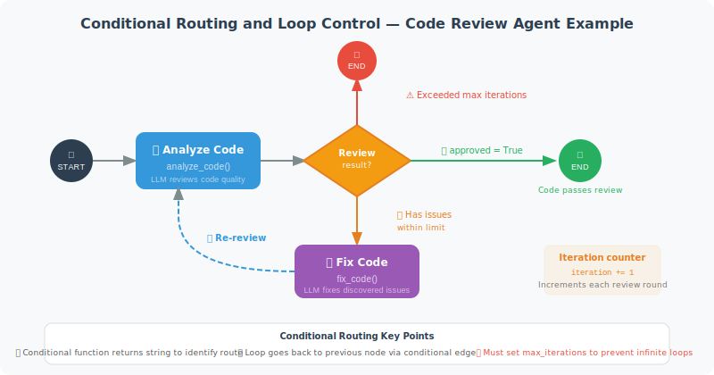

# Conditional Routing and Loop Control

LangGraph's power lies in its flexible conditional routing and loop control — enabling it to express workflows far more complex than a simple "call a tool."

In the previous section, we used `tools_condition`, a built-in condition function, to determine "whether a tool is needed." But real-world Agents often require more complex decision logic: deciding whether to pass or reject code based on review results, routing to different processing flows based on user intent, deciding whether to iterate and optimize based on a quality score...

All of these can be implemented with **conditional routing** — you define a condition function that inspects the current state and returns a string identifying which path to take. Then use `add_conditional_edges` to map those strings to different target nodes.

### The Power and Risk of Loops

The most powerful use of conditional routing is constructing **loops** — allowing a node's output to point back to a previous node. For example, an iterative flow like "code review → fix → re-review → re-fix." But loops also introduce the risk of infinite loops: if the condition logic has a bug, the Agent might loop forever. Therefore, **setting a maximum iteration count is a mandatory safety measure.**

Below, we use a "Code Review Agent" to demonstrate conditional routing and loop control. This Agent analyzes code, finds issues, fixes the code, and then re-reviews — until the code passes review or the maximum iteration count is reached.



```python
from langgraph.graph import StateGraph, END, START
from typing import TypedDict, Optional, Literal
from langchain_openai import ChatOpenAI
from langchain_core.messages import HumanMessage
import json

llm = ChatOpenAI(model="gpt-4o-mini")

# ============================
# Code Review Agent with Loops
# ============================

class CodeReviewState(TypedDict):
    code: str
    review_result: Optional[str]
    issues: list
    iteration: int
    max_iterations: int
    approved: bool

def analyze_code(state: CodeReviewState) -> CodeReviewState:
    """Analyze code quality"""
    response = llm.invoke([
        HumanMessage(content=f"""Review the following code and identify all issues (JSON format):
```python
{state['code']}
```
Return: {{"issues": ["issue1", "issue2"], "severity": "high/medium/low"}}""")
    ])
    
    try:
        import re
        json_match = re.search(r'\{.*\}', response.content, re.DOTALL)
        if json_match:
            result = json.loads(json_match.group())
            issues = result.get("issues", [])
        else:
            issues = []
    except:
        issues = []
    
    return {
        "issues": issues,
        "review_result": response.content,
        "iteration": state.get("iteration", 0) + 1
    }

def fix_code(state: CodeReviewState) -> CodeReviewState:
    """Fix code issues"""
    issues_text = "\n".join([f"- {issue}" for issue in state["issues"]])
    
    response = llm.invoke([
        HumanMessage(content=f"""Fix the issues in the following code:

Code:
```python
{state['code']}
```

Issues:
{issues_text}

Return only the fixed Python code:""")
    ])
    
    fixed_code = response.content
    if "```python" in fixed_code:
        fixed_code = fixed_code.split("```python")[1].split("```")[0].strip()
    elif "```" in fixed_code:
        fixed_code = fixed_code.split("```")[1].split("```")[0].strip()
    
    return {"code": fixed_code}

def should_fix_or_approve(state: CodeReviewState) -> Literal["fix", "approve", "max_reached"]:
    """Conditional routing: decide whether to continue fixing or approve
    
    This function is the core control logic of the entire loop:
    - Check the iteration count limit (safety valve to prevent infinite loops)
    - If no issues, approve directly
    - Only trigger the fix loop for critical issues (e.g., bugs, security vulnerabilities)
    """
    
    if state["iteration"] >= state["max_iterations"]:
        return "max_reached"
    
    if not state["issues"]:
        return "approve"
    
    # Only continue fixing for critical issues
    critical_keywords = ["bug", "error", "security vulnerability", "performance issue", "syntax error"]
    has_critical = any(
        any(kw in issue.lower() for kw in critical_keywords)
        for issue in state["issues"]
    )
    
    return "fix" if has_critical else "approve"

def mark_approved(state: CodeReviewState) -> CodeReviewState:
    """Mark code as approved"""
    return {"approved": True}

# Build the graph
graph = StateGraph(CodeReviewState)
graph.add_node("analyze", analyze_code)
graph.add_node("fix", fix_code)
graph.add_node("approve", mark_approved)

graph.add_edge(START, "analyze")
graph.add_conditional_edges(
    "analyze",
    should_fix_or_approve,
    {
        "fix": "fix",
        "approve": "approve",
        "max_reached": "approve"
    }
)
graph.add_edge("fix", "analyze")  # After fixing, re-analyze (loop!)
graph.add_edge("approve", END)

app = graph.compile()

# Test
initial_code = """
def divide(a, b):
    return a / b

result = divide(10, 0)
print(result)
"""

result = app.invoke({
    "code": initial_code,
    "review_result": None,
    "issues": [],
    "iteration": 0,
    "max_iterations": 3,
    "approved": False
})

print(f"Final code:\n{result['code']}")
print(f"Approved: {result['approved']}")
print(f"Iterations: {result['iteration']}")
```

## Advanced Routing Patterns

The code review example above demonstrates basic conditional routing. In real Agent systems, you may need more complex routing logic:

**Pattern 1: Fan-out**

Route requests to different specialized processing flows based on user intent:

```python
def intent_router(state: dict) -> str:
    """Route to different processing nodes based on user intent"""
    intent = state.get("detected_intent", "unknown")
    
    routing_map = {
        "code_review": "code_analyzer",
        "bug_fix": "debugger",
        "feature_request": "planner",
        "documentation": "doc_writer",
    }
    
    return routing_map.get(intent, "general_handler")

graph.add_conditional_edges("intent_detector", intent_router, {
    "code_analyzer": "code_analyzer",
    "debugger": "debugger",
    "planner": "planner",
    "doc_writer": "doc_writer",
    "general_handler": "general_handler",
})
```

**Pattern 2: Quality Gate**

Add a quality check before Agent output; if it doesn't pass, send it back for rework:

```python
def quality_gate(state: dict) -> str:
    """Check output quality, decide whether to pass or redo"""
    score = state.get("quality_score", 0)
    retries = state.get("retry_count", 0)
    
    if score >= 0.8:
        return "publish"       # Quality acceptable, publish
    elif retries >= 3:
        return "manual_review" # Retries exhausted, hand off to human
    else:
        return "regenerate"    # Regenerate
```

**Pattern 3: Map-Reduce (Parallel Merge)**

LangGraph 2.0 introduced the `Send()` API, supporting dynamic creation of parallel branches:

```python
from langgraph.constants import Send

def route_to_parallel(state: dict) -> list[Send]:
    """Dynamically distribute tasks to multiple parallel nodes"""
    subtasks = state.get("subtasks", [])
    
    # Create an independent Send for each subtask
    return [
        Send("worker", {"task": subtask, "task_id": i})
        for i, subtask in enumerate(subtasks)
    ]

graph.add_conditional_edges("planner", route_to_parallel)
```

## Debugging Conditional Routing

When conditional routing behavior doesn't match expectations, the most effective debugging method is **tracing each routing decision**:

```python
# Method 1: Add logging to the condition function
import logging
logger = logging.getLogger("agent.routing")

def route_with_logging(state: dict) -> str:
    """Conditional routing with logging"""
    decision = state.get("review_result")
    iteration = state.get("iteration", 0)
    
    if decision == "pass":
        result = "approve"
    elif iteration >= state.get("max_iterations", 3):
        result = "approve"  # Force approve when max iterations exceeded
    else:
        result = "fix"
    
    logger.info(f"Routing decision: iteration={iteration}, decision={decision} → {result}")
    return result

# Method 2: Use stream to trace the complete execution path
for event in app.stream(initial_state):
    for node_name, output in event.items():
        print(f"  Node [{node_name}] → iteration={output.get('iteration', '?')}")
```

> 💡 **Best practice**: Complex condition routing functions should be **unit tested first** to verify that every input combination returns the correct routing target, before integrating into the graph.

---

## Summary

Key techniques for conditional routing:
- **Condition function**: returns a string identifying the next node
- **Loop control**: must set a maximum iteration count to prevent infinite loops
- **State tracking**: record iteration count and completion flags in State

---

*Next section: [13.5 Human-in-the-Loop: Human-AI Collaboration](./05_human_in_the_loop.md)*