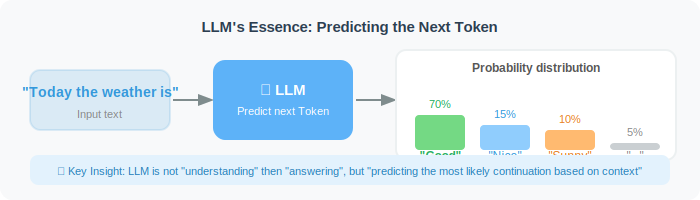
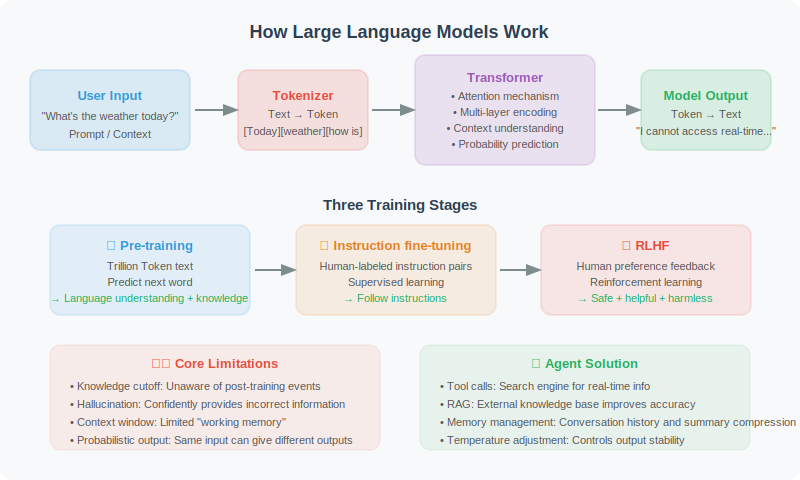
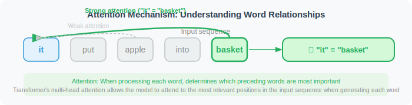
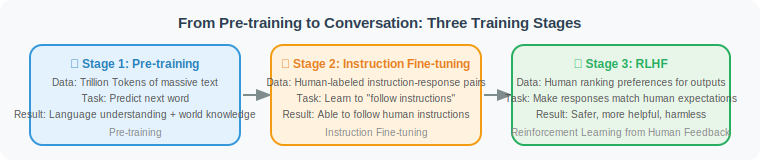
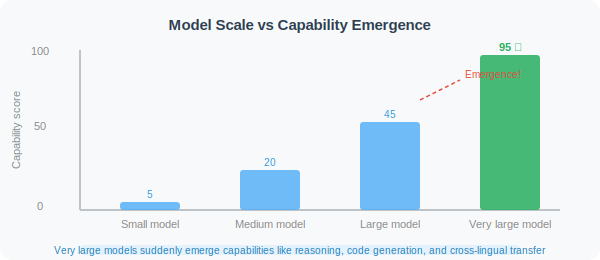
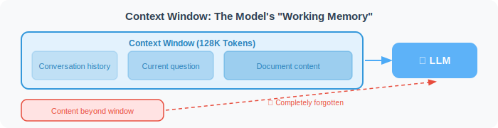
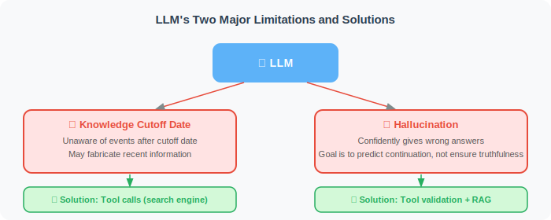

# How Does an LLM Work? (A Complete Deconstruction of Intuition and Underlying Logic)

> 🧠 *"You don't need to be an engine engineer to drive well — but understanding how every gear meshes together lets you execute a perfect drift in extreme conditions. Building excellent AI Agents is no different."*

Large Language Models (LLMs) are the core breakthrough of modern AI. Many developers treat LLMs as a black-box API: send a Prompt, receive a response. But in real Agent development, you'll encounter all kinds of strange phenomena: Why do models hallucinate? Why does the same Prompt give different answers each time? Why does the model "forget" things when the context gets long?

This section won't make you derive painful partial differential equations. Instead, through intuition, analogy, and analysis of underlying logic, it will help you truly understand how LLMs work — the essential path from "framework user" to top-tier Agent architect.

## 1. A Simple Starting Point: Autoregressive "Next Token" Prediction

The first step to lifting the veil on LLM intelligence is accepting a fact that sounds counterintuitive: **it isn't "thinking" about how to answer your question globally — it's just doing extreme probability prediction.**

Traditional discriminative algorithms (like typical pCTR or pCVR prediction models) usually output a single continuous probability between 0 and 1, used for binary or multi-class classification of "click" or "conversion." An LLM is a **generative model** — at each step, it faces a super multi-class problem with tens of thousands or even hundreds of thousands of Tokens (word pieces).

Imagine you're playing an endless word-chain game:

```text
Input: "Artificial intelligence is advancing at an astonishing rate of ___"

Model's internal probability distribution (Logits after Softmax):
1. "development" (85.2%)
2. "change"      (10.1%)
3. "growth"      (3.5%)
4. "destruction" (0.8%)
...
(The remaining 99,996 tokens in the vocabulary have negligible probability)
```

The LLM samples a word from this probability distribution (e.g., "development"), then **appends this new word to the original input to form new context, and predicts the next word again**. This mechanism of using its own output as the next step's input is called **Autoregressive** generation. The long, flowing text you see is actually the accumulated result of hundreds or thousands of independent predictions.



> **💡 Advanced Intuition: Temperature and Hallucination — Two Sides of the Same Coin**
> The model doesn't always choose the highest-probability word (this is called Greedy Decoding). We can control the sampling strategy with the `Temperature` parameter.
> * **T=0**: The model always picks the highest-probability word. Output is extremely stable — suitable for code generation and JSON extraction.
> * **T>0.7**: Low-probability words get amplified weight. The model becomes highly creative and unpredictable — suitable for copywriting, but this "random walk" into low-probability territory is also why models are more prone to "hallucination."

## 2. Transformer: Attention Is All You Need



The foundation of modern LLMs is the **Transformer** architecture, proposed in 2017. Before it, RNN/LSTM models read text word by word from left to right, like reading a book, and easily "forgot" things in long sentences. Transformer completely abandoned sequential reading. Its core soul is the **Self-Attention mechanism**, which lets the model **survey the entire context simultaneously**.

An analogy to understand attention:
Imagine you're reading this sentence — *"She put the apple in the basket, then took **it** away."*

What does "it" refer to? Your brain automatically "attends to" "basket" in the preceding text (not "apple"). Transformer elegantly implements this as a database-query-like system:
* **Query (Q)**: The paging signal actively sent out by the word currently being processed ("it").
* **Key (K)**: The labels attached to all preceding words ("I am apple," "I am basket").
* **Value (V)**: The true deep semantic content of those words.

The current word's Q computes a dot product with the K of every preceding word. The higher the match, the more that word's V is blended into the current word's understanding.



To capture all-around relationships, the model runs multiple sets of attention mechanisms simultaneously (**Multi-Head Attention**) — some heads find verb-object pairings, others resolve pronoun references. This extreme extraction of context forms the underlying foundation for Agents to understand complex Prompts.

## 3. From Pre-training to Conversation: The Three Stages of LLM "Alchemy"

A top-tier conversational model (like GPT-4o or Claude 3.5 Sonnet) is not trained in one shot. Its creation is a long relay race:



| Training Stage | Core Task & Analogy | Data & Cost | Output Characteristics |
|:---|:---|:---|:---|
| **1. Pre-training** | **Compress world knowledge.** Like having a gifted child read every library in human history, teaching it only one thing: "predict the next word." | Trillions of Tokens (web pages, code, papers); costs tens of millions of dollars, thousands of GPUs running for months. | **Base Model**: Encyclopedic but unruly. Ask it "how to cook," it might continue with "how to boil water." |
| **2. Supervised Fine-Tuning (SFT)** | **Behavioral normalization.** Like new employee onboarding — teaching it the Q&A paradigm and how to follow human instructions. | Tens of thousands to hundreds of thousands of high-quality human-written "Q&A pairs." | **Instruct Model**: Can hold a normal conversation and follow instructions. |
| **3. RLHF / DPO** | **Value alignment.** Introduce a reward model to score responses, guiding the model to be safe, thorough, and appropriate. | Requires large numbers of highly-paid human experts for preference ranking. | **Chat Model**: The final product. High EQ, polite, refuses harmful requests. |

> ⚠️ **Note for Agent Developers: The Alignment Tax**
> RLHF-trained models are "safe and useful," but they also lose some raw creativity — this is called the alignment tax. For certain highly specialized Agent tasks (like internal automated code auditing or non-standard data cleaning), fine-tuning the base model from Stage 1 sometimes outperforms using a heavily aligned commercial chat API.

## 4. Emergent Abilities: The Magic of 1+1 > 2

When a model's parameter count and training data cross a certain threshold (generally considered to be around 10 billion parameters), it suddenly "unlocks" advanced capabilities that smaller models completely lack. This is called **Emergent Abilities**.



Small models only learn the "statistical patterns" and "grammar" of language. Large models, through the compression of massive data, are forced to internally construct complex **World Models** and logical representations. Typical emergent abilities include:

- **Few-shot In-context Learning**: The cornerstone of Agent development. Without changing any model code, just give a few examples in the Prompt and it can learn a brand-new task on the spot.
- **Chain-of-Thought (CoT) Reasoning**: The ability to reason step by step to solve complex problems.
- **Cross-modal and Cross-lingual Transfer**: Logical abstraction learned from Python naturally transfers to C++ or pseudocode.

```python
# A classic example of emergent ability: complex reasoning and self-reflection
prompt = """
Q: If all Bloops are Razzies, and all Razzies are Lazzies,
   are all Bloops Lazzies?
A: Let me think step by step...
"""
# A small model with a few billion parameters will directly output a random guess (Yes/No)
# A large model with hundreds of billions of parameters can output a rigorous
# symbolic logic derivation based on conceptual mapping
```

## 5. Scaling Laws: The Secret Behind "Bigger Is Better"

Emergent abilities are not mystical — behind them lies a powerful empirical rule: **Scaling Laws**.

In 2020, OpenAI published a paper revealing a striking pattern: **model performance (decrease in cross-entropy loss) follows a predictable power-law relationship with three factors**:

```
Performance ∝ f(model parameters, training data volume, compute)
```

This means that simply throwing more money at compute and data will reliably improve the model.
DeepMind then proposed the **Chinchilla Law** (2022), further refining this: **under a fixed compute budget, parameter count and data volume should scale proportionally.** Previously, people liked to make parameters huge (e.g., 175B) but didn't feed enough data. Now, small models (like Llama 3 8B) trained on an astonishing 15T Tokens have comprehensively surpassed older large models.

> 💡 **Implications for Agent Development**: Scaling Laws tell us that **choosing a larger/newer model almost always directly improves the success rate of an Agent pipeline**. When an Agent fails frequently, the first step is not to obsess over the Prompt — it's to switch to a stronger model to determine whether the bottleneck is logic or model capability.

## 6. The Rise of Reasoning Models: From "Fast Thinking" to "Slow Thinking"

In 2024–2025, simply scaling up parameter counts brought rapidly diminishing returns. A new paradigm is fundamentally reshaping the Agent's brain — **Reasoning Models**.

Traditional LLMs use what Daniel Kahneman calls "System 1 (Fast Thinking)": see the input, rely on intuition-like probability distributions to directly generate output.
Reasoning models (like OpenAI o3 and DeepSeek-R1) introduce "System 2 (Slow Thinking)," investing in **Test-time Compute**:

```python
# Traditional LLM "fast thinking"
# Input → directly output final answer (prone to failure on complex math and planning)
response = "42"  

# Reasoning model "slow thinking"
# Input → triggers RL-reinforced chain of thought → self-correction → output answer
thinking_process = """
[Internal invisible thinking process]
Let me analyze this problem...
First, decompose into sub-problems... Try approach A...
Wait, approach A breaks down at edge cases (self-reflection).
Backtrack, try approach B...
Verify: Is the result reasonable? Yes, the derivation holds.
"""
response = "42"  # Given after tens of thousands of tokens of deep deliberation
```

Key characteristics of reasoning models:

| Dimension | Traditional Chat LLM (GPT-4o) | Reasoning Model (o3, R1) |
|-----------|-------------------------------|--------------------------|
| **Thinking Mechanism** | Direct sampling from probability distribution | RL-based search tree (MCTS, etc.) exploration |
| **First-token Latency** | Very low (milliseconds to seconds) | Very high (tens of seconds to minutes) |
| **Complex Planning** | Weaker, prone to hallucination | Excellent, with built-in reflection and trial-and-error |
| **Agent Role** | Interactive routing, general information extraction | Complex task orchestration, multi-step code debugging, deep research |

> 💡 **Architectural Insight: Hybrid Routing Strategy**: Top-tier Agent systems don't use reasoning models for everything (too slow and expensive). The right approach: use extremely cheap and fast base models for intent recognition and tool dispatch; when encountering tasks requiring long-horizon planning and hard-core reasoning, dynamically route to the slow-thinking reasoning model.

## 7. Context Window: The Agent's "Working Memory" and the KV Cache Challenge

LLMs have an absolute physical constraint: the **Context Window**. During each generation, the model can only "see" a limited number of Tokens. Content beyond the window is directly truncated at the underlying computation level.

At the engineering level, to speed up generation, the model saves the computed states of historical Tokens in GPU memory (called **KV Cache**). An ultra-long context of hundreds of thousands of tokens means enormous GPU memory consumption and compute costs.



| Model | Context Window | Approximate Equivalent |
|-------|---------------|------------------------|
| GPT-4o / DeepSeek V3 | 128K Tokens | A 300-page novel |
| Claude 3.5 Sonnet | 200K Tokens | Several detailed research reports or an entire project's core codebase |
| Gemini 1.5 Pro | 1M–2M Tokens | The entire Harry Potter series, or hours of HD video |

Furthermore, ultra-long contexts come with a fatal engineering trap — **Lost in the Middle**: models have fresh memory of information at the beginning and end of a document, but easily overlook details buried in the middle of long text.

This is why Agent developers can't blindly stuff everything into the Prompt. You must build **memory management mechanisms** (summarize and compress short-term memory) and **RAG (Retrieval-Augmented Generation) systems** (use vector databases for precise on-demand retrieval).

## 8. Core Limitations: Knowledge Cutoff and the Nature of Hallucination

When designing robust Agents, developers must treat two inherent LLM "flaws" as the starting point of system design:



1. **Knowledge Cutoff**: The model's neural network weights are "frozen" the moment training ends. It doesn't know today's weather or the earnings report just released.
    * *Agent response:* Must equip it with **Tool Calling** capabilities, letting it autonomously query APIs and search engines.
2. **Hallucination**: Remember, an LLM is not a database — it's a probability prediction machine. Hallucination is essentially the model performing a kind of "interpolation smoothing" in continuous latent space. It's stitching together plausible-sounding facts using correct grammar.
    * *Agent response:* Hallucination cannot be eliminated, only defended against in the engineering pipeline through **external knowledge source comparison (RAG)**, **multi-Agent debate**, and **code sandbox execution verification**.

## 9. Summary and Implications for Agent Development

Having understood how LLMs work, we distill the following principles for Agent practice:

1. **It's a probability engine — embrace uncertainty**: The same input doesn't always produce the same output. Agent pipeline design must incorporate fault tolerance, retries, and format validation.
2. **Context is compute, Prompt is code**: The quality of context you provide determines where the model's attention focuses. Optimizing Prompts is essentially optimizing the allocation of attention weights.
3. **Don't treat it as an omniscient god**: Think of it as a genius with an IQ of 140 who's locked in a dark room with mild amnesia. You need to provide it with external memory (Vector DB) and hands and feet to perceive the outside world (Tools).

| Core Concept | Underlying Principle | Guidance for Agent Development |
|---|---|---|
| **Generation Mechanism** | Autoregressive Next-Token prediction | Use Temperature to balance stability and creativity |
| **Understanding Mechanism** | Multi-Head Self-Attention | Put key information at the beginning/end; avoid Lost in the Middle |
| **Model Evolution** | Pre-train → SFT → RLHF | Choose the right model tier based on task needs (creativity vs. compliance) |
| **Slow Thinking** | Test-time Compute | Route complex planning and debugging tasks to reasoning models (e.g., o3/R1) |
| **Core Limitations** | Frozen weights; probability interpolation causes hallucination | Must build a Tools ecosystem and RAG retrieval system |

---

*References & Further Reading:*
* *Vaswani, A. et al. (2017). "Attention Is All You Need." (The foundational Transformer paper)*
* *Kaplan, J. et al. (2020). "Scaling Laws for Neural Language Models." (OpenAI on model scaling laws)*
* *Wei, J. et al. (2022). "Chain-of-Thought Prompting Elicits Reasoning in Large Language Models." (Unveiling Chain-of-Thought)*

---

*Next section: [3.2 Prompt Engineering: The Art of Communicating with Models](./02_prompt_engineering.md)*
