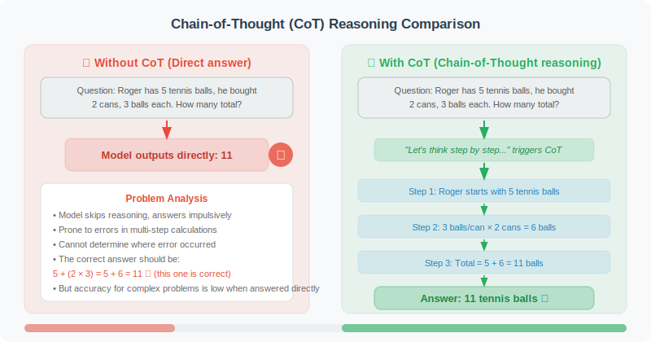
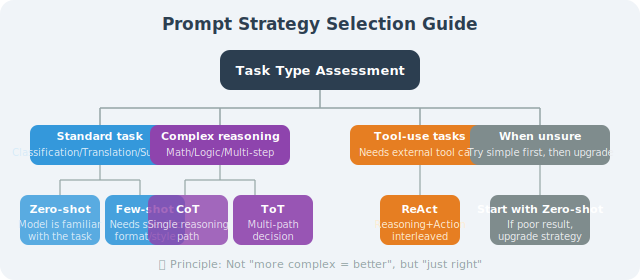

# Few-shot / Zero-shot / Chain-of-Thought Prompting Strategies

After mastering the basics of Prompt Engineering, let's learn several research-validated prompting strategies. These strategies can significantly improve LLM performance when facing complex tasks.

> 📄 **Academic Background**: Few-shot learning was systematically studied by Brown et al. in the GPT-3 paper [1], proving that large models can adapt to new tasks with just a few examples. Chain-of-Thought (CoT) was proposed by Wei et al. [2] — simply adding "Let's think step by step" to a prompt dramatically improves LLM reasoning. On the GSM8K math reasoning benchmark, CoT improved PaLM 540B's accuracy from 17.9% to 58.1%.

## Zero-shot: Direct Questioning

**Zero-shot** is the simplest strategy: directly tell the model what the task is, without providing any examples.

```python
from openai import OpenAI

client = OpenAI()

def zero_shot_classify(text: str) -> str:
    """Zero-shot sentiment classification"""
    response = client.chat.completions.create(
        model="gpt-4o",
        messages=[
            {
                "role": "system",
                "content": "You are a text classification expert."
            },
            {
                "role": "user",
                "content": f"""
Classify the sentiment of the following review. Return only one of: Positive, Negative, Neutral.

Review: {text}

Classification:"""
            }
        ]
    )
    return response.choices[0].message.content.strip()

# Test
texts = [
    "This product is amazing — it completely exceeded my expectations!",
    "It's okay, nothing special.",
    "Terrible quality, total waste of money. Not recommended."
]

for text in texts:
    result = zero_shot_classify(text)
    print(f"Text: {text[:40]}... → {result}")
```

**When to use Zero-shot:**
- Common tasks with clear descriptions that the model is familiar with
- Rapid prototype validation
- Scenarios with high latency and cost requirements

## Few-shot: Example-Guided Learning

**Few-shot** provides a few examples to help the model understand the expected input-output pattern.

```python
def few_shot_classify(text: str) -> str:
    """Few-shot sentiment classification — guided by examples"""
    
    # Carefully selected examples (covering different cases)
    examples = [
        ("The camera on this phone is stunning and the battery life is great!", "Positive"),
        ("Shipping was way too slow — waited two weeks. Very disappointed.", "Negative"),
        ("Product matches the description. Packaging was intact.", "Neutral"),
        ("Customer service was super helpful and resolved my issue quickly. Great experience!", "Positive"),
        ("A bit pricey, but the quality is genuinely good.", "Neutral"),
    ]
    
    # Build the Few-shot Prompt
    few_shot_prompt = "Classify the sentiment of the following reviews (Positive/Negative/Neutral).\n\n"
    
    for example_text, label in examples:
        few_shot_prompt += f"Review: {example_text}\nSentiment: {label}\n\n"
    
    few_shot_prompt += f"Review: {text}\nSentiment:"
    
    response = client.chat.completions.create(
        model="gpt-4o",
        messages=[{"role": "user", "content": few_shot_prompt}]
    )
    return response.choices[0].message.content.strip()

# Few-shot is generally more stable on complex classification tasks
result = few_shot_classify("I have to say, the price is a bit high, but the product itself has no major issues.")
print(f"Classification: {result}")
```

**Key techniques for Few-shot:**

```python
def create_few_shot_prompt(task_description: str, 
                            examples: list[tuple],
                            new_input: str) -> str:
    """
    General-purpose Few-shot Prompt builder
    
    Args:
        task_description: Description of the task
        examples: [(input, output), ...] list of examples
        new_input: The new input to process
    """
    prompt = f"{task_description}\n\n"
    
    prompt += "## Examples\n\n"
    for i, (inp, out) in enumerate(examples, 1):
        prompt += f"Example {i}:\n"
        prompt += f"Input: {inp}\n"
        prompt += f"Output: {out}\n\n"
    
    prompt += f"## Now process the following\n"
    prompt += f"Input: {new_input}\n"
    prompt += "Output:"
    
    return prompt

# Usage example: code comment generation
examples = [
    (
        "def add(a, b): return a + b",
        "# Adds two numbers and returns the result\ndef add(a, b): return a + b"
    ),
    (
        "def is_even(n): return n % 2 == 0",
        "# Checks if a number is even, returns a boolean\ndef is_even(n): return n % 2 == 0"
    ),
]

new_code = "def factorial(n): return 1 if n <= 1 else n * factorial(n-1)"
prompt = create_few_shot_prompt(
    "Add a one-line comment to the following Python function",
    examples,
    new_code
)
print(prompt)
```

**Example selection principles:**
1. **Representativeness**: Cover various cases of the task (including edge cases)
2. **Diversity**: Don't use all similar examples
3. **Quality**: The examples themselves must be correct
4. **Order**: The style of the last example has the greatest influence

## Chain-of-Thought (CoT): Making the Model "Think It Through"

**Chain-of-Thought (CoT)** is a revolutionary prompting strategy: by having the model show its reasoning process, it significantly improves accuracy on complex problems.

> 📄 **Paper Source**: CoT was first proposed by the Google Brain team in *"Chain-of-Thought Prompting Elicits Reasoning in Large Language Models"* (Wei et al., 2022). The paper found that simply adding reasoning steps to Few-shot examples caused the model's accuracy on the GSM8K math reasoning dataset to jump from 17.7% to 58.1% — just by changing the prompt format, without modifying any model parameters. This discovery revealed a profound truth: **large language models already have reasoning capabilities; we just need to "activate" them in the right way.**



```python
def solve_with_cot(problem: str) -> str:
    """Use Chain-of-Thought to solve complex problems"""
    
    response = client.chat.completions.create(
        model="gpt-4o",
        messages=[
            {
                "role": "system",
                "content": """When solving problems, strictly follow these steps:
1. Understand the problem (restate it in 1–2 sentences)
2. Analyze the given conditions
3. Formulate a solution approach
4. Derive step by step
5. State the conclusion and verify

Label each step clearly."""
            },
            {
                "role": "user",
                "content": problem
            }
        ]
    )
    return response.choices[0].message.content

# Math reasoning problem
problem = """
A train travels at 120 km/h. How many minutes does it take to cover 180 kilometers?
"""

result = solve_with_cot(problem)
print(result)
```

**The Zero-shot CoT Magic Phrase:**

> 📄 **Paper Source**: *"Large Language Models are Zero-Shot Reasoners"* (Kojima et al., 2022) discovered a surprising fact — simply appending *"Let's think step by step"* to the end of a Prompt can trigger CoT reasoning without providing any reasoning examples. This means the model's reasoning ability is "built-in" and can be activated with a simple trigger phrase.

```python
def zero_shot_cot(question: str) -> str:
    """Zero-shot Chain-of-Thought: trigger reasoning with the magic phrase"""
    
    # Step 1: Trigger reasoning
    response1 = client.chat.completions.create(
        model="gpt-4o",
        messages=[
            {
                "role": "user",
                "content": f"{question}\n\nLet's think step by step:"
            }
        ]
    )
    
    reasoning = response1.choices[0].message.content
    
    # Step 2: Give the final answer based on the reasoning
    response2 = client.chat.completions.create(
        model="gpt-4o",
        messages=[
            {"role": "user", "content": f"{question}\n\nLet's think step by step:"},
            {"role": "assistant", "content": reasoning},
            {"role": "user", "content": "Based on the reasoning above, please give a concise final answer:"}
        ]
    )
    
    return {
        "reasoning": reasoning,
        "answer": response2.choices[0].message.content
    }

result = zero_shot_cot("If a train travels at 120 km/h, how many minutes does it take to cover 180 km?")
print("Reasoning process:", result["reasoning"])
print("\nFinal answer:", result["answer"])
```

## Advanced Strategy: Tree-of-Thought (ToT)

**Tree-of-Thought** is an upgrade to CoT: it has the model explore multiple reasoning paths and select the optimal solution.

> 📄 **Paper Source**: *"Tree of Thoughts: Deliberate Problem Solving with Large Language Models"* (Yao et al., 2023). Unlike CoT's "one path to the end," ToT has the model generate multiple candidate thoughts at each step, then uses an evaluation function to judge which thoughts are more promising, ultimately finding the optimal reasoning path like a search tree. The paper's experiments on the Game of 24 were especially impressive — standard CoT solved only 4% of problems, while ToT reached 74%.

```python
def tree_of_thought(problem: str, num_paths: int = 3) -> str:
    """
    Tree of Thought: generate multiple reasoning paths, evaluate, and select the best
    Suitable for complex decision problems
    """
    
    # Step 1: Generate multiple reasoning paths
    paths_prompt = f"""
Problem: {problem}

Please provide {num_paths} different solution approaches (start each with a brief title, then describe the core method):
"""
    
    paths_response = client.chat.completions.create(
        model="gpt-4o",
        messages=[{"role": "user", "content": paths_prompt}]
    )
    
    paths = paths_response.choices[0].message.content
    
    # Step 2: Evaluate each path
    eval_prompt = f"""
Problem: {problem}

Here are several solution approaches:
{paths}

Please evaluate each approach on:
1. Feasibility (1–10 score)
2. Time cost
3. Potential risks

Finally, recommend which approach and explain why.
"""
    
    eval_response = client.chat.completions.create(
        model="gpt-4o",
        messages=[{"role": "user", "content": eval_prompt}]
    )
    
    return {
        "paths": paths,
        "evaluation": eval_response.choices[0].message.content
    }

# Example: complex decision problem
problem = """
I need to learn Python for data analysis work within 3 months.
I only have 2 hours per day to study, and I have some programming background (basic HTML/CSS).
How should I plan my learning path?
"""

result = tree_of_thought(problem)
print("Multi-path exploration:\n", result["paths"])
print("\nEvaluation & Recommendation:\n", result["evaluation"])
```

## ReAct: Interweaving Reasoning and Action

**ReAct (Reasoning + Acting)** is one of the most important prompting strategies in Agent development (covered in depth in Chapter 6).

> 📄 **Paper Source**: *"ReAct: Synergizing Reasoning and Acting in Language Models"* (Yao et al., 2022). ReAct's core insight is: **pure reasoning (CoT) and pure action (tool calling) are both insufficient — interweaving the two achieves the best results.** On the HotpotQA multi-hop reasoning task, ReAct outperformed pure CoT by 6 percentage points; on the ALFWorld interactive task, it outperformed pure action mode by 34 percentage points. This paper directly established the foundational architecture of modern Agents.

```python
react_prompt = """
You are an AI assistant that can use tools. When solving problems, strictly follow this format:

Thought: Analyze the current situation and decide the next step
Action: Choose and use a tool
Observation: Record the result returned by the tool
... (repeat until the problem is solved)
Answer: Final answer

Available tools:
- search(query): Search the internet
- calculate(expression): Evaluate a math expression
- get_weather(city): Get weather information

---
Question: What is the temperature in New York today in Celsius? What is it in Fahrenheit?

Thought: I need to get New York's current temperature first, then convert the units.
Action: get_weather("New York")
Observation: New York today: 15°C
Thought: I have the temperature. Now I need to convert 15°C to Fahrenheit using F = C × 9/5 + 32
Action: calculate("15 * 9/5 + 32")
Observation: 59.0
Answer: New York's temperature today is 15°C, which is 59.0°F.
"""

# This pattern will be implemented in detail in Chapter 6
```

## Prompting Strategy Selection Guide



## Practice: Comprehensive Strategy Comparison

```python
import time

def benchmark_strategies(question: str) -> dict:
    """Compare the effect of different strategies on the same question"""
    
    strategies = {
        "zero_shot": {
            "messages": [{"role": "user", "content": question}]
        },
        "cot": {
            "messages": [{"role": "user", "content": f"{question}\n\nLet's think step by step:"}]
        },
        "few_shot_cot": {
            "messages": [
                {
                    "role": "system",
                    "content": "You are a logical reasoning expert. When solving problems, first analyze the conditions, then derive step by step."
                },
                {
                    "role": "user",
                    "content": """Example:
Problem: 5 people share 12 apples. How many does each person get on average?
Analysis: Total is 12, number of people is 5, perform division
Calculation: 12 ÷ 5 = 2.4
Answer: Each person gets 2.4 apples on average.

Now solve: """ + question
                }
            ]
        }
    }
    
    results = {}
    for name, config in strategies.items():
        start = time.time()
        response = client.chat.completions.create(
            model="gpt-4o-mini",
            **config
        )
        elapsed = time.time() - start
        
        results[name] = {
            "answer": response.choices[0].message.content,
            "tokens": response.usage.total_tokens,
            "time": f"{elapsed:.2f}s"
        }
    
    return results

# Test a complex reasoning problem
question = "In a class of 40 students, 60% like math and 75% like language arts. What is the minimum number of students who like both?"
results = benchmark_strategies(question)

for strategy, data in results.items():
    print(f"\nStrategy: {strategy}")
    print(f"Token usage: {data['tokens']}")
    print(f"Time: {data['time']}")
    print(f"Answer: {data['answer'][:200]}...")
```

---

## Summary

| Strategy | Best For | Pros | Cons |
|----------|---------|------|------|
| Zero-shot | Common standard tasks | Simple, fast, token-efficient | Poor on complex tasks |
| Few-shot | Specific format/style needed | Stable and controllable | Uses more tokens |
| CoT | Reasoning, calculation, multi-step | High accuracy | Slower, more tokens |
| ToT | Complex decision problems | Explores multiple solutions | Slowest, most expensive |
| ReAct | Agents requiring tool calls | Combines reasoning and action | Complex to implement |

Choosing the right strategy is an important skill in Agent development — it's not "the more complex the better," but "just right."

### 📖 Further Reading: Core Papers

The prompting strategies in this section all have solid academic research foundations. Here are the most important papers, in chronological order:

| Paper | Authors | Year | Core Contribution |
|-------|---------|------|------------------|
| *Chain-of-Thought Prompting Elicits Reasoning in Large Language Models* | Wei et al. (Google Brain) | 2022 | First proposed CoT; proved that adding reasoning steps to examples dramatically improves math and logical reasoning |
| *Large Language Models are Zero-Shot Reasoners* | Kojima et al. | 2022 | Discovered that "Let's think step by step" alone activates Zero-shot CoT |
| *Self-Consistency Improves Chain of Thought Reasoning* | Wang et al. (Google Brain) | 2023 | Proposed Self-Consistency: sample multiple CoT paths and take the majority vote, further improving reasoning accuracy |
| *ReAct: Synergizing Reasoning and Acting in Language Models* | Yao et al. (Princeton) | 2022 | Interweaved reasoning and action, establishing the ReAct architecture of modern Agents |
| *Tree of Thoughts: Deliberate Problem Solving with LLMs* | Yao et al. (Princeton) | 2023 | Upgraded CoT with multi-path exploration + backtracking search, dramatically outperforming CoT on complex reasoning |

> 💡 **Frontier Developments**: Since 2024–2025, reasoning models have become the core direction of LLM development. OpenAI's o1/o3/o4-mini series, Anthropic's Claude 4 Extended Thinking, DeepSeek-R2, and other models have "internalized" CoT reasoning into the model itself (rather than relying on prompts), demonstrating astonishing capabilities in math, programming competitions, and scientific reasoning. Google's Gemini 2.5 Pro also introduced a "Thinking Mode." This shows that CoT has evolved from a "prompting trick" into a core paradigm of model training — future LLMs will increasingly "know how to think." For Agent developers, reasoning models dramatically improve planning capabilities in complex multi-step tasks.

> 📖 **More Paper Analysis**: For a deep dive into ReAct, see [6.6 Paper Readings: Frontiers in Planning and Reasoning](../chapter_planning/06_paper_readings.md). For Self-Consistency's application in hallucination mitigation, see [17.6 Paper Readings: Frontiers in Safety and Reliability](../chapter_security/06_paper_readings.md).

---

## References

[1] BROWN T B, MANN B, RYDER N, et al. Language models are few-shot learners[C]//NeurIPS. 2020.

[2] WEI J, WANG X, SCHUURMANS D, et al. Chain-of-thought prompting elicits reasoning in large language models[C]//NeurIPS. 2022.

[3] KOJIMA T, GU S, REID M, et al. Large language models are zero-shot reasoners[C]//NeurIPS. 2022.

[4] WANG X, WEI J, SCHUURMANS D, et al. Self-consistency improves chain of thought reasoning in language models[C]//ICLR. 2023.

[5] YAO S, YU D, ZHAO J, et al. Tree of thoughts: Deliberate problem solving with large language models[C]//NeurIPS. 2023.

---

*Next section: [3.4 Model API Basics (OpenAI / Open-Source Models)](./04_api_basics.md)*
