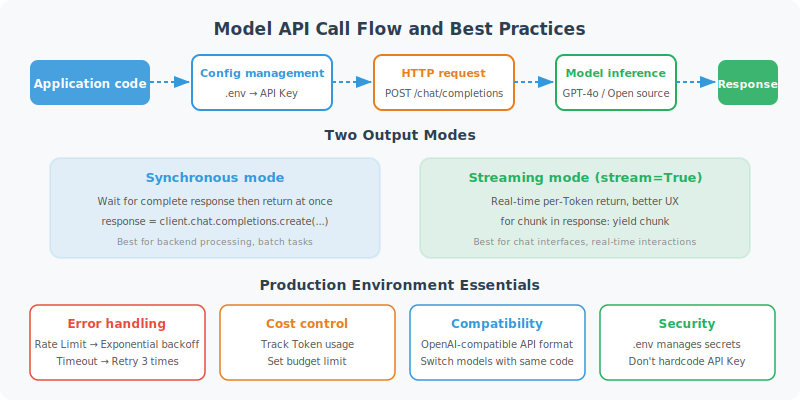

# Model API Basics (OpenAI / Open-Source Models)

Enough theory — let's write some code! This section will walk you through your first real model API call and help you master production-essential skills like streaming output and error handling.



## Environment Setup

```bash
# Install required libraries
pip install openai python-dotenv

# Create a .env file to store your API Key (don't hardcode it in your code!)
echo "OPENAI_API_KEY=your-api-key-here" > .env
```

```python
# config.py: Centralized configuration management
import os
from dotenv import load_dotenv

load_dotenv()  # Load environment variables from .env file

OPENAI_API_KEY = os.getenv("OPENAI_API_KEY")
if not OPENAI_API_KEY:
    raise ValueError("Please set the OPENAI_API_KEY environment variable")
```

## OpenAI SDK: The Most Basic Call

```python
from openai import OpenAI
import os

client = OpenAI(api_key=os.getenv("OPENAI_API_KEY"))

# The simplest call
def simple_chat(message: str) -> str:
    """The most basic single-turn conversation"""
    response = client.chat.completions.create(
        model="gpt-4o-mini",  # Cheap and fast entry-level model
        messages=[
            {"role": "user", "content": message}
        ]
    )
    return response.choices[0].message.content

# Test
answer = simple_chat("Explain Python's GIL in one sentence.")
print(answer)
```

## Multi-Turn Conversation Management

In Agent development, maintaining conversation history is key:

```python
class ChatSession:
    """Simple wrapper for managing multi-turn conversation history"""
    
    def __init__(self, system_prompt: str = None, model: str = "gpt-4o-mini"):
        self.model = model
        self.messages = []
        
        if system_prompt:
            self.messages.append({
                "role": "system",
                "content": system_prompt
            })
    
    def chat(self, user_message: str) -> str:
        """Send a message and get a reply"""
        # Add user message
        self.messages.append({
            "role": "user",
            "content": user_message
        })
        
        # Call the API
        response = client.chat.completions.create(
            model=self.model,
            messages=self.messages
        )
        
        # Get the reply
        assistant_message = response.choices[0].message.content
        
        # Save to history
        self.messages.append({
            "role": "assistant",
            "content": assistant_message
        })
        
        return assistant_message
    
    def clear_history(self):
        """Clear conversation history (keep the system prompt)"""
        system_msgs = [m for m in self.messages if m["role"] == "system"]
        self.messages = system_msgs
    
    def get_history(self) -> list:
        """Get conversation history"""
        return [m for m in self.messages if m["role"] != "system"]

# Usage example
session = ChatSession(
    system_prompt="You are a professional Python programming tutor. Keep explanations concise and easy to understand."
)

# Multi-turn conversation
questions = [
    "What is a decorator?",
    "Can you give a practical usage example?",
    "How do you pass parameters to a decorator?"
]

for q in questions:
    print(f"\nUser: {q}")
    answer = session.chat(q)
    print(f"Assistant: {answer}")
```

## Streaming Output: Display Generated Content in Real Time

Streaming output improves user experience — no need to wait for the model to finish generating before displaying:

```python
def stream_chat(message: str, system: str = None) -> str:
    """Streaming output — print generated content in real time"""
    
    messages = []
    if system:
        messages.append({"role": "system", "content": system})
    messages.append({"role": "user", "content": message})
    
    # stream=True enables streaming mode
    stream = client.chat.completions.create(
        model="gpt-4o",
        messages=messages,
        stream=True
    )
    
    full_response = ""
    print("Assistant: ", end="", flush=True)
    
    for chunk in stream:
        # Each chunk contains a small piece of text
        if chunk.choices[0].delta.content is not None:
            content = chunk.choices[0].delta.content
            print(content, end="", flush=True)
            full_response += content
    
    print()  # New line
    return full_response

# Test streaming output
result = stream_chat("Write a short poem about Python")
print(f"\nFull content ({len(result)} characters)")
```

```python
# Async streaming output (recommended for production)
import asyncio
from openai import AsyncOpenAI

async_client = AsyncOpenAI()

async def async_stream_chat(message: str) -> str:
    """Async streaming output"""
    stream = await async_client.chat.completions.create(
        model="gpt-4o",
        messages=[{"role": "user", "content": message}],
        stream=True
    )
    
    full_response = ""
    async for chunk in stream:
        if chunk.choices[0].delta.content is not None:
            content = chunk.choices[0].delta.content
            print(content, end="", flush=True)
            full_response += content
    
    return full_response

# Run the async function
asyncio.run(async_stream_chat("Explain what asynchronous programming is"))
```

## Error Handling: Essential for Production

```python
from openai import OpenAI, RateLimitError, APIError, APITimeoutError
import time
import logging

logger = logging.getLogger(__name__)

def robust_chat(
    message: str,
    max_retries: int = 3,
    retry_delay: float = 1.0
) -> str:
    """Robust call with retry mechanism"""
    
    for attempt in range(max_retries):
        try:
            response = client.chat.completions.create(
                model="gpt-4o-mini",
                messages=[{"role": "user", "content": message}],
                timeout=30  # 30-second timeout
            )
            return response.choices[0].message.content
            
        except RateLimitError as e:
            # Rate limit hit — wait and retry
            wait_time = retry_delay * (2 ** attempt)  # Exponential backoff
            logger.warning(f"Rate limit hit. Retrying in {wait_time}s (attempt {attempt+1})")
            time.sleep(wait_time)
            
        except APITimeoutError:
            logger.warning(f"Request timed out. Retrying (attempt {attempt+1})")
            time.sleep(retry_delay)
            
        except APIError as e:
            if e.status_code >= 500:  # Server error — can retry
                logger.error(f"API server error {e.status_code}. Retrying.")
                time.sleep(retry_delay)
            else:  # Client error (400, etc.) — don't retry
                raise
    
    raise RuntimeError(f"API call failed after {max_retries} retries")

# Usage example
try:
    result = robust_chat("Hello! How are you today?")
    print(result)
except RuntimeError as e:
    print(f"Call failed: {e}")
```

## Calling Open-Source Models: Ollama Local Deployment

If you don't want to rely on a paid API, you can run open-source models locally:

```bash
# Install Ollama (local model runtime framework)
# macOS/Linux:
curl -fsSL https://ollama.ai/install.sh | sh

# Pull and run a model
ollama pull llama4
ollama run llama4
```

```python
# Ollama is compatible with the OpenAI API format!
from openai import OpenAI

# Point to the local Ollama service
ollama_client = OpenAI(
    base_url="http://localhost:11434/v1",
    api_key="ollama"  # Ollama doesn't need a real API Key
)

def chat_with_ollama(message: str, model: str = "llama4") -> str:
    """Call a local Ollama model"""
    response = ollama_client.chat.completions.create(
        model=model,
        messages=[{"role": "user", "content": message}]
    )
    return response.choices[0].message.content

# Usage is exactly the same!
result = chat_with_ollama("Hello, introduce yourself")
print(result)
```

## Calling Other Models: DeepSeek and More

```python
# DeepSeek — excellent cost-performance ratio
from openai import OpenAI

deepseek_client = OpenAI(
    api_key=os.getenv("DEEPSEEK_API_KEY"),
    base_url="https://api.deepseek.com"
)

def chat_with_deepseek(message: str) -> str:
    response = deepseek_client.chat.completions.create(
        model="deepseek-chat",
        messages=[{"role": "user", "content": message}]
    )
    return response.choices[0].message.content

# Anthropic Claude (via official SDK)
import anthropic

claude_client = anthropic.Anthropic(api_key=os.getenv("ANTHROPIC_API_KEY"))

def chat_with_claude(message: str) -> str:
    response = claude_client.messages.create(
        model="claude-3-5-sonnet-20241022",
        max_tokens=1024,
        messages=[{"role": "user", "content": message}]
    )
    return response.content[0].text
```

## Complete LLM Call Wrapper

In real projects, it's recommended to wrap a unified LLM client:

```python
from enum import Enum
from dataclasses import dataclass
from typing import Optional
import os

class ModelProvider(Enum):
    OPENAI = "openai"
    OLLAMA = "ollama"
    DEEPSEEK = "deepseek"
    QWEN = "qwen"

@dataclass
class LLMConfig:
    provider: ModelProvider
    model: str
    temperature: float = 0.7
    max_tokens: int = 2000
    timeout: int = 30

class UnifiedLLMClient:
    """Unified LLM call client supporting multiple providers"""
    
    def __init__(self, config: LLMConfig):
        self.config = config
        self.client = self._create_client()
    
    def _create_client(self) -> OpenAI:
        """Create the corresponding client based on configuration"""
        configs = {
            ModelProvider.OPENAI: {
                "api_key": os.getenv("OPENAI_API_KEY"),
                "base_url": None
            },
            ModelProvider.OLLAMA: {
                "api_key": "ollama",
                "base_url": "http://localhost:11434/v1"
            },
            ModelProvider.DEEPSEEK: {
                "api_key": os.getenv("DEEPSEEK_API_KEY"),
                "base_url": "https://api.deepseek.com"
            },
            ModelProvider.QWEN: {
                "api_key": os.getenv("DASHSCOPE_API_KEY"),
                "base_url": "https://dashscope.aliyuncs.com/compatible-mode/v1"
            },
        }
        
        provider_config = configs[self.config.provider]
        return OpenAI(**{k: v for k, v in provider_config.items() if v is not None})
    
    def chat(self, messages: list, stream: bool = False):
        """Unified conversation interface"""
        kwargs = {
            "model": self.config.model,
            "messages": messages,
            "temperature": self.config.temperature,
            "max_tokens": self.config.max_tokens,
            "stream": stream
        }
        
        return self.client.chat.completions.create(**kwargs)
    
    def simple_chat(self, message: str, system: str = None) -> str:
        """Simple single-turn conversation"""
        messages = []
        if system:
            messages.append({"role": "system", "content": system})
        messages.append({"role": "user", "content": message})
        
        response = self.chat(messages)
        return response.choices[0].message.content

# Usage examples
# Using OpenAI
openai_llm = UnifiedLLMClient(LLMConfig(
    provider=ModelProvider.OPENAI,
    model="gpt-4o-mini",
    temperature=0.7
))

# Using local Ollama
local_llm = UnifiedLLMClient(LLMConfig(
    provider=ModelProvider.OLLAMA,
    model="llama4",
    temperature=0.5
))

# Regardless of provider, the interface is identical
result = openai_llm.simple_chat("What are the main differences between Python and JavaScript?")
print(result)
```

---

## Summary

This section covered the core skills for LLM API calls:

| Skill | Key Points |
|-------|-----------|
| Basic call | `client.chat.completions.create()` + messages list |
| Multi-turn conversation | Maintain messages history, including assistant messages |
| Streaming output | `stream=True`, iterate over chunks |
| Error handling | Retry mechanism + exponential backoff |
| Multi-model support | Most open-source models are compatible with the OpenAI format |

In the next section, we'll dive into the key parameters that affect model output.

---

*Next section: [3.5 Tokens, Temperature, and Model Parameters Explained](./05_model_parameters.md)*