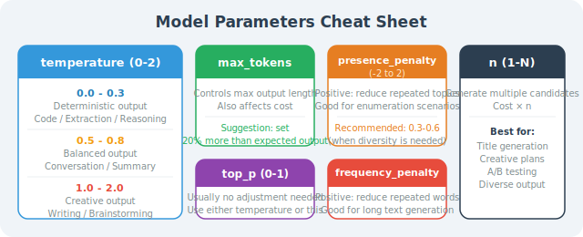

# Tokens, Temperature, and Model Parameters Explained

Model parameters are key factors that affect the quality, cost, and stability of LLM output. In 2026, as model capabilities evolve at breakneck speed (Claude 4.6, Gemini 3.1 Pro, DeepSeek-R1, etc.), understanding these underlying parameters lets you control Agent behavior and costs with precision.

## Token: The Model's "Basic Unit"

A Token is not a character, not a word — it is the **smallest unit** by which a model processes text.

```python
import tiktoken  # Token counting library (using OpenAI's system as an example to demonstrate core principles;
                 # in 2026, different vendors like Qwen and Gemini have their own tokenizers, but the underlying logic is the same)

def count_tokens(text: str, model_encoding: str = "cl100k_base") -> int:
    """Count the number of tokens in a text"""
    encoding = tiktoken.get_encoding(model_encoding)
    tokens = encoding.encode(text)
    return len(tokens)

def visualize_tokens(text: str, model_encoding: str = "cl100k_base"):
    """Visualize token splitting"""
    encoding = tiktoken.get_encoding(model_encoding)
    tokens = encoding.encode(text)
    
    print(f"Text: {text}")
    print(f"Token count: {len(tokens)}")
    print(f"Token list: {[encoding.decode([t]) for t in tokens]}")
    print()

# English tokenization example
visualize_tokens("Hello, how are you today?")
# Token list: ['Hello', ',', ' how', ' are', ' you', ' today', '?']
# Token count: 7

# Code token count
code = """
def fibonacci(n):
    if n <= 1:
        return n
    return fibonacci(n-1) + fibonacci(n-2)
"""
visualize_tokens(code)
```

**The relationship between Tokens and billing:**

> ⏰ *Note: The pricing data below is based on publicly available pricing from vendor websites as of March 2026. Model prices change frequently — always refer to the latest official documentation.*

```python
# Token cost calculator (price unit: USD per million tokens, latest data as of 2026-03)
PRICE_PER_1M_TOKENS = {
    "claude-4.6-sonnet": {"input": 3.0, "output": 15.0},      # Strongest reasoning, higher price
    "gemini-3.1-pro-preview": {"input": 2.0, "output": 12.0}, # King of ultra-long context and multimodal
    "qwen-3.5-max": {"input": 1.2, "output": 6.0},            # Business workhorse, great value
    "kimi-2.5": {"input": 1.0, "output": 3.0},                # Suitable for ultra-long text retrieval
    "deepseek-r1": {"input": 0.55, "output": 2.19},           # Best value reasoning model
}

def estimate_cost(
    input_text: str,
    expected_output_tokens: int,
    model: str = "qwen-3.5-max"
) -> dict:
    """Estimate API call cost"""
    input_tokens = count_tokens(input_text)
    
    price = PRICE_PER_1M_TOKENS.get(model, {"input": 1.0, "output": 2.0})
    input_cost = (input_tokens / 1_000_000) * price["input"]
    output_cost = (expected_output_tokens / 1_000_000) * price["output"]
    
    return {
        "input_tokens": input_tokens,
        "expected_output_tokens": expected_output_tokens,
        "total_tokens": input_tokens + expected_output_tokens,
        "estimated_cost_usd": input_cost + output_cost,
    }

# Estimate cost
prompt = "Please write a 500-word article about Python asynchronous programming"
cost = estimate_cost(prompt, 500, "qwen-3.5-max")
print(f"Input tokens: {cost['input_tokens']}")
print(f"Estimated total cost: ${cost['estimated_cost_usd']:.4f}")
```

**Key rules for Token usage:**
- English: ~1 Token/word
- Code: ~1–2 Tokens/line
- Numbers and punctuation: ~1 Token each

### Token Consumption Breakdown by Content Type

You might intuitively think "1 character = 1 Token," but the reality is far more complex. Let's break down Token consumption for different content types with concrete examples:

```python
import tiktoken

encoding = tiktoken.get_encoding("cl100k_base")

# === English text ===
# Common English words are usually 1 Token; short/common combinations may be merged
samples_en = {
    "Hello":              encoding.encode("Hello"),           # 1 Token
    "artificial":         encoding.encode("artificial"),      # 1 Token (common word)
    "superintelligence":  encoding.encode("superintelligence"),  # 2 Tokens (long/rare word)
    "Hello, world!":      encoding.encode("Hello, world!"),   # 4 Tokens
    "The quick brown fox jumps over the lazy dog.":
        encoding.encode("The quick brown fox jumps over the lazy dog."),  # 10 Tokens
}

for text, tokens in samples_en.items():
    decoded = [encoding.decode([t]) for t in tokens]
    print(f"'{text}' → {len(tokens)} Token(s), split: {decoded}")

# Rules:
# - Common English words are ~1 Token/word; uncommon or very long words split into 2–3 Tokens
# - Spaces are usually merged with the following word (e.g., ' how')
# - On average, English text is ~1 Token ≈ 4 characters (including spaces)
```

```python
# === Punctuation ===
samples_punct = {
    ",":    encoding.encode(","),      # English comma: 1 Token
    ".":    encoding.encode("."),      # English period: 1 Token
    "!?":   encoding.encode("!?"),     # Two punctuation marks → usually 2 Tokens
    "...":  encoding.encode("..."),    # Ellipsis: may be 1 Token
}

for text, tokens in samples_punct.items():
    decoded = [encoding.decode([t]) for t in tokens]
    print(f"'{text}' → {len(tokens)} Token(s), split: {decoded}")
```

```python
# === Numbers ===
samples_num = {
    "42":       encoding.encode("42"),         # 1 Token
    "3.14":     encoding.encode("3.14"),       # 2 Tokens (decimal point splits)
    "2026":     encoding.encode("2026"),       # 1 Token
    "1000000":  encoding.encode("1000000"),    # 1–2 Tokens
    "3.141592653589793": encoding.encode("3.141592653589793"),  # Multiple Tokens
}

for text, tokens in samples_num.items():
    decoded = [encoding.decode([t]) for t in tokens]
    print(f"'{text}' → {len(tokens)} Token(s), split: {decoded}")

# Rules:
# - 1–4 digit integers are usually 1 Token
# - Longer numbers are split, roughly 1 Token per 3–4 digits
# - Decimal points cause additional Token splits
```

**Image Token consumption (multimodal models):**

2026 is the year of multimodal Agent explosion. Models like Gemini 3.1 Pro or Claude 4.6 process images not by character count but by "image tiles":

```python
# General image Token consumption estimation (based on mainstream tiling logic)

def estimate_image_tokens(width: int, height: int, detail: str = "auto") -> int:
    """
    Estimate the number of tokens consumed by an image
    
    detail modes:
    - "low": Fixed base consumption regardless of image size (typically ~85 Tokens)
    - "high": Calculated based on image dimensions, split into tiles, may consume hundreds to thousands of Tokens
    - "auto": Model automatically selects
    """
    if detail == "low":
        return 85  # Fixed consumption
    
    # high detail mode calculation (using a typical 512x512 tiling algorithm):
    # 1. Limit max dimension and scale proportionally
    max_dim = max(width, height)
    if max_dim > 2048:
        scale = 2048 / max_dim
        width = int(width * scale)
        height = int(height * scale)
    
    # 2. Calculate how many 512x512 tiles are needed
    tiles_x = (width + 511) // 512   # Round up
    tiles_y = (height + 511) // 512
    num_tiles = tiles_x * tiles_y
    
    # 3. Each tile consumes a fixed number of Tokens (e.g., 170) + base Tokens (e.g., 85)
    total_tokens = num_tiles * 170 + 85
    return total_tokens

# Token consumption for common image sizes
print("=== Multimodal Image Token Consumption Estimate (high detail mode) ===")
image_sizes = [
    (256, 256,   "Thumbnail/icon"),
    (512, 512,   "Small image"),
    (1024, 768,  "Regular photo"),
    (1920, 1080, "Full HD screenshot"),
    (4096, 2160, "4K image"),
]

for w, h, desc in image_sizes:
    tokens_low = estimate_image_tokens(w, h, "low")
    tokens_high = estimate_image_tokens(w, h, "high")
    print(f"  {desc} ({w}x{h}): low={tokens_low}, high={tokens_high} Tokens")
```

> 💡 **Practical tip:** If your Agent frequently processes images (e.g., web UI screenshot analysis), compress images to below 1080p in your local code first, or use `detail="low"` for non-OCR scenarios. This can save you a significant amount in API costs!

Quick reference table for Token consumption by content type:

| Content Type | Example | Approx. Token Cost |
|-------------|---------|-------------------|
| English word | "Hello" | 1 Token/word |
| English long/rare word | "superintelligence" | 2–3 Tokens/word |
| Punctuation | `, . ! ?` | 1 Token each |
| Number (1–4 digits) | "42", "2026" | 1 Token |
| Long number | "3.141592653589793" | Split per 3–4 digits |
| Code | Python/JS, etc. | ~1–2 Tokens/line |
| Image (low) | Any size | Fixed 85 Tokens |
| Image (high) | 1920×1080 | ~1445 Tokens |

## Temperature: The Creativity Dial

Temperature controls the **randomness** of output and is one of the most important parameters:

```python
from openai import OpenAI
client = OpenAI()  # Compatible with mainstream LLM API formats

def test_temperature(prompt: str, temperatures: list, runs: int = 3):
    """Compare output effects at different Temperature values"""
    
    for temp in temperatures:
        print(f"\n{'='*50}")
        print(f"Temperature = {temp}")
        print('='*50)
        
        for i in range(runs):
            response = client.chat.completions.create(
                model="gpt-4o-mini",
                messages=[{"role": "user", "content": prompt}],
                temperature=temp,
                max_tokens=50
            )
            print(f"  Run {i+1}: {response.choices[0].message.content}")

# Test creative writing (higher Temperature is better)
test_temperature(
    "Describe spring in one sentence",
    temperatures=[0.0, 0.7, 1.5],
    runs=3
)
# Temperature=0.0: Output is identical every time (absolute determinism)
# Temperature=0.7: Some variation, language is natural and fluent
# Temperature=1.5: Highly divergent creativity, but words may jump or be incoherent
```

**Recommended Temperature values for different scenarios:**

```python
TEMPERATURE_GUIDE = {
    "code_generation": 0.1,          # Requires precision, low randomness
    "data_extraction_json": 0.0,     # Complete determinism, prevents crashes
    "qa_factual": 0.3,               # Slightly stable
    "copywriting_summary": 0.7,      # Balance creativity and accuracy
    "brainstorming_creative": 1.0,   # Encourage diversity
    "poetry_creative_writing": 1.2,  # High creativity
    "agent_logic_routing": 0.1,      # Tool calls need extreme stability
    "conversation_chat": 0.8,        # Natural conversation
}

def get_optimal_temperature(task_type: str) -> float:
    return TEMPERATURE_GUIDE.get(task_type, 0.7)
```

## Top-p: Another Way to Control Randomness

Top-p (also called Nucleus Sampling) dynamically truncates and samples from the set of highest-probability words, with the set size determined by p:

```python
# Using Top-p and Temperature together
response = client.chat.completions.create(
    model="gpt-4o-mini",
    messages=[{"role": "user", "content": "Write the opening of a short story about AI awakening"}],
    temperature=0.8,   # Controls degree of randomness
    top_p=0.9,         # Only sample from the top 90% of cumulative probability vocabulary
    max_tokens=200
)
```

**Difference between Temperature and Top-p:**

| Parameter | Mechanism | Industry Best Practice |
|-----------|-----------|----------------------|
| Temperature | Scales the entire probability distribution of all vocabulary | **Usually adjust this parameter first** |
| Top-p | Directly "cuts off" low-probability long-tail words | **Don't adjust both parameters significantly at the same time** |

Usually adjust one and keep the other at default (`temperature=1.0` or `top_p=1.0`).

## max_tokens: Control Output Length (⚠️ Hidden Trap for Reasoning Models)

```python
def chat_with_length_control(
    message: str,
    max_output_tokens: int = 500,
    model: str = "gpt-4o-mini"
) -> dict:
    """Control output length"""
    
    response = client.chat.completions.create(
        model=model,
        messages=[{"role": "user", "content": message}],
        max_tokens=max_output_tokens  # Limit generation length
    )
    
    usage = response.usage
    content = response.choices[0].message.content
    finish_reason = response.choices[0].finish_reason
    
    return {
        "content": content,
        "total_tokens": usage.total_tokens,
        "finish_reason": finish_reason  # "stop"=normal end, "length"=truncated at limit
    }

# Test
result = chat_with_length_control("Write a 500-word article", max_output_tokens=100)
if result["finish_reason"] == "length":
    print("⚠️ Output was truncated by max_tokens!")
```

> **🔥 2026 Critical Warning: The CoT Token Trap in Reasoning Models (e.g., DeepSeek-R1)**
> If you're using a "slow thinking" reasoning model like `DeepSeek-R1`, never set `max_tokens` too small!
> 
> Reasoning models output a large amount of internal "Chain of Thought" before giving the final answer. These thinking processes **are also subject to max_tokens and are billed**. If you set `max_tokens` to 500 to save money, the model may exhaust its quota during the thinking phase, and you won't even get the final answer.
> * **Best practice:** When calling reasoning models for complex planning, set `max_tokens` to 4000 or even 8000.

## Presence Penalty & Frequency Penalty: Control Repetition

```python
# These two parameters help prevent the model from repeating itself
response = client.chat.completions.create(
    model="gpt-4o-mini",
    messages=[{"role": "user", "content": "List 10 different startup directions"}],
    
    # presence_penalty: Penalizes any token that has already appeared (encourages new topics)
    # Range: -2.0 to 2.0; positive values reduce topic repetition
    presence_penalty=0.5,
    
    # frequency_penalty: Penalizes tokens proportional to how often they've appeared (encourages vocabulary diversity)
    # Range: -2.0 to 2.0; positive values reduce high-frequency words
    frequency_penalty=0.3,
)

# Suitable for: listing diverse options, generating long non-repetitive research reports
```

## stop: Custom Stop Conditions

```python
# Make the model stop abruptly at a specific string — extremely cost-effective for data extraction
response = client.chat.completions.create(
    model="gpt-4o-mini",
    messages=[{
        "role": "user",
        "content": "Please output in format:\nName:\nPrice:\nDescription:"
    }],
    stop=["Description:"],  # Once "Description:" is generated, immediately force-stop API generation
)

# Practical use case: structured data extraction without filler text
def extract_until_marker(text: str, stop_marker: str) -> str:
    """Extract content up to a marker, preventing the model from adding filler text afterward"""
    response = client.chat.completions.create(
        model="gpt-4o-mini",
        messages=[{"role": "user", "content": text}],
        stop=[stop_marker]
    )
    return response.choices[0].message.content
```

## n: Generate Multiple Candidate Results

```python
def generate_multiple_options(prompt: str, n: int = 3) -> list:
    """Generate multiple parallel candidate results in a single API call for downstream selection or scoring"""
    
    response = client.chat.completions.create(
        model="gpt-4o-mini",
        messages=[{"role": "user", "content": prompt}],
        n=n,             # Generate n different branch replies
        temperature=0.9  # Must increase temperature to ensure diversity across branches
    )
    
    return [choice.message.content for choice in response.choices]

# Suitable for: ad copy headline generation, A/B test proposals, multi-Agent debate drafts
titles = generate_multiple_options(
    "Generate 3 compelling titles for a technical blog post about multi-agent collaboration",
    n=3
)
for i, title in enumerate(titles, 1):
    print(f"Candidate {i}: {title}")
```

## Complete Parameter Reference & Agent Practice Recommendations

In real Agent architecture design, we typically wrap a routing factory that dynamically switches base models and parameter configurations based on task attributes:

```python
def create_agent_call(
    messages: list,
    task_type: str = "general",
    **override_params
) -> dict:
    """
    Best-practice Agent call factory
    Automatically matches the optimal 2026 model and parameters based on task type
    """
    
    # Dynamic routing presets for different task types
    task_presets = {
        "reasoning": {          # Complex reasoning, logic bug investigation
            "model": "deepseek-r1",  # Use a powerful reasoning model
            "temperature": 0.6,      # Reasoning models have internal exploration; don't need too low a temperature
            "max_tokens": 8000,      # Must reserve large token budget for CoT generation
        },
        "code": {               # Pure code writing/refactoring
            "model": "gpt-4o",
            "temperature": 0.1,
            "max_tokens": 4000,
        },
        "extraction": {         # Information extraction, intent classification, JSON generation
            "model": "gpt-4o-mini",
            "temperature": 0.0,      # Eliminate all randomness to prevent JSON parse failures
            "max_tokens": 500,
        },
        "creative": {           # Creative copywriting, brainstorming
            "model": "gpt-4o",
            "temperature": 0.9,
            "max_tokens": 1000,
            "presence_penalty": 0.3,
        },
        "general": {            # General conversation and standard instructions
            "model": "gpt-4o-mini",
            "temperature": 0.7,
            "max_tokens": 1500,
        }
    }
    
    params = task_presets.get(task_type, task_presets["general"])
    params.update(override_params)  # Allow external business layer to override defaults
    params["messages"] = messages
    
    response = client.chat.completions.create(**params)
    
    return {
        "content": response.choices[0].message.content,
        "usage": {
            "input": response.usage.prompt_tokens,
            "output": response.usage.completion_tokens,
            "total": response.usage.total_tokens
        },
        "model": response.model,
        "finish_reason": response.choices[0].finish_reason
    }

# Usage example: have the Agent extract conclusions from copy
result = create_agent_call(
    messages=[{"role": "user", "content": "Extract the user purchase intent rating from this text..."}],
    task_type="extraction"
)
print(f"Routed to model: {result['model']}")
print(f"Total token usage: {result['usage']['total']}")
```

## Parameter Quick Reference Card



---

## Section Summary

Understanding model parameters is a fundamental skill for Agent architects in 2026:

- **Tokens are the billing atom**: Multimodal image billing is especially prone to overruns — preprocessing compression is key.
- **Temperature determines stability**: Set to `0.0` for tool parameter extraction; set to `0.9+` for brainstorming.
- **Watch out for the max_tokens trap in reasoning models**: Models like `DeepSeek-R1` consume large amounts of hidden thinking Tokens — always leave enough quota to avoid truncation.
- **Dynamic model routing**: Different task types (extraction vs. reasoning vs. creative) should map to different parameter combinations and the best value-for-money model.

Mastering these parameters lets you achieve the perfect balance between quality, latency, and API costs, giving you true control over Agent behavior.

### 🤔 Thinking Exercises

1. An Agent is responsible for reviewing long advertising copy (potentially tens of thousands of words) for compliance. Which model would you choose for the best value, and how would you set `Temperature` and `max_tokens`?
2. If you notice that your Agent's weekly report summaries frequently use phrases like "overall," "it is worth noting," etc., which parameter should you adjust? Why?
3. Calculate: if you use `DeepSeek-R1` to build a problem-solving Agent that handles 1,000 requests per day, with an average input of 500 Tokens but an average CoT and output of 3,000 Tokens, what would the monthly cost be? How does this compare to using a standard model?

---

*Next chapter: [Chapter 4: Tool Calling (Tool Use / Function Calling)](../chapter_tools/README.md)*
