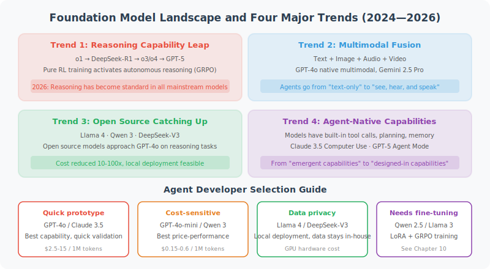

# Foundation Model Landscape and Selection Guide

> 🌍 *"Models iterate rapidly — today's SOTA may be tomorrow's baseline. But understanding the evolution trends lets you make better choices amid change."*

In the previous sections, we learned about the basic principles of LLMs, prompt engineering, API calls, and model parameters. That knowledge represents the "unchanging" underlying capabilities. This section discusses the "changing" part — **the technical frontier and industry landscape of foundation models**.

As an Agent developer, you don't need to train your own foundation model, but you must understand the capability boundaries and development trends of models — because **the choice of model directly determines the ceiling of your Agent**.



## 2024–2026: Four Major Trends in Foundation Models

### Trend 1: The Leap in Reasoning Capability

In September 2024, OpenAI's o1 first proved the feasibility of "trading more reasoning time for better results." In January 2025, the open-source release of DeepSeek-R1 ignited the democratization of reasoning models — it was the first to demonstrate how pure RL training (GRPO) could cause Chain-of-Thought capability to emerge spontaneously in a model.

In April 2025, OpenAI released o3 and o4-mini, achieving **multimodal reasoning** ("thinking while looking at images") and autonomous tool chain calls for the first time. In August 2025, **GPT-5** was officially released, with reasoning capability built in as a native feature, eliminating the need for a separate o-series model.

By early 2026, reasoning had become standard in all mainstream models:

| Model | Release | Reasoning Mode | Key Breakthrough |
|-------|---------|---------------|-----------------|
| **GPT-5** | 2025.08 | Built-in thinking | Expert-level performance in math/science/finance/law |
| **GPT-5.3-Codex** | 2026.02 | Agent programming reasoning | First "self-developing" programming model, 25% speed improvement |
| **Claude Opus 4.6** | 2026.02 | Adaptive thinking | 1M context + Agent Teams + adaptive reasoning depth |
| **Gemini 2.5 Pro** | 2025.03 | Native multimodal reasoning | 2M context + dynamic reasoning depth |
| **DeepSeek-V3.2** | 2025.12 | Fused thinking reasoning | Strongest open-source Agent capability, sparse attention for efficiency |
| **Kimi K2** | 2025.07 | Agent reasoning | 1T total/32B active, MuonClip optimizer, open-source Agent SOTA |
| **Kimi K2.5** | 2026.03 | Agent group reasoning | Kimi Linear + Attention Residuals, multi-Agent orchestration |
| **Qwen3.5-Plus** | 2026.02 | Hybrid reasoning | 397B params with only 17B active (~4.3%), Gated DeltaNet hybrid attention |
| **DeepSeek V4** | 2026.03 | Deep reasoning | 671B MoE, Engram memory architecture, 1M+ context |
| **MiniMax M2.5** | 2026.03 | Hybrid reasoning | 229B MoE, Lightning Attention, Agent real-world SOTA |

> 💡 **Impact on Agents**: Reasoning models give Agents a qualitative leap in "planning" and "complex decision-making." In real engineering, more and more Agents adopt a "fast-slow dual system" — fast models for simple routing, reasoning models for complex planning. The arrival of GPT-5 and Claude 4.6 makes this switching more seamless — reasoning capability is now built into general-purpose models.

### Trend 2: MoE and the Efficiency Revolution

Large models keep getting larger, but **inference costs are falling** — driven by the comprehensive victory of **Mixture of Experts (MoE)**.

The core idea of MoE: the total parameter count can be very large (hundreds of billions), but only a small fraction is activated during each inference. Like a large company with hundreds of employees, but only the most suitable dozen are assigned to each project.

```python
# Intuitive understanding of MoE models (conceptual illustration)
class MixtureOfExperts:
    """
    Using Qwen3.5-Plus as an example:
    Total parameters: 397B
    Active per inference: 17B (~4.3% only)
    Effect: Approaches or exceeds trillion-parameter dense models, at a fraction of the inference cost
    """
    def __init__(self, num_experts=128, active_experts=8):
        self.num_experts = num_experts
        self.active_experts = active_experts
    
    def forward(self, input_tokens):
        # Router decides which experts to activate
        scores = self.router(input_tokens)
        top_k = scores.topk(self.active_experts)
        # Only selected experts participate in computation
        return sum(expert(input_tokens) * w for expert, w in top_k)
```

| Model | Total Params | Active Params | Architecture Highlights |
|-------|-------------|--------------|------------------------|
| **Kimi K2** | 1T | 32B | MuonClip optimizer, trillion-parameter open-source MoE |
| **Kimi K2.5** | 48B | 3B | Kimi Linear hybrid attention + Attention Residuals |
| **DeepSeek V4** | 671B | ~37B | Engram memory + mHC hyperconnection + DSA 2.0 |
| **DeepSeek-V3.2** | 685B | ~37B | DSA sparse attention, enhanced Agent capability |
| **Qwen3.5-Plus** | 397B | 17B | Gated DeltaNet hybrid attention, native multimodal |
| **MiniMax M2.5** | 229B | ~? | Lightning Attention, 200K~1M context |
| **Llama 4 Maverick** | 400B | 17B | 128 experts, native multimodal MoE |
| **Llama 4 Scout** | 109B | 17B | 16 experts, 10M token context window |
| **Qwen 3 MoE** | 235B | ~22B | Fast-slow hybrid reasoning |

> 💡 **Impact on Agents**: MoE makes "large model capability + small model cost" a reality. The biggest change in Q1 2026 is **Kimi K2 open-sourcing at trillion-parameter scale**, pushing MoE scale to new heights; meanwhile, Kimi K2.5 proves the viability of "small but powerful" with just 48B total/3B active parameters. DeepSeek V4's Engram memory architecture offloads static knowledge to CPU, freeing GPU for inference computation. Qwen3.5-Plus uses Gated DeltaNet linear attention, dramatically reducing inference latency.

### Trend 3: The Full Rise of the Open-Source Ecosystem

In 2025–2026, open-source models are no longer just "catching up" with closed-source — they have **formed a competitive balance** and even **locally surpassed** closed-source in multiple areas:

**Tier 1 (Competing with GPT-5)**:
- **Kimi K2** (Moonshot AI, 2025.07): 1T total/32B active MoE, MuonClip optimizer doubles training efficiency, open-source Agent SOTA
- **Qwen3.5-Plus** (Alibaba, 2026.02): 397B MoE native multimodal, Gated DeltaNet hybrid attention, leading in Agent capability, coding, and reasoning
- **DeepSeek V4** (DeepSeek, 2026.03): 671B MoE, Engram memory architecture, 1M+ context, coding surpasses Claude Opus
- **DeepSeek-V3.2** (DeepSeek, 2025.12): Fused reasoning, enhanced Agent capability
- **Llama 4 Maverick** (Meta, 2025.04): 400B MoE multimodal, surpasses GPT-4o in text generation

**Tier 2 (Lightweight and Efficient)**:
- **Kimi K2.5** (Moonshot AI, 2026.03): 48B total/3B active, Kimi Linear + Attention Residuals, extreme efficiency
- **MiniMax M2.5** (MiniMax, 2026.03): 229B MoE, Lightning Attention, strong real-world Agent performance
- **Llama 4 Scout** (Meta, 17B active/109B total): 10M context window, runs on a single H100
- **Phi-4** (Microsoft, 14B): The ceiling for small-size models, reasoning surpasses many 70B models
- **Phi-4-multimodal** (Microsoft, 5.6B): Unified architecture for speech + vision + text
- **Gemma 3** (Google, 1B~27B): Preferred choice for edge deployment
- **Qwen 3 series** (Alibaba, 0.6B~235B): Full coverage from phones to servers

**Open-source vs. Closed-source Decision Matrix**:

| Dimension | Closed-source | Open-source |
|-----------|--------------|-------------|
| **Peak Capability** | Still has an edge (GPT-5, Claude Opus 4.6) | Rapidly catching up; Qwen3.5/DeepSeek locally surpass in some areas |
| **Cost** | Pay-per-use API | Near-zero marginal cost after self-deployment |
| **Privacy** | Data sent to third party | Data completely private |
| **Customization** | Limited (Fine-tuning API) | Fully controllable (LoRA/full fine-tuning) |
| **Latency** | Affected by network | Controllable with local deployment |
| **Agent Capability** | Mature and stable tool calling | DeepSeek-V3.2, Qwen3.5 natively support Agent |
| **Best For** | Rapid prototyping, general tasks | Production deployment, data-sensitive scenarios |

### Trend 4: The Rise of Agent-Native Models

The most notable new trend in 2025–2026 is: **models are beginning to be specifically optimized for Agent scenarios**.

- **Kimi K2**: Trillion-parameter open-source MoE, Agent capability reaches open-source SOTA on multiple benchmarks, focused on Agent-specific pre-training and post-training
- **Kimi K2.5**: Unveiled at GTC 2026, introduces "Agent Group" mode where a central orchestrator manages multiple specialized sub-Agents executing in parallel
- **DeepSeek V4**: Engram memory architecture offloads static knowledge to CPU, freeing GPU for inference; enhanced Agent capability at 1M+ context
- **DeepSeek-V3.2**: Officially positioned as "Reasoning-first models built for agents," reinforcing tool calling and multi-step reasoning
- **GPT-5-Codex / GPT-5.3-Codex**: Specifically optimized for Codex Agent programming, trained via RL to generate code matching human PR style, capable of continuous programming for 7+ hours
- **Claude Opus 4.6**: Introduces Agent Teams concept, multi-Agent collaborative work, stable performance at 1M context
- **Qwen3.5-Plus**: Deeply adapted to Agent frameworks (e.g., OpenClaw), dramatically improved tool call accuracy
- **MiniMax M2.5**: Trained via RL in millions of real environments, outstanding Agent tool calling and multi-step execution capability

This means Agent developers no longer need to "force a fit" — the models themselves are designed for Agents.

## Multimodal Foundation Models: More Than Just Text

In 2026, foundation models are almost all **natively multimodal** — supporting mixed input and output of text, images, audio, and video at the architecture level.

```python
# Typical multimodal Agent call
from openai import OpenAI
client = OpenAI()

response = client.chat.completions.create(
    model="gpt-5",  # GPT-5 natively supports multimodal
    messages=[{
        "role": "user",
        "content": [
            {"type": "text", "text": "What's wrong with this architecture diagram? Please provide improvement suggestions."},
            {"type": "image_url", "image_url": {"url": "data:image/png;base64,..."}}
        ]
    }]
)

# GPT-5 can not only "understand" images, but also generate images and have real-time voice conversations
```

**Mainstream Multimodal Model Comparison**:

| Model | Release | Input Modalities | Output Modalities | Special Capabilities |
|-------|---------|-----------------|------------------|---------------------|
| **GPT-5** | 2025.08 | Text+Image+Audio | Text+Image+Audio | Real-time voice conversation, native image generation |
| **Claude Opus 4.6** | 2026.02 | Text+Image+PDF | Text | 1M context, Agent Teams |
| **Gemini 2.5 Pro** | 2025.03 | Text+Image+Video+Audio | Text+Image | Native video understanding, 2M context |
| **Qwen3.5-Plus** | 2026.02 | Text+Image+Video | Text | Native multimodal MoE + Gated DeltaNet |
| **Kimi K2** | 2025.07 | Text | Text | Trillion-param Agent SOTA, strongest tool calling |
| **DeepSeek V4** | 2026.03 | Text+Image | Text | Engram memory, 1M+ context, coding SOTA |
| **MiniMax M2.5** | 2026.03 | Text+Image+Audio | Text+Speech | Lightning Attention, 200K~1M context |
| **Llama 4 Maverick** | 2025.04 | Text+Image | Text | Open-source multimodal MoE, 400B total params |
| **Phi-4-multimodal** | 2025.02 | Text+Image+Speech | Text | Only 5.6B params, unified multimodal architecture |

## The Rise of Small Models: SLM and Edge Deployment

The progress of **Small Language Models (SLMs)** is remarkable — 14B parameter models from 2025 have comprehensively surpassed GPT-4 from 2023.

```python
# Impressive small model performance (2025–2026 benchmark data)
slm_benchmarks = {
    "Phi-4 (14B)":             {"MMLU": 84.8, "HumanEval": 82.6, "GSM8K": 94.5},
    "Phi-4-reasoning (14B)":   {"MMLU": 86.2, "HumanEval": 85.1, "GSM8K": 95.8},
    "Qwen 3 (8B)":            {"MMLU": 81.2, "HumanEval": 79.8, "GSM8K": 91.3},
    "Llama 4 Scout (17B act)": {"MMLU": 83.5, "HumanEval": 80.1, "GSM8K": 92.1},
    "Phi-4-mini (3.8B)":      {"MMLU": 72.1, "HumanEval": 68.5, "GSM8K": 84.2},
    # Comparison: GPT-4 from 2023 (~1.7T params estimated)
    "GPT-4 (2023)":           {"MMLU": 86.4, "HumanEval": 67.0, "GSM8K": 92.0},
}

# Phi-4-reasoning (14B) has comprehensively surpassed GPT-4 (2023) in coding and math!
# Phi-4-mini (3.8B) can even run on a phone and still do function calling
# This means: Agents don't necessarily need the largest model
```

> 💡 **Impact on Agents**: SLMs allow Agents to run locally on **phones, laptops, and edge devices**, enabling zero-latency, fully private interactions. Apple Intelligence, Google's Gemini Nano, and Microsoft's Phi-4-mini are all products of this trend. Phi-4-multimodal handles speech, vision, and text simultaneously with just 5.6B parameters, opening the door for edge-side multimodal Agents.

## Model Selection Guide for Agent Developers

With so many model choices, how do you pick the right foundation model for your Agent?

```python
def select_model(requirements: dict) -> str:
    """Agent model selection decision function (March 2026 edition)"""
    
    budget = requirements.get("monthly_budget_usd", 100)
    task_type = requirements.get("task_type", "general")
    privacy = requirements.get("privacy_required", False)
    latency_ms = requirements.get("max_latency_ms", 5000)
    reasoning = requirements.get("complex_reasoning", False)
    agent_native = requirements.get("agent_native", False)
    
    # Decision tree
    if privacy:
        if reasoning:
            return "DeepSeek-V3.2 (self-hosted)"  # Open-source + reasoning + Agent
        elif latency_ms < 500:
            return "Phi-4 / Qwen 3-8B (local deployment)"  # Edge SLM
        else:
            return "Qwen3.5-Plus / Llama 4 Maverick (self-hosted)"  # Open-source general
    
    if agent_native:
        if budget > 500:
            return "Claude Opus 4.6 / GPT-5"  # Top-tier Agent experience
        else:
            return "DeepSeek-V3.2 API / Qwen3.5-Plus API"  # Value Agent
    
    if reasoning:
        if budget > 500:
            return "Claude Opus 4.6 / GPT-5"  # Top-tier reasoning
        else:
            return "DeepSeek-V3.2 API / o4-mini"  # Value reasoning
    
    if budget < 50:
        return "DeepSeek-V3.2 API / GPT-4o-mini"  # Extreme value
    
    return "GPT-5 / Claude Sonnet 4.6"  # Balanced general choice
```

**Recommended models by Agent scenario**:

| Agent Scenario | Recommended Model | Reason |
|---------------|------------------|--------|
| Coding assistant | Claude Opus 4.6 / GPT-5.3-Codex | Stable for long coding sessions, strongest Agent coding capability |
| Data analysis | GPT-5 / Gemini 2.5 Pro | Multimodal understanding + stable function calling |
| Customer service | GPT-4o-mini / Qwen 3-8B | Cost-sensitive, high response speed requirement |
| Deep research | Claude Opus 4.6 / GPT-5 | 1M+ context + deep reasoning |
| Document processing | Gemini 2.5 Pro / Claude Opus 4.6 | 2M/1M ultra-long document input, PDF layout understanding |
| Local privacy | Qwen3.5-Plus / DeepSeek-V3.2 (self-hosted) | Data stays local, complete Agent capability |
| Edge deployment | Phi-4-mini (3.8B) / Qwen 3 (4B) | Runs on phone/laptop |
| Multimodal Agent | GPT-5 / Qwen3.5-Plus | Native multimodal, tool calling + visual understanding |

## 2025–2026 Key Model Release Timeline

```
2024.09  OpenAI o1 ──── The year of reasoning models
2024.12  Phi-4 (14B) ── Microsoft releases strongest small model
2025.01  DeepSeek-R1 ── Open-source reasoning model ignites the world
2025.02  Phi-4-multimodal / Phi-4-mini ── Edge multimodal
2025.03  Gemini 2.5 Pro ── 2M context + reasoning, tops leaderboards
2025.04  Llama 4 Scout/Maverick ── Meta's first MoE open-source multimodal
2025.04  o3 / o4-mini ── OpenAI multimodal reasoning
2025.04  Qwen 3 ── Alibaba hybrid reasoning full series (0.6B~235B)
2025.05  Claude 4 (Opus/Sonnet) ── 7-hour continuous coding, new Agent benchmark
2025.07  Kimi K2 ── Moonshot AI trillion-parameter open-source MoE, MuonClip optimizer
2025.08  GPT-5 ── OpenAI "most intelligent" model, built-in reasoning
2025.09  GPT-5-Codex ── Agent programming-specific model
2025.09  DeepSeek-V3.2-Exp ── DSA sparse attention exploration
2025.10  Kimi Linear ── Linear attention architecture, 6x speed improvement
2025.12  DeepSeek-V3.2 official ── Enhanced Agent capability, fused reasoning
2026.02  Claude Opus 4.6 / Sonnet 4.6 ── 1M context official release
2026.02  GPT-5.3-Codex ── "First self-developing" programming model
2026.02  Qwen3.5-Plus (397B-A17B) ── Gated DeltaNet hybrid attention
2026.03  Kimi K2.5 (48B-A3B) ── Attention Residuals + Agent Groups
2026.03  DeepSeek V4 (671B MoE) ── Engram memory architecture, 1M+ context
2026.03  MiniMax M2.5 (229B MoE) ── Lightning Attention, Agent real-world SOTA
```

## Outlook: What's Next for Foundation Models

Several development directions worth watching:

1. **Hybrid Attention Architectures**: The most important architectural trend of 2026 — Gated DeltaNet (Qwen3.5), Kimi Linear (Kimi K2.5), Lightning Attention (MiniMax M2.5) and other linear attention variants mixed with full attention, reducing inference latency by 5–6× while maintaining model quality
2. **Optimizer Innovation**: Kimi K2's MuonClip proves Adam/AdamW isn't the only option — doubling training efficiency, potentially changing the entire industry's training economics
3. **Agent-Native Architecture**: Models moving from "passively answering" to "actively acting" — Kimi K2.5's Agent Group orchestration, DeepSeek V4's Engram memory architecture, enabling models to natively support complex multi-step Agent workflows
4. **Efficiency First**: MoE + sparse attention (e.g., DeepSeek DSA) + Attention Residuals continuously reduce deployment costs
5. **Knowledge-Reasoning Separation**: DeepSeek V4's Engram memory offloads static knowledge to CPU while GPU focuses on reasoning — this paradigm may be adopted by more models
6. **World Models**: From language models to world models — understanding physical laws and causal relationships, not just text patterns
7. **Continual Learning and Personalization**: Models continuously learn from post-deployment interactions; each Agent has unique "experience"
8. **Model Collaboration (Agent Teams)**: Multiple specialized models form a "team," each with its own role — Claude 4.6's Agent Teams and Kimi K2.5's Agent Groups are pioneers of this direction

---

## Section Summary

| Trend | Core Change | Impact on Agent Development |
|-------|------------|----------------------------|
| Reasoning capability leap | GPT-5/Claude 4.6 built-in reasoning, no separate reasoning model needed | Qualitative leap in Agent complex planning; fast-slow systems merge |
| MoE efficiency revolution | Kimi K2 open-sources at trillion-parameter scale; Qwen3.5 activates only 4.3% | Agent operating costs dramatically reduced; trillion-scale models available open-source |
| Hybrid attention architecture | Gated DeltaNet / Kimi Linear / Lightning Attention | Inference latency reduced 5–6×; long-context Agents become economically viable |
| Optimizer innovation | MuonClip replaces AdamW, doubles training efficiency | Lower training costs; more teams can train specialized Agent models |
| Open-source full rise | Kimi K2/Qwen3.5/DeepSeek V4 form complete ecosystem | Private Agent deployment matures; data security no longer a bottleneck |
| Agent-Native | Models specifically optimized for Agent scenarios (tool calling/long tasks/Agent groups) | Developers no longer need to "force a fit"; models are Agent-ready |
| Native multimodal | Text → vision + speech + video full modality | Agents can "see," "hear," and "draw"; more natural interaction |
| Small model progress | 3.8B params run on phones; 14B surpasses GPT-4 | Agents can run on edge devices; zero latency, complete privacy |

> ⏰ *Note: Model technology evolves extremely fast. The data in this section is current as of March 24, 2026. DeepSeek V4 has been officially released; Kimi K2.5 debuted at GTC 2026. The industry landscape is still rapidly evolving. It is recommended to regularly follow vendor release announcements and authoritative benchmark evaluations (such as LMArena, Open LLM Leaderboard, Chatbot Arena) for the latest information.*

---

*Next section: [3.7 Foundation Model Architecture Explained](./07_model_architecture.md)*
