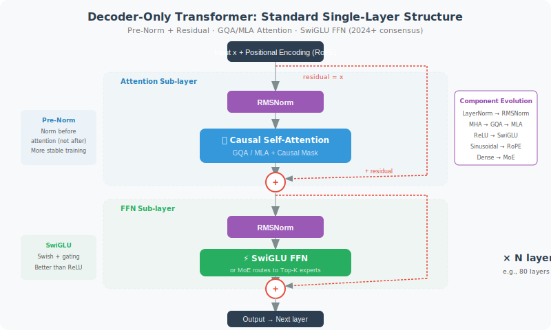

# Foundation Model Architecture Explained

> 🏗️ *"Understanding how models work helps you make better judgments, and understanding the evolution of model architecture helps you understand where the entire industry is heading."*

In Section 3.1, we used intuition to understand the basic principles of LLMs — Transformer, attention mechanism, and Token prediction. This section goes one level deeper, showing you what the **"skeleton" of a model looks like** — from Decoder-Only architecture to attention mechanism variants, normalization schemes, positional encoding, MoE routing, and the specific architectural choices made by major open-source models from 2024 to 2026.

This knowledge is not "academic decoration" — when you need to choose a deployment model for an Agent, estimate inference costs, or understand why a certain model performs better on long texts, **your understanding of architecture is your underlying judgment**.

## The Standard "Skeleton" of Modern LLMs: Decoder-Only Transformer

Since 2023, almost all mainstream LLMs have adopted the **Decoder-Only** architecture. This differs from the original Transformer's Encoder-Decoder structure — it retains only the decoder portion, using a **Causal Attention Mask** to ensure each Token can only "see" the content to its left.

```python
# Intuition behind the causal attention mask
# When generating "I like eating apples":
#
#          I   like  eating  apples
#  I      [✓]  [✗]   [✗]    [✗]     ← "I" can only see itself
#  like   [✓]  [✓]   [✗]    [✗]     ← "like" can see "I" and itself
#  eating [✓]  [✓]   [✓]    [✗]     ← "eating" can see all preceding words
#  apples [✓]  [✓]   [✓]    [✓]     ← "apples" can see the entire sequence
#
# The [✗] above the diagonal is the causal mask — preventing "peeking at the future"
```

Why Decoder-Only?

| Architecture | Representative Models | Suitable Tasks | Why LLMs Don't Use Others |
|-------------|----------------------|---------------|--------------------------|
| Encoder-Only | BERT | Understanding (classification, NER) | Cannot auto-regressively generate |
| Encoder-Decoder | T5, BART | Translation, summarization | High complexity, not conducive to ultra-large-scale expansion |
| **Decoder-Only** | **GPT, Llama, DeepSeek** | **All generation tasks** | ✅ Simple architecture, easy to scale, efficient training |

A standard Decoder-Only Transformer layer looks like this:



```python
class TransformerDecoderLayer:
    """Standard structure of one modern LLM layer (2024+ consensus version)"""
    
    def forward(self, x):
        # 1. Pre-Norm + Attention
        residual = x
        x = self.norm1(x)                  # RMSNorm (Pre-Normalization)
        x = self.attention(x)              # Causal self-attention (GQA/MLA)
        x = residual + x                   # Residual connection
        
        # 2. Pre-Norm + FFN
        residual = x
        x = self.norm2(x)                  # RMSNorm
        x = self.ffn(x)                    # SwiGLU feed-forward network
        x = residual + x                   # Residual connection
        
        return x
```

Next, let's break down the technical evolution of each component.

## Evolution of Attention Mechanisms: MHA → GQA → MLA


The attention mechanism is the "heart" of the Transformer. From 2017 to 2025, it went through three key generations — driven by **inference efficiency**, especially the **memory pressure of KV-Cache**.

### MHA: Classic Multi-Head Attention

The original Transformer used Multi-Head Attention (MHA), where each head has independent Query, Key, and Value projections:

```python
class MultiHeadAttention:
    """MHA: Each head has independent Q, K, V"""
    def __init__(self, d_model=4096, n_heads=32):
        self.n_heads = n_heads
        self.head_dim = d_model // n_heads  # 128
        
        # Independent Q, K, V projections for each head
        self.wq = Linear(d_model, n_heads * self.head_dim)  # 32 Q groups
        self.wk = Linear(d_model, n_heads * self.head_dim)  # 32 K groups ← a lot!
        self.wv = Linear(d_model, n_heads * self.head_dim)  # 32 V groups ← also a lot!
    
    # KV Cache size = n_layers × n_heads × seq_len × head_dim × 2
    # For Llama-2-70B (80 layers, 64 heads, 128 dim):
    # KV Cache per 1K tokens ≈ 2.5 GB!
```

**Problem**: During inference, all layers and all heads' K and V must be cached — when sequence length grows, memory explodes.

### GQA: Grouped-Query Attention

Llama 2 (2023) introduced **Grouped-Query Attention** — allowing multiple Query heads to share one set of Key-Values:

```python
class GroupedQueryAttention:
    """GQA: Multiple Q heads share one KV group, greatly reducing KV Cache"""
    def __init__(self, d_model=4096, n_q_heads=32, n_kv_heads=8):
        self.n_q_heads = n_q_heads     # 32 Query heads
        self.n_kv_heads = n_kv_heads   # 8 KV heads (every 4 Q heads share 1 KV)
        self.head_dim = d_model // n_q_heads
        
        self.wq = Linear(d_model, n_q_heads * self.head_dim)   # 32 Q groups
        self.wk = Linear(d_model, n_kv_heads * self.head_dim)  # Only 8 K groups!
        self.wv = Linear(d_model, n_kv_heads * self.head_dim)  # Only 8 V groups!
    
    # KV Cache reduced to 1/4 of MHA (32→8 heads)
    # Llama 3 70B: KV Cache from 2.5GB/1K → ~0.6GB/1K
```

GQA **barely loses model quality** (verified by extensive ablation studies), yet reduces KV Cache by 4–8×. This is why almost all mainstream models adopted GQA after 2023.

**Which models use GQA?**
- Llama 2/3/4, Qwen 2/2.5/3, Gemma 2/3, Mistral/Mixtral, Phi-3/4

### MLA: Multi-head Latent Attention (DeepSeek Innovation)

DeepSeek-V2 (2024) proposed a more aggressive solution — **Multi-head Latent Attention**. Instead of reducing the number of KV heads, it **compresses the entire KV into a low-dimensional latent space**:

```python
class MultiHeadLatentAttention:
    """
    MLA: DeepSeek's core innovation
    Not "sharing heads," but "compressing KV into a low-dimensional space"
    """
    def __init__(self, d_model=7168, n_heads=128, kv_lora_rank=512):
        self.n_heads = n_heads
        self.kv_lora_rank = kv_lora_rank  # KV compressed to 512 dimensions
        
        # KV first down-projected to low-dimensional space
        self.kv_down_proj = Linear(d_model, kv_lora_rank)     # 7168 → 512
        # Up-projected on demand during inference
        self.kv_up_proj = Linear(kv_lora_rank, n_heads * 128 * 2)  # 512 → full-size KV
    
    def forward(self, x, kv_cache=None):
        # Compress KV: only cache the 512-dim latent vector!
        compressed_kv = self.kv_down_proj(x)  # [batch, seq, 512]
        
        # During inference, store the compressed vector in cache
        if kv_cache is not None:
            kv_cache.store(compressed_kv)  # Only store 512 dims!
        
        # Decompress in real-time when computing attention
        full_kv = self.kv_up_proj(compressed_kv)
        k, v = full_kv.chunk(2, dim=-1)
        # ... normal attention computation
```

**How impressive are the results?**

| Attention Type | KV Cache / Token | vs. MHA |
|---------------|-----------------|---------|
| MHA (Llama 2 level) | ~2.5 GB / 1K tokens | Baseline |
| GQA (Llama 3 level) | ~0.6 GB / 1K tokens | 75% reduction |
| **MLA (DeepSeek-V3)** | ~0.04 GB / 1K tokens | **98.6% reduction** |

MLA allows DeepSeek-V3 (671B parameters) to handle extremely long contexts on relatively limited hardware — something GQA cannot achieve.

### Three Generations of Attention Mechanisms Compared

```
MHA:    Q₁ → K₁,V₁    Q₂ → K₂,V₂    Q₃ → K₃,V₃    Q₄ → K₄,V₄
        Each Q has its own independent KV              → Largest KV Cache

GQA:    Q₁ ─┐          Q₃ ─┐
        Q₂ ─┤→ K₁,V₁   Q₄ ─┤→ K₂,V₂
        Multiple Q heads share one KV group            → KV Cache reduced 4~8x

MLA:    Q₁ ─┐
        Q₂ ─┤→ [compressed vector c] → real-time decompress → K,V
        Q₃ ─┤   (512 dims)
        Q₄ ─┘
        All KV compressed into low-dim latent representation  → KV Cache reduced ~70x
```

## Evolution of Normalization: LayerNorm → RMSNorm + Pre-Norm

### From Post-Norm to Pre-Norm

The original Transformer used **Post-Normalization** — compute attention/FFN first, then normalize. GPT-2 (2019) found that placing normalization **before** attention/FFN (Pre-Normalization) significantly improves training stability for deep networks:

```python
# Post-Norm (original Transformer, now obsolete)
x = x + Attention(x)
x = LayerNorm(x)        # Normalization comes after

# Pre-Norm (modern standard)
x = x + Attention(RMSNorm(x))  # Normalization comes before
# Gradients can flow directly back through residual connections, not "blocked" by normalization
```

### From LayerNorm to RMSNorm

Standard LayerNorm requires computing mean and variance:

```python
# LayerNorm: subtract mean, divide by standard deviation
def layer_norm(x, gamma, beta):
    mean = x.mean(dim=-1, keepdim=True)
    var = x.var(dim=-1, keepdim=True)
    return gamma * (x - mean) / sqrt(var + eps) + beta

# RMSNorm: only divide by RMS (root mean square), remove mean centering
def rms_norm(x, gamma):
    rms = sqrt(mean(x ** 2) + eps)
    return gamma * x / rms
    # No mean computation, no beta bias → faster!
```

Advantages of RMSNorm:
- **Faster**: Eliminates mean computation and bias parameters
- **Equivalent performance**: Extensive experiments show it matches LayerNorm in LLM training
- **Hardware-friendly**: Simpler computation → better GPU kernel optimization

> 📊 **Industry consensus**: Among 53 analyzed Transformer models, **77.4%** use RMSNorm. Mainstream models released after 2023 use Pre-Norm + RMSNorm at nearly 100%.

## Evolution of Positional Encoding: Absolute → RoPE

The Transformer architecture itself is "position-agnostic" about Token order — it doesn't know whether "apple" comes before or after "eat." Positional encoding tells the model "where a Token is in the sequence."

### RoPE: Rotary Position Embeddings

The de facto standard for 2024–2026 is **RoPE (Rotary Position Embeddings)**, proposed by Su et al. in 2021:

```python
# Core idea of RoPE: encode positional information using rotation matrices
#
# Key insight: the dot product (attention score) of two vectors
# after rotation depends only on their "relative position difference"
#
# Mathematical expression (simplified):
# q_m · k_n = f(q, k, m-n)
#             ↑ depends only on relative position m-n

def apply_rope(x, position_ids, dim):
    """Apply rotary positional encoding to Q and K"""
    # Generate frequencies
    freqs = 1.0 / (10000 ** (torch.arange(0, dim, 2) / dim))
    # Compute angles = position × frequency
    angles = position_ids.unsqueeze(-1) * freqs
    
    # Split vector into pairs, apply 2D rotation to each pair
    cos = torch.cos(angles)
    sin = torch.sin(angles)
    
    x1, x2 = x[..., ::2], x[..., 1::2]
    rotated = torch.cat([
        x1 * cos - x2 * sin,  # Rotation transform
        x1 * sin + x2 * cos,
    ], dim=-1)
    return rotated
```

**Advantages of RoPE**:
1. **Relative position awareness**: Attention scores naturally encode the relative distance between Tokens
2. **No learnable parameters**: Pure mathematical transformation, adds no model parameters
3. **Extrapolatable**: By adjusting the frequency base, can extend to longer sequences not seen during training
4. **Compatible with FlashAttention**: Easy to integrate into efficient attention kernels

### Context Extension: YaRN and NTK-aware Scaling

A key practical issue with RoPE is **how to extend model inference to longer sequences than seen during training**:

```python
# Model trained with max_seq_len = 8192
# But you want to use it at 128K or even 1M context

# Method 1: NTK-aware scaling (adjust frequency base)
def ntk_scaled_rope(dim, max_position, base=10000, scaling_factor=16):
    """NTK-aware scaling: increase base to maintain precision of high-frequency components"""
    new_base = base * (scaling_factor ** (dim / (dim - 2)))
    freqs = 1.0 / (new_base ** (torch.arange(0, dim, 2) / dim))
    return freqs

# Method 2: YaRN (Yet another RoPE extensioN)
# Combines NTK scaling + attention score temperature correction
# Llama 4 Scout uses YaRN to achieve 10M token context!
```

> 📊 **Industry consensus**: Among the 53 analyzed models, **69.8%** use RoPE. Among Decoder-Only LLMs after 2022, RoPE is the absolute mainstream choice.

## Activation Functions and FFN: The Dominance of SwiGLU

In addition to attention, each Transformer layer has a **Feed-Forward Network (FFN/MLP)**. Its activation function has undergone significant evolution:

```python
# Classic FFN: two linear transformations + ReLU
class ClassicFFN:
    def forward(self, x):
        return self.w2(F.relu(self.w1(x)))
        # Parameters: 2 × d_model × d_ff (typically d_ff = 4 × d_model)

# Modern FFN: SwiGLU (Swish-Gated Linear Unit)
class SwiGLU_FFN:
    def forward(self, x):
        gate = F.silu(self.w_gate(x))    # Swish activation = x * sigmoid(x)
        up = self.w_up(x)                 # Up projection
        return self.w_down(gate * up)      # Gate × up projection → down projection
        # Parameters: 3 × d_model × d_ff (extra gate projection)
        # But d_ff is typically reduced from 4d to ~2.67d to maintain total parameter count
```

The core of SwiGLU is the **gating mechanism** — it lets the network decide "which information passes through and which is suppressed," giving it stronger expressive power than simple ReLU.

```
ReLU:     max(0, x)              → Simple truncation
GeLU:     x · Φ(x)              → Probabilistic gating
SwiGLU:   Swish(Wx) ⊙ (Vx)     → Learned gate × content
```

> 📊 **Industry consensus**: **71.7%** of analyzed models use SwiGLU or GeGLU. After LLaMA, this has become an unwritten standard.

## MoE Architecture: The Power of Sparsity

We introduced MoE from a "trends" perspective in Section 3.6. Here we look deeper at its **architectural details**.

### Basic Structure of MoE

MoE replaces standard FFN layers with multiple "expert" networks + one "router":

```python
class MoELayer:
    """Mixture of Experts layer: replaces standard FFN"""
    def __init__(self, d_model, n_experts=64, n_active=8):
        # 64 experts, but only 8 are activated per token
        self.experts = [SwiGLU_FFN(d_model) for _ in range(n_experts)]
        self.router = Linear(d_model, n_experts)  # Router: decides which experts to activate
    
    def forward(self, x):
        # 1. Routing decision: each token independently selects experts
        router_logits = self.router(x)              # [batch, seq, n_experts]
        weights, indices = router_logits.topk(k=8)  # Select top-8 experts
        weights = F.softmax(weights, dim=-1)         # Normalize weights
        
        # 2. Expert computation: only activate selected experts
        output = 0
        for i, (expert_idx, w) in enumerate(zip(indices, weights)):
            output += w * self.experts[expert_idx](x)
        
        return output
```

### MoE Configurations Vary Significantly Across Models

| Model | Total Experts | Active Experts | Shared Experts | Routing | Load Balancing |
|-------|--------------|----------------|----------------|---------|----------------|
| **Mixtral 8×22B** | 8 | 2 | None | Top-2 softmax | Auxiliary loss |
| **DeepSeek-V3** | 256 | 8 | 1 shared | Top-8 sigmoid | **No auxiliary loss** (bias term) |
| **DeepSeek V4** | 256 | 8 | 1 shared | Top-8 sigmoid | No auxiliary loss + **mHC hyperconnection** |
| **Kimi K2** | 128+ | ~8 | Yes | Top-K | MuonClip optimizer stabilizes training |
| **Llama 4 Scout** | 16 | 1 | None | Top-1 | Auxiliary loss |
| **Llama 4 Maverick** | 128 | 1 | None | Token-choice | Auxiliary loss |
| **Qwen 3 (235B)** | 128 | 8 | Yes | Top-8 | Auxiliary loss |
| **Qwen3.5-Plus** | 128 | 8 | Yes | Top-8 | Optimized auxiliary loss |
| **MiniMax M2.5** | — | — | — | — | Lightning Attention hybrid |

### Two Key Innovations from DeepSeek

**1. Shared Expert**

DeepSeek designates some experts as "always active," providing a stable general knowledge base:

```python
class DeepSeekMoE:
    """DeepSeek's MoE: shared experts + routed experts"""
    def __init__(self):
        self.shared_expert = SwiGLU_FFN()     # Always participates in computation
        self.routed_experts = [SwiGLU_FFN() for _ in range(256)]
        self.router = Linear(d_model, 256)
    
    def forward(self, x):
        # Shared expert: all tokens pass through
        shared_out = self.shared_expert(x)
        
        # Routed experts: each token selects top-8
        indices, weights = self.route(x)
        routed_out = weighted_sum(self.routed_experts, indices, weights)
        
        return shared_out + routed_out
```

**2. Load Balancing Without Auxiliary Loss**

A classic challenge in MoE is "routing collapse" — all tokens rush to a few experts. The usual solution is to add an auxiliary loss function to penalize imbalance, but this interferes with the main training objective.

DeepSeek-V3 introduced a clean alternative — **adding a learnable bias term to each expert**:

```python
# Traditional approach: auxiliary loss (interferes with main training objective)
loss = main_loss + alpha * load_balance_loss

# DeepSeek approach: bias term (does not interfere with main training objective)
router_logits = self.router(x) + self.expert_bias
# expert_bias does not participate in gradient updates; instead adjusted by rules:
# If an expert is overloaded → decrease its bias
# If an expert is underloaded → increase its bias
```

## Full Architecture Comparison of Open-Source Models

Now let's put all the technical modules together and look at the complete architectural choices of mainstream open-source models from 2024–2026:

| Component | Llama 3 (2024) | Llama 4 (2025) | DeepSeek-V3 | DeepSeek V4 | Qwen 3 | Qwen3.5 | Kimi K2 | Kimi K2.5 |
|-----------|----------------|----------------|-------------|-------------|--------|---------|---------|-----------|
| **Base Architecture** | Dense | MoE | MoE | MoE | Dense/MoE | MoE | MoE | MoE |
| **Attention** | GQA | GQA | **MLA** | **MLA** + DSA 2.0 | GQA | **Gated DeltaNet hybrid** | GQA | **Kimi Linear hybrid** |
| **Normalization** | RMSNorm | RMSNorm | RMSNorm | RMSNorm | RMSNorm | RMSNorm | RMSNorm | RMSNorm |
| **Residual Connection** | Standard additive | Standard additive | Standard additive | **mHC hyperconnection** | Standard additive | Standard additive | Standard additive | **Attention Residuals** |
| **Positional Encoding** | RoPE | RoPE+YaRN | RoPE | RoPE | RoPE+YaRN | RoPE+YaRN | RoPE | RoPE |
| **Activation** | SwiGLU | SwiGLU | SwiGLU | SwiGLU | SwiGLU | SwiGLU | SwiGLU | SwiGLU |
| **Optimizer** | AdamW | AdamW | AdamW | AdamW | AdamW | AdamW | **MuonClip** | **MuonClip** |
| **MoE Experts** | — | 16/128 | 256+1 | 256+1 | 128 | 128 | 128+ | — |
| **Total/Active Params** | 8B~405B | 109B~400B | 671B/~37B | 671B/~37B | 0.6B~235B | 397B/17B | **1T/32B** | 48B/3B |
| **Context** | 128K | 10M | 128K | **1M+** | 32K~128K | 262K | 128K | 256K |

### A Key Observation: Architecture is "Diverging"

If the theme of 2024–2025 was architectural **convergence** (consensus stack), then the theme of 2026 is architectural **divergence** — on top of the consensus stack, major models are beginning to explore radically different innovation paths:

```
"Consensus Stack" (2024–2025, still the foundation):
├── Decoder-Only architecture
├── Pre-Normalization + RMSNorm
├── RoPE positional encoding
├── SwiGLU activation function
├── GQA or MLA attention
├── No bias (No Bias)
└── Large-scale models → MoE

"Divergence Frontier" (2026 new breakthroughs):
├── Hybrid attention ── Gated DeltaNet (Qwen3.5) / Kimi Linear / Lightning Attention (MiniMax)
├── Residual connection rewrite ── Attention Residuals (Kimi K2.5) / mHC hyperconnection (DeepSeek V4)
├── Optimizer innovation ── MuonClip replaces AdamW (Kimi K2/K2.5)
├── Knowledge-reasoning separation ── Engram memory architecture (DeepSeek V4)
└── Multi-token prediction ── Predict multiple tokens simultaneously (DeepSeek V4 / Qwen3.5)
```

Differentiated competition is shifting from "training data and scale" back to **architectural innovation**:
1. **Hybrid attention design** (ratio and method of mixing linear attention + full attention)
2. **Information flow optimization** (residual connections, hyperconnections, and other inter-layer information transfer mechanisms)
3. **Training efficiency** (optimizer innovation, multi-token prediction, etc.)
4. **Inference efficiency** (knowledge offloading, sparse attention, KV-Cache optimization)
5. **Specific MoE design** (number of experts, routing strategy, load balancing)
6. **Long-context extension techniques** (YaRN, NTK scaling, linear attention)

## FlashAttention: The Hardware Magic That Makes Long Context Possible

All of the above are innovations at the "model architecture" level. But there is a **computational-level** technical breakthrough that has a huge impact on the actual capabilities of LLMs — **FlashAttention**.

The problem with standard attention is that it needs to **instantiate the entire attention matrix** (N×N). When N reaches the million scale, memory explodes:

```python
# Standard attention: O(N²) memory
def standard_attention(Q, K, V):
    scores = Q @ K.T / sqrt(d)  # [N, N] ← needs 1TB memory when N=1M!
    weights = softmax(scores)
    return weights @ V

# FlashAttention: block-wise computation, O(N) memory
def flash_attention(Q, K, V, block_size=256):
    """
    Core idea: don't instantiate the full N×N matrix
    Instead: block-wise computation + online softmax updates
    """
    output = zeros_like(Q)
    for i in range(0, N, block_size):
        for j in range(0, N, block_size):
            q_block = Q[i:i+block_size]
            k_block = K[j:j+block_size]
            v_block = V[j:j+block_size]
            # Compute attention for only this small block
            block_score = q_block @ k_block.T / sqrt(d)
            # Online softmax update (no full matrix needed)
            output[i:i+block_size] = online_softmax_update(
                output[i:i+block_size], block_score, v_block
            )
    return output
    # Memory reduced from O(N²) to O(N)
    # Speed improved 2~4× (better GPU memory hierarchy utilization)
```

Three generations of FlashAttention:

| Version | Year | Key Improvement |
|---------|------|----------------|
| FlashAttention-1 | 2022 | IO-aware block computation, O(N²) → O(N) memory |
| FlashAttention-2 | 2023 | Better parallelization, 2× additional speedup |
| FlashAttention-3 | 2024 | Async execution using Tensor Cores, approaches hardware theoretical peak |

> 💡 **Impact on Agents**: FlashAttention is the underlying hero enabling million-level context windows. Without it, Gemini 2.5 Pro's 2M context and Llama 4 Scout's 10M context would be impossible. As an Agent developer, you don't need to implement it yourself (major inference frameworks have it built in), but understanding it helps you understand the capability boundaries of models.

## New Architectural Breakthroughs in 2026

From late 2025 to early 2026, foundation model architecture saw a wave of important innovations — overturning the earlier judgment that "architecture has crystallized," with multiple components being redesigned. Here are the four most noteworthy directions.

### Hybrid Attention: Linear + Full Attention

The most important architectural trend of 2026 is **hybrid attention** — replacing most full attention layers with linear-complexity attention variants, retaining only a few full attention layers for scenarios requiring global information.

```python
# Core idea of hybrid attention
class HybridAttentionBlock:
    """
    2026 mainstream design: 3 out of every 4 layers use linear attention, 1 uses full attention
    
    Qwen3.5:   Gated DeltaNet : Gated Attention = 3:1
    Kimi K2.5: KDA (Kimi Delta Attention) : Full Attention = 3:1
    MiniMax M2.5: Lightning Attention : Full Attention = mixed
    """
    def __init__(self, layer_idx, d_model):
        if layer_idx % 4 == 3:  # One full attention layer every 4 layers
            self.attn = FullAttention(d_model)      # O(N²) but retains global modeling capability
        else:
            self.attn = GatedDeltaNet(d_model)       # O(N) linear complexity
    
    def forward(self, x):
        return self.attn(x)
```

**Gated DeltaNet (used by Qwen3.5)**: Combines the Delta Rule (incremental learning rule) with a gating mechanism, achieving O(N) linear attention complexity while retaining selective memory of important information through gating:

```python
class GatedDeltaNet:
    """
    Gated DeltaNet: Qwen3.5's linear attention variant
    Core idea: replace "global attention matrix" with "incremental updates"
    
    Comparison:
    - Full attention: every token computes attention with all tokens → O(N²)
    - Gated DeltaNet: maintains a compressed state, incremental updates → O(N)
    """
    def forward(self, x):
        # 1. Compute queries, keys, values
        q, k, v = self.qkv_proj(x).split(3)
        
        # 2. Gating: decide "how much old info to keep, how much new info to accept"
        gate = torch.sigmoid(self.gate_proj(x))  # Gate signal
        
        # 3. Delta Rule incremental state matrix update
        # S_{t} = gate * S_{t-1} + (1 - gate) * k_t ⊗ v_t
        state = gate * prev_state + (1 - gate) * torch.outer(k, v)
        
        # 4. Extract information from state using query vector
        output = q @ state
        return output
    
    # Key advantages:
    # - No KV-Cache needed during inference (state matrix is fixed size)
    # - At 128K~1M context, decoding speed improved 5~6×
    # - Selective attention to important information preserved through gating
```

**Kimi Linear (used by Kimi K2.5)**: Moonshot AI's KDA (Kimi Delta Attention), mixing linear attention and global attention at a 3:1 ratio, achieving 5–6× decoding speedup in the 128K~1M range.

**Performance comparison**:

| Attention Type | Complexity | 128K Decoding Speed | 1M Decoding Speed | Quality Loss |
|---------------|-----------|--------------------|--------------------|-------------|
| Full attention (standard Transformer) | O(N²) | Baseline | Baseline | — |
| GQA | O(N²) (smaller KV) | ~1.2× | ~1.2× | Nearly none |
| Gated DeltaNet hybrid 3:1 | O(N) (most layers) | ~4× | **~5×** | Extremely low |
| Kimi Linear hybrid 3:1 | O(N) (most layers) | ~5× | **~6×** | Extremely low |

> 💡 **Impact on Agents**: Hybrid attention makes **long-context Agents economically viable**. Previously, running Agents at 1M context had extremely high inference costs; now a 5–6× reduction in inference latency means dramatically lower costs. This is critical for Agent scenarios that need to process entire code repositories or long documents.

### Attention Residuals: Rewriting Residual Connections

Kimi K2.5 proposed a bold architectural modification at GTC 2026 — **Attention Residuals (AttnRes)**, rewriting the standard residual connection that has been used for 10 years since ResNet.

```python
# Standard residual connection (default design since 2015)
class StandardResidual:
    """
    x_{l+1} = x_l + F_l(x_l)
    All preceding layer outputs are accumulated with fixed weight 1 → signal "dilutes" in deep networks
    """
    def forward(self, x, layer_output):
        return x + layer_output  # Simple addition, weight fixed at 1

# Attention Residuals (proposed by Kimi K2.5)
class AttentionResiduals:
    """
    Replace fixed-weight residual accumulation with Softmax attention
    Each layer can "actively choose" which preceding layers to draw information from
    
    Effect: equivalent to 1.25× compute of standard training, but with nearly zero extra overhead
    """
    def forward(self, x, all_previous_outputs):
        # Compute attention weights of current layer over all preceding layer outputs
        # (instead of fixed weight-1 accumulation)
        scores = self.query(x) @ self.key(all_previous_outputs).T
        weights = F.softmax(scores, dim=-1)
        
        # Selectively combine representations from preceding layers
        aggregated = weights @ all_previous_outputs
        return aggregated

# Block AttnRes (practical variant, reduces memory overhead)
class BlockAttentionResiduals:
    """
    Divide layers into blocks, perform attention aggregation at block level
    Combined with cached pipeline communication, nearly zero extra overhead
    """
    pass
```

**Why does it matter?** The "additive accumulation" of standard residual connections causes uncontrolled growth of hidden states in deep networks, diluting each layer's contribution. AttnRes lets each layer use **learned, input-dependent weights** to selectively combine preceding information, resulting in more stable training and better downstream task performance.

### MuonClip: Optimizer Innovation

The **MuonClip optimizer** introduced by Kimi K2 is the most important training-level innovation of 2025–2026. It challenges AdamW's 11-year dominance:

```python
# AdamW (industry standard since 2014)
# Based on first-order gradients + momentum + adaptive learning rate

# MuonClip (proposed by Kimi K2)
# Based on Muon momentum + Newton-Schulz iteration + QK-Clip stabilization
class MuonClipOptimizer:
    """
    Core innovations:
    1. Extends the Muon optimizer to trillion-parameter scale
    2. Newton-Schulz iteration + QK-Clip solves logit explosion
    3. Distributed Muon adapted for large-scale GPU clusters
    
    Effect: token training efficiency improved 2× vs AdamW
    Meaning: double the model capability with the same compute budget
    """
    def __init__(self, params, lr, max_logit=100):
        self.max_logit = max_logit  # QK-Clip: limit maximum logits
    
    def step(self):
        # 1. Muon momentum update
        momentum = self.compute_muon_momentum()
        
        # 2. Newton-Schulz iteration (solves instability in large-scale training)
        update = self.newton_schulz_iterate(momentum)
        
        # 3. QK-Clip: strictly limit logits to within 100
        # Prevents logit explosion in trillion-parameter training
        update = self.clip_qk(update, self.max_logit)
        
        # 4. Apply update
        self.apply_update(update)
```

**Impact**: MuonClip's success means AdamW is no longer the only option. If this training efficiency improvement generalizes to other architectures, it could fundamentally change the entire industry's training economics — achieving the same model capability with half the compute.

### Engram Memory Architecture (DeepSeek V4)

DeepSeek V4 proposed an entirely new concept — **Engram Memory**, decoupling knowledge storage from reasoning computation:

```python
class EngramMemory:
    """
    DeepSeek V4's Engram memory architecture
    Core idea: static knowledge should not occupy expensive GPU memory
    
    Traditional approach: all knowledge encoded in model parameters → all loaded to GPU
    Engram approach: static knowledge stored in CPU memory → GPU focuses on reasoning computation
    """
    def __init__(self, vocab_size, embedding_dim):
        # N-gram embeddings stored in CPU memory
        self.ngram_embeddings = CPUStorage(vocab_size, embedding_dim)
        # O(1) hash lookup, does not occupy GPU memory
        self.hash_table = HashIndex()
    
    def lookup(self, input_tokens):
        """O(1) knowledge embedding lookup from CPU memory"""
        hashed = self.hash_table(input_tokens)
        knowledge = self.ngram_embeddings[hashed]  # CPU → GPU transfer
        return knowledge
    
    def forward(self, x, input_tokens):
        # 1. Get static knowledge from Engram
        knowledge = self.lookup(input_tokens)
        
        # 2. Reasoning computation on GPU
        reasoning_output = self.transformer_layers(x + knowledge)
        
        return reasoning_output
    
    # Effects:
    # - Frees GPU memory for reasoning → longer context, larger batches
    # - Significant improvement on knowledge benchmarks
    # - Knowledge and reasoning can be scaled independently
```

**mHC (Manifold-Constrained Hyper-Connections)** is another innovation from DeepSeek V4 — using the Sinkhorn-Knopp algorithm to constrain the residual mixing matrix, maintaining signal stability across hundreds of layers with only 6.7% additional training overhead.

> 💡 **Impact on Agents**: The "knowledge-reasoning separation" paradigm of Engram memory is particularly suited for Agent scenarios — Agents need large amounts of domain knowledge (stored in CPU memory) while also needing strong reasoning capability (GPU focused on computation). This makes it possible to run knowledge-intensive Agents on constrained hardware.

---

## Section Summary

| Architecture Component | Evolution Direction | Modern Consensus | Frontier Breakthroughs (2026) |
|-----------------------|--------------------|-----------------|-----------------------------|
| **Overall Architecture** | Encoder-Decoder → Decoder-Only | Decoder-Only | MoE becomes standard for large models |
| **Attention Mechanism** | MHA → GQA → MLA | GQA / MLA | **Hybrid attention**: Gated DeltaNet / Kimi Linear (latency reduced 5–6×) |
| **Normalization** | Post-Norm → Pre-Norm + RMSNorm | Pre-Norm + RMSNorm | Converged, nearly no debate |
| **Residual Connection** | Fixed additive residual | Standard residual | **Attention Residuals** (Kimi K2.5) / **mHC** (DeepSeek V4) |
| **Positional Encoding** | Absolute → RoPE | RoPE | YaRN/NTK extended to 10M+ |
| **Activation Function** | ReLU → GeLU → SwiGLU | SwiGLU | Gating mechanism becomes standard |
| **MoE** | Dense → sparse mixture of experts | Top-K routing + shared experts | Trillion-parameter open-source MoE (Kimi K2) |
| **Optimizer** | SGD → Adam → AdamW | AdamW | **MuonClip** (doubles training efficiency) |
| **Knowledge Storage** | All encoded in parameters | Parameterized storage | **Engram memory** (knowledge-reasoning separation) |
| **Inference Acceleration** | Standard attention → FlashAttention | FA-2/3 | Block + IO optimization approaches hardware limits |

> 📖 *Understanding these architectural components is not to make you train models — it's to give you underlying judgment when selecting models for deployment, optimizing inference, and estimating costs. When someone says "this model uses Gated DeltaNet hybrid attention," you know its inference latency will be very low in long-text scenarios; when someone says "uses Engram memory," you know it can handle knowledge-intensive tasks on smaller GPUs. In 2026, architectural innovation has returned to the forefront of competition.*

---

*Next section: [3.8 SFT and Reinforcement Learning Training Data Preparation](./08_training_data.md)*
