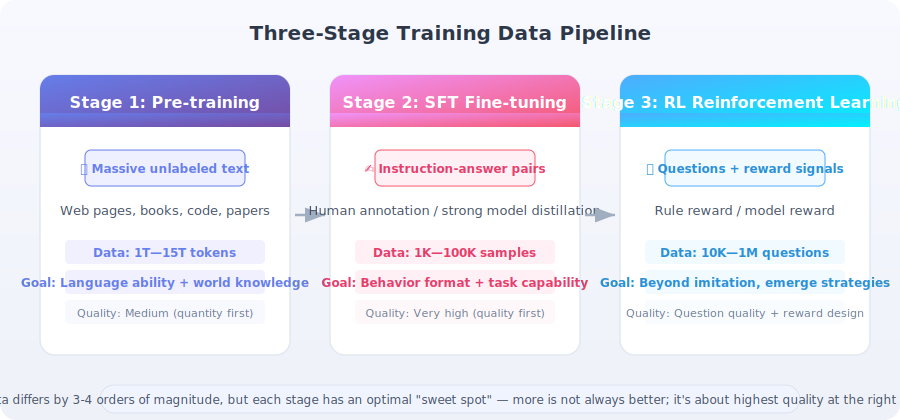

# SFT and Reinforcement Learning Training Data Preparation

> 📊 *"Data is the most underestimated lever in model training. Algorithms change every year, but the improvements from high-quality data are cross-algorithm."*

In the previous sections, we learned about how large language models work and their architectural design. But the gap between a model going from a "general foundation" to a "useful Agent" is not just algorithms — it's **data**. Whether it's SFT (Supervised Fine-Tuning) or reinforcement learning training like RLHF/GRPO, the quality, quantity, distribution, and format of data directly determine the ceiling of training effectiveness.

This section systematically explains the core principles and practical methods of training data preparation — from choosing data volume to quality control, from SFT data to RL reward data — helping you build a **data-first** training mindset.

---

## The Big Picture of Training Data: Three-Stage Data Flow

Large language model training is typically divided into three stages, each with very different data requirements:



| Stage | Data Type | Typical Scale | Data Characteristics | Core Goal |
|-------|-----------|--------------|---------------------|-----------|
| **Pre-training** | Unlabeled text (web pages, books, code) | 1T–15T tokens | Large volume, variable quality, broad coverage | Learn language capability and world knowledge |
| **SFT (Supervised Fine-Tuning)** | Instruction-answer pairs / multi-turn dialogues | 1K–100K samples | Small volume but extremely high quality, strict format | Learn behavioral format and task capability |
| **RL (Reinforcement Learning)** | Questions + reward signals | 10K–1M questions | Requires evaluable reward functions | Go beyond imitation, emerge new strategies |

> 💡 **Key insight**: The data volumes across the three stages differ by 3–4 orders of magnitude, but each stage has its own "data sweet spot" — more is not always better; the goal is to achieve **the highest quality at the right scale**.

---

## SFT Data Preparation

### The Core Principle of "Less but Better"

The most important finding in the SFT stage comes from the LIMA [1] (Less Is More for Alignment) paper:

> **Using only 1,000 carefully selected high-quality samples, a 65B LLaMA can achieve dialogue quality close to GPT-4.**

This conclusion has been repeatedly validated in subsequent work:

| Study | Data Scale | Core Finding |
|-------|-----------|-------------|
| **LIMA** (2023) [1] | 1,000 samples | Quality >> Quantity; curated data crushes 52K Alpaca |
| **Alpaca** (2023) [2] | 52,000 samples | GPT-3.5 generated data, variable quality, moderate results |
| **WizardLM** (2023) [3] | 70,000 samples | Evol-Instruct improves complexity, significantly outperforms Alpaca |
| **DEITA** (2024) [4] | 6,000 samples | Automated selection of 6K from 300K; outperforms full-set training |
| **Qwen2.5 Technical Report** (2024) [5] | ~500K samples | Industrial scale, but with extremely rigorous multi-round cleaning and quality filtering |

**Why is a small amount of data enough?**

SFT is not teaching the model "new knowledge" — the pre-training stage has already equipped it with rich world knowledge and language capability. The essence of SFT is **teaching the model the correct "behavioral format"**:

```
State of the pre-trained model:
  "I know a lot of things, but I don't know how to answer your question"

After SFT:
  "I know a lot of things, and now I also know what format and style to use when answering you"
```

This is why SFT is more like "teaching etiquette" than "teaching knowledge" — teaching a knowledgeable person how to converse properly doesn't require tens of thousands of lessons.

### Data Volume Selection Guide

Based on practical experience and published research, recommended data volumes for different scenarios:

| Scenario | Recommended Volume | Notes |
|----------|-------------------|-------|
| **Proof of concept / research experiments** | 500–1,000 samples | LIMA scale, sufficient to validate feasibility |
| **Single-task fine-tuning** (e.g., math, coding) | 1,000–5,000 samples | Cover various difficulty levels and edge cases |
| **Agent behavioral format training** | 500–2,000 samples | Teach the model `<think>`/`<tool_call>` format |
| **General instruction following** | 5,000–50,000 samples | Cover multiple task types and dialogue styles |
| **Industrial-grade product alignment** | 50K–500K samples | Multi-round cleaning, multi-dimensional quality control |

> ⚠️ **Common pitfall**: Many teams' first instinct is "more data is better," so they spend large resources collecting 100K low-quality samples. In practice, **1,000 manually verified samples almost always outperform 10,000 unreviewed samples**. This is the most counterintuitive but most important rule in the SFT stage.

### Data Quality Assessment Framework

High-quality SFT data must meet standards across five dimensions:

| Quality Dimension | Definition | Detection Method | Typical Issues |
|------------------|-----------|-----------------|----------------|
| **Correctness** | Answer content is factually accurate and logically sound | Manual review + automated fact-checking | Math calculation errors, outdated information |
| **Format consistency** | Follows a unified output format specification | Regex validation | Unpaired `<think>` tags, JSON format errors |
| **Completeness** | Answer fully covers all aspects of the question | Manual scoring | Only answered half the question |
| **Difficulty distribution** | Reasonable ratio of easy/medium/hard tasks | Automated classification + statistics | All simple Q&A, lacking complex reasoning |
| **Diversity** | Covers different domains, styles, and lengths | Deduplication + cluster analysis | Large number of duplicate or highly similar samples |

#### Automated Quality Detection Example

```python
import re
import json
from collections import Counter

def validate_sft_sample(sample: dict) -> dict:
    """
    Multi-dimensional quality detection for a single SFT sample
    
    Args:
        sample: Dialogue sample containing a conversations field
        
    Returns:
        Dictionary containing detection results for each dimension
    """
    issues = []
    conversations = sample.get("conversations", [])
    
    # 1. Basic structure check
    roles = [msg["role"] for msg in conversations]
    if roles[0] != "system":
        issues.append("Missing system message")
    if "assistant" not in roles:
        issues.append("Missing assistant response")
    
    # 2. Format consistency check (Agent scenario)
    for msg in conversations:
        if msg["role"] == "assistant":
            content = msg["content"]
            
            # Check think tag pairing
            think_opens = len(re.findall(r"<think>", content))
            think_closes = len(re.findall(r"</think>", content))
            if think_opens != think_closes:
                issues.append(f"Unpaired think tags: {think_opens} open vs {think_closes} close")
            
            # Check tool_call tag pairing
            tc_opens = len(re.findall(r"<tool_call>", content))
            tc_closes = len(re.findall(r"</tool_call>", content))
            if tc_opens != tc_closes:
                issues.append(f"Unpaired tool_call tags: {tc_opens} open vs {tc_closes} close")
            
            # Check tool call format
            tool_calls = re.findall(
                r"<tool_call>\n(.+?)\n</tool_call>", content, re.DOTALL
            )
            for tc in tool_calls:
                # Validate it's a valid function call format
                if not re.match(r"\w+\(.*\)", tc.strip()):
                    issues.append(f"Abnormal tool call format: {tc[:50]}")
    
    # 3. Length reasonableness check
    total_tokens = sum(len(msg["content"]) for msg in conversations)
    if total_tokens < 50:
        issues.append("Sample too short, may lack information")
    if total_tokens > 20000:
        issues.append("Sample too long, may contain redundant content")
    
    # 4. Non-empty response check
    assistant_msgs = [m for m in conversations if m["role"] == "assistant"]
    for i, msg in enumerate(assistant_msgs):
        if len(msg["content"].strip()) < 10:
            issues.append(f"Assistant response #{i+1} is too short")
    
    return {
        "valid": len(issues) == 0,
        "issues": issues,
        "num_turns": len(assistant_msgs),
        "total_chars": total_tokens
    }


def analyze_dataset_distribution(samples: list[dict]) -> dict:
    """
    Analyze the overall distribution characteristics of a dataset
    """
    # Count turns per sample
    turn_counts = [
        len([m for m in s["conversations"] if m["role"] == "assistant"])
        for s in samples
    ]
    
    # Count tool call coverage
    tool_usage = Counter()
    for s in samples:
        for msg in s["conversations"]:
            if msg["role"] == "assistant":
                tools = re.findall(r"(\w+)\(", msg["content"])
                tool_usage.update(tools)
    
    # Count length distribution
    lengths = [
        sum(len(m["content"]) for m in s["conversations"])
        for s in samples
    ]
    
    return {
        "total_samples": len(samples),
        "avg_turns": sum(turn_counts) / len(turn_counts),
        "max_turns": max(turn_counts),
        "tool_coverage": dict(tool_usage.most_common(20)),
        "avg_length": sum(lengths) / len(lengths),
        "length_p90": sorted(lengths)[int(len(lengths) * 0.9)],
    }
```

### Methods for Creating SFT Data

High-quality SFT data has three main sources:

#### Method 1: Manual Annotation (Highest Quality, Highest Cost)

Domain experts manually write instruction-answer pairs. This is the method with the highest quality ceiling, suitable for critical task scenarios.

**Practical tips**:
- Create detailed **annotation guidelines** specifying format, style, and length requirements
- Have multiple annotators independently annotate the same batch of data and calculate **inter-annotator agreement**
- Establish a **review mechanism**: annotate → initial review → final review → database

```python
# Annotation guidelines example (simplified)
ANNOTATION_GUIDELINES = """
## Format Requirements
1. All reasoning processes go inside <think>...</think>
2. Tool calls are wrapped in <tool_call>...</tool_call>
3. Final answers are output directly, no additional tags needed

## Quality Standards
- Reasoning process must be logically coherent, no skipped steps
- Math calculations must use the calculator tool, no mental arithmetic
- Answers must be direct, concise, and accurate
- If the question is ambiguous, clearly state the assumptions

## Common Mistakes
❌ Giving the answer directly inside <think> without using tools
❌ Wrong parameter types in tool calls (string vs number)
❌ Responses containing redundant phrases like "As an AI assistant"
"""
```

#### Method 2: Strong Model Distillation (High Quality, Moderate Cost)

Use strong models like GPT-4 / Claude to generate responses, then manually filter. This is currently the most commonly used method.

**Key techniques**:

1. **Seed Tasks**: Manually write 50–200 high-quality seed samples to ensure consistent style and format
2. **Evol-Instruct (Instruction Evolution)** [3]: Iteratively "evolve" simple instructions to generate more complex, more challenging variants

```python
# Evol-Instruct instruction evolution strategies
EVOLUTION_STRATEGIES = {
    "add_constraints": "Add an uncommon constraint to the original instruction",
    "deepen_reasoning": "Rewrite the instruction to require multi-step reasoning",
    "concretize": "Replace abstract instructions with specific real-world scenarios",
    "add_turns": "Convert single-turn Q&A into a multi-turn interactive task",
    "combine_tasks": "Combine two simple tasks into one composite task",
}

# Example: evolution of one instruction
EVOLUTION_EXAMPLE = """
Original instruction:
  "Calculate the area of a circle"

→ Add constraints:
  "Calculate the area of a circular flower bed with a radius of 3.7 meters,
   round the result to two decimal places, and tell me the total cost
   if each square meter of turf costs $15"

→ Deepen reasoning:
  "An annular running track has an inner radius of 50 meters and outer radius of 55 meters.
   If paving the track costs $200 per square meter, is a budget of $300,000 enough?
   If not, what is the minimum inner radius it needs to be reduced to?"
"""
```

3. **Quality filtering**: After generation, must go through automated detection + manual sampling review

#### Method 3: Automated Data Selection (For Large-Scale Data)

Use automated methods to select a high-quality subset from massive existing data. DEITA [4] proposes an effective approach:

| Filtering Dimension | Method | Intuition |
|--------------------|--------|-----------|
| **Complexity** | Use LLM to score instruction complexity | Filter out overly simple "hello" type questions |
| **Quality** | Use LLM to score response quality | Filter out incomplete or erroneous samples |
| **Diversity** | Embedding-based deduplication and clustering | Avoid large numbers of highly similar samples |

```python
from sentence_transformers import SentenceTransformer
from sklearn.cluster import KMeans
import numpy as np

def diversity_based_selection(
    samples: list[dict],
    target_size: int = 5000,
    n_clusters: int = 500,
) -> list[dict]:
    """
    Diversity-based data selection:
    1. Encode all samples as vectors
    2. Cluster and select the best sample from each cluster
    3. Ensure the final dataset covers as many "semantic regions" as possible
    """
    model = SentenceTransformer("all-MiniLM-L6-v2")
    
    # Extract instruction text from each sample
    instructions = [
        next(m["content"] for m in s["conversations"] if m["role"] == "user")
        for s in samples
    ]
    
    # Encode as vectors
    embeddings = model.encode(instructions, show_progress_bar=True)
    
    # K-Means clustering
    kmeans = KMeans(n_clusters=n_clusters, random_state=42)
    labels = kmeans.fit_predict(embeddings)
    
    # Select top-k samples closest to cluster center from each cluster
    per_cluster = target_size // n_clusters
    selected = []
    
    for cluster_id in range(n_clusters):
        cluster_indices = np.where(labels == cluster_id)[0]
        center = kmeans.cluster_centers_[cluster_id]
        
        # Sort by distance to cluster center (nearest first)
        distances = np.linalg.norm(
            embeddings[cluster_indices] - center, axis=1
        )
        sorted_idx = cluster_indices[np.argsort(distances)]
        
        # Select top-k
        selected.extend(sorted_idx[:per_cluster].tolist())
    
    return [samples[i] for i in selected[:target_size]]
```

---

## Reinforcement Learning Training Data Preparation

RL stage data requirements are completely different from SFT — no "standard answers" are needed, but **evaluable questions** and **effective reward signals** are required.

### Core Elements of RL Data

| Element | Description | Example |
|---------|-------------|---------|
| **Question/Prompt** | The question the model needs to answer | "Prove that √2 is irrational" |
| **Reward Function** | Function that evaluates response quality | Code passes tests → +1, fails → 0 |
| **Reference Answer (optional)** | Reference used for reward calculation | Standard proof process |

Key difference from SFT:

```
SFT data:  Question + standard answer → Imitation learning ("do as shown")
RL data:   Question + reward function → Exploration learning ("find the optimal solution yourself")
```

> 💡 **Why doesn't RL need standard answers?** Because RL's goal is to let the model **explore** good strategies on its own. Standard answers would actually limit the exploration space — like teaching a child chess: SFT is showing them grandmaster game records to imitate, RL is letting them play chess themselves, rewarding wins and penalizing losses. The latter may discover unexpectedly new strategies.

### Reward Function Design

The reward function is the core of RL training. A good reward function must:

1. **Be automatically evaluable** (cannot rely on manual annotation, otherwise online training is impossible)
2. **Have clear signals** (avoid sparse rewards — the model has difficulty learning from all-zero signals)
3. **Be cheat-proof** (prevent the model from finding "shortcuts" that don't align with expectations to get high scores)

Common reward function types:

| Reward Type | Applicable Scenarios | Implementation | Pros/Cons |
|------------|---------------------|----------------|-----------|
| **Rule-based reward** | Tasks with clear standard answers | Math answer matching, code test case pass rate | ✅ Precise, no noise ❌ Limited applicability |
| **Model-based reward** | Open-ended tasks | Train a Reward Model to score | ✅ Wide applicability ❌ Has noise, can be "hacked" |
| **Hybrid reward** | Composite tasks | Weighted combination of rule + model rewards | ✅ Flexible ❌ Weights need careful tuning |

#### Rule-Based Reward Design Example

```python
import re
import subprocess
import tempfile
from typing import Optional

def math_reward(
    response: str, 
    ground_truth: str,
    format_required: bool = True,
) -> float:
    """
    Rule-based reward function for math problems
    
    Reward composition:
    - Correct answer: +1.0
    - Correct format (inside \\boxed{}): +0.1
    - Has reasoning process: +0.1
    
    Total score range: [0, 1.2]
    """
    reward = 0.0
    
    # 1. Extract answer (from \boxed{})
    boxed_match = re.search(r"\\boxed\{(.+?)\}", response)
    if boxed_match:
        predicted = boxed_match.group(1).strip()
        reward += 0.1  # Format score
        
        # 2. Answer matching (supports numerical tolerance)
        try:
            if abs(float(predicted) - float(ground_truth)) < 1e-6:
                reward += 1.0
        except ValueError:
            # Non-numeric answer (e.g., expression), use string matching
            if predicted.replace(" ", "") == ground_truth.replace(" ", ""):
                reward += 1.0
    else:
        # No \boxed{}, try extracting from the last line
        last_line = response.strip().split("\n")[-1]
        numbers = re.findall(r"[-+]?\d*\.?\d+", last_line)
        if numbers:
            try:
                if abs(float(numbers[-1]) - float(ground_truth)) < 1e-6:
                    reward += 1.0
            except ValueError:
                pass
    
    # 3. Bonus for reasoning process
    if "<think>" in response and "</think>" in response:
        think_content = re.search(
            r"<think>(.*?)</think>", response, re.DOTALL
        )
        if think_content and len(think_content.group(1).strip()) > 50:
            reward += 0.1
    
    return reward


def code_reward(
    response: str,
    test_cases: list[dict],
    timeout: int = 10,
) -> float:
    """
    Rule-based reward function for coding problems
    
    Reward = proportion of test cases passed
    """
    # Extract code block
    code_match = re.search(r"```python\n(.*?)```", response, re.DOTALL)
    if not code_match:
        return 0.0
    
    code = code_match.group(1)
    passed = 0
    
    for tc in test_cases:
        test_code = f"""{code}\n\n# Test\nassert {tc['assertion']}"""
        try:
            with tempfile.NamedTemporaryFile(
                suffix=".py", mode="w", delete=False
            ) as f:
                f.write(test_code)
                f.flush()
                result = subprocess.run(
                    ["python", f.name],
                    capture_output=True,
                    timeout=timeout,
                )
                if result.returncode == 0:
                    passed += 1
        except (subprocess.TimeoutExpired, Exception):
            pass
    
    return passed / len(test_cases) if test_cases else 0.0
```

### RL Training Data Volume Selection

The logic for choosing data volume in the RL stage is completely different from SFT:

| Factor | Impact | Recommendation |
|--------|--------|----------------|
| **Number of questions** | More questions = more exploration directions | 10K–100K unique questions |
| **Samples per question (G)** | GRPO samples G responses per question | G = 8–64, adjust based on resources |
| **Effective training samples** | Questions × G = total training samples | 100K–millions of samples |
| **Training epochs** | Usually 1–3 epochs | Too many leads to overfitting |

**The key for RL data is not volume, but the "effective reward range"**:

```
Ineffective data: reward is always 0 or always 1
  → Model cannot distinguish good from bad, learns nothing

Effective data: among G responses to the same question, some score high and some score low
  → Model can learn by comparison: "doing it this way gets +1, that way gets 0"
```

> ⚠️ **Key principle**: If a question is too easy (model gets it right 100% of the time) or too hard (model gets it right 0% of the time), it has **absolutely no value** in RL training. The most valuable data is questions where the model has a 30%–70% pass rate — "just hard enough."

### RL Data Filtering: Difficulty Calibration

```python
def calibrate_difficulty(
    questions: list[dict],
    model,
    tokenizer,
    n_samples: int = 16,
    target_pass_rate: tuple[float, float] = (0.2, 0.8),
) -> list[dict]:
    """
    Difficulty calibration: filter questions that are "just hard enough" for the current model
    
    Process:
    1. Sample n_samples responses for each question
    2. Calculate pass rate
    3. Keep questions with pass rate within target_pass_rate range
    
    Args:
        questions: List of candidate questions
        model: Current policy model
        n_samples: Number of samples per question
        target_pass_rate: Target pass rate range (lower bound, upper bound)
    """
    calibrated = []
    
    for q in questions:
        # Sample multiple responses
        responses = []
        for _ in range(n_samples):
            response = model.generate(
                tokenizer.encode(q["prompt"], return_tensors="pt"),
                max_new_tokens=2048,
                temperature=0.7,
                do_sample=True,
            )
            responses.append(tokenizer.decode(response[0]))
        
        # Calculate pass rate
        rewards = [q["reward_fn"](r) for r in responses]
        pass_rate = sum(1 for r in rewards if r > 0.5) / len(rewards)
        
        # Filter
        if target_pass_rate[0] <= pass_rate <= target_pass_rate[1]:
            calibrated.append({
                **q,
                "estimated_pass_rate": pass_rate,
                "estimated_difficulty": 1 - pass_rate,
            })
    
    print(f"Calibration complete: {len(questions)} → {len(calibrated)} samples"
          f" (retention rate {len(calibrated)/len(questions)*100:.1f}%)")
    
    return calibrated
```

### Curriculum Learning: Training Rhythm from Easy to Hard

In RL training, the **order of data presentation** also matters. The core idea of Curriculum Learning is:

```
Stage 1 (Warm-up): Start with easy questions to build basic capability
    → Questions with 60%–80% pass rate
    → Help the model establish the basic understanding that "correct answers get rewards"

Stage 2 (Ramp-up): Gradually increase difficulty
    → Questions with 30%–60% pass rate
    → Model begins exploring more complex strategies

Stage 3 (Challenge): Challenge high-difficulty questions
    → Questions with 10%–30% pass rate
    → Truly creative problem-solving strategies emerge
```

> 💡 **Intuitive analogy**: Like learning to swim — first build confidence in the shallow end, then challenge the deep end. Throwing someone who can't swim directly into the deep end will most likely result in drowning (training collapse), not learning to swim.

---

## SFT Data vs RL Data: Comparative Summary

| Dimension | SFT Data | RL Data |
|-----------|---------|---------|
| **Core requirement** | Standard answers (demonstrations) | Questions + reward signals |
| **Data volume** | Small but high quality (1K–100K) | Moderate (10K–1M questions, ×G samples) |
| **Quality requirement** | Extremely high (every sample must be correct) | Question quality matters, but no standard answers needed |
| **Cost structure** | High creation cost, low usage cost | Low creation cost, high compute cost (sampling) |
| **Failure mode** | Errors in data are directly "learned" | Reward function design flaws lead to "reward hacking" |
| **Iteration approach** | Incremental addition + quality filtering | Dynamically adjust difficulty as model capability improves |

---

## Common Pitfalls in Data Preparation

### Pitfall 1: Data Contamination

Training data contains questions from the evaluation set, causing inflated benchmark scores without actual capability improvement.

```python
# Simple method to detect data contamination
def check_contamination(
    train_data: list[str], 
    eval_data: list[str],
    threshold: float = 0.9,
) -> list[tuple[int, int, float]]:
    """
    Detect overlap between training set and evaluation set
    """
    from difflib import SequenceMatcher
    
    contaminated = []
    for i, train_item in enumerate(train_data):
        for j, eval_item in enumerate(eval_data):
            similarity = SequenceMatcher(
                None, train_item, eval_item
            ).ratio()
            if similarity > threshold:
                contaminated.append((i, j, similarity))
    
    if contaminated:
        print(f"⚠️ Found {len(contaminated)} suspected contaminated sample pairs!")
    
    return contaminated
```

### Pitfall 2: Distribution Shift

The distribution of SFT data doesn't match the actual usage scenario. For example:
- Training data is all English, but users ask questions in other languages
- Training data is all short answers, but users need long-form analysis
- Training data is all knowledge Q&A, but the Agent needs to make tool calls

**Solution**: Collect or simulate real user usage patterns to ensure training data covers actual scenarios.

### Pitfall 3: Reward Hacking

In RL training, the model learns "shortcuts" to fool the reward function rather than genuinely improving capability.

Classic examples:
- Reward function only checks the final answer → model learns to guess the answer directly, skipping reasoning
- Reward function checks response length → model learns to output verbose filler to pad word count
- Reward function uses LLM scoring → model learns to use phrasing that "flatters" the scoring model

**Solutions**:
1. Reward function should be **multi-dimensional** (correctness + format + reasoning quality)
2. Regularly **manually sample** training outputs to check for abnormal patterns
3. Use **KL divergence constraints** to limit policy drift (built into PPO/GRPO)

### Pitfall 4: Catastrophic Forgetting

Over-fine-tuning causes the model to lose the general capabilities learned during pre-training.

**Symptoms**: After SFT, the model performs well on the target task, but general conversation capability and knowledge Q&A capability significantly decline.

**Solutions**:
1. **Mix in general data**: Add 10%–20% general conversation data to SFT data
2. **Control training epochs**: SFT usually only needs 1–3 epochs
3. **Use LoRA**: Only update a small number of parameters, naturally prevents catastrophic forgetting (see Section 10.2)

---

## Practical Checklist

Before starting training, use the following checklist to review your data preparation:

**SFT Data Checklist**:

- [ ] Is the data volume reasonable? (More is not always better)
- [ ] Has each sample been quality-checked? (Correctness, format consistency)
- [ ] Does the data distribution match the actual usage scenario?
- [ ] Has deduplication been done? Have samples with >90% similarity been merged?
- [ ] Is the difficulty distribution reasonable? Are easy/medium/hard all covered?
- [ ] Has data contamination been checked? Is there overlap between training and evaluation sets?
- [ ] Has general data been mixed in to prevent catastrophic forgetting?

**RL Data Checklist**:

- [ ] Can the reward function be automatically evaluated?
- [ ] Does the reward signal have discriminative power? (Not all 0s or all 1s)
- [ ] Has question difficulty been calibrated? (30%–70% pass rate)
- [ ] Has a multi-dimensional reward been designed? (To prevent Reward Hacking)
- [ ] Is there a curriculum learning strategy? (Easy to hard)
- [ ] Are training outputs regularly manually sampled for review?

---

## Common Interview Questions

### Basic Understanding

**1. Why can the SFT stage achieve good results with very little data? Explain from the perspective of model learning.**

> **Key points**:
> - SFT is not teaching the model "new knowledge" — the pre-training stage has already learned rich world knowledge and language capability
> - The essence of SFT is **behavioral format training** — teaching the model "how to answer," not "what to answer"
> - Analogy: teaching a knowledgeable person proper social etiquette doesn't require tens of thousands of lessons
> - Empirical data from the LIMA paper: 1,000 curated samples ≈ the effect of 52,000 random samples
> - From a probabilistic perspective: SFT only needs to adjust the "shape" of the output distribution (format, style), not the "core content" of the distribution (knowledge)

**2. How do you determine if your SFT data volume is sufficient? What signals indicate insufficient or excessive data?**

> **Key points**:
>
> **Signals of insufficient data**:
> - Validation set loss keeps decreasing without converging
> - Model has high format error rates on unseen task types
> - Model behavior is unstable — sometimes correct, sometimes wrong on similar questions
>
> **Signals of too much data (or insufficient quality)**:
> - Validation set loss stops decreasing very early
> - Model starts reproducing specific phrasings from training data (overfitting)
> - Performance no longer improves or even degrades after adding more data
>
> **Practical method**:
> - Plot a **scaling curve**: start from 100 samples, gradually increase to 500, 1000, 5000, observe the performance inflection point
> - If performance improvement from 1000 to 5000 is < 2%, 1000 samples may already be sufficient

**3. In reinforcement learning training, what kinds of questions are most valuable for training? What kinds are completely worthless?**

> **Key points**:
>
> **Most valuable**: Questions where the model has a 30%–70% probability of answering correctly
> - These questions are in the model's "Zone of Proximal Development"
> - After sampling G responses, some are good and some are bad, forming effective contrasts
> - GRPO's within-group normalization can produce discriminative advantage signals
>
> **Completely worthless**:
> - Too easy (100% correct): all response rewards are 1, after normalization all advantages are 0
> - Too hard (0% correct): all response rewards are 0, equally unable to learn
>
> **Analogy**: Exam question design — if a question is too easy everyone gets full marks, if too hard everyone gets zero; neither can distinguish student ability. The best questions are "moderately difficult questions with discriminative power"

### Deep Understanding

**4. What is the essential difference between the "failure modes" of SFT data and RL data? How should each be prevented?**

> **Key points**:
>
> | Dimension | SFT Failure Mode | RL Failure Mode |
> |-----------|-----------------|-----------------|
> | **Data errors** | Wrong answers are directly "learned" | Reward function design flaws lead to Reward Hacking |
> | **Distribution issues** | Training distribution ≠ usage distribution → generalization failure | Unreasonable question difficulty distribution → no useful signal learned |
> | **Volume issues** | Too much low-quality data → dilutes high-quality signal | Too few effective questions → insufficient exploration |
> | **Prevention** | Manual review + automated quality control | Multi-dimensional rewards + KL constraints + manual sampling |
>
> **Core difference**: SFT errors are "learned wrong" (garbage in, garbage out); RL errors are "learned crooked" (found unexpected shortcuts)

**5. With limited resources, how would you allocate the data preparation budget? If you only have 100 person-days of annotation resources, how would you distribute them?**

> **Key points**:
>
> **Recommended allocation** (100 person-days):
> - **60% → SFT data annotation** (60 person-days): Annotate 1,500–3,000 high-quality samples
>   - Create annotation guidelines: 5 person-days
>   - Core annotation: 40 person-days (50–80 samples per person-day)
>   - Quality review: 15 person-days
> - **20% → RL question collection** (20 person-days): Collect and filter 10K–50K questions
>   - Key is collecting questions, no need to write answers
>   - Focus on designing and validating the reward function
> - **10% → Evaluation set construction** (10 person-days): 500–1,000 high-quality evaluation samples
> - **10% → Iterative optimization** (10 person-days): Supplement weak-area data based on first-round training results
>
> **Rationale**: SFT data quality directly determines the starting point of RL training — if the model hasn't learned basic behavioral format in the SFT stage, the exploration efficiency in the RL stage will be significantly reduced

---

## Section Summary

| Topic | Key Points |
|-------|-----------|
| **SFT data volume** | Small but high quality (1K–5K); quality >> quantity (LIMA law) |
| **SFT data quality** | Five-dimensional evaluation: correctness, format consistency, completeness, difficulty distribution, diversity |
| **SFT data sources** | Manual annotation > strong model distillation > automated selection |
| **RL data core** | No standard answers needed; need good questions + good reward functions |
| **RL difficulty calibration** | Most valuable questions have 30%–70% pass rate |
| **Curriculum learning** | Easy-to-hard training rhythm; avoid "throwing into the deep end" |
| **Common pitfalls** | Data contamination, distribution shift, Reward Hacking, catastrophic forgetting |

> 📖 *There are no shortcuts in training data preparation — unlike algorithmic innovation, there are no "eureka moments." It's more like patient and meticulous engineering work. But it is precisely this unglamorous work that often determines the ceiling of the final model. A good data engineer may be rarer than a good algorithm engineer.*

---

## References

1. Zhou et al. "LIMA: Less Is More for Alignment." NeurIPS 2023.
2. Taori et al. "Stanford Alpaca: An Instruction-following LLaMA model." 2023.
3. Xu et al. "WizardLM: Empowering Large Language Models to Follow Complex Instructions." 2023.
4. Liu et al. "What Makes Good Data for Alignment? A Comprehensive Study of Automatic Data Selection in Instruction Tuning (DEITA)." ICLR 2024.
5. Qwen Team. "Qwen2.5 Technical Report." 2024.

---

*Previous section: [3.7 Foundation Model Architecture Explained](./07_model_architecture.md)*
