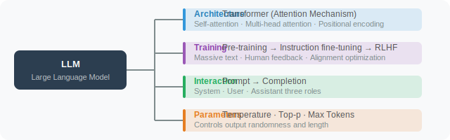

# Chapter 3: LLM Fundamentals

> A craftsman must first sharpen his tools. Before we start building Agents, we need to deeply understand their "brain" — the Large Language Model (LLM).

---

## Chapter Overview

This chapter explains how large language models work at an intuitive level, then systematically covers how to communicate with models effectively through Prompt Engineering, introduces common prompting strategies, and walks you through your first API call step by step. Finally, we dive into key parameters like Token and Temperature to help you truly "master" language models.

## Chapter Goals

After completing this chapter, you will be able to:

- ✅ Intuitively understand how LLMs work (no math required)
- ✅ Master the core principles and techniques of Prompt Engineering
- ✅ Flexibly apply prompting strategies like Zero-shot, Few-shot, and CoT
- ✅ Proficiently call the OpenAI API and common open-source model interfaces
- ✅ Understand how parameters like Token and Temperature affect output
- ✅ Understand the architectural components of mainstream models (MHA/GQA/MLA, RoPE, SwiGLU, MoE) and 2026 breakthroughs (Hybrid Attention, Attention Residuals, MuonClip, Engram Memory)
- ✅ Master the latest advances in foundation models and model selection strategies for Agent development
- ✅ Understand the core principles of SFT and RL training data preparation: data volume selection, quality evaluation, and reward function design

## Chapter Structure

| Section | Content | Difficulty |
|---------|---------|-----------|
| 3.1 How Does an LLM Work? | Intuitive understanding of Transformers, pre-training, and emergent abilities | ⭐⭐ |
| 3.2 Prompt Engineering | System messages, role-playing, structured output | ⭐⭐ |
| 3.3 Prompting Strategies | Zero-shot, Few-shot, CoT, ToT | ⭐⭐⭐ |
| 3.4 Model API Basics | OpenAI SDK, open-source models, streaming | ⭐⭐ |
| 3.5 Tokens & Model Parameters | Token counting, Temperature, Top-p, etc. | ⭐⭐ |
| 3.6 Foundation Model Landscape | Industry landscape, model ecosystem (Kimi K2/K2.5, DeepSeek V4, Qwen3.5), Agent selection guide | ⭐⭐⭐ |
| 3.7 Foundation Model Architecture | MHA→GQA→MLA, RoPE, SwiGLU, MoE, and 2026 breakthroughs: Hybrid Attention, Attention Residuals, MuonClip, Engram Memory | ⭐⭐⭐⭐ |
| 3.8 SFT & RL Training Data Preparation | Data volume selection, quality evaluation, SFT data creation, RL reward function design, difficulty calibration and curriculum learning | ⭐⭐⭐ |

## Core Concepts at a Glance

## Why Do Agent Developers Need to Understand LLMs?

Many Agent frameworks (LangChain, LangGraph, etc.) wrap model calls very cleanly, allowing beginners to get started quickly. But when your Agent encounters the following issues, understanding the underlying LLM mechanisms becomes critical:

- Unstable output — the same question gets different answers
- Model "hallucination" — confidently giving wrong answers
- Token limit exceeded — long conversations get truncated
- High costs — needing to optimize Prompts to reduce consumption

Understanding LLMs is like understanding how an engine works — even if you don't build engines, knowing the principles makes you a better driver.

## 🔗 Learning Path

> **Prerequisites**: [Chapter 1: What is an Agent?](../chapter_intro/README.md), [Chapter 2: Development Environment Setup](../chapter_setup/README.md)
>
> **Recommended next steps**:
> - 👉 [Chapter 4: Tool Calling](../chapter_tools/README.md) — The core capability of Agents
> - 👉 [Chapter 8: Context Engineering](../chapter_context_engineering/README.md) — Upgrade from Prompt Engineering to systematic context management

---

*Next section: [3.1 How Does an LLM Work? (Intuitive Understanding)](./01_how_llm_works.md)*
