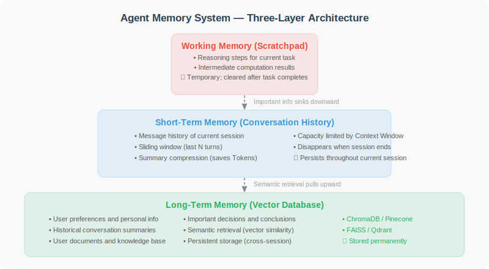

# Why Do Agents Need Memory?

Imagine an assistant who completely forgets you every time you come to them — who you are, what your job is, what tasks you assigned last time. Such an assistant cannot provide any real help.

## An Agent Without Memory: The Pain of Constant Repetition

```python
# Example conversation with an Agent that has no memory
user: "My name is Alex, and I'm a Python developer"
agent: "Hello! How can I help you?"

user: "Help me write a function"
agent: "Sure, what functionality do you need the function to have?"

# The next day...
user: "That function from yesterday has a bug"
agent: "Sorry, I don't have access to our previous conversation.
       Could you tell me which function you need help fixing?"  # Completely forgotten!
```

This experience frustrates users and limits the complexity of tasks an Agent can handle.

## The Three Levels of Memory Systems

An Agent's memory system is analogous to human memory and consists of three levels:



**Short-Term Memory**
- Analogy: Documents on your desk while working
- Content: Message history of the current conversation
- Characteristics: Limited capacity (constrained by Context Window), disappears when the session ends
- Use: Maintaining coherence across multi-turn conversations

**Long-Term Memory**
- Analogy: Files stored in a filing cabinet
- Content: User preferences, important information, historical conversation summaries
- Characteristics: Persistent storage, cross-session access, large capacity
- Use: Personalized service, knowledge accumulation

**Working Memory (Scratchpad)**
- Analogy: Scratch paper
- Content: Intermediate reasoning steps for the current task
- Characteristics: Exists while the task is in progress, can be cleared after completion
- Use: Complex multi-step reasoning, avoiding "repeated reasoning"

## Typical Scenarios Where Memory Failure Causes Problems

Understanding when "lack of memory causes problems" helps decide where to add memory systems:

```python
# Scenario 1: Preference amnesia
# The user said "I prefer concise code without comments"
# But in the next conversation the Agent starts writing lots of comments again

# Scenario 2: Context fragmentation
# The user is discussing a complex problem; the conversation grows too long
# and exceeds the Context Window
# The Agent starts forgetting what was said at the beginning of the conversation

# Scenario 3: Repeated onboarding
# The user has to introduce themselves and their background every time
# The Agent cannot accumulate knowledge about the user

# Scenario 4: Task continuity
# The user asks to "continue the plan we discussed last time"
# The Agent has no idea what was discussed last time
```

## Core Challenges in Memory System Design

**1. Token Limits**

```python
# Context Window limits the size of short-term memory
# GPT-4o has a 128K token context
# But long conversations consume tokens quickly and are costly

# Solutions:
# - Sliding window: only keep the most recent N turns of conversation
# - Summary compression: compress old conversations into summaries
# - Vector retrieval: retrieve relevant snippets from long-term memory
```

**2. What Is Worth Remembering**

```python
# Not all information is worth storing
# Worth remembering:
keep_memory = [
    "User name, profession, preferences",
    "Important decisions and conclusions",
    "User-defined rules (e.g., code style)",
    "Ongoing project information",
]

# Not worth remembering:
skip_memory = [
    "Casual small talk",
    "Repeated greetings",
    "Temporary queries",
    "Outdated information",
]
```

**3. Memory Accuracy**

```python
# Information stored in memory may be incorrect
# The Agent needs:
# - The ability to update memory (user corrects preferences)
# - Distinguishing facts from inferences
# - Memory source traceability
```

---

## Summary

Memory systems are the core of Agent practicality:
- Short-term memory: maintains coherence within the current conversation
- Long-term memory: accumulates knowledge across sessions
- Working memory: supports complex reasoning tasks
- Core challenges: token limits, selective memory, accuracy

> 📖 **Want to dive deeper into the academic frontier of memory systems?** Read [5.6 Paper Readings: Frontier Advances in Memory Systems](./06_paper_readings.md), covering in-depth analysis of four core papers: Generative Agents, MemGPT, MemoryBank, and CoALA.

---

*Next section: [5.2 Short-Term Memory: Conversation History Management](./02_short_term_memory.md)*
