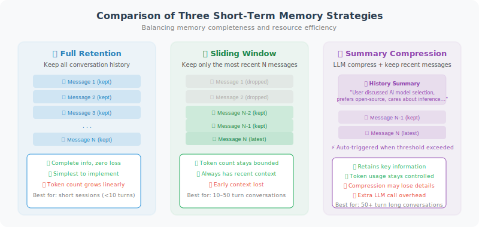

# Short-Term Memory: Conversation History Management

Short-term memory is the most fundamental form of memory — maintaining conversation history so the Agent knows "what we just talked about."

Why does this matter? LLMs are inherently **stateless** — each call is a completely fresh request, and the model does not "remember" the content of previous conversations. If the user says "My name is Alex" in the first turn and asks "What's my name?" in the second turn, the model will be completely lost if the previous conversation history is not passed back. Short-term memory solves exactly this problem: **by attaching previous conversation records to each request, the model "appears" to have memory.**

But this creates a new problem: the LLM's context window is limited (GPT-4o has approximately 128K tokens). As conversations grow longer, token consumption increases sharply, which is not only costly but may also exceed the model's processing limit. Therefore, we need **conversation history management strategies** to balance "memory completeness" and "resource efficiency."

This section introduces three strategies: full retention, sliding window, and summary compression, each suited to different conversation length scenarios.



## Basic Conversation History Management

Let's start with the simplest approach: retaining the complete conversation history. This `ConversationHistory` class encapsulates message addition, token counting, and API calls. Note that it uses `tiktoken` to precisely calculate the token count of each message — this is critical for the window truncation strategy later.

```python
from openai import OpenAI
from dataclasses import dataclass, field
from typing import Optional
import tiktoken

client = OpenAI()

@dataclass
class Message:
    role: str  # "user", "assistant", "system", "tool"
    content: str
    token_count: int = 0

class ConversationHistory:
    """Conversation history manager"""
    
    def __init__(self, system_prompt: str = None, model: str = "gpt-4o"):
        self.model = model
        self.encoding = tiktoken.encoding_for_model(model)
        self.messages: list[Message] = []
        
        if system_prompt:
            self.add_message("system", system_prompt)
    
    def count_tokens(self, text: str) -> int:
        """Count the number of tokens in a text"""
        return len(self.encoding.encode(text))
    
    def add_message(self, role: str, content: str):
        """Add a message"""
        token_count = self.count_tokens(content)
        msg = Message(role=role, content=content, token_count=token_count)
        self.messages.append(msg)
        return msg
    
    def total_tokens(self) -> int:
        """Calculate total token count"""
        return sum(m.token_count for m in self.messages)
    
    def to_api_format(self) -> list[dict]:
        """Convert to OpenAI API format"""
        return [{"role": m.role, "content": m.content} for m in self.messages]
    
    def chat(self, user_message: str) -> str:
        """Conduct one round of conversation"""
        self.add_message("user", user_message)
        
        response = client.chat.completions.create(
            model=self.model,
            messages=self.to_api_format()
        )
        
        reply = response.choices[0].message.content
        self.add_message("assistant", reply)
        
        return reply
    
    def get_stats(self) -> dict:
        """Get history statistics"""
        return {
            "message_count": len(self.messages),
            "total_tokens": self.total_tokens(),
            "user_messages": sum(1 for m in self.messages if m.role == "user"),
            "assistant_messages": sum(1 for m in self.messages if m.role == "assistant"),
        }
```

## Sliding Window: Controlling History Length

The problem with full retention is obvious: as the number of conversation turns increases, token consumption grows linearly. When a conversation exceeds 50 turns, the conversation history alone may occupy tens of thousands of tokens.

**Sliding window** is the most intuitive solution — only keep the most recent N turns of conversation and discard earlier records. This is analogous to the capacity limit of human short-term memory (the famous "7±2" rule in psychology).

The implementation below has two truncation dimensions: `max_turns` (maximum number of turns) and `max_tokens` (maximum token count). This dual safeguard is important — sometimes a single turn contains very long code, and turn count alone cannot effectively control token consumption. The `_get_window_messages` method first truncates by turn count, then checks whether the token count exceeds the limit, and if so, further removes the earliest turns.

Note that `system_prompt` is always retained and does not participate in truncation — this is because the system prompt defines the Agent's role and behavior, and losing it would cause the Agent to "lose its identity."

```python
class SlidingWindowMemory:
    """Sliding window conversation manager: only keeps the most recent N turns"""
    
    def __init__(
        self,
        system_prompt: str = None,
        max_turns: int = 10,       # Maximum turns to retain
        max_tokens: int = 8000,    # Maximum token count
        model: str = "gpt-4o-mini"
    ):
        self.model = model
        self.max_turns = max_turns
        self.max_tokens = max_tokens
        self.system_prompt = system_prompt
        self.all_messages: list[dict] = []  # Complete history (not sent to LLM)
        
        self.encoding = tiktoken.encoding_for_model(model)
    
    def _count_tokens(self, messages: list[dict]) -> int:
        """Calculate total token count for a list of messages"""
        total = 0
        for msg in messages:
            total += len(self.encoding.encode(msg.get("content", "")))
        return total
    
    def _get_window_messages(self) -> list[dict]:
        """Get messages within the sliding window"""
        # System prompt is always retained
        result = []
        if self.system_prompt:
            result.append({"role": "system", "content": self.system_prompt})
        
        # Only take the most recent max_turns * 2 messages (each turn = user + assistant)
        recent = self.all_messages[-(self.max_turns * 2):]
        
        # If token count exceeds limit, truncate further
        while recent and self._count_tokens(result + recent) > self.max_tokens:
            recent = recent[2:]  # Remove the earliest turn (2 messages) each time
        
        return result + recent
    
    def chat(self, user_message: str) -> str:
        """Chat using the sliding window"""
        self.all_messages.append({"role": "user", "content": user_message})
        
        # Use messages within the window
        window_messages = self._get_window_messages()
        
        response = client.chat.completions.create(
            model=self.model,
            messages=window_messages
        )
        
        reply = response.choices[0].message.content
        self.all_messages.append({"role": "assistant", "content": reply})
        
        # Display window info
        print(f"[Memory] Total history: {len(self.all_messages)} messages | "
              f"Window in use: {len(window_messages)} messages | "
              f"Window tokens: {self._count_tokens(window_messages)}")
        
        return reply

# Test
memory = SlidingWindowMemory(
    system_prompt="You are a programming assistant",
    max_turns=5
)

for i in range(8):  # Simulate a long conversation
    reply = memory.chat(f"This is question {i+1}, please answer in one sentence: what is Python?")
    print(f"Q{i+1}: {reply[:50]}...")
```

## Summary Compression: Intelligently Compressing History

The downside of the sliding window is its "all-or-nothing" nature — conversations outside the window are discarded entirely, regardless of whether they contain important information. If the user introduced their background and requirements at the beginning of the conversation, the Agent completely forgets it once the window slides past.

**Summary compression** is a smarter approach: when the conversation history exceeds a threshold, use an LLM to compress the old conversation into a concise summary, then only retain "summary + recent messages." This controls the total token count while preserving key information from early conversations (such as user preferences, project background, and decisions already made).

The cost of this approach is: each compression requires an additional LLM call (you can use a lightweight model like `gpt-4o-mini` to reduce costs), and some details are inevitably lost during compression. In practice, summary compression is especially suitable for scenarios where conversations are very long but information density is uneven — for example, technical support conversations where the first half may involve extensive troubleshooting attempts, and the truly valuable parts are the conclusions and decisions.

```python
class SummaryMemory:
    """
    Summary memory manager
    Automatically compresses old conversations into summaries when history exceeds the threshold
    """
    
    def __init__(
        self,
        system_prompt: str = None,
        max_tokens_before_summary: int = 3000,
        model: str = "gpt-4o-mini",
        summary_model: str = "gpt-4o-mini"
    ):
        self.model = model
        self.summary_model = summary_model
        self.system_prompt = system_prompt
        self.max_tokens = max_tokens_before_summary
        
        self.summary: str = ""  # Compressed history summary
        self.recent_messages: list[dict] = []  # Recent messages (not compressed)
        
        self.encoding = tiktoken.encoding_for_model(model)
    
    def _count_tokens(self, text: str) -> int:
        return len(self.encoding.encode(text))
    
    def _should_summarize(self) -> bool:
        """Determine whether compression is needed"""
        total = sum(self._count_tokens(m["content"]) 
                   for m in self.recent_messages)
        return total > self.max_tokens
    
    def _create_summary(self) -> str:
        """Compress the current conversation history into a summary"""
        if not self.recent_messages:
            return self.summary
        
        # Build the compression prompt
        conversation_text = "\n".join([
            f"{m['role'].upper()}: {m['content']}"
            for m in self.recent_messages
        ])
        
        existing_summary = f"Existing summary:\n{self.summary}\n\n" if self.summary else ""
        
        summary_prompt = f"""{existing_summary}Please compress the following conversation into a concise summary, retaining key information, decisions, and user preferences:

{conversation_text}

Requirements:
1. Retain the user's key needs and preferences
2. Retain important decisions and conclusions
3. Ignore small talk and repetitive content
4. Use third-person description, concise and objective
5. No more than 200 words"""
        
        response = client.chat.completions.create(
            model=self.summary_model,
            messages=[{"role": "user", "content": summary_prompt}],
            max_tokens=400
        )
        
        return response.choices[0].message.content
    
    def _build_messages(self) -> list[dict]:
        """Build the message list to send to the LLM"""
        messages = []
        
        # System prompt
        if self.system_prompt:
            messages.append({"role": "system", "content": self.system_prompt})
        
        # History summary (if any)
        if self.summary:
            messages.append({
                "role": "system",
                "content": f"[Conversation History Summary]\n{self.summary}"
            })
        
        # Recent messages
        messages.extend(self.recent_messages)
        
        return messages
    
    def chat(self, user_message: str) -> str:
        """Chat with automatic summary compression"""
        self.recent_messages.append({"role": "user", "content": user_message})
        
        # Check if compression is needed
        if self._should_summarize():
            print("[Memory] Conversation history too long, compressing...")
            self.summary = self._create_summary()
            # Clear recent messages, keep only the last user message
            self.recent_messages = [self.recent_messages[-1]]
            print(f"[Memory] Compression complete. Summary: {self.summary[:100]}...")
        
        # Call the LLM
        response = client.chat.completions.create(
            model=self.model,
            messages=self._build_messages()
        )
        
        reply = response.choices[0].message.content
        self.recent_messages.append({"role": "assistant", "content": reply})
        
        return reply

# Test summary memory
summary_mem = SummaryMemory(
    system_prompt="You are a Python programming assistant",
    max_tokens_before_summary=500  # Set small for testing
)

conversations = [
    "My name is Alex, I'm a backend developer working mainly with Python and Go",
    "I'm building a microservices project using FastAPI and SQLAlchemy",
    "I prefer a clean coding style and don't like over-abstraction",
    "Help me write a user authentication endpoint in FastAPI",
    "The endpoint needs to support JWT tokens",
]

for msg in conversations:
    print(f"\nUser: {msg}")
    reply = summary_mem.chat(msg)
    print(f"Assistant: {reply[:100]}...")
```

---

## Summary

Three strategies for short-term memory management:

| Strategy | Applicable Scenario | Pros | Cons |
|----------|--------------------|----|------|
| Full history | Short conversations | Complete information | High token consumption |
| Sliding window | General conversations | Simple and efficient | May lose early information |
| Summary compression | Long conversations | Retains important information | Requires additional LLM call |

---

*Next section: [5.3 Long-Term Memory: Vector Databases and Retrieval](./03_long_term_memory.md)*