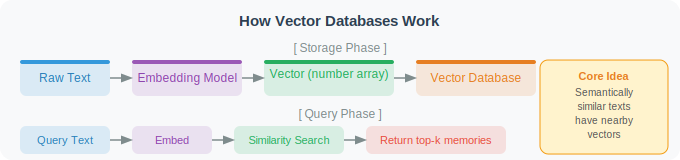

# Long-Term Memory: Vector Databases and Retrieval

Long-term memory allows an Agent to "remember" information across multiple sessions — you tell it today that you're a Python developer who prefers concise code, and it still remembers next week.

> 📄 **Academic Frontier**: A landmark study in memory systems is Stanford's Generative Agents [1] — 25 AI Agents living in a virtual town, recording all experiences through a "Memory Stream" and retrieving memories using a weighted combination of three dimensions: **Recency, Importance, and Relevance**. Notably, the memory decay mechanism assigns lower retrieval weights to older memories (exponential decay), but frequently recalled memories gain higher weights. This design closely mirrors the memory consolidation theory in cognitive science.

Short-term memory (conversation history) disappears when a session ends. Long-term memory requires **persistent storage** — information must be written to a database and retrievable on the next startup. However, traditional database exact queries (SQL `WHERE` clauses) don't suit natural language scenarios. A user might ask "What programming language did I mention before?" — you can't predict whether to search for "Python", "Java", or "Rust".

This is where **vector databases** come in. The core idea: convert text into mathematical vectors (arrays of floating-point numbers), then measure semantic similarity by computing distances between vectors. "Python is a programming language" and "Python used for programming" differ in wording, but their vectors are very close. This lets us use natural language as a query condition and retrieve information by semantic relevance.

## How Vector Databases Work



Core idea: **Semantically similar text will have similar vector representations**.

The code below demonstrates this — we generate vector embeddings for three text samples and compute cosine similarity between them. You'll see that semantically similar sentences (even with different words) have similarity close to 1.0, while semantically unrelated sentences have low similarity.

```python
import chromadb
from openai import OpenAI
import json
import datetime
from typing import Optional

client = OpenAI()

# ============================
# Vector Embedding Utilities
# ============================

def get_embedding(text: str, model: str = "text-embedding-3-small") -> list[float]:
    """Get vector embedding for text"""
    response = client.embeddings.create(
        input=text,
        model=model
    )
    return response.data[0].embedding

# Test: semantically similar texts have similar vectors
from numpy import dot
from numpy.linalg import norm

def cosine_similarity(v1, v2) -> float:
    """Compute cosine similarity"""
    return dot(v1, v2) / (norm(v1) * norm(v2))

# Verify semantic similarity
texts = [
    "Python is a programming language",       # original
    "Python is a language used for coding",   # semantically similar
    "The weather is nice today",              # semantically unrelated
]

embeddings = [get_embedding(t) for t in texts]
sim_1_2 = cosine_similarity(embeddings[0], embeddings[1])
sim_1_3 = cosine_similarity(embeddings[0], embeddings[2])
print(f"Similarity (semantically similar): {sim_1_2:.4f}")  # should be > 0.9
print(f"Similarity (semantically different): {sim_1_3:.4f}")  # should be < 0.5
```

## Building a Memory System with ChromaDB

With the concept of vector embeddings in place, we can build a complete long-term memory system. [ChromaDB](https://www.trychroma.com/) is a lightweight open-source vector database that supports persistent storage and semantic retrieval — ideal for local development and prototyping.

The `LongTermMemory` class below encapsulates the core operations of a memory system: **adding memories** (vectorizing text and storing it in the database), **semantic retrieval** (finding the most relevant memories for a query), and **categorized management** (distinguishing between preferences, facts, tasks, and other memory types).

A few design choices worth noting:
- **Per-user Collections**: prevents memories from different users from interfering with each other
- **Importance scores**: each memory has an importance score from 1–10; low-importance memories can be filtered during retrieval
- **Relevance thresholds**: the `format_for_prompt` method labels retrieved memories as "highly relevant", "relevant", or "reference", helping the LLM judge which memories are most worth considering

```python
class LongTermMemory:
    """
    Long-term memory system based on ChromaDB.
    Supports: adding memories, semantic retrieval, update, delete.
    """
    
    def __init__(self, user_id: str, persist_dir: str = "./memory_db"):
        self.user_id = user_id
        
        # Create persistent vector database
        self.chroma_client = chromadb.PersistentClient(path=persist_dir)
        
        # Each user has an independent Collection
        self.collection = self.chroma_client.get_or_create_collection(
            name=f"user_{user_id}_memory",
            metadata={"hnsw:space": "cosine"}  # use cosine similarity
        )
        
        print(f"[Memory System] Loaded memory store for user {user_id}, "
              f"{self.collection.count()} memories found")
    
    def _embed(self, text: str) -> list[float]:
        """Generate text embedding"""
        response = client.embeddings.create(
            input=text,
            model="text-embedding-3-small"
        )
        return response.data[0].embedding
    
    def add_memory(
        self,
        content: str,
        memory_type: str = "general",
        importance: int = 5,
        source: str = "conversation"
    ) -> str:
        """
        Add a memory entry.
        
        Args:
            content: Memory content
            memory_type: Type (preference/fact/event/task)
            importance: Importance score (1-10)
            source: Source of the memory
        
        Returns:
            Memory ID
        """
        import uuid
        
        memory_id = str(uuid.uuid4())
        
        self.collection.add(
            ids=[memory_id],
            embeddings=[self._embed(content)],
            documents=[content],
            metadatas=[{
                "type": memory_type,
                "importance": importance,
                "source": source,
                "created_at": datetime.datetime.now().isoformat(),
                "user_id": self.user_id
            }]
        )
        
        print(f"[Memory] Saved: {content[:50]}...")
        return memory_id
    
    def search_memories(
        self,
        query: str,
        n_results: int = 5,
        memory_type: Optional[str] = None,
        min_importance: int = 1
    ) -> list[dict]:
        """
        Semantically search memories.
        
        Args:
            query: Query content (natural language)
            n_results: Number of results to return
            memory_type: Filter by type
            min_importance: Minimum importance threshold
        
        Returns:
            List of relevant memories, sorted by similarity
        """
        query_embedding = self._embed(query)
        
        # Build filter conditions
        where = {"user_id": self.user_id}
        if memory_type:
            where["type"] = memory_type
        if min_importance > 1:
            where["importance"] = {"$gte": min_importance}
        
        try:
            results = self.collection.query(
                query_embeddings=[query_embedding],
                n_results=min(n_results, self.collection.count()),
                where=where,
                include=["documents", "metadatas", "distances"]
            )
        except Exception:
            # If not enough results
            results = self.collection.query(
                query_embeddings=[query_embedding],
                n_results=max(1, self.collection.count()),
                include=["documents", "metadatas", "distances"]
            )
        
        memories = []
        if results["documents"] and results["documents"][0]:
            for i, (doc, meta, dist) in enumerate(zip(
                results["documents"][0],
                results["metadatas"][0],
                results["distances"][0]
            )):
                memories.append({
                    "content": doc,
                    "type": meta.get("type"),
                    "importance": meta.get("importance"),
                    "created_at": meta.get("created_at"),
                    "relevance": 1 - dist  # convert to similarity (0-1)
                })
        
        return memories
    
    def get_all_memories(self, memory_type: Optional[str] = None) -> list[dict]:
        """Get all memories"""
        where = {"user_id": self.user_id}
        if memory_type:
            where["type"] = memory_type
        
        if self.collection.count() == 0:
            return []
        
        results = self.collection.get(
            where=where,
            include=["documents", "metadatas"]
        )
        
        memories = []
        for doc, meta in zip(results["documents"], results["metadatas"]):
            memories.append({
                "content": doc,
                "type": meta.get("type"),
                "importance": meta.get("importance"),
                "created_at": meta.get("created_at"),
            })
        
        # Sort by importance
        return sorted(memories, key=lambda x: x.get("importance", 0), reverse=True)
    
    def format_for_prompt(self, memories: list[dict]) -> str:
        """Format memories as prompt-ready text"""
        if not memories:
            return "No relevant memories"
        
        lines = ["[Relevant Memories]"]
        for m in memories:
            relevance = m.get("relevance", 0)
            if relevance >= 0.7:
                relevance_label = "highly relevant"
            elif relevance >= 0.5:
                relevance_label = "relevant"
            else:
                relevance_label = "reference"
            
            lines.append(f"[{m['type']} | {relevance_label}] {m['content']}")
        
        return "\n".join(lines)
```

Next is the most "intelligent" part of the memory system — the **automatic memory extractor**. Rather than requiring users to manually tell the Agent "please remember this", the system automatically analyzes each conversation turn: does this exchange contain information worth storing long-term?

`MemoryExtractor` uses an LLM to make this judgment. It analyzes each turn's user message and Agent reply, extracting persistent-value content such as personal information, preferences, and ongoing projects — while ignoring small talk and temporary queries. Extracted memories are tagged with type labels and importance scores for categorized retrieval later.

```python
class MemoryExtractor:
    """Automatically extract memorable information from conversations"""
    
    def __init__(self):
        self.client = OpenAI()
    
    def extract_memories(self, user_message: str, agent_reply: str) -> list[dict]:
        """
        Analyze a conversation and extract information worth remembering.
        
        Returns:
            List of memories, each containing content, type, and importance
        """
        prompt = f"""Analyze the following conversation and extract important information worth storing as long-term memory.

User said: {user_message}
Assistant replied: {agent_reply}

Extraction rules:
- Record the user's personal information, preferences, and habits
- Record important decisions and conclusions
- Record ongoing projects or tasks
- Ignore small talk, greetings, and repeated information
- Ignore temporary queries (e.g., "what day is it today")

Return JSON format (return empty list if nothing worth remembering):
[
  {{
    "content": "memory content (concise declarative sentence)",
    "type": "preference|fact|event|task|skill",
    "importance": integer from 1-10
  }}
]

Return only JSON, no other content."""
        
        response = self.client.chat.completions.create(
            model="gpt-4o-mini",
            messages=[{"role": "user", "content": prompt}],
            response_format={"type": "json_object"}
        )
        
        try:
            result = json.loads(response.choices[0].message.content)
            # Handle possible nested formats
            if isinstance(result, dict):
                memories = result.get("memories", result.get("items", []))
            else:
                memories = result
            return memories if isinstance(memories, list) else []
        except:
            return []


# ============================
# Test
# ============================

def test_memory_system():
    """Test the memory system"""
    
    # Initialize
    memory = LongTermMemory(user_id="user_001")
    extractor = MemoryExtractor()
    
    # Add some memories
    memory.add_memory("User's name is Alex, a Python backend engineer", "fact", importance=8)
    memory.add_memory("User prefers concise code style, dislikes excessive comments", "preference", importance=7)
    memory.add_memory("User is building a microservice project based on FastAPI", "task", importance=8)
    memory.add_memory("User is proficient in Python and Go", "skill", importance=6)
    
    print("\n=== Semantic Search Test ===")
    
    # Test 1: search for code style
    results = memory.search_memories("What should I keep in mind when writing code?")
    print("\nQuery: What should I keep in mind when writing code?")
    for r in results[:3]:
        print(f"  [{r['relevance']:.2f}] {r['content']}")
    
    # Test 2: search for project info
    results = memory.search_memories("What project is the user working on?")
    print("\nQuery: What project is the user working on?")
    for r in results[:3]:
        print(f"  [{r['relevance']:.2f}] {r['content']}")
    
    print("\n=== Auto Memory Extraction Test ===")
    
    # Test extracting memories from a conversation
    new_memories = extractor.extract_memories(
        user_message="I've started learning Rust recently, the ownership system is really interesting",
        agent_reply="Rust's ownership system is indeed unique — it's the core mechanism for guaranteeing memory safety..."
    )
    
    print("Memories extracted from conversation:")
    for m in new_memories:
        print(f"  [{m['type']} | importance:{m['importance']}] {m['content']}")
        memory.add_memory(m['content'], m['type'], m['importance'])
    
    return memory

# memory = test_memory_system()
```

---

## Summary

Key elements of long-term memory:
- **Vector embeddings**: convert text into comparable vectors
- **Semantic retrieval**: find semantically related (not just keyword-matched) memories
- **Categorized storage**: distinguish between preferences, facts, tasks, and other types
- **Automatic extraction**: automatically identify information worth remembering from conversations

---

*Next: [5.4 Working Memory: The Scratchpad Pattern](./04_working_memory.md)*

---

## References

[1] PARK J S, O'BRIEN J C, CAI C J, et al. Generative agents: Interactive simulacra of human behavior[C]//UIST. 2023.

[2] JOHNSON J, DOUZE M, JÉGOU H. Billion-scale similarity search with GPUs[J]. IEEE Transactions on Big Data, 2021, 7(3): 535-547.