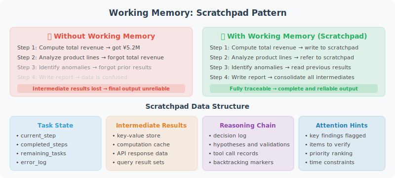

# Working Memory: The Scratchpad Pattern

Working memory is an Agent's "scratch paper" during complex task execution — recording reasoning steps and intermediate results to help the Agent maintain task state.



## Why Do Agents Need Working Memory?

```python
# An Agent without working memory will "forget" intermediate steps on complex tasks
user_task = """
Analyze our company's Q1 financial data:
1. Calculate total revenue
2. Find the fastest-growing product line
3. Identify cost anomalies
4. Generate a summary report
"""

# Problems:
# - Can step 3 use the results from step 1?
# - After analyzing 20 product lines, how do we remember which grew fastest?
# - We found 3 anomalies — what are the details of each?

# Solution: Scratchpad
# During reasoning, write intermediate results to the Scratchpad
# Subsequent steps can read and use these intermediate results
```

## Basic Scratchpad Implementation

```python
import json
from datetime import datetime
from openai import OpenAI
from typing import Any

client = OpenAI()

class Scratchpad:
    """Working memory / scratch paper"""
    
    def __init__(self):
        self._notes: dict[str, Any] = {}
        self._log: list[dict] = []
    
    def write(self, key: str, value: Any, description: str = ""):
        """Write a note"""
        self._notes[key] = {
            "value": value,
            "description": description,
            "updated_at": datetime.now().isoformat()
        }
        self._log.append({
            "action": "write",
            "key": key,
            "description": description,
            "time": datetime.now().isoformat()
        })
    
    def read(self, key: str) -> Any:
        """Read a note"""
        entry = self._notes.get(key)
        return entry["value"] if entry else None
    
    def list_keys(self) -> list[str]:
        """List all keys"""
        return list(self._notes.keys())
    
    def to_prompt_text(self) -> str:
        """Format Scratchpad contents as prompt text"""
        if not self._notes:
            return "Working Memory: (empty)"
        
        lines = ["[Working Memory - Known Information]"]
        for key, entry in self._notes.items():
            desc = f" ({entry['description']})" if entry['description'] else ""
            lines.append(f"- {key}{desc}: {json.dumps(entry['value'], ensure_ascii=False)}")
        
        return "\n".join(lines)
    
    def clear(self):
        """Clear (call after task completion)"""
        self._notes.clear()


class ScratchpadAgent:
    """Multi-step reasoning Agent using a Scratchpad"""
    
    def __init__(self):
        self.scratchpad = Scratchpad()
    
    def _build_system_prompt(self) -> str:
        """Build system prompt including current Scratchpad contents"""
        base_prompt = """You are an AI assistant capable of solving complex multi-step problems.

When solving problems, you should:
1. Break the problem into multiple steps
2. Execute step by step, recording results after each step
3. Later steps can reference results from earlier steps

"""
        scratchpad_content = self.scratchpad.to_prompt_text()
        return base_prompt + "\n" + scratchpad_content
    
    def _tools_for_scratchpad(self) -> list[dict]:
        """Define Scratchpad-related tools"""
        return [
            {
                "type": "function",
                "function": {
                    "name": "save_to_scratchpad",
                    "description": "Save intermediate calculation results or important information to working memory for use in subsequent steps",
                    "parameters": {
                        "type": "object",
                        "properties": {
                            "key": {
                                "type": "string",
                                "description": "Key name in snake_case, e.g. total_revenue"
                            },
                            "value": {
                                "description": "Value to save (can be any type)"
                            },
                            "description": {
                                "type": "string",
                                "description": "Brief description of this piece of information"
                            }
                        },
                        "required": ["key", "value"]
                    }
                }
            },
            {
                "type": "function",
                "function": {
                    "name": "read_from_scratchpad",
                    "description": "Read previously saved intermediate results",
                    "parameters": {
                        "type": "object",
                        "properties": {
                            "key": {
                                "type": "string",
                                "description": "Key name to read"
                            }
                        },
                        "required": ["key"]
                    }
                }
            },
            {
                "type": "function",
                "function": {
                    "name": "list_scratchpad_keys",
                    "description": "List all key names in working memory",
                    "parameters": {
                        "type": "object",
                        "properties": {}
                    }
                }
            }
        ]
    
    def _execute_tool(self, tool_name: str, tool_args: dict) -> str:
        """Execute a Scratchpad tool"""
        if tool_name == "save_to_scratchpad":
            self.scratchpad.write(
                tool_args["key"],
                tool_args["value"],
                tool_args.get("description", "")
            )
            return f"Saved: {tool_args['key']} = {tool_args['value']}"
        
        elif tool_name == "read_from_scratchpad":
            value = self.scratchpad.read(tool_args["key"])
            if value is not None:
                return f"{tool_args['key']} = {json.dumps(value, ensure_ascii=False)}"
            else:
                return f"Key not found: {tool_args['key']}, available keys: {self.scratchpad.list_keys()}"
        
        elif tool_name == "list_scratchpad_keys":
            keys = self.scratchpad.list_keys()
            return f"Keys in working memory: {keys}"
        
        return "Unknown tool"
    
    def solve(self, problem: str) -> str:
        """Solve a complex problem"""
        self.scratchpad.clear()
        
        print(f"\n{'='*50}")
        print(f"Problem: {problem}")
        print('='*50)
        
        messages = [
            {
                "role": "system",
                "content": self._build_system_prompt()
            },
            {
                "role": "user",
                "content": f"{problem}\n\nPlease solve step by step, saving intermediate results to working memory after each step."
            }
        ]
        
        tools = self._tools_for_scratchpad()
        max_steps = 10
        step = 0
        
        while step < max_steps:
            step += 1
            
            # Update system prompt each call to reflect latest scratchpad state
            messages[0]["content"] = self._build_system_prompt()
            
            response = client.chat.completions.create(
                model="gpt-4o",
                messages=messages,
                tools=tools,
                tool_choice="auto"
            )
            
            message = response.choices[0].message
            finish_reason = response.choices[0].finish_reason
            messages.append(message)
            
            if finish_reason == "stop":
                print(f"\n[Final Answer]\n{message.content}")
                return message.content
            
            if finish_reason == "tool_calls" and message.tool_calls:
                for tc in message.tool_calls:
                    result = self._execute_tool(
                        tc.function.name,
                        json.loads(tc.function.arguments)
                    )
                    print(f"[Tool] {tc.function.name}: {result[:100]}")
                    
                    messages.append({
                        "role": "tool",
                        "tool_call_id": tc.id,
                        "content": result
                    })
        
        return "Exceeded maximum number of steps"


# Test: financial data analysis (using mock data)
test_data = {
    "Q1 Revenue": {"Product A": 120, "Product B": 85, "Product C": 200, "Product D": 60},
    "Q1 Cost": {"Product A": 45, "Product B": 80, "Product C": 60, "Product D": 55},
    "Last Quarter Revenue": {"Product A": 100, "Product B": 70, "Product C": 190, "Product D": 50},
}

agent = ScratchpadAgent()
result = agent.solve(f"""
Please analyze the following Q1 financial data:
{json.dumps(test_data, ensure_ascii=False, indent=2)}

Please complete:
1. Calculate the profit margin for each product
2. Find the fastest-growing product
3. Identify products with abnormally low profit margins (below 20%)
4. Generate an analysis summary
""")
```

## Working Memory in ReAct

The ReAct pattern itself is a form of working memory:

```python
react_with_scratchpad = """
Task: {task}

Thought: Analyze current state, decide next step
Action: Choose a tool
Observation: Result returned by the tool
[Repeat Thought-Action-Observation until task is complete]
Final Answer: ...

Current Working Memory:
{scratchpad_content}
"""
```

---

## Summary

The value of working memory (Scratchpad):
- Supports **complex multi-step tasks**, sharing intermediate results between steps
- Avoids redundant computation and information loss
- Makes the Agent's reasoning process more transparent and traceable
- Can be cleared after task completion, keeping long-term memory clean

---

*Next: [5.5 Practice: Personal Assistant Agent with Memory](./05_practice_memory_agent.md)*
