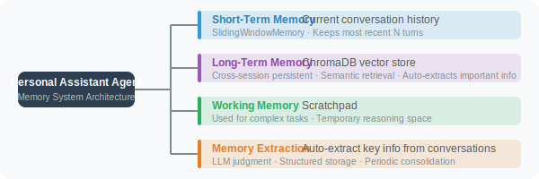

# Practice: Personal Assistant Agent with Memory

Combining the knowledge from the previous four sections, we'll build a personal assistant that truly "remembers" — one that retains your preferences and continuously learns across sessions.

This project is a comprehensive application of everything in this chapter. We combine short-term memory (sliding window) with long-term memory (ChromaDB vector retrieval), plus automatic memory extraction, to build a personal assistant that genuinely "knows you".

### Core Design

The personal assistant's memory system operates in three coordinated layers:

1. **Short-term memory** (sliding window): maintains coherence within the current session, allowing the assistant to track conversation context
2. **Long-term memory** (ChromaDB): persists across sessions, remembering the user's identity, preferences, skills, and other long-term information
3. **Automatic extraction** (LLM analysis): after each conversation turn, automatically identifies information worth remembering

How these three layers collaborate: each time the user sends a message, the system first retrieves relevant information from long-term memory, then sends it along with recent conversation history to the LLM. After the LLM replies, the extractor analyzes whether the turn produced any new information worth storing. The entire process is transparent to the user.

## System Architecture



## Complete Implementation

The `PersonalAssistant` class below is the core of the entire system. Pay attention to the processing flow in the `chat` method — this is exactly the three-layer memory working sequence: retrieve long-term memories → build messages (including short-term memory and relevant long-term memories) → call LLM → update short-term memory → auto-extract new memories.

```python
# personal_assistant.py
import json
import os
import datetime
import chromadb
import uuid
from openai import OpenAI
from dotenv import load_dotenv
from rich.console import Console
from rich.panel import Panel

load_dotenv()

client = OpenAI()
console = Console()


class PersonalAssistant:
    """
    Personal assistant with a complete memory system.
    - Short-term memory: conversation history (last 10 turns)
    - Long-term memory: ChromaDB vector storage
    - Automatic memory extraction and storage
    """
    
    def __init__(self, user_id: str, assistant_name: str = "Aria"):
        self.user_id = user_id
        self.assistant_name = assistant_name
        
        # Initialize vector database
        self.chroma = chromadb.PersistentClient(path=f"./data/memory_{user_id}")
        self.memory_collection = self.chroma.get_or_create_collection(
            name="long_term_memory",
            metadata={"hnsw:space": "cosine"}
        )
        
        # Short-term memory: conversation history
        self.conversation_history: list[dict] = []
        self.max_history_turns = 10
        
        # Session ID (for tracking)
        self.session_id = str(uuid.uuid4())[:8]
        
        count = self.memory_collection.count()
        console.print(f"[dim]{assistant_name} loaded, long-term memory: {count} entries[/dim]")
    
    # =====================
    # Memory Operations
    # =====================
    
    def _embed(self, text: str) -> list[float]:
        """Generate embedding vector"""
        response = client.embeddings.create(
            input=text,
            model="text-embedding-3-small"
        )
        return response.data[0].embedding
    
    def save_memory(self, content: str, memory_type: str = "general", importance: int = 5):
        """Save a long-term memory entry"""
        memory_id = str(uuid.uuid4())
        
        self.memory_collection.add(
            ids=[memory_id],
            embeddings=[self._embed(content)],
            documents=[content],
            metadatas=[{
                "type": memory_type,
                "importance": importance,
                "user_id": self.user_id,
                "session_id": self.session_id,
                "created_at": datetime.datetime.now().isoformat()
            }]
        )
    
    def recall_memories(self, query: str, n: int = 5) -> list[dict]:
        """Retrieve relevant memories"""
        if self.memory_collection.count() == 0:
            return []
        
        results = self.memory_collection.query(
            query_embeddings=[self._embed(query)],
            n_results=min(n, self.memory_collection.count()),
            where={"user_id": self.user_id},
            include=["documents", "metadatas", "distances"]
        )
        
        memories = []
        if results["documents"] and results["documents"][0]:
            for doc, meta, dist in zip(
                results["documents"][0],
                results["metadatas"][0],
                results["distances"][0]
            ):
                relevance = 1 - dist
                if relevance > 0.4:  # filter low-relevance memories
                    memories.append({
                        "content": doc,
                        "type": meta.get("type", "general"),
                        "importance": meta.get("importance", 5),
                        "relevance": relevance
                    })
        
        return sorted(memories, key=lambda x: x["relevance"], reverse=True)
    
    def _auto_extract_memories(self, user_msg: str, assistant_reply: str):
        """Automatically extract memorable information from a conversation"""
        
        prompt = f"""Extract information worth storing as long-term memory from the following conversation.

User said: {user_msg}
Assistant replied: {assistant_reply[:200]}

Extraction rules:
✅ Extract: user's personal info, preferences, work, skills, ongoing projects, explicitly stated needs
❌ Skip: greetings, temporary queries, what the assistant said, content with no lasting value

Return a JSON array (return empty array [] if nothing worth extracting):
[{{"content": "concise statement", "type": "fact|preference|task|skill", "importance": 1-10}}]"""
        
        try:
            response = client.chat.completions.create(
                model="gpt-4o-mini",
                messages=[{"role": "user", "content": prompt}],
                response_format={"type": "json_object"},
                max_tokens=300
            )
            
            result = json.loads(response.choices[0].message.content)
            memories = result if isinstance(result, list) else result.get("memories", [])
            
            for m in memories:
                if isinstance(m, dict) and m.get("content"):
                    self.save_memory(
                        m["content"],
                        m.get("type", "general"),
                        m.get("importance", 5)
                    )
                    console.print(f"[dim]💾 Memory: {m['content'][:60]}[/dim]")
        
        except Exception as e:
            pass  # Memory extraction failure doesn't affect the main function
    
    def _get_window_history(self) -> list[dict]:
        """Get conversation history within the sliding window"""
        return self.conversation_history[-(self.max_history_turns * 2):]
    
    # =====================
    # Conversation
    # =====================
    
    def chat(self, user_message: str) -> str:
        """Chat with the assistant"""
        
        # 1. Retrieve relevant information from long-term memory
        relevant_memories = self.recall_memories(user_message, n=5)
        
        # 2. Build messages
        system_content = f"""You are {self.assistant_name}, the personal assistant for user {self.user_id}.

You can help the user with various tasks: answering questions, writing, analysis, coding, and more.
Personalize your responses — use what you know about the user to provide targeted help.
"""
        
        if relevant_memories:
            memory_text = "\n".join([
                f"- [{m['type']}] {m['content']}"
                for m in relevant_memories[:3]  # at most 3 most relevant
            ])
            system_content += f"\n[Memories About the User]\n{memory_text}\n"
        
        messages = [
            {"role": "system", "content": system_content}
        ] + self._get_window_history() + [
            {"role": "user", "content": user_message}
        ]
        
        # 3. Call LLM
        response = client.chat.completions.create(
            model="gpt-4o",
            messages=messages,
            max_tokens=800
        )
        
        reply = response.choices[0].message.content
        
        # 4. Update conversation history
        self.conversation_history.append({"role": "user", "content": user_message})
        self.conversation_history.append({"role": "assistant", "content": reply})
        
        # 5. Extract memories asynchronously (non-blocking)
        self._auto_extract_memories(user_message, reply)
        
        return reply
    
    def show_memories(self):
        """Display all memories"""
        if self.memory_collection.count() == 0:
            console.print("[dim]No long-term memories yet[/dim]")
            return
        
        results = self.memory_collection.get(
            where={"user_id": self.user_id},
            include=["documents", "metadatas"]
        )
        
        from rich.table import Table
        table = Table(title=f"📚 {self.user_id}'s Long-Term Memory Store")
        table.add_column("Type", style="cyan", width=10)
        table.add_column("Importance", style="yellow", width=10)
        table.add_column("Content", style="white")
        
        entries = list(zip(results["documents"], results["metadatas"]))
        entries.sort(key=lambda x: x[1].get("importance", 0), reverse=True)
        
        for doc, meta in entries[:20]:  # show at most 20 entries
            importance = meta.get("importance", 5)
            table.add_row(
                meta.get("type", "general"),
                "★" * min(importance // 2, 5),
                doc[:80]
            )
        
        console.print(table)


# ============================
# Main Program
# ============================

def main():
    console.print(Panel(
        "[bold]🤖 Personal Assistant Agent[/bold]\n"
        "I'll remember information about you and provide personalized service\n\n"
        "Commands:\n"
        "  memory  → View what I remember about you\n"
        "  clear   → Clear conversation history\n"
        "  quit    → Exit",
        title="Startup",
        border_style="green"
    ))
    
    user_id = input("\nPlease enter your username: ").strip() or "default_user"
    
    assistant = PersonalAssistant(
        user_id=user_id,
        assistant_name="Aria"
    )
    
    console.print(f"\n[bold green]Aria:[/bold green] Hello, {user_id}! How can I help you today?")
    
    while True:
        user_input = input(f"\n[{user_id}]: ").strip()
        
        if not user_input:
            continue
        
        if user_input.lower() == "quit":
            console.print("[bold]Goodbye! I'll remember today's conversation 😊[/bold]")
            break
        
        if user_input.lower() == "memory":
            assistant.show_memories()
            continue
        
        if user_input.lower() == "clear":
            assistant.conversation_history.clear()
            console.print("[dim]Conversation history cleared (long-term memory preserved)[/dim]")
            continue
        
        reply = assistant.chat(user_input)
        console.print(f"\n[bold green]Aria:[/bold green] {reply}")


if __name__ == "__main__":
    main()
```

## Key Implementation Details

Let's dive deeper into several important design decisions in the code:

**Relevance filtering in memory retrieval**: The `recall_memories` method sets a `relevance > 0.4` threshold. This is because vector retrieval always returns the "most similar" results, but those results aren't necessarily truly relevant. For example, if the user asks "what should I eat today", ChromaDB will still return some results even if there's no food-related information in the memory store (just with very low similarity). Setting a threshold filters out this noise.

**Injecting memories into the System Prompt**: In the `chat` method, retrieved relevant memories are injected into the system prompt (the `[Memories About the User]` section), rather than sent as user messages. This is because information in the system prompt is treated by the model as "background knowledge" — it won't be directly quoted or exposed to the user in the reply, making the interaction feel more natural.

**Silent memory extraction**: The `_auto_extract_memories` method is wrapped in `try...except`, so failures don't affect the main conversation flow. Memory extraction is a "nice-to-have" feature — even if it occasionally fails, it shouldn't disrupt the user's normal conversation experience.

## Demo Output

```
[Alex]: My name is Alex, I'm a Python engineer working on an AI project
💾 Memory: User's name is Alex
💾 Memory: User is a Python engineer
💾 Memory: User is working on an AI project

Aria: Hi Alex! Great to meet you. As a Python engineer working on an AI project,
what direction are you focusing on? Agent development, model training, or something else?

[Alex]: Help me write a Python function to compute the Fibonacci sequence

Aria: (Based on the "Python engineer" memory, provides professional-grade code)
def fibonacci(n: int) -> list[int]:
    """Return the first n Fibonacci numbers"""
    ...

-- Next session --
[Alex]: Can that Fibonacci function from yesterday be optimized?

Aria: (Knows from memory that Alex is a Python engineer, gives targeted answer)
You can optimize it with a generator or memoization...
```

---

## Summary

This chapter built a complete memory system:

| Component | Technology | Purpose |
|-----------|-----------|---------|
| Short-term memory | Sliding window | In-session coherence |
| Long-term memory | ChromaDB | Cross-session personalization |
| Memory extraction | LLM analysis | Auto-identify important information |
| Semantic retrieval | Vector similarity | Precise recall of relevant memories |

This framework can serve as the foundation for building personalized Agent applications.

---

*Next chapter: [Chapter 6: Planning and Reasoning](../chapter_planning/README.md)*