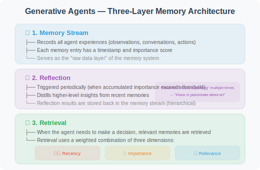
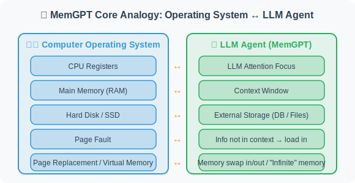
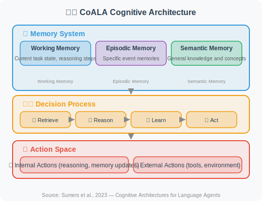

# 5.6 Paper Readings: Frontiers in Memory Systems

> 📖 *"Memory is not just storage — it is the foundation of understanding and reasoning."*  
> *Research on Agent memory systems is advancing rapidly. Here are the most influential works.*

---

## Generative Agents: A Milestone in Memory for Virtual Worlds

**Paper**: *Generative Agents: Interactive Simulacra of Human Behavior*  
**Authors**: Park et al., Stanford University & Google Research  
**Published**: 2023 | [arXiv:2304.03442](https://arxiv.org/abs/2304.03442)

### Core Problem

How can AI Agents have a rich inner life like humans — remembering past experiences, reflecting on their significance, and making plans based on them?

### Experimental Design

The researchers built a virtual town called **Smallville**, where 25 AI residents (Generative Agents) live autonomously. Each resident has their own background (name, occupation, relationships) and moves freely around the town — visiting coffee shops, going to work, chatting with other residents, attending events.

Remarkably, these Agents exhibited many **emergent behaviors**:
- One Agent planned a Valentine's Day party and spontaneously invited others
- Agents formed friendships and social circles
- Agents adjusted their attitudes toward other Agents based on past interactions

### Memory Architecture (Core Contribution)

The memory system of Generative Agents is their most important technical innovation, consisting of three layers:



### Implications for Agent Development

1. The **"Observe-Reflect-Retrieve" framework** is the golden paradigm for designing Agent memory systems. Most subsequent research has borrowed from this framework
2. The idea of **importance scoring** — not all information is worth remembering; selectivity is required
3. **Multi-dimensional retrieval** outperforms single-dimensional retrieval (pure time-series or pure semantic similarity alone is insufficient)
4. The **reflection mechanism** allows Agents to distill abstract knowledge from concrete experiences — a key marker of "intelligence"

---

## MemGPT: Operating System-Style Memory Management

**Paper**: *MemGPT: Towards LLMs as Operating Systems*  
**Authors**: Packer et al., UC Berkeley  
**Published**: 2023 | [arXiv:2310.08560](https://arxiv.org/abs/2310.08560)

### Core Problem

LLM context windows are finite (even 128K tokens can be exhausted). When conversations are long enough or large amounts of information need to be processed, how do we manage this limited "memory"?

### Core Analogy: LLM = Computer

MemGPT's most elegant insight is comparing the LLM's context window to a computer's memory management:



### Method

MemGPT divides the context window into two regions:

1. **Main Context**: like RAM — holds the most immediately needed information (system prompt, recent conversation, working memory)
2. **External Storage**: like a hard drive — stores complete conversation history, documents, knowledge, etc.

Key mechanisms:
- **Self-editing functions**: the Agent can call `core_memory_append()`, `core_memory_replace()`, and similar functions to actively manage its own memory
- **Automatic swap-in/swap-out**: when information the Agent needs isn't in the main context, the system automatically retrieves it from external storage and "swaps it in"
- **Pause and resume**: the Agent can pause the current conversation, search external storage for information, then resume

### Key Findings

1. **Theoretically unlimited memory**: through layered storage, LLMs can break through context window limits
2. **Active memory management**: the Agent itself decides which information is worth keeping in "working memory"
3. **Multi-session continuity**: cross-session information can be persistently stored via external storage

### Implications for Agent Development

MemGPT's architectural thinking is very practical for today's Agent development:
- **Layered memory design**: don't stuff all information into the Prompt — manage it in layers
- **Agent self-managed memory**: give Agents memory management tools (like the practice project in Section 5.5)
- **Reference open-source solutions like mem0**: [mem0](https://github.com/mem0ai/mem0) is an open-source implementation of the MemGPT concept

---

## MemoryBank: Forgetting-Curve-Inspired Memory Management

**Paper**: *MemoryBank: Enhancing Large Language Models with Long-Term Memory*  
**Authors**: Zhong et al.  
**Published**: 2023 | [arXiv:2305.10250](https://arxiv.org/abs/2305.10250)

### Core Problem

Existing memory systems either "remember everything" (storage explosion) or "only remember the latest" (forgetting important information). How can we simulate real human memory behavior — important, frequently recalled memories are consolidated, while unimportant, rarely recalled memories gradually fade?

### Method

MemoryBank's core innovation is incorporating the **Ebbinghaus Forgetting Curve**:

```
Memory Strength = Initial Strength × e^(-t/S)

Where:
- t = time since last access
- S = memory stability (depends on importance and number of reviews)

Practical effect:
- Frequently accessed memories → S increases → slower decay → "consolidated"
- Long-unaccessed memories → strength continuously decays → eventually "forgotten" (or archived)
- Important memories → larger initial S → can persist even without frequent access
```

### Memory Operations

MemoryBank supports three core operations:
1. **Memory write**: new information stored with initial strength
2. **Memory recall**: access time updated on retrieval, increasing stability
3. **Memory forgetting**: periodic scan; memories below the strength threshold are moved to an "archive zone"

### Implications for Agent Development

- **Natural information management**: smarter than manually setting "keep the last N entries"
- **User profiles evolve over time**: user preferences may change, and old preferences naturally decay
- **Storage efficiency**: automatically removes no-longer-needed information, controlling storage costs

---

## CoALA: A Unified Framework for Agent Cognitive Architecture

**Paper**: *Cognitive Architectures for Language Agents (CoALA)*  
**Authors**: Sumers et al.  
**Published**: 2023 | [arXiv:2309.02427](https://arxiv.org/abs/2309.02427)

### Core Problem

What is the relationship between an Agent's memory system, reasoning system, and action system? Is there a unified cognitive architecture to organize these components?

### The CoALA Framework

CoALA draws on cognitive architecture theory from cognitive science (e.g., ACT-R, SOAR) and proposes a unified framework for LLM Agents:



### Core Contributions

1. **Unified classification**: categorizes and compares existing Agent systems by cognitive architecture components
2. **Three-way memory split**: the working memory / episodic memory / semantic memory distinction is more precise than the traditional "short-term/long-term" split
3. **Design guidance**: provides Agent developers with a "checklist" — what cognitive components to consider when designing an Agent

### Implications for Agent Development

The CoALA framework helps us think more systematically about Agent design:
- **Episodic memory ≠ semantic memory**: the former stores "what I experienced", the latter stores "what I know". Their retrieval strategies differ
- **Working memory is the foundation of reasoning**: complex reasoning requires a Scratchpad (see Section 5.4)
- **Learning loop**: Agents should not only use memory but also learn from experience and update memory

---

## HippoRAG: Hippocampus-Inspired Long-Term Memory

**Paper**: *HippoRAG: Neurobiologically Inspired Long-Term Memory for Large Language Models*  
**Authors**: Gutiérrez et al., Ohio State University NLP Group  
**Published**: 2024 | NeurIPS 2024 | [arXiv:2405.14831](https://arxiv.org/abs/2405.14831)

### Core Problem

The human hippocampus efficiently integrates new information and associates it with existing knowledge, while existing RAG systems simply "retrieve the most similar chunks" — lacking modeling of **relationships between pieces of knowledge**.

### Method

HippoRAG simulates the hippocampus's memory indexing theory (Complementary Learning Systems):

```
Traditional RAG:
  Documents → Chunking → Vectorization → Retrieve most similar chunks → Generate answer
  Problem: no connections between chunks, cannot reason across documents

HippoRAG:
  Offline indexing phase (simulating cortical learning):
    Documents → LLM extracts knowledge triples (entity, relation, entity)
    → Build knowledge graph (similar to hippocampal index structure)

  Online retrieval phase (simulating hippocampal retrieval):
    Query → Extract entities from query
    → Find related entities in knowledge graph
    → Expand along graph via personalized PageRank
    → Locate most relevant original document chunks
    → Generate answer
```

### Key Findings

1. **Knowledge graph as index**: better than pure vector retrieval for questions requiring cross-document associative reasoning
2. **Continual learning**: new knowledge can be incrementally added to the graph without re-indexing all documents
3. **Significantly outperforms standard RAG on multi-hop QA tasks**: 20%+ improvement on benchmarks like MuSiQue

### Implications for Agent Development

HippoRAG provides a new paradigm for Agent long-term memory — using a **knowledge graph as the memory index layer** and a vector database as the raw content storage layer, with both cooperating to achieve high-quality memory retrieval. This closely aligns with the concept of "semantic memory" in the CoALA framework.

---

## Zep: Temporal Knowledge Graph-Driven Agent Memory

**Paper**: *Zep: A Temporal Knowledge Graph Architecture for Agent Memory*  
**Authors**: Rasmussen et al.  
**Published**: 2025 | [arXiv:2501.13956](https://arxiv.org/abs/2501.13956)

### Core Problem

Most existing Agent memory systems ignore the **temporal dimension** — when information was recorded, when it expires, and how information evolves over time. But in real applications, temporal information is critical:

```
Example: Evolution of user preferences
  January 2025: "User likes Python"
  June 2025: "User is starting to switch to Rust"
  December 2025: "User now primarily uses Rust"

Without temporal modeling → Agent doesn't know which language to recommend
With temporal modeling → Agent knows the user's latest preference is Rust
```

### Method

Zep organizes Agent memory as a **Temporal Knowledge Graph**:

```
Core data structure:
  (entity, relation, entity, timestamp, validity period)
  
Example:
  (User A, preferred language, Python, 2025-01, 2025-05)
  (User A, preferred language, Rust, 2025-06, current)
  (User A, project, chatbot, 2025-03, 2025-08)

During retrieval:
  1. Semantic relevance (graph structure traversal)
  2. Temporal relevance (prioritize the most recent, still-valid memories)
  3. Episodic context (associate other memories from the same period)
```

### Implications for Agent Development

- **Temporal awareness is a prerequisite for long-term memory**: especially in personal assistant and customer service scenarios
- **Knowledge graphs are the ideal structure for organizing memory**: better than pure vector lists for expressing complex relationships between entities
- Zep is open-source and provides a Python SDK, directly integrable with LangChain / LangGraph projects

---

## Paper Comparison and Development Timeline

| Dimension | Generative Agents | MemGPT | MemoryBank | CoALA | HippoRAG | Zep |
|-----------|-------------------|--------|------------|-------|----------|-----|
| **Year** | 2023 | 2023 | 2023 | 2023 | 2024 | 2025 |
| **Core Innovation** | Observe-Reflect-Retrieve framework | OS-style layered storage | Forgetting curve memory management | Unified cognitive architecture | Hippocampal indexing theory | Temporal knowledge graph |
| **Memory Type** | Memory stream + reflection | Main context + external storage | Forgetting curve-driven | Working/episodic/semantic | Knowledge graph index | Temporal graph + episodic |
| **Highlight** | Reflection mechanism | Self-editing memory | Natural memory decay | Theoretical framework | Cross-document association | Temporal awareness |
| **Use Case** | Social simulation | Long conversations | User profiling | System design | Knowledge-intensive tasks | Personal assistants |

**Development Timeline**:

```
Generative Agents (established the basic paradigm for memory systems)
    ↓
MemGPT (solved the engineering problem of "limited context windows")
    ↓
MemoryBank (introduced forgetting mechanisms from cognitive science)
    ↓
CoALA (provided a unified theoretical framework)
    ↓
HippoRAG (used knowledge graphs as the memory index layer, NeurIPS 2024)
    ↓
Zep + mem0 (temporal graphs + production-grade memory solutions, 2025)
```

> 💡 **Frontier Trends (2025–2026)**: Memory systems are evolving from "passive storage" to "active organization". Two key trends: ① **Knowledge graphs are becoming the core of memory**: HippoRAG, Zep, and mem0 all use graph structures to organize memory, which better expresses entity relationships and supports multi-hop reasoning compared to pure vector storage; ② **Temporally-aware memory**: Agents need to understand "when they learned what" and "which information is outdated". Zep's temporal knowledge graph and MemoryBank's forgetting curve represent two complementary temporal modeling approaches. [mem0](https://github.com/mem0ai/mem0) as an open-source memory layer solution has been widely adopted, supporting automatic memory extraction, conflict detection, and graph-structured memory. [supermemory](https://github.com/supermemoryai/supermemory) represents another production-grade approach — it merges RAG and Memory into a unified context engine, supporting automatic fact extraction, user profile maintenance, and multimodal document processing, ranking #1 on LongMemEval, LoCoMo, and ConvoMem benchmarks, while providing MCP services and integrations with major frameworks (LangChain, LangGraph, Vercel AI SDK, etc.).

---

*Back to: [Chapter 5: Memory Systems](./README.md)*
