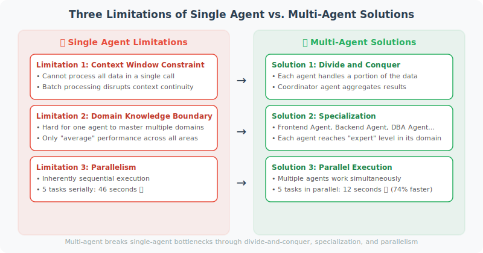

# Limitations of Single Agents

Understanding the bottlenecks of a single Agent is the key to knowing when to introduce a multi-Agent architecture.



## Three Core Limitations

```python
# Limitation 1: Context Window Constraint
# A single Agent's context window is limited (even 128K tokens can be exhausted on complex tasks)

# Example: Analyzing an entire codebase
problem = """
Task: Analyze 50,000 lines of code and find all security vulnerabilities

The single Agent's dilemma:
- Cannot process all the code in a single call
- Must process in batches, but how to maintain context coherence?
- How to integrate analysis results from different batches?
"""

# Limitation 2: Domain Knowledge Boundaries
# A single Agent struggles to be an expert in multiple domains simultaneously

# Example: Full-stack project development
fullstack_task = """
Task: Build a complete web application

Required expertise:
- Frontend React/Vue development
- Backend Python/Node.js development
- Database design (SQL/NoSQL)
- DevOps/CI-CD configuration
- Security auditing

Single Agent's problem: one Agent can only be "average" across all domains
"""

# Limitation 3: Parallelism
# A single Agent is inherently sequential and cannot truly execute in parallel

sequential_time = sum([10, 8, 12, 9, 7])  # Single Agent: 46 seconds
parallel_time = max([10, 8, 12, 9, 7])    # Multi-Agent parallel: 12 seconds
print(f"Time saved: {sequential_time - parallel_time} seconds ({(sequential_time-parallel_time)/sequential_time*100:.0f}%)")
```

## Advantages of Multi-Agent Systems

```python
# Demonstrating advantages: parallel processing of different modules

import concurrent.futures
import time
from openai import OpenAI

client = OpenAI()

def single_agent_approach(tasks: list[str]) -> list[str]:
    """Single Agent: sequential processing"""
    results = []
    for task in tasks:
        # Each call must wait
        response = client.chat.completions.create(
            model="gpt-4o-mini",
            messages=[{"role": "user", "content": task}],
            max_tokens=100
        )
        results.append(response.choices[0].message.content)
    return results

def multi_agent_approach(tasks: list[str]) -> list[str]:
    """Multi-Agent: parallel processing (one independent Agent per task)"""
    def process_task(task: str) -> str:
        response = client.chat.completions.create(
            model="gpt-4o-mini",
            messages=[{"role": "user", "content": task}],
            max_tokens=100
        )
        return response.choices[0].message.content
    
    with concurrent.futures.ThreadPoolExecutor(max_workers=5) as executor:
        results = list(executor.map(process_task, tasks))
    
    return results

# Comparison test
tasks = [
    "Describe Python's characteristics in one sentence",
    "Describe JavaScript's characteristics in one sentence",
    "Describe Go's characteristics in one sentence",
    "Describe Rust's characteristics in one sentence",
    "Describe Java's characteristics in one sentence",
]

start = time.time()
single_results = single_agent_approach(tasks)
single_time = time.time() - start

start = time.time()
multi_results = multi_agent_approach(tasks)
multi_time = time.time() - start

print(f"Single Agent time: {single_time:.2f}s")
print(f"Multi-Agent time: {multi_time:.2f}s")
print(f"Speedup: {single_time/multi_time:.1f}x")
```

## When to Use Multi-Agent?

```python
# Decision function
def should_use_multi_agent(task: dict) -> bool:
    """Determine whether multi-Agent is needed"""
    
    criteria = {
        "Requires parallel processing": task.get("parallelizable", False),
        "Requires multiple domains": len(task.get("domains", [])) > 2,
        "High task complexity": task.get("complexity", 0) > 7,
        "Time-sensitive": task.get("time_sensitive", False),
        "Requires mutual verification": task.get("requires_verification", False),
    }
    
    # Consider multi-Agent if 2 or more criteria are met
    met_criteria = sum(criteria.values())
    
    print("Evaluation results:")
    for criterion, met in criteria.items():
        print(f"  {'✅' if met else '❌'} {criterion}")
    print(f"Met {met_criteria} criteria")
    
    return met_criteria >= 2

# Test
print(should_use_multi_agent({
    "name": "Full-stack application development",
    "parallelizable": True,
    "domains": ["frontend", "backend", "database", "security"],
    "complexity": 9,
    "time_sensitive": True,
    "requires_verification": True
}))
```

---

## Summary

Scenarios for using multi-Agent:
- Tasks can be parallelized (significant time savings)
- Multiple domains of expertise are required (role specialization)
- Task exceeds a single context window
- Mutual verification is needed (improved accuracy)

> 📖 **Want to dive deeper into the academic frontier of multi-Agent systems?** Read [16.6 Paper Readings: Frontier Research in Multi-Agent Systems](./06_paper_readings.md), covering in-depth analyses of core papers including MetaGPT, ChatDev, AutoGen, and AgentVerse.

---

*Next section: [16.2 Multi-Agent Communication Patterns](./02_communication_patterns.md)*
