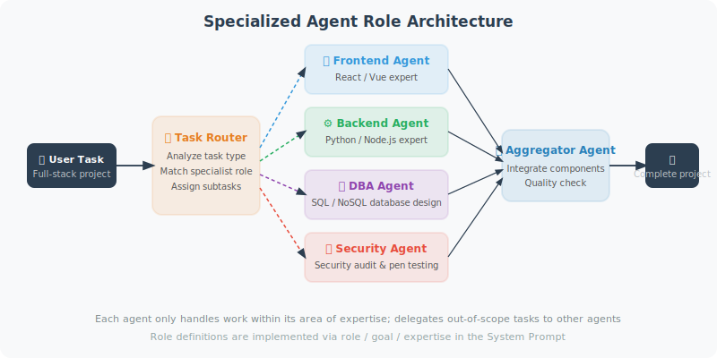

# Role Division and Task Allocation

An efficient multi-Agent system requires a well-designed division of roles. Good role design allows each Agent to deliver maximum value.



## Designing Specialized Agents

```python
from openai import OpenAI
from typing import Optional

client = OpenAI()

class SpecializedAgent:
    """Base class for specialized Agents"""
    
    def __init__(self, name: str, role: str, expertise: str):
        self.name = name
        self.role = role
        self.expertise = expertise
        self.system_prompt = f"""You are {name}, serving as a {role}.
        
Your area of expertise: {expertise}

Work requirements:
- Only handle work directly related to your area of expertise
- If a task is outside your area of expertise, clearly state this and request help from other Agents
- Provide professional, precise output
"""
    
    def process(self, task: str, context: str = "") -> str:
        """Process a task"""
        messages = [
            {"role": "system", "content": self.system_prompt}
        ]
        
        if context:
            messages.append({
                "role": "user",
                "content": f"Background information: {context}\n\nTask: {task}"
            })
        else:
            messages.append({"role": "user", "content": task})
        
        response = client.chat.completions.create(
            model="gpt-4o",
            messages=messages,
            max_tokens=800
        )
        
        return response.choices[0].message.content


# ============================
# Software Development Team Example
# ============================

class DevTeam:
    """Multi-Agent software development team"""
    
    def __init__(self):
        # Define each role's Agent
        self.product_manager = SpecializedAgent(
            name="Alice",
            role="Product Manager",
            expertise="Requirements analysis, feature planning, user story writing, priority sorting"
        )
        
        self.architect = SpecializedAgent(
            name="Bob",
            role="System Architect",
            expertise="System design, technology selection, architecture decisions, database design, API design"
        )
        
        self.developer = SpecializedAgent(
            name="Charlie",
            role="Full-Stack Developer",
            expertise="Python backend development, FastAPI, Django, database operations, code implementation"
        )
        
        self.tester = SpecializedAgent(
            name="Diana",
            role="QA Engineer",
            expertise="Test case design, pytest writing, boundary condition testing, security testing"
        )
        
        self.devops = SpecializedAgent(
            name="Eve",
            role="DevOps Engineer",
            expertise="Docker, CI/CD, deployment scripts, monitoring configuration"
        )
    
    def develop_feature(self, requirement: str) -> dict:
        """Complete feature development workflow"""
        
        results = {}
        
        print(f"\n{'='*60}")
        print(f"Development requirement: {requirement}")
        print('='*60)
        
        # 1. Product Manager: Requirements analysis
        print("\n[Alice - Product Manager] Analyzing requirements...")
        user_stories = self.product_manager.process(
            f"Write user stories and acceptance criteria for the following requirement: {requirement}"
        )
        results["user_stories"] = user_stories
        
        # 2. Architect: System design
        print("\n[Bob - Architect] Designing system...")
        architecture = self.architect.process(
            "Design an implementation plan, including: technology stack selection, data structures, API design",
            context=f"Requirements document: {user_stories}"
        )
        results["architecture"] = architecture
        
        # 3. Developer: Code implementation
        print("\n[Charlie - Developer] Writing code...")
        code = self.developer.process(
            "Write Python implementation code based on the design plan, including complete functions and classes",
            context=f"Design plan: {architecture}"
        )
        results["code"] = code
        
        # 4. QA Engineer: Write tests
        print("\n[Diana - QA] Writing tests...")
        tests = self.tester.process(
            "Write pytest test cases for the following code, covering normal and boundary cases",
            context=f"Code to test: {code[:500]}"
        )
        results["tests"] = tests
        
        # 5. DevOps: Deployment configuration
        print("\n[Eve - DevOps] Preparing deployment...")
        deployment = self.devops.process(
            "Create a Dockerfile and docker-compose.yml",
            context=f"Code: {code[:300]}"
        )
        results["deployment"] = deployment
        
        return results


# Test
team = DevTeam()
result = team.develop_feature("User login API supporting email + password login, returning a JWT token")

print("\n\n=== Development Summary ===")
for key, value in result.items():
    print(f"\n[{key}]")
    print(value[:200] + "..." if len(value) > 200 else value)
```

## Dynamic Role Allocation

```python
class DynamicTaskAllocator:
    """Dynamic task allocator: automatically assigns tasks to the most suitable Agent"""
    
    def __init__(self, agents: dict[str, SpecializedAgent]):
        self.agents = agents
    
    def allocate(self, task: str) -> str:
        """Analyze the task and select the most suitable Agent"""
        agent_descriptions = "\n".join([
            f"- {name}: expertise in {agent.expertise}"
            for name, agent in self.agents.items()
        ])
        
        response = client.chat.completions.create(
            model="gpt-4o-mini",
            messages=[{
                "role": "user",
                "content": f"""Based on the task description, select the most suitable Agent.

Available Agents:
{agent_descriptions}

Task: {task}

Return only the Agent name (one word):"""
            }],
            max_tokens=20
        )
        
        agent_name = response.choices[0].message.content.strip().lower()
        return agent_name
    
    def process(self, task: str) -> str:
        """Automatically allocate and execute a task"""
        agent_name = self.allocate(task)
        agent = self.agents.get(agent_name)
        
        if agent:
            print(f"Assigned to: {agent.name} ({agent.role})")
            return agent.process(task)
        else:
            # No exact match found; use the first Agent
            agent = list(self.agents.values())[0]
            return agent.process(task)
```

---

## Summary

Key principles for role design:
- **Specialization**: Each role focuses on one domain
- **Clear boundaries**: Responsibilities between roles are clear and non-overlapping
- **Clear system prompts**: Each Agent knows its own capability boundaries
- **Dynamic allocation**: Consider automatic task allocation for complex systems

---

*Next section: [16.4 Supervisor Mode vs. Decentralized Mode](./04_supervisor_vs_decentralized.md)*