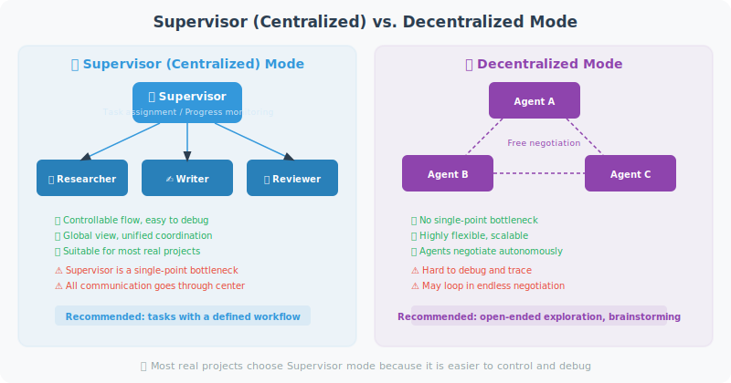

# Supervisor Mode vs. Decentralized Mode

Multi-Agent systems face a fundamental architectural decision: **who coordinates?** Should you set up a "project manager" to centrally schedule all Agents (Supervisor mode), or let Agents negotiate freely with each other (decentralized mode)?

Both modes have their pros and cons. Most real-world projects choose Supervisor mode because it's easier to control and debug. This section compares the two approaches with complete code examples.



## Supervisor (Centralized) Mode

The Supervisor mode works like project management: a Supervisor Agent is responsible for analyzing tasks, assigning subtasks, monitoring progress, and aggregating results. All decisions are coordinated through the Supervisor.

The following example builds a "content creation team" — the Supervisor coordinates three sub-Agents: a researcher, a writer, and a reviewer:

```python
from langgraph.graph import StateGraph, END, START
from langgraph.prebuilt import create_react_agent
from langchain_openai import ChatOpenAI
from langchain_core.tools import tool
from typing import TypedDict, Annotated, Literal
import operator

llm = ChatOpenAI(model="gpt-4o")

# ============================
# Define tools for each sub-Agent
# ============================

@tool
def do_research(topic: str) -> str:
    """Research specialist: in-depth research on a specified topic"""
    from openai import OpenAI
    client = OpenAI()
    response = client.chat.completions.create(
        model="gpt-4o-mini",
        messages=[{"role": "user", "content": f"Research {topic} and provide 3 core insights"}],
        max_tokens=200
    )
    return response.choices[0].message.content

@tool
def write_content(outline: str) -> str:
    """Writing specialist: write content based on an outline"""
    from openai import OpenAI
    client = OpenAI()
    response = client.chat.completions.create(
        model="gpt-4o-mini",
        messages=[{"role": "user", "content": f"Write a 300-word article based on this outline: {outline}"}],
        max_tokens=400
    )
    return response.choices[0].message.content

@tool
def review_content(content: str) -> str:
    """Review specialist: check content quality"""
    from openai import OpenAI
    client = OpenAI()
    response = client.chat.completions.create(
        model="gpt-4o-mini",
        messages=[{"role": "user", "content": f"Review the following content (score + suggestions): {content[:200]}"}],
        max_tokens=150
    )
    return response.choices[0].message.content

# Supervisor Agent has access to all tools
supervisor_tools = [do_research, write_content, review_content]
supervisor_agent = create_react_agent(llm, supervisor_tools)

# ============================
# Supervisor decision logic
# ============================

class SupervisorState(TypedDict):
    messages: Annotated[list, operator.add]
    task: str
    research_done: bool
    content_written: bool
    review_done: bool

def supervisor(state: SupervisorState) -> dict:
    """Supervisor: centrally coordinates all subtasks"""
    from langchain_core.messages import HumanMessage, SystemMessage
    
    context = f"""
You are a task coordinator managing a content creation team.
Available tools: do_research, write_content, review_content

Task: {state['task']}
Research complete: {state.get('research_done', False)}
Writing complete: {state.get('content_written', False)}
Review complete: {state.get('review_done', False)}

Analyze the current progress and decide the next step:
1. If research is not done → use do_research
2. If research is done but writing is not → use write_content
3. If writing is done but review is not → use review_content
4. If everything is done → summarize and finish

Current message history (to get previous outputs):
{[m.content if hasattr(m, 'content') else str(m) for m in state.get('messages', [])[-3:]]}
"""
    
    result = supervisor_agent.invoke({
        "messages": [HumanMessage(content=context)]
    })
    
    last_msg = result["messages"][-1]
    content = last_msg.content if hasattr(last_msg, 'content') else ""
    
    # Update state
    updates = {"messages": [last_msg]}
    if "research" in content.lower():
        updates["research_done"] = True
    if "write" in content.lower() or "article" in content.lower():
        updates["content_written"] = True
    if "review" in content.lower():
        updates["review_done"] = True
    
    return updates

def should_continue(state: SupervisorState) -> str:
    if state.get("review_done"):
        return "end"
    return "continue"

# Build Supervisor graph
graph = StateGraph(SupervisorState)
graph.add_node("supervisor", supervisor)
graph.add_edge(START, "supervisor")
graph.add_conditional_edges(
    "supervisor",
    should_continue,
    {"end": END, "continue": "supervisor"}
)

supervisor_app = graph.compile()

# Run
result = supervisor_app.invoke({
    "messages": [],
    "task": "Write a technical article about Python asynchronous programming",
    "research_done": False,
    "content_written": False,
    "review_done": False
})

print("Final state:")
print(f"  Research complete: {result['research_done']}")
print(f"  Writing complete: {result['content_written']}")
print(f"  Review complete: {result['review_done']}")
```

## Decentralized Mode

Unlike Supervisor mode, decentralized mode has no central coordinator. Each Agent has its own inbox and communicates directly with other Agents via broadcast or point-to-point messages. This mode is more like a self-organizing team — members discuss freely and decide among themselves who does what.

The advantage is no single point of failure and high flexibility; the disadvantage is high coordination costs and the potential for conflicts or deadlocks.

```python
# Decentralized: Agents negotiate directly with each other, no central coordinator

class PeerToPeerNetwork:
    """Peer-to-peer Agent network"""
    
    def __init__(self):
        self.agents = {}
        self.message_board = {}  # Shared message board
    
    def add_agent(self, name: str, specialization: str):
        self.agents[name] = {
            "name": name,
            "specialization": specialization,
            "inbox": [],
        }
    
    def broadcast(self, sender: str, message: str, target: str = "all"):
        """Broadcast a message"""
        if target == "all":
            for name, agent in self.agents.items():
                if name != sender:
                    agent["inbox"].append({
                        "from": sender,
                        "message": message
                    })
        else:
            if target in self.agents:
                self.agents[target]["inbox"].append({
                    "from": sender,
                    "message": message
                })
    
    def process_inbox(self, agent_name: str) -> list[str]:
        """Process inbox"""
        agent = self.agents[agent_name]
        messages = agent["inbox"].copy()
        agent["inbox"].clear()
        return [m["message"] for m in messages]

# Usage example
network = PeerToPeerNetwork()
network.add_agent("research", "Information research")
network.add_agent("writing", "Content writing")
network.add_agent("editing", "Article editing")

# Agents communicate directly with each other, self-organizing to complete tasks
# This mode is more flexible but also harder to control
```

## Comparison of the Two Modes

```
Supervisor (Centralized):
✅ Easy to coordinate and control
✅ Global view, avoids duplicate work
✅ Easy to debug and monitor
❌ Supervisor becomes a bottleneck
❌ If Supervisor fails, everything fails

Decentralized:
✅ No single point of failure
✅ Highly flexible, adaptive
✅ Closer to real team collaboration
❌ High coordination costs
❌ May produce conflicts or deadlocks
❌ Difficult to debug

Recommendations:
- Most production scenarios → Supervisor mode
- High fault tolerance required → Decentralized
- Clear task boundaries → Supervisor is more suitable
```

## Summary

This section compared the two major architectural paradigms for multi-Agent systems:

- **Supervisor (Centralized) Mode**: A coordinator Agent centrally schedules all sub-Agents, providing a global view that is easy to coordinate and monitor. The code example shows how to build a Supervisor loop with LangGraph, tracking task progress via state flags. Suitable for scenarios with clear task boundaries and strict process control requirements.
- **Decentralized Mode**: Agents communicate directly via a peer-to-peer network, with no single point of failure and high flexibility. But coordination costs and debugging difficulty are also higher.

**Practical recommendation**: Most production projects should prioritize Supervisor mode; its controllability and debuggability far outweigh decentralized solutions. Only consider decentralized architecture when high fault tolerance is required or the number of Agents is very large.

---

*Next section: [16.5 Practice: Multi-Agent Software Development Team](./05_practice_dev_team.md)*
