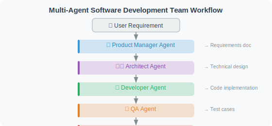

# Practice: Multi-Agent Software Development Team

Combining all the knowledge from this chapter, we'll build a complete multi-Agent software development system that simulates real development team collaboration.

## System Design

This project simulates a complete software development team with 6 roles: Product Manager, Architect, Developer, QA Engineer, DevOps Engineer, and Documentation Engineer. Each role is handled by an independent Agent node, and they pass work results through **shared state** (`DevState`).

### Design Philosophy

This system's design follows two core principles:

1. **Specialization**: Each Agent is only responsible for its area of expertise. The Product Manager doesn't write code; the Developer doesn't write test cases. This division of labor allows each Agent's prompt to be more focused, resulting in higher output quality.

2. **Pipeline + Parallelism**: The workflow is not entirely sequential — after development is complete, testing, DevOps, and documentation can be executed in parallel (they have no dependencies on each other). LangGraph natively supports this parallel execution pattern.

### Factory Function Pattern

The code uses a `create_agent_node` factory function to create Agent nodes, rather than writing a separate function for each role. This is because all roles follow the same behavioral pattern (receive upstream output → call LLM → return result), with only the role name, task description, and input/output fields differing. The factory function parameterizes these differences, greatly reducing repetitive code.



## Complete Implementation

```python
# dev_team_agent.py
from langgraph.graph import StateGraph, END, START
from langchain_openai import ChatOpenAI
from langchain_core.messages import HumanMessage
from typing import TypedDict, Optional
from rich.console import Console
from rich.panel import Panel
from rich.markdown import Markdown
import json

llm = ChatOpenAI(model="gpt-4o", temperature=0.3)
console = Console()

class DevState(TypedDict):
    """Development team shared state"""
    original_requirement: str
    product_spec: Optional[str]
    technical_design: Optional[str]
    implementation: Optional[str]
    test_cases: Optional[str]
    deployment_config: Optional[str]
    documentation: Optional[str]
    current_phase: str
    issues: list

def create_agent_node(role: str, task_template: str, input_key: str, output_key: str):
    """Factory function: create a standard Agent node"""
    
    def agent_node(state: DevState) -> dict:
        console.print(f"\n[bold cyan]👤 {role}[/bold cyan] starting work...")
        
        # Get context
        context = state.get(input_key, state.get("original_requirement", ""))
        
        response = llm.invoke([
            HumanMessage(content=f"""You are a {role}.

Task: {task_template}

Input:
{context}

Please provide professional, detailed output:""")
        ])
        
        result = response.content
        console.print(f"[green]✅ {role} complete[/green]")
        console.print(Panel(Markdown(result[:300] + "..." if len(result) > 300 else result), 
                           title=role, border_style="blue", expand=False))
        
        return {
            output_key: result,
            "current_phase": role
        }
    
    return agent_node

# Create nodes for each role
product_manager_node = create_agent_node(
    role="Product Manager",
    task_template="""Analyze the requirements and output a product specification document containing:
1. Feature description (user story format: As a... I want to... So that...)
2. Feature module list
3. Non-functional requirements (performance, security, etc.)
4. Acceptance criteria""",
    input_key="original_requirement",
    output_key="product_spec"
)

architect_node = create_agent_node(
    role="System Architect",
    task_template="""Based on the product specification, design a technical solution:
1. Technology stack selection (language/framework/database) with justification
2. System architecture diagram (text description)
3. Database table design (main tables and fields)
4. API interface design (endpoints, methods, parameters, responses)
5. Key implementation considerations""",
    input_key="product_spec",
    output_key="technical_design"
)

developer_node = create_agent_node(
    role="Python Developer",
    task_template="""Based on the technical solution, implement code using Python/FastAPI:
1. Main data models (Pydantic models)
2. Core business logic functions
3. API route implementation
4. Utility functions

Requirements:
- Code is complete and runnable
- Includes type annotations
- Add necessary comments
- Follow best practices""",
    input_key="technical_design",
    output_key="implementation"
)

tester_node = create_agent_node(
    role="QA Engineer",
    task_template="""Write test cases for the implementation code:
1. pytest unit tests (covering main functionality)
2. Boundary condition tests
3. Exception handling tests
4. Integration test case descriptions (no implementation needed)

Code must be directly runnable (pip install pytest httpx fastapi)""",
    input_key="implementation",
    output_key="test_cases"
)

devops_node = create_agent_node(
    role="DevOps Engineer",
    task_template="""Prepare deployment configuration:
1. Dockerfile (multi-stage build)
2. docker-compose.yml (including database and application services)
3. Example environment variable file (.env.example)
4. Basic GitHub Actions CI/CD configuration""",
    input_key="implementation",
    output_key="deployment_config"
)

docs_node = create_agent_node(
    role="Technical Documentation Engineer",
    task_template="""Write API documentation (Markdown format):
1. Project overview
2. Quick start (installation, configuration, running)
3. API reference (detailed description of each endpoint)
4. Code examples (Python requests call examples)
5. FAQ""",
    input_key="technical_design",
    output_key="documentation"
)

# ============================
# Build the development workflow graph
# ============================

# The edges in the workflow graph define the dependencies between roles:
# - Product Manager → Architect: architecture design requires a product spec first
# - Architect → Developer: development requires a technical plan first
# - Developer → Tester/DevOps/Docs (parallel): all three depend on the code implementation but are independent of each other
#
# Note: When LangGraph encounters a node with multiple outgoing edges, it executes all target nodes in parallel.
# This means tester, devops, and docs nodes start simultaneously, greatly reducing total execution time.

workflow = StateGraph(DevState)

# Add nodes
workflow.add_node("product_manager", product_manager_node)
workflow.add_node("architect", architect_node)
workflow.add_node("developer", developer_node)
workflow.add_node("tester", tester_node)
workflow.add_node("devops", devops_node)
workflow.add_node("docs", docs_node)

# Connect the workflow
workflow.add_edge(START, "product_manager")
workflow.add_edge("product_manager", "architect")
workflow.add_edge("architect", "developer")
workflow.add_edge("developer", "tester")
workflow.add_edge("developer", "devops")  # Parallel: after development, testing and DevOps start simultaneously
workflow.add_edge("developer", "docs")   # Parallel: documentation is also written simultaneously
workflow.add_edge("tester", END)
workflow.add_edge("devops", END)
workflow.add_edge("docs", END)

dev_team = workflow.compile()

# ============================
# Run the development team
# ============================

def develop(requirement: str) -> dict:
    """Start the development process"""
    console.print(Panel(
        f"[bold]🚀 Starting Multi-Agent Development Team[/bold]\n"
        f"Requirement: {requirement}",
        border_style="green"
    ))
    
    initial_state = {
        "original_requirement": requirement,
        "product_spec": None,
        "technical_design": None,
        "implementation": None,
        "test_cases": None,
        "deployment_config": None,
        "documentation": None,
        "current_phase": "Initialization",
        "issues": []
    }
    
    result = dev_team.invoke(initial_state)
    
    console.print("\n" + Panel(
        "[bold green]🎉 Development Complete![/bold green]\n\n"
        f"✅ Product Spec: {'Complete' if result['product_spec'] else 'Incomplete'}\n"
        f"✅ Technical Design: {'Complete' if result['technical_design'] else 'Incomplete'}\n"
        f"✅ Code Implementation: {'Complete' if result['implementation'] else 'Incomplete'}\n"
        f"✅ Test Cases: {'Complete' if result['test_cases'] else 'Incomplete'}\n"
        f"✅ Deployment Config: {'Complete' if result['deployment_config'] else 'Incomplete'}\n"
        f"✅ API Documentation: {'Complete' if result['documentation'] else 'Incomplete'}",
        border_style="green"
    ))
    
    return result


if __name__ == "__main__":
    result = develop("User management system: including registration, login, profile editing, and password reset features")
    
    # Save to files
    import os
    os.makedirs("output", exist_ok=True)
    
    for key, value in result.items():
        if value and isinstance(value, str) and key not in ["current_phase"]:
            with open(f"output/{key}.md", "w", encoding="utf-8") as f:
                f.write(f"# {key}\n\n{value}")
    
    print("\n📁 All files saved to the output/ directory")
```

## Chapter Summary

Key points for multi-Agent collaboration:

| Element | Key Practice |
|---------|-------------|
| Role design | Specialized, clear boundaries |
| Communication mechanism | Shared state (LangGraph) or message queue |
| Architecture choice | Supervisor (recommended) or decentralized |
| Parallel execution | Tasks without dependencies run simultaneously |
| Error handling | Each Agent handles exceptions independently |

---

*Next chapter: [Chapter 17: Agent Communication Protocols](../chapter_protocol/README.md)*